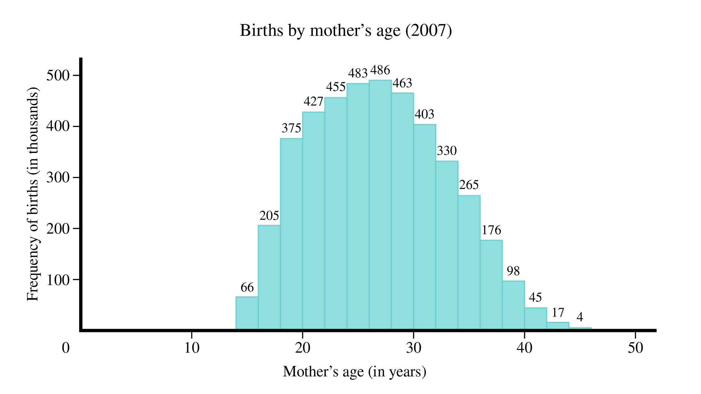
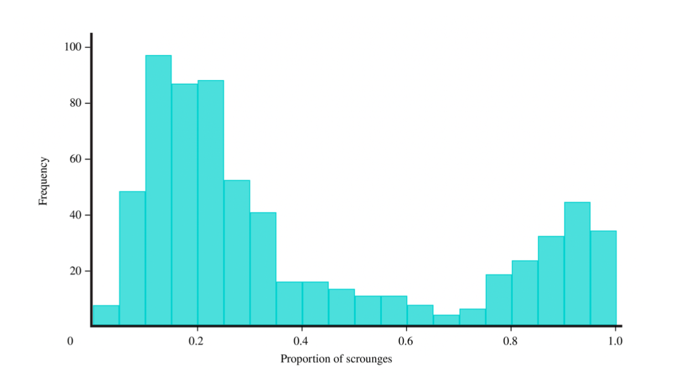
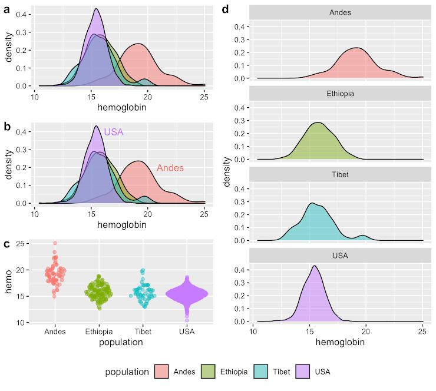
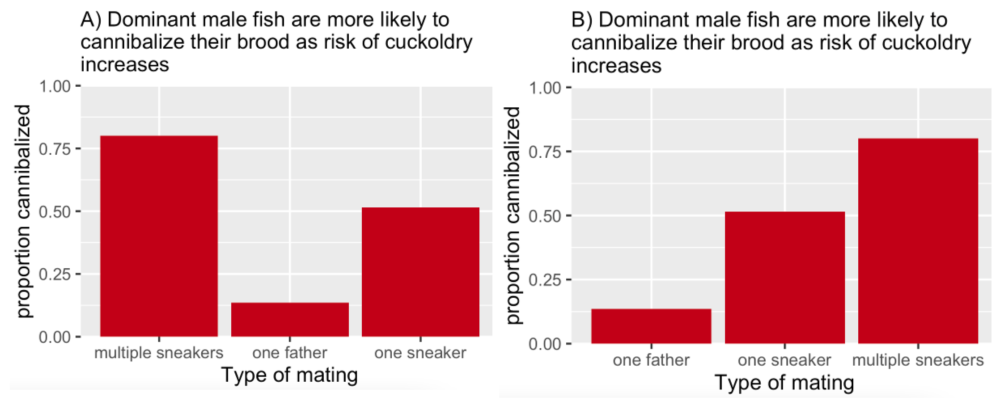
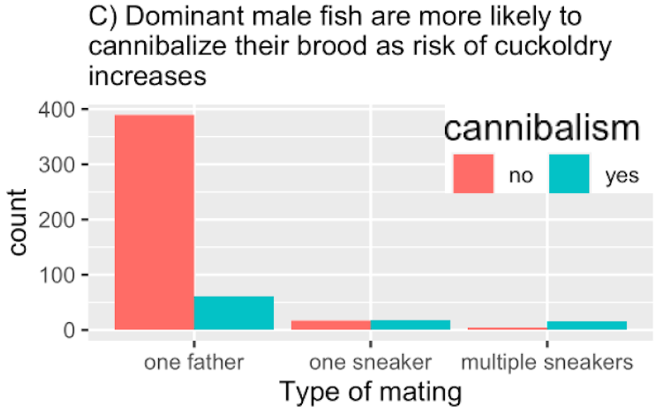

```{r setup, include=FALSE}
library(tufte)
# invalidate cache when the tufte version changes
knitr::opts_chunk$set(cache.extra = packageVersion('tufte'))
options(htmltools.dir.version = FALSE)
```

# Learning Goals

-   Differentiate between estimates of location and estimates of width.

-   Recognize that variability is not simply noise, but is a key parameter that can be estimated.

-   Become familiar with the most common descriptive statistics.

-   Know when the mean or median is a more appropriate summary of location.

-   Distinguish between explanatory and exploratory figures.

-   Identify what makes a good graph.

-   Understand how data types drive figure design.

-   Understand how to make effective tables.

-   Identify best practices in figure design.

-   Recognize how visual choices can mislead viewers

-   Improve misleading plots by making suggestions about how make choices that promote clarity.

-   Interpret a histogram and connect it to key descriptions of data, and to: - Responsibly interpret a given numerical summary. - Evaluate which summary is most informative for a given variable. - Use histograms to visually assess measures of central tendency and spread.

-   Explain and interpret summaries of the location of a numeric variable. - Understand the mathematics behind these summaries and calculate them manually.

-   Calculate and interpret standard summaries of center in R and manually. These include:

-   Median: The middle.

-   Mean: The center of gravity.

-   Mode(s): The common observation(s).

-   Explain and interpret summaries of the spread of a numeric variable. - Understand the mathematics behind these summaries and calculate them manually. - Use R to calculate and visualize them.

-   Identify the “skew” of data: You should be able to distinguish between: Right skewed data Left skewed data Symmetric data values.

-   Identify the number of modes in a data set. Differentiate between one, two and more modes.

-   Explain why we must consider the shape of data when summarizing it.

# Key terms

You should be able to explain and apply these concepts in their relevant concepts. Try to define them below with your own words. Then look them up and check.

**Stripchart:**

**Bar plot/graph:**

**Frequency distribution:**

**Relative frequency (distribution):**

**Frequency table: (definition and purpose)**

**Contingency table: (definition and purpose)**

**Histogram:**

**Mosaic plot:**

**Line graph/plot:**

**Skew (positive, negative, left, right):**

**Boxplot:**

**Median (sample and population):**

**Mean (sample and population):**

**Range:**

**Interquartile range:**

**Variance (sample and population):**

**Standard deviation (sample and population):**

# Supporting Materials for Learning

-   Ch.2-3, slides
-   Quiz 2-3, Problem Set 1
-   Study activities provided here

# Study activities

\[Answers for 2-6 at the end\]

1)  For each of the types of plots and tables seen in chapter 2, answer the following: What are they? What kind of variable or relationship are they good for? Draw one example for each with made up data.

2)  The histogram displays the number of 2008 births among U.S. women ages 10 to 50. Each bin represents an interval of two years, and the height of each bin represents the frequency with which the data fall within that interval.

{fig-alt="Histogram showing mother's age (in years) on the x-axis and frequency of births (in thousands) on the y-axis."}

a.  How many births occurred among women over the age of 38?

b.  What percentage of births occurred among women between the ages of 16 and 18? Give your answer to one decimal place.

c.  What does the histogram tell you about the ages at which women gave birth in 2008?

-   [ ] Women between the ages of 26 and 28 gave birth more often than any other age group.

-   [ ] The distribution of ages at which women gave birth is roughly symmetric.

-   [ ] Seventeen women between the ages of 42 and 44 gave birth in 2008.

-   [ ] No woman over the age of 44 gave birth in 2008.

3)  What type of distribution is represented below? (think about shape)

{fig-alt="Histogram showing proportion of scrounges on the x-axis and absolute frequency on the y-axis."}

4)  A sample of 30 distance scores measured in yards has a mean of 7, a variance of 16, and a standard deviation of 4.

<!-- -->

a.  You want to convert all your distances from yards to feet, so you multiply each score in the sample by 3. What are the new mean, variance, and standard deviation?

b.  You then decide that you only want to look at the distance past a certain point. Thus, after multiplying the original scores by 3, you decide to subtract 4 feet from each of the scores. Now what are the new mean, variance, and standard deviation?

<!-- -->

5)  

    {fig-alt="Figure with panels a-d showing different types of plots for the same dataset."}

<!-- -->

a)  Which of the plots in the figure above keep all information even if printed in black and white?

b)  Which of the plots in the figure above is still somewhat useful but loses some information?

6\.

6.  {fig-alt="Two alternative barplots for the same dataset."}

<!-- -->

a)  Which of the two plots is better? Why?

b)  Which feature of figure 3, below, is better than figure 2 above? Which feature of fig. 2 is better than fig 3?

{fig-alt="A third alternative barplot for the same dataset."}

# Key points

-   Graphical displays must be clear, honest, and efficient.
-   Strive to show the data, to make patterns in the data easy to see, to represent magnitudes honestly, and to draw graphical elements clearly.
-   Follow the same rules when constructing tables to reveal patterns in the data.
-   A frequency table is used to display a frequency distribution for categorical or numerical data.
-   Contingency tables describe the association between two (or more) categorical variables by displaying frequencies of all combinations of categories.
-   Recommended graphical/table methods for displaying:
-   One numerical: histogram, frequency table. Less common: violin, stripchart, boxplot, cumulative frequency distribution (these are usually used when trying to show association between categorical and numerical variables but can be used for this as well).
-   One categorical: frequency table, bar plot (graph), pie chart (not recommended in general because it is difficult to interpret)
-   Two numerical variables: scatterplot
-   Two categorical variables: mosaic plot, grouped bar plot (graph), contingency table
-   One numerical and one categorical: stripchart, multiple histograms, violin plot, boxplot, cumulative frequency distributions
-   Summary measurement taken at consecutive points in time (line graph) and space (map).
-   Recommended descriptive statistics methods for displaying:
    -   Numerical variables: measures of location and spread
    -   Categorical variables: proportions
-   Tidy datasets: Data files should have a row for each individual and a column for each variable. Use clear, informative names for variables with no spaces. Save the data using plain text files, which will never become obsolete.
-   The location of a distribution for a numerical variable can be measured by its mean or by its median. The mean gives the center of gravity of the distribution and is calculated as the sum of all measurements divided by the number of measurements. The median gives the middle value.
-   The standard deviation measures the spread of a distribution for a numerical variable. It is a measure of the typical distance between observations and the mean. The variance is the square of the standard deviation.
-   The quartiles break the ordered observations into four equal parts. The interquartile range, the difference between the first and third quartiles, is another measure of the spread of a frequency distribution.
-   The mean and median yield similar information when the frequency distribution of the measurements is symmetric and unimodal. The mean and standard deviation become less informative about the location and spread of typical observations than the median and interquartile range when the data include extreme observations.
-   The percentile of a measurement specifies the percentage of observations less than or equal to it. The quantile of a measurement specifies the fraction of observations less than or equal to it.
-   All the quantiles of a sample of data can be shown using a graph of the cumulative frequency distribution.
-   The proportion is the most important descriptive statistic for a categorical variable.
-   It is calculated by dividing the number of observations in the category of interest by n, the total number of observations in all categories combined.

# References

Brandvain, Y. (2022). Applied Biostats. Bookdown. https://bookdown.org/ybrandvain/Applied_Biostats_2022/

Brandvain, Y. (2025). Applied Biostats. Bookdown. <https://ybrandvain.github.io/biostats/book_sections/data_viz/dataviz_summary.html>

Whitlock, M., & Schluter, D. (2020). The analysis of biological data. Macmillan. https://whitlockschluter3e.zoology.ubc.ca/

# Answers

2a)166000;2b) 4.8; 2c) Women between the ages of 26 and 28 gave birth more often than any other age group.

3)  Bimodal

4a) mean=21, sd=12, var=144; 4b) mean=17, sd=12, var= 144

5a) c & d 5b) b

6a) Fig 2 makes patterns easier to see.

6b) Fig 3 shows more of the data. Fig. 2 makes patterns easier to see.
