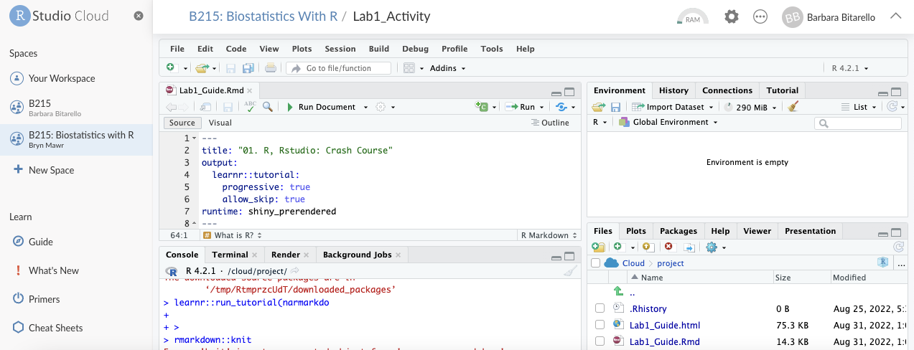

## Tasks

-   Complete DataCamp activities (All chapters of "Getting Started with R")
-   Work through this document
-   Create a basic R script
-   Create an R markdown document with your personal notes and code
-   Complete the Quiz at the end of this doc
-   Downlod the file with your answers and upload to moodle

## Learning outcomes 

1.  Getting started with R and RStudio

2.  Understand the difference between R and Rstudio

3.  Use the R console (command-line)

4.  Use R as a calculator

5.  Understand the concepts of input and output in R

6.  Assign variables

7.  Understand the main variable types in R (string, Boolean, numeric)

8.  Use pre-built functions in R

9.  Learn how to learn about a specific function

10. Learn how to create, name, and index vectors

11. Save your code in an R script

## What is R?

R is awesome. This is our first lesson. Let's dive in.

R is a computer program that allows an extraordinary range of
statistical calculations. It is a free (open source) programming
language and program for statistical computing and graphic, mainly
written by voluntary contributions from statisticians around the world.
R is available on most operating systems, including Windows, Mac OS, and
Linux.

It is one of the primary languages used by data scientists and
statisticians alike. It is supported by the R Foundation for Statistical
Computing and a large community of open source developers.

R can make *graphics* and do *statistical calculations*. It is also a
full-fledged *computing language*. In this course, we will only scratch
the surface of what R can do but hopefully it will be enough to give you
a solid foundation and essential toolkit for any current-day biologist.

Since R is an open source program and freely available, it is very attractive for academics whose access to statistical programs is
regulated through their association to various colleges or universities.

## What is RStudio?

Rstudio is a separate program, also free, that provides a more
elegant front end for R. RStudio allows you to easily organize separate
windows for R commands, graphic, help, etc. in one place.

Since R utilizes a command line interface, there can be a steep learning
curve for some individuals who are used to using GUI focused
programs.

For this course, we will use Rstudio Cloud.You are welcome (but not
required) to install the desktop version of R and Rstudio as well on
your machine.

**R and RStudio are not the same thing!**

RStudio is a different program from R---it is installed separately and
occupies its own place in the Programs menu (Windows PC) or Applications
folder (Mac). **You can run R without RStudio but you cannot run RStudio
without R.**

## How does the Rstudio Cloud workspace work?

Join the B215: Biostatistics with R (Fall 2025) Posit Cloud workspace. This space will be updated often, and you will see a mirrored version in your own space.

**Important:**If the workspace is changed by the instructowebr-r, you would need to delete your mirrored version and create a new one to see those changes -- but hopefully we won't need to do this!

When you start RStudio, it will automatically start R as well. **You run
R inside RStudio.**

After you have started RStudio, you should see a new window with a menu
bar at the top and three main sections. The righthand of the section is called
the "Console" -- this is where you type commands to give instructions to
R and typically where you see R's answers to you. You can also expand a fourth section above the console, which is labeled "Source", in this section you can create and save files. 

{width="80%"}

Another important corner of this window (located in the bottom left) can show a variety of
information. Most importantly to us, this is where graphics will appeawebr-r,
under the tab marked "Plots".

## Saving your code

Good science relies on reproducibility of findings. In the world of
computer programming, this means:

-   Raw data is never modified; you read it as is, process it, and
    produce outputs
-   Outputs should be disposable; if your computer explodes, as long as
    you backed up your code you should be able to reproduce your
    output/results
-   Manual steps (i.e., these that cannot be automated) should be
    avoided or otherwise minimized
-   Ideally, one software package (in our case, R) should be enough to
    run your code; if other software is needed, ideally you would make
    the integration between them work seamlessly and in an automated way
    [this is beyond the scope of our course]

So how do you save your code?

## A basic R script

An R script is a text file containing your R code. Commented lines ('\#'
sign) are read as comments.

-   Go to the Weekly Lab Activities `>` Lab1 activity.
-   Click on File `>` New File `>` R Script. This will open a blank file.
-   Type "\#" followed by your full name. That is a comment and is
    ignored by R.
-   In the next line, type:

```{webr-r}
120/10
```

-   Now press command + s to save (or click File `>` Save OR click on the
    little save icon at the top of the script)
-   Voilà! You have created your first R script. Save your file as
    lab1_lastname_firstname (fill in with your name)
-   Keep this file open and as your progress through this document,
    whenever any code appears, write it down preceded by a description
    in the form of a comment
-   Later we will see how to turn this into an R markdown file

## The Console

When you start RStudio, you'll see a corner of the window called the
"Console." By default the console window is in the bottom left of the
Rstudio screen.

You can type commands in this window where there is a **prompt** (which
will look like a `>` sign at the bottom of the window). The Console has
to be the selected window. (Clicking anywhere in the Console selects
it.)

## The `>` prompt is R's way of inviting you to give it instructions. 

- You communicate with R by typing commands after the `>` prompt. 
- What you type into the prompt will be treated as an input for R to do something with.

Let's see some examples.

## Examples

Type `2+2` at the `>` prompt, and hit return. You'll see that R can work
like a calculator (among its many other powers). It will give you the
answewebr-r, 4, and it will label that answer with `[1]` to indicate that it is
the first element in the answer. (This is sort of annoying when the
answers are simple like this, but can be very valuable when the answers
become more complex.) In other words, your input being 2+2 will result
in an output being `[1] 4`. Try it:

```{webr-r, echo = T, eval = F}
2+2 #input
```

In these labs, the input will show up in a gray box and the output, if
any, will follow in a white box.

```{webr-r, r-add2}
2+2
```

Now try running below the operation 

## Logs and Roots

You can use a wide variety of math functions to make calculations here,
e.g., `log()` calculates the log of a number:

```{webr-r,  r-log1, echo =T }
log(10)
```

Note: By default, this gives the natural log with base `e`.

Parentheses are used both as a way to group elements of the calculation
and also as a way to denote the arguments of functions. The "arguments"
of a function are the set of values given to it as input. 

For example,
`log(3)` is applying the function `log()` to the argument `3`.

By the way, `e` (mathematical constant that is the base of the natural logarithm) in R is obtained by:

```{webr-r,  r-constant, echo =T }
exp(1)
```

## sqrt()

Another mathematical function that often comes in handy is the square
root function, sqrt(). For example, the square root of 4 is:

```{webr-r}
sqrt(4)
```

To calculate a value with an exponent, used the \^ symbol. For example
$$4^3$$ is written as:

```{webr-r}
4^3
```

Of course, many math functions can be combined to give an almost
infinite possibility of mathematical expressions. For example,

$$\frac{1}{\sqrt2\pi\times 3.1^2}e^{-\frac{(12-10.7)^2}{2\times 3.1}}$$

can be calculated with:

```{webr-r}
(1/(sqrt(2 * pi * (3.1)^2))) * exp(-(12-10.7)^2/(2*3.1))
```

Try to run these yourself in the sandbox. For practice you should type things in instead of copying and pasting (trust us):

```{webr-r}

```

## R commands summary

Here is a non-exhaustive list of common mathematical operators you may want to use in R:

| **Description**          | **Operator**   |
|--------------------------|----------------|
| Equal to                 | `==`             |
| Not equal to             | `!=`    
| Assignment  of a value to a variable            | `<-` or `=`       |
| Addition                 | `+`             |
| Subtraction              | `-`             |
| Multiplication           | `*`             |
| Division                 | `/`              |
| Exponentiation           | `x^y` or `x\*\*y` |
| Modulo (x mod y), returns remainder of a division         | `x %% y`         |
| Less than                | `<`             |
|Greater than | `>` |
| Less than or equal to    | `<=`            |
| Greater than or equal to | `>=`            |         |
| x OR y (Boolean)         | `x || y` |
| x AND y (Boolean)        | `x && y`        |

## Getting info about a function

In your prompt, run:

```{webr-r}
?log
```

This will make an R documentation appear on the right side of your
Rstudio pane. This is an R help page. 

Note: typing `help()` and the name of the function of interest inside the parentheses gives you the same result. Try it!

```{webr-r}

```


**Remember**:

-   All pre-built functions in R have R pages that you can access in this way
-   If you are trying to access the help function for a package that is not installed by default in webr-r, you will need to add an extra "?"
- Most other packages you install will also have such help pages but you can only access the info if you have installed the package AND loaded it.

For example, try to find the help page for the function "tstrsplit":

```{webr-r}
?tstrsplit
```

You got an error, which would make some people give up. But if you are
certain the function exists, you can try:

```{webr-r}
??tstrsplit
```

This will show any match to "tstrsplit" within installed packages in your workspace. 


## Packages

-   If you click on "Packages" in the lower right, you will see
    currently installed packages. The checkmark highlights those that
    are currently "loaded" into your workspace
-   You can install packages by going to Tools `>` Install Packages and
    searching for a package of interest.

Sandbox: Use the area below for any R practice

```{r}
help(log)
```

## Assigning variables

A variable is a thing that can change.

Variable names should: 

* be meaningful 
* they can include letters and
numbers
* NOT begin with a number 
* spaces are not tolerated -- In fact, in the world of programming you should forget spaces altogether when naming things (variables, files, functions, etc.) because they are a no-no 
*use underscores, periods, capitalization, etc. if you want to separate words
*Example: instead of "my var", use "myvar", "myVar", "my_var", etc. 
* choosing meaningful names makes your code easier to read - by you and
others

```{webr-r}
xvar = 2 #good 
x_var = 9 #also good
yvar <- 4 #you can use <- as well for assignments of values to variables
```

Now try to recreate the variables above but call them `x var` and `y var` instead:
```{webr-r}

```

You should get an error for an "unexpected symbol", that's the space. 

## Data types in R

Variables in R can be numeric, text, or Boolean
(true/false).Text variables are referred to as strings in R (and many
other programming languages).

Basic data types in R can be divided into the following types:[^6]


-   numeric \<- (10.5, 55, 787)
-   integer \<- (1L, 55L, 100L, where the letter "L" declares this as an
    integer)
-   complex - (9 + 3i, where "i" is the imaginary part)
-   character (a.k.a. string) - ("k", "R is exciting", "FALSE", "11.5")
-   logical (a.k.a. boolean) - (TRUE or FALSE)

Examples: (try these in the sandbox at the end of this section)

```{webr-r}

# numeric
x <- 10.5
class(x)

# integer
x <- 1000L
class(x)

# complex
x <- 9i + 3
class(x)

# character/string
x <- "R is exciting"
class(x)

# logical/boolean
x <- TRUE
class(x) # this command tells you the class of a given variable or R object.

2 < 0 #Try this and see what happens

```

We'll cover these data types and their uses in depth in Lab 2, but for now if you want a head start you can learn more at  [Data types in R. W3schools.com.
    https://www.w3schools.com/r/r_data_types.asp](https://www.w3schools.com/r/r_data_types.asp) .
    
### Numbers

There are three number types in R:

-   **numeric:** the most common type in R; contains any number with or
    without a decimal
-   **integer:** numeric data without decimals. This is used when you are
    certain that you will never create a variable that should contain
    decimals. Just add the letter L after the number to create an integer.
-   **complex:** number is written with an "i" as the imaginary part. Less
    used.

### Example

Try these in the sandbox at the end of this section.

```{webr-r}
x <- 200.8  # numeric
y <- 1000L  # integer
z <- 1i     # complex
```

Try these, one at a time:


```{webr-r}
x <- 200.8  # numeric
y <- 1000L  # integer
z <- 1i     # complex
```

You can convert from one type to another with the following functions:

```{webr-r}
as.numeric()
as.integer()
as.complex()
```

Try these in the sandbox below:

```{webr-r}
x <- 200.8  # numeric
y <- 1000L  # integer

x2 <- as.integer(x) #what happens here?

y2 <- as.numeric(y) #what happens here?

class(x2)

class(y2)
```

Sandbox: Use the area below for any R practice

```{r}

```

## R Data Structure

R has several data structures: vectors, lists, matrices, arrays,
data.frames, factors.

Today we will see vectors and factors:

### Vectors

A vector is simply a list of items that are of the same type.

To combine the list of items to a vectowebr-r, use the c() function and
separate the items by a comma.

In the example below, we create a vector variable called planets, that
combines strings:

```{webr-r}
#vector of strings

planets <- c("Earth", "Mars", "Saturn")

#print planets
planets
```

In this example, we create a vector that combines numerical values:

```{webr-r}
#vector of numeric values

prime_numbers<- c(2, 3, 5, 7, 11)

#print prime numbers

prime_numbers
```

You can create a sequence of numbers using `:` :

Vector with numerical values in a sequence:

```{webr-r}
numbers <- 1:10

numbers
```

```{r}

```


## Links & References

[R Foundation for Statistical Computing](https://www.r-project.org/foundation/)
    
    
[R programming language explained](https://www.freecodecamp.org/news/r-programming-language-explained/)
    
 [What is a GUI?](https://www.computerhope.com/jargon/g/gui.htm)
 
 [Rstudio](https://www.rstudio.com/)
 
 [Stephen J. Royle. The Digital Cell: Cell Biology as Data Science. Cold Spring Harbor Laboratory Press.](https://www.cshl.edu/press-news/the-digital-cell-cell-biology-as-a-data-science/)
 
[Data types in R. W3schools.com.https://www.w3schools.com/r/r_data_types.asp](https://www.w3schools.com/r/r_data_types.asp)

