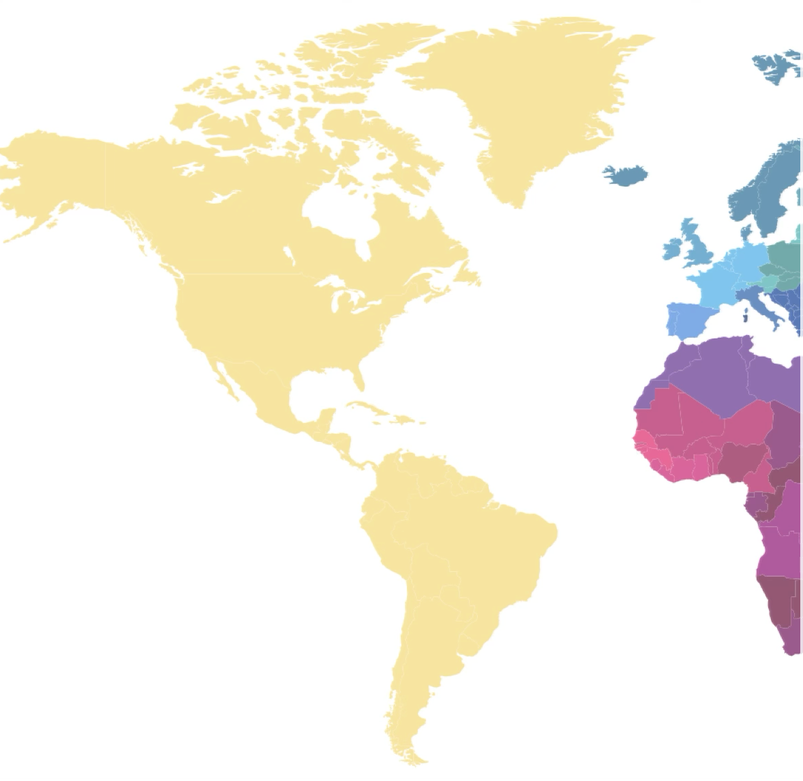
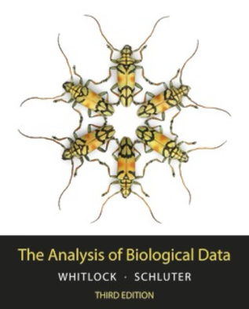
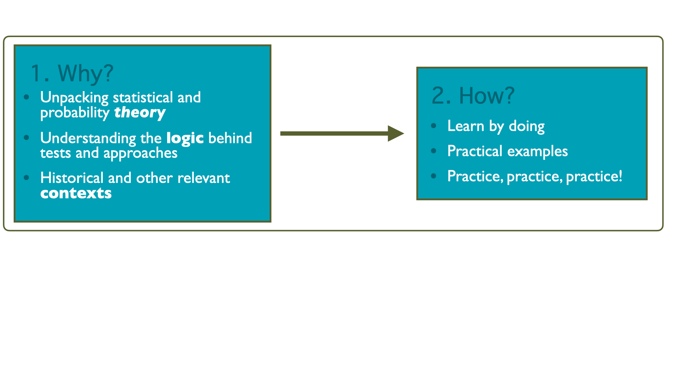
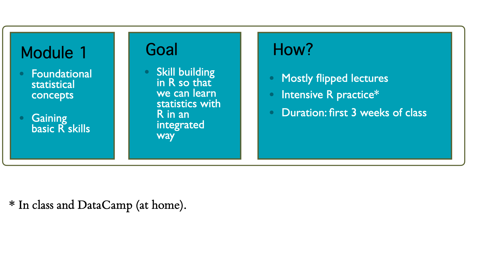
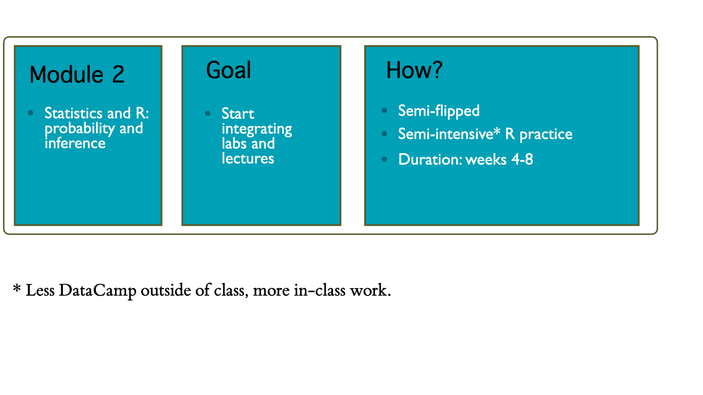
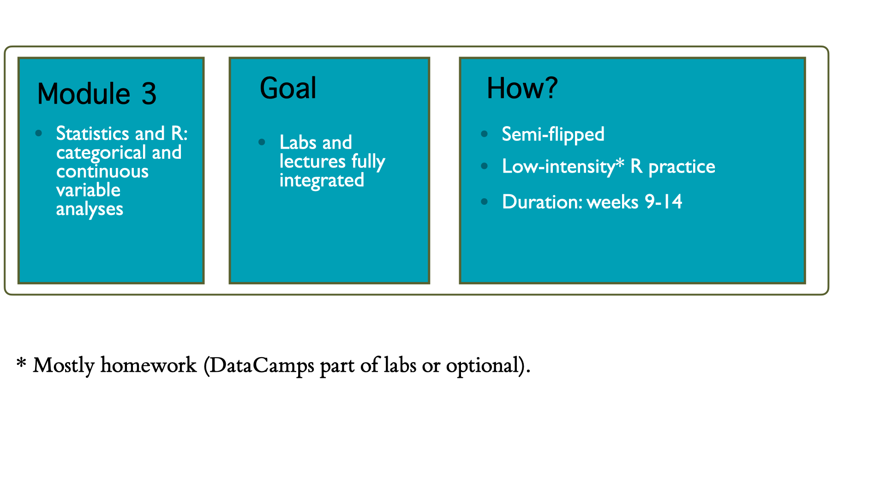

## Overview

-   Introductions
-   Course Logistics
-   To-Dos for this week

```{r, echo = F}
##| echo: false
library(tidyverse)
library(scales)
library(knitr)
library(kableExtra)
library(colorblindr)

options(dplyr.print_min = 6, dplyr.print_max = 6)


source("bb_theme.R")
theme_set(theme_gray(base_size = 18))
```

## Hello!

::::: columns
::: {.column width=\"30%\"}

:::

::: {.column width=\"70%\"}
-   Bárbara D. Bitarello (she/her/hers)
-   PhD in human evolutionary genetics
-   Professor \@ BMC since July 2021
-   Computational biologist/population geneticist/evolutionary biologist/statistical geneticist, etc
-   Interested in all things related to evolution
:::
:::::

::: notes
We also have a TA and a student consultant
:::

## Pre-Reqs

-   No prior experience with programming is required!
-   BIOL B110 or B111 highly recommended (though not required). **Why?** Examples are heavily focused on biology, though the concepts and skills learned will be transferable
-   Students who have taken PSYC B205/H200 or SOCL B265 are [not]{.underline} eligible to take this course.
-   High school algebra - if you’re not sure, I recommend checking [Khan Academy - Algebra Basics](https://www.khanacademy.org/math/algebra-basics) for a recap

## Logistics

Everything I am about to say is in the syllabus!


-   Materials
-   Course structure
-   Policies
-   How to succeed


## Materials
::::: columns
::: {.column width=\"50%\"}
-   Have a laptop for labs and calculator for exams
-   Join Piazza
-   Make accounts in DataCamp and Posit Cloud using BMC/HC email
-   Then accept invite sent by email (check spam)
:::

::: {.column width="50%"}

-   Scientific calculator (not graphing calculator) $\sim\$12$
-   [Scientific vs Graphing Calculator](https://www.architecturelab.net/whats-the-difference-between-scientific-and-graphing-calculator/)

-   Textbook: Whitlock and Schluter *The Analysis of Biological Data*, 3rd edition (2nd: ok, but check pages)

:::
:::::

{fig-alt="Cover of the 3rd edition of the textbook"}

## Other things to do

1.   Read syllabus & schedule
2.   Answer pre-course survey
3.   Check course schedule and reach out ASAP if there are issues/conflicts
4.   Check midterm dates and plan accordingly
5.  Students with accommodations: please send info ASAP

## Course Pages  {visibility="hidden"}

-   Course website: <https://bbitarello.github.io/b215f2025/> has syllabus, schedule, etc.
-   All assignments must be uploaded on Moodle (except DataCamp)


## Piazza

-   Piazza is the preferred method for any questions that may benefit classmates, both logistical and content-related
-   Piazza allows you to post anonymously (note: I will still know your identity)


## Course Structure



::: notes
Lectures: Statistical concepts, address questions based on readings. In-class activities will occur often and count towards participation. Lectures are designed with the assumption that you have completed the pre-assigned readings, enabling us to dive deeper into nuances, applications, and questions. Labs: R computer lab (bring your laptop) with guided tutorial. R Labs are due by the end of the day.
:::

## Module 1



## Module 2



## Module 3




## DataCamp  {visibility="hidden"}

-   Assigned weekly (mostly modules 1-2) to practice lab skills
-   DC shows the hard deadlines but ideally you should complete the weekly DC activities as they are assigned, weekly

## Attendance and Late Work  {visibility="hidden"}

-   Please communicate need to miss class by email.
-   Grace days: every one gets 4, no questions asked, just email *_before_* the deadline and say how many days you need for a given assignment.
-   Late work otherwise penalized -10% per day.

## AI policy  {visibility="hidden"}

We are following the BMC Honor Code. Please see syllabus.

Questions about this: now or later on Piazza.

::: notes
who has read the syllabus? If not, read now the part on this
:::

## FAQs answered in the syllabus

Please visit the FAQ section of the syllabus. A few examples...

1.  What if I have to miss class?
2.  What if I cannot turn in an assignment in time?
3.  What if I am requesting an extension because of sickness?
4.  What if I have accommodations?

## How to succeed

- You should plan/expect to devote ~ 10 hours a week to this course (including class time)
- Be consistent and diligent
-   Attend classes
-   Complete all pre-class prep
-   Be consistent and diligent
-   Check Piazza regularly, attend office hours (at least 2x)
-   Don’t leave everything for last minute — that will not work well
-   Communicate proactively

## Skill building

> "Research on expertise (5) indicates that even historic geniuses needed years of practice to develop their expertise. Ericsson (6) estimates that high-level expertise takes about 10,000 h of practice to develop and claims that no substantial exceptions have been found. In other words, no matter who you are, you need many repeated practice opportunities to develop expertise."

Koedinger, Carvalho, Liu, McLaughlin. PNAS. 120(13) e2221311120, [https://doi.org/10.1073/pnas.2221311120](https://doi.org/10.1073/pnas.2221311120) (2023). 

## Questions?

## Why should *you* care about statistics?

-   Biology (ecology, genetics, immunology, microbiology, …)
-   Biomedical sciences
-   Public health
-   Data science
-   Economy, Psychology, Social Science

## Why should *anyone* care about statistics?

::::: columns
::: {.column width="\"50%\""}
-   Good science!
-   Critical evaluation of “scientific evidence”
-   Statistics and probability are not intuitive
-   We tend to jump to conclusions and we are very often wrong
-   Transferable skills
:::

::: column
{fig-align="center" width="339"}
:::
:::::

## Challenge: data deluge

{fig-alt="Cover of the magazine “The economist”. The heading reads: “The data deluge - And how to handle it: A 14-page special report”. Under the heading is a drawing of a person holding an umbrella in a rainstorm, but the rain is all 1s and 0s. The umbrella top is open but upside-down, collecting water which the person is using to water a plant from the handle of the umbrella." fig-align="center" width="460"}


::: notes
A human can't possibly analyze the amount of data out there without computer coding
:::

## Scientific literacy

{fig-alt="Comic from xfcd.com: lists p-values ranging from 0.001 to >=0.1 on the left, and on the right offers and interpretation." fig-align="center" width="467"}
