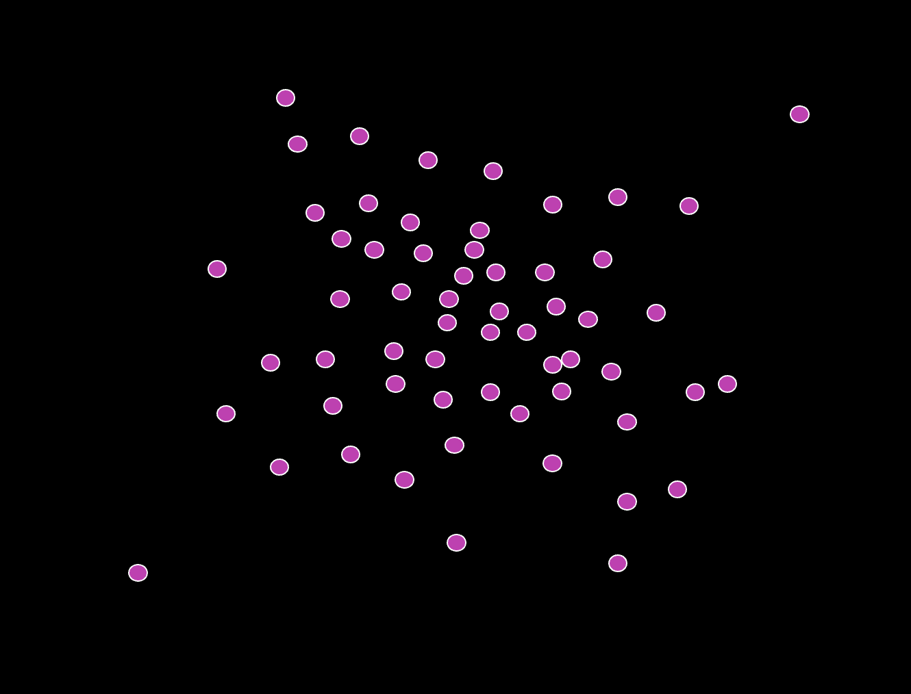
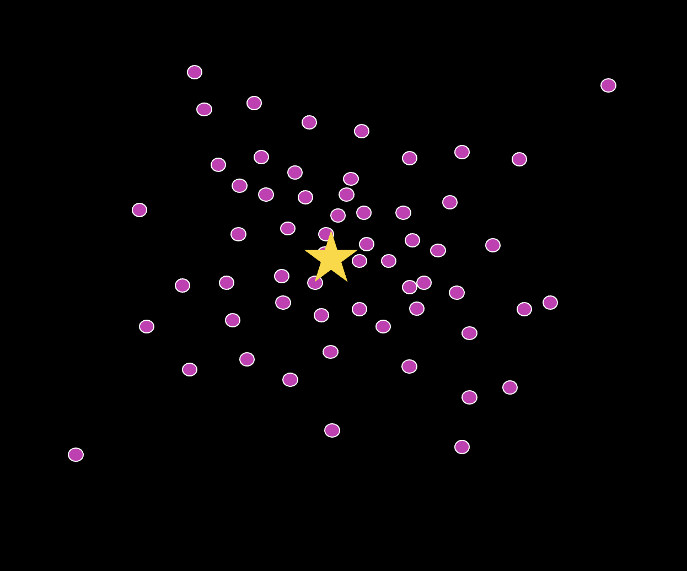
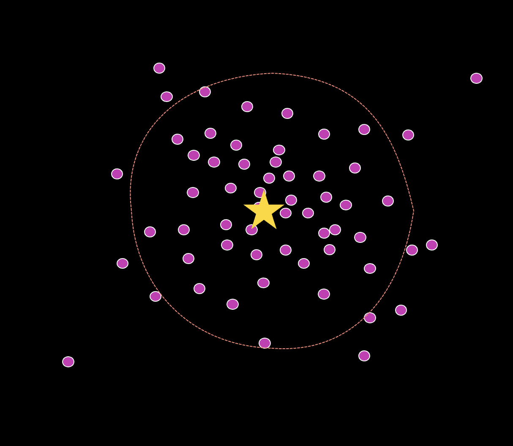

## Outline

```{r setup, include = F}
library(tidyverse)
source("bb_theme.R")
library(DataSetsb215)
human_genes<-read_csv("../data/human_genes.csv")
crimes<-read_csv("https://whitlockschluter3e.zoology.ubc.ca/Data/chapter03/chap03t1.2ConvictionsFreq.csv")
library(gt)
```

## Outline

* Estimates of location
* Estimates of width
* Explanatory and exploratory figures
* Best practices in figure design
* How data types drive figure design
* How to make effective tables

::: notes
today: location and width; next class plots
:::

## Learning Goals

-   Differentiate between estimates of location and estimates of width.
-   Recognize that variability is not simply noise, but is a key parameter that can be estimated.
-   Become familiar with the most common descriptive statistics.
-   Know when the mean or median is a more appropriate summary of location.


::: notes
These learning goals are for the entire topic/unit. They will also be available in the study guide.
:::


## Descriptive Statistics

::: r-fit-text
Or **summary statistics**: quantities that capture important features of frequency distributions
:::


* Location (**central tendency**)

* Width (**spread**)

* Association (**correlation**)

## The data (1/3)

{fig-alt="Several pink points somewhat clustered around the center of a black background." fig-align="center"}

##  The data (2/3)

* A measure of center (or location) of our data: `r emo::ji("star")`

{fig-alt="Several pink points somewhat clustered around the center of a black background. A yellow star is at the center of the image, amongst the points." fig-align="center"}

## The data (3/3)


* A measure of center (or location) of our data: `r emo::ji("star")`

* A measure of spread (or width) of our data (red).

{fig-alt="Several pink points somewhat clustered around the center of a black background. A yellow star is at the center of the image, amongst the points." fig-align="center"}


## Measures of location (central tendency){.center}


* Mean

* Median

* Mode


## The ~~average~~ problem

::: goal
“Average” is sometimes used synonymously with mean. But: medians and even modes are sometimes called an “average”
:::

Let's be precise (pun intended):

* When you see the word, “average”, pay attention to which measure of location it describes.

* Here, let’s be stats pro, and refer to mean, median, mode, etc.

## The Mean

::: goal
The sum of values divided by the sample size.
:::


$$\bar{Y}=\frac{\sum_{i=1}^{n}Y_{i}}{n}$$


::::: columns
::: column
-   $\bar{Y}$: the mean of variable of $Y$
-   $\sum$: sum
:::

::: column
-   $n$: the number of individuals in the samples (sample size)
-   $Y_{i}$: the observed value for the $i$-th individual
:::
:::::

* $\bar{Y}$ ("Y bar") is the *estimate* for the mean (the real parameter mean is often expressed as $\mu$)

## The Mean (example)

::: goal
The mean of the set of 11 numbers: $1, 15,9, 16,6, 17, 10,  5, 12, 14, 13$
:::


$$\bar{Y}=\frac{\sum_{i=1}^{n}Y_{i}}{n}$$


```{r numns, eval=T, echo=F}
nums<-c(1+15+9+16+6+17+10+5+12+14+13)/11
```

$\bar{Y} = (1+15+9+16+6+17+10+5+12+14+13)/11 =$ `r nums`

::: aside
Nerd alert: this is the "arithmetic mean", the one you see most often. The three pytagorean means also include the geometric mean and the harmonic mean.
:::


## Median

::: goal
The middle measurement. 
:::

Calculate the median by taking the value halfway through an ordered list of observations.


-   Sample size is odd: The $(n + 1) / 2$-th value.
-   Sample size is even: Mean of $n/2$-th and the $(n + 2) / 2$-th values.

## Median example

1) Sample size is odd: The $(n + 1) / 2$-th value.

-   First, order the numbers: 1,  5,  6,  9, 10, 12, 13, 14, 15, 16, 17

-   The $(n + 1) / 2$-th value for odd sized samples: 

    1  5  6  9 10 **12** 13 14 15 16 17

2) Sample size is even: Mean of $n/2$-th and the $(n + 2) / 2$-th values.

    1  5  6  9 10 **[12 13]** 14 15 16 17 17
  
    mean of 12 and 13 is (12+13)/2=`r mean(c(12,13))`

## Mean and Median in R

```{r mean}
# a vector with the numbers
mynumbers <- c(1, 15,9, 16,6, 17, 10,  5, 12, 14, 13)
# mean "manually"
mysum<-sum(mynumbers) #sum all numbers
l<-length(mynumbers) #number of elements in vector
mymean <- mysum/l
mymean
# note that you can use a built-in function for this:
mymean2 <- mean(mynumbers)
mymean2
# median with built-in function
mymedian <- median(mynumbers)
mymedian
# median "manually"
mynumbers2<-sort(mynumbers)
mynumbers2
#since l = 11 (odd) we select the l+1-th element, i.e, (11+1)/2=6
mynumbers2[6]

```


## Mean x Median

::::: columns
::: column
-   Mathematically convenient.

-   Simply the sum of all observations divided by the sample size.

:::

::: column
-   Better descriptor for skewed population distributions (less affected by outliers).

-   The median is the middle measurement.
:::
:::::

::: goal
The mean and median become the same when data are symmetric.
:::

## Mode

::: goal
The most common value observed in a sample.
:::

-   easy to pick

-   always a **real value** in the data

-  applicable to non-numerical variables!
```{r beaver, fig.height=6, echo = F, fig.cap="Histograms reveal measures of center",fig.align="center"}
ggplot(datasets::beaver1, aes(x=temp)) + geom_histogram(color="white")
```

## But how will you know how your data is distributed? {.center}

::: r-fit-text
First step: plot your data
:::

## Skewness (1/2)

```{r skew, echo=FALSE, fig.height=4, fig.width=8, warning=FALSE, message=FALSE}
df<-data.frame(vals = c(rbeta(100000,2,5), 
                    rnorm(100000,.5,.15), 
                    rbeta(100000,5,2)), 
           skew = rep(c("Right Skewed","Not skewed", "Left Skewed"),each = 100000)) 
df |> ggplot(aes(x = vals, fill = skew)) + 
  geom_density(alpha = 0.9,show.legend = FALSE) + 
  facet_wrap(~skew) +
  scale_x_continuous(breaks = seq(.1,.9,.2), limits = c(0,1))
```

## Skewness (2/2)

**Left: Asymmetric** Few small values. $>1/2$ of values exceed the mean.

**Middle: Symmetric** As many large as small values. $\sim1/2$ of values exceed the mean.

**Right: Asymmetric** Few large values. $>1/2$ of values are less than the mean.

```{r skew2,echo=FALSE, fig.height=4, fig.width=8, message=FALSE, warning=FALSE,fig.align="center"}
df<-data.frame(vals = c(rbeta(100000,2,5), 
                    rnorm(100000,.5,.15), 
                    rbeta(100000,5,2)), 
           skew = rep(c("Right Skewed","Not skewed", "Left Skewed"),each = 100000)) 
df |> ggplot(aes(x = vals, fill = skew)) + 
  geom_density(alpha = 0.9,show.legend = FALSE) + 
  facet_wrap(~skew) +
  scale_x_continuous(breaks = seq(.1,.9,.2), limits = c(0,1)) 
```


## Next

Measures of spread (width):


- range

- q-quantiles, interquartile range 

- Variance

- Standard deviation 

- Coefficient of variation

## Acknowledgments

Yaniv Brandvain; Freeman & Company; and Michael Whitlock for some materials used in these slides.
