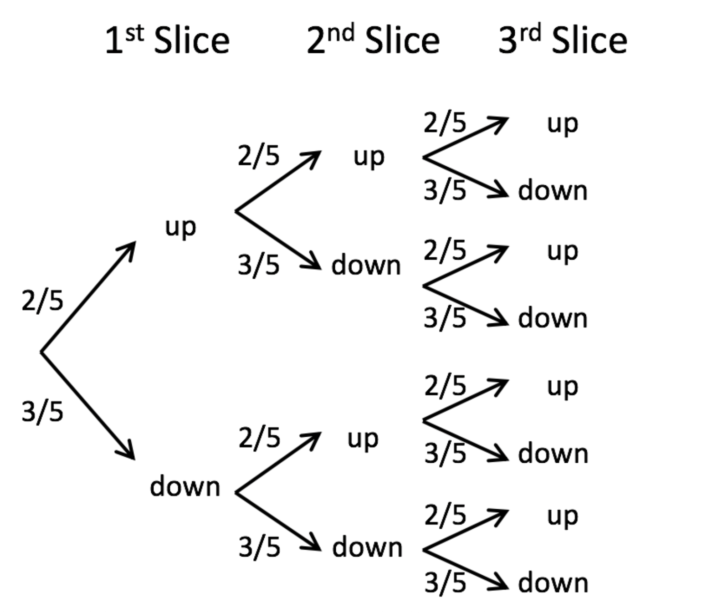
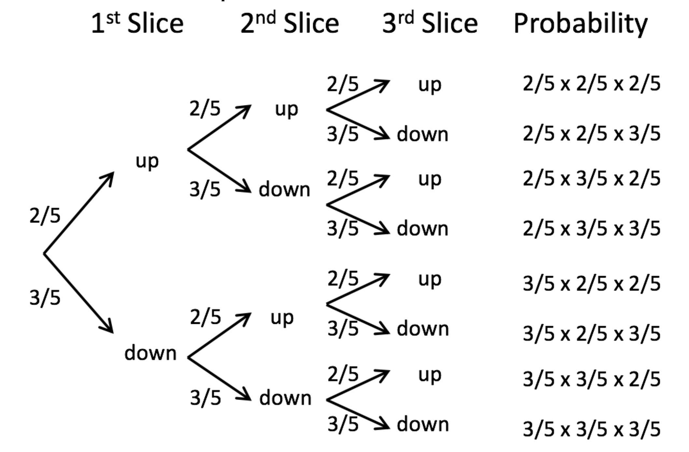
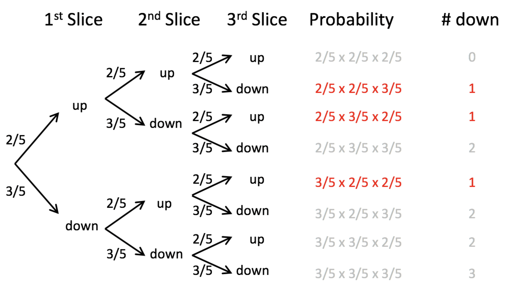
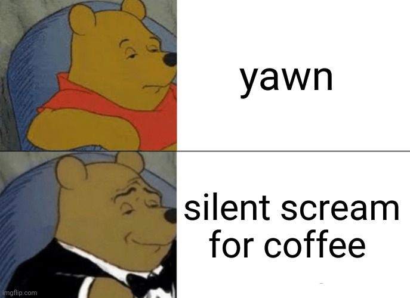

```{r setup, include=FALSE}
knitr::opts_chunk$set(collapse=T)
library(tidyverse)
library(forcats)
library(dplyr)
library(ggplot2)
library(ggforce)
library(tidyr)
library(stringr)
library(knitr)
library(ggthemes)
library(wesanderson)
library(gt)
library(RColorBrewer)
library(plotly)
library(readr)
library(thematic)
library(infer)
library(kableExtra)
library(gridExtra)
library(emoGG)
library(emo)

gg_color_hue <- function(n) {
  hues = seq(15, 375, length = n + 1)
  hcl(h = hues, l = 65, c = 100)[1:n]
}
source("bb_theme.R")

# set the theme
theme_set(bb_theme())
```

## Key learning goals

-   Explain probabilities and proportions. Which is the parameter? Which is the estimate?
-   Explain the binomial. When would you use it?
-   Understand the binomial distribution and connect it to simple
    probability rules.
-   Quantify the expected mean and variability of a binomial
    distribution.
-   Be able to appropriately conduct and interpret a binomial test.

## Proportions

-   A proportion is the fraction of individuals having a particular
    attribute. i.e. \# successes divided by \# trials

-   A proportion is also the probability that any an individual randomly
    sampled from that population will have that attribute

## Example: Murphy’s Law

::: goal
Researchers found that 6101 of the 9821 slices of toast thrown in the
air landed butter side down. What proportion of the slices landed butter
side down? Is the deck stacked against us?
:::


How would you test this?

## From proportions to the binomial

::: goal
Let’s use this estimated proportion as our *best estimate* for the true
probability of landing butter side down. To make the math a little easier, let's assume that the true
probability that toast falls butter side down is 60%.

Question: If three people drop their slice of toast, what is the
probability that one falls butter side down and two fall butter side up?
:::

HINT: Draw trees… Work on this for a few minutes

## From proportions to the binomial 

First, draw a tree



## From proportions to the binomial 

Then, work out probabilities



## From proportions to the binomial 

Finally, count the ways to get the desired outcome



## From proportions to the binomial 

Add up probabilities

$3 \times (2/5\times 2/5\times 3/5)=0.288$


## THIS IS OLD NEWS FOR YOU, SO WHAT ELSE IS NEW? {.dark-theme .center}



## THERE’S AN EASIER WAY: THE BINOMIAL DISTRIBUTION {.dark-theme .center}
