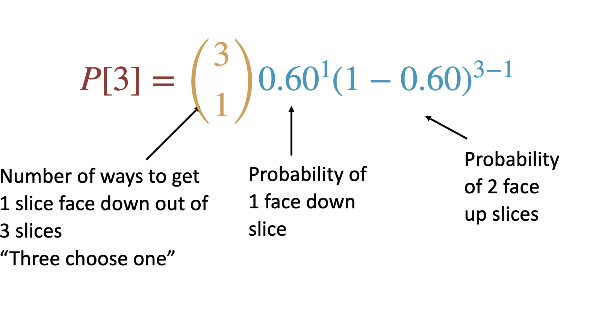

```{r setup, include=FALSE}
knitr::opts_chunk$set(collapse=T)
library(tidyverse)
library(forcats)
library(dplyr)
library(ggplot2)
library(ggforce)
library(tidyr)
library(stringr)
library(knitr)
library(ggthemes)
library(wesanderson)
library(gt)
library(RColorBrewer)
library(plotly)
library(readr)
library(thematic)
library(infer)
library(kableExtra)
library(gridExtra)
library(emoGG)
library(emo)

gg_color_hue <- function(n) {
  hues = seq(15, 375, length = n + 1)
  hcl(h = hues, l = 65, c = 100)[1:n]
}
source("bb_theme.R")

# set the theme
theme_set(bb_theme())
```

## Key learning goals

-   Explain probabilities and proportions. Which is the parameter? Which
    is the estimate?
-   Explain the binomial. When would you use it?
-   Understand the binomial distribution and connect it to simple
    probability rules.
-   Quantify the expected mean and variability of a binomial
    distribution.
-   Be able to appropriately conduct and interpret a binomial test.

## Proportions

-   A proportion is the fraction of individuals having a particular
    attribute. i.e. \# successes divided by \# trials

-   A proportion is also the probability that any an individual randomly
    sampled from that population will have that attribute

## Example: Murphy’s Law

::: goal
Researchers found that 6101 of the 9821 slices of toast thrown in the
air landed butter side down. What proportion of the slices landed butter
side down? Is the deck stacked against us?
:::

How would you test this?

## From proportions to the binomial

::: goal
Let’s use this estimated proportion as our *best estimate* for the true
probability of landing butter side down. To make the math a little
easier, let's assume that the true probability that toast falls butter
side down is 60%.

Question: If three people drop their slice of toast, what is the
probability that one falls butter side down and two fall butter side up?
:::

HINT: Draw trees… Work on this for a few minutes

## From proportions to the binomial

First, draw a tree


## From proportions to the binomial

Then, work out probabilities


## From proportions to the binomial

Finally, count the ways to get the desired outcome


## From proportions to the binomial

Add up probabilities

$3 \times (2/5\times 2/5\times 3/5)=0.288$


## THIS IS OLD NEWS FOR YOU, SO WHAT ELSE IS NEW? {.dark-theme .center}


## THERE’S AN EASIER WAY: THE BINOMIAL DISTRIBUTION {.dark-theme .center transition="concave" transition-speed="fast"}

## The Binomial Distribution: Idea

-   The probability of a given number (X) of “successes” from a fixed
    number of n independent trials.

-   E.g. If three people drop their slice of toast, what is the
    probability that one falls butter side down and two fall butter side
    up?

## Probability of Successes

Of $n$ independent trials, each with probability of success $p$, the
probably of $X$ successes is given by:

$$P[X]=\binom {n}{X}p^X(1-p)^{n-X}$$

. . .

Let's look at these parts separately

## Probability of Successes

$\binom{n}{X}$: Binomial coefficient: describes the number of ways to
get X successes in $n$ trials.

. . .

$\binom {n}{X}=\frac{n!}{X!(n-X)!}$

. . .

$n!=n\times (n-1) \times (n-2) ...\times 2 \times 1$

E.g. how many ways are there to toss 3 coins and get 1 tails.

$$\binom {3}{1}=\frac{3!}{1!(2)!}$$ $$\binom {3}{1}=3$$

## Probability of successes

$P[X]$: The probability of observing $X$ successes in $n$ trials EQUALS

. . .

$\binom{n}{X}$: \# ways to get $X$ successes from $n$ trials TIMES

. . .

$p^X(1-p)^{n-X}$: The probability of $X$ successes and by $n – X$
failures

## So back to our toast example

::: goal
Assume that the true probability that toast falls butter side down is
60%.

Question: If three people drop their slice of toast, what is the
probability that one falls butter side down and two fall butter side up?
:::

. . .

Step 1: binomial coefficient

$\binom {n}{X}=\frac{n!}{X!(n-X)!}$

. . .

$\binom {3}{1}=\frac{3!}{1!(3-1)!}=\frac{3\times 2}{2}=3$

In R:

```{r echo = T}
# binom coef.
# k is a more common notation than X for the binomial coefficient.

# "n choose k" number of ways to get 1 success out of 3 trials

choose(n=3, k=1)
```

## Toast example (cont.)

Step 2: The probability of $X$ successes and $n-X$ failures

$p^X(1-p)^{n-X}$

. . .

$0.60\times(1-0.60)^{3-1}=0.60\times 0.40^2=0.096$

. . .

Putting it all together:

$P[\text{1 successes}]=3\times0.096=0.288$

{width="368"}

## Toast example (in R)

"Manually":

```{r echo = T}
choose(n=3, k=1)*0.60*(0.40)^(2)

```

Dedicated function:

```{r echo = T}
dbinom(x = 1, size = 3, prob = 0.60)
```

## More problems! {.dark-theme .center}

## Problem 2: A population of paradise flycatchers

:::::: columns
:::: {.column width="70%"}
::: goal
The population has 80% brown males and 20% white.You capture 5 male
flycatchers at random. What is the chance that 3 of those are brown and
2 are white?
:::

$P[X]=\binom {n}{X}p^X(1-p)^{n-X}$

$\binom {n}{X}=\frac{n!}{X!(n-X)!}$

\[work on this for a few minutes\]
::::

::: {.column width="30%"}
{fig-alt="decorative figure showing flycatcher birds"}
:::
::::::

## Problem 2: Solution 

$P[X]=\binom {n}{X}p^X(1-p)^{n-X}$\$

. . .

$\binom {n}{X}=\frac{n!}{X!(n-X)!}$

$\binom {n}{X}=\frac{5!}{3!(2)!}$

$P[2]=\frac{120}{12}\times 0.8^X(1-0.8)^{5-3}$

$=19 \times (0.8)^3\times (0.2)^2$

$=0.205$

## Problem 2: Solution in R 

In R

```{r echo = T}
#Manually
binom_coef<-(5*4*3*2)/((3*2)*2)
binom_coef*(0.8^3)*((1-0.8)^2)
#or
binom_coef2<-choose(n=5, k=3)
binom_coef2*(0.8^3)*((1-0.8)^2)
```

Or:

```{r echo = T}
dbinom(x=3, size=5, prob=0.8)
```

## Problem 2: Solution in R 

```{r echo = T}
#notice that success can be either
#outcome: five birds, 3 brown, 2 white.
#p(brown)=3/5, p(white)=2/5
#brown as success
dbinom(x=3, size=5, prob=0.8)
#white as success
dbinom(x=2, size=5, prob=0.2)

```

## The binomial test {.dark-theme .center}

::: {r-fit-text}
Testing $H_0$ that $\hat p$ comes

from a population with proportion $p_0$
:::

## Example: the toast is back!

::: goal
Researchers found that 6101 of the 9821 slices of toast thrown in the
air landed butter side down.

What is the probability that we would see a result this or more extreme
if toast has a fifty-fifty chance of landing butter side down?
:::

**State the hypotheses**

. . .

Let's define butter side down as a "success"

. . .

Null hypothesis ($H_{0}$):

The sample proportion comes from a population with a probability of
success equal to $p_0=0.5$.

Alternate hypothesis ($H_{A}$):

The sample proportion comes from a population with a probability of
success $\neq p_0$.

## Calculate test statistic:

$p_0 = .5$, $n = 9821$, $X = 6101$

$\hat p=\frac{X}{n}=\frac{6101}{9821}=0.62$

## Generate the null & Find P-value

Actually calculating P-value would look like this

$9821-6101=3719$

Two-tailed P-value:

$p = \sum_{X = 6101}^{X = 9821} {9821 \choose X} .5^X (.5)^{9821-X}$

$+$

$\sum_{X = 0}^{X = 3719}  {9821 \choose X} .5^X (.5)^{9821-X}$

## We conducted a Binomial Test!

We reject $H_0$ & conclude that toast is more likely to land butter side
down than not

`r ji("clap")` Congrats `r ji("clap")`</font> You already conducted a
hypothesis test!

```{r binom, echo = F}
library(tidyverse)
library(ggthemes)
binom_tib<-tibble(x = c(1:9820)) |> 
  mutate(prob = dbinom(x = x, size = 9821, prob = .5), as_extreme = x<=3718 | x >= 6101) 
set.seed(1985)
# mytib<-tibble(p=rbinom(n=10000, size = 10000, prob = 0.5)) 
# mytib|> ggplot(aes(x=p)) + 
#   geom_histogram(color = "white") +
#   scale_fill_manual(values=asteroidcity1())+
#   ggtitle("Sampling distribution")+
#   xlab("Number slices butter side down")+
#   bb_theme()
ggplot(binom_tib, aes(x = x, y = prob, fill = as_extreme)) + 
    geom_density(stat = "identity")+ 
    ggtitle("A very small p-value, reject the null hypothesis") + geom_vline(xintercept = c(3719,6101), lty = 2) + 
    xlab("Number slices butter side down") +
    scale_fill_manual(stringr::str_wrap("Values as extreme or more extreme?", 10),values = asteroidcity1())+
    theme_tufte()+
    theme(axis.text.y=element_text(size=12), 
          axis.title.y = element_text(size=12), axis.title.x=element_text(size=12),
          axis.text.x=element_text(size=12))+
  bb_theme()
```

## `R` can make this even easier

```{r binom3, echo=TRUE}
butter.down <- 6101
slices      <- 9821
prop.down   <- butter.down / slices
# 
binom.test(x = butter.down, n = slices, p = .5, alternative = "two.sided")
# doing it "manually"
sum(dbinom(6101:9821, size= 9821, prob=0.5)) +
sum(dbinom(1:((9821-6101)+1), size= 9821, prob=0.5))
```

## Properties of the binomial distribution {.dark-theme .center}

## Expected \# successes of n trials

Expected successes in $n$ trials

$$\Huge{\mu = n \times p}$$

$\mu$: That's right. Mean number of successes, aka, expected number of
successes.

::: aside
Probability Trivia: A binomial with n = 1 is called a Bernoulli process.
This will not be a factoid you need to know in this class, but you might
hear it some time.
:::

## Binomial: Variability and Uncertainty

For counts:

$$\text{population variance: } \sigma^2 = n \times p \times(1-p)$$

$$\text{sample variance: }s^2 = n\times \hat p \times(1-\hat p)$$

::: aside
Note: Some textbooks use n-1 rather than n for the denominator of the standard error. Dividing by n-1 decreases bias, but yields estimates results  that are further from the truth, on average.
:::

## Properties of proportions: expectations

If there are $X$ successes in $n$ trials in a random sample, then the

*estimated proportion of successes* is:

$$\hat p = \frac{X}{n}$$

$\hat p$: The hat signals that this is an estimate

$p$: The expected proportion of successes is the probability of success p


## 


