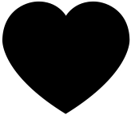
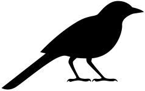

```{r setup, include=FALSE}
knitr::opts_chunk$set(collapse=T)
library(tidyverse)
library(forcats)
library(dplyr)
library(ggplot2)
library(ggforce)
library(tidyr)
library(stringr)
library(knitr)
library(ggthemes)
library(wesanderson)
library(gt)
library(RColorBrewer)
library(plotly)
library(readr)
library(thematic)
library(infer)
library(kableExtra)
library(gridExtra)
library(emoGG)
library(emo)
library(ggmosaic)

gg_color_hue <- function(n) {
  hues = seq(15, 375, length = n + 1)
  hcl(h = hues, l = 65, c = 100)[1:n]
}
source("bb_theme.R")
options(digits = 3)

# set the themeb_theme()
theme_set(bb_theme())

birds_original <- data.frame(Age = c("Old","Young","Old", "Young"),
                      Species = c("Junco", "Junco", "Finch", "Finch"),
                      Number = c(4, 7, 9, 9))
nhl <- tibble( month = c("Jan", "Feb", "Mar", "Apr", "May", "June", "Jul", "Aug", "Sep", "Oct", "Nov", "Dec"),
        month.num = 1:12,
        births = c(133, 125, 114, 119, 119, 123, 96, 91, 83, 84,73,85)) |> 
  mutate(month = fct_reorder(.f = month, .x = month.num,.desc = TRUE))


human_births<-tibble( month = c("Jan","Feb","Mar","April","May",
                                "June","Jul","Aug","Sept","Oct","Nov","Dec"),
                             `births (%)`  = 100*c(Jan = 0.0794, Feb = .0763, Mar = .0872,
                              April = .0863, May = .0895, June = .0857, Jul = .0876,
                              Aug = .085, Sept =  .0854, Oct = .0819, Nov = .0770,
                              Dec = .0787) )

lousy.fish <- tibble(num_parasites = 0:9, num_fish = c(103, 72, 44, 14, 3, 1, 1,0,0,0)) 
fish.sum   <- lousy.fish |> summarise(total_fish = sum(num_fish), 
                                       total_parasites = sum(num_fish* num_parasites))

births<-tibble( month = c("Jan","Feb","Mar","April","May","June","Jul","Aug","Sept","Oct","Nov","Dec"),
        `births (%)`  = 100*c(Jan = 0.0794, Feb = .0763, Mar = .0872, April = .0863, May = .0895, June = .0857, Jul = .0876, Aug = .085, Sept =  .0854, Oct = .0819, Nov = .0770, Dec = .0787) ) 
```

## Outline

-   ~~Quantifying associations between two categorical variables~~

-   ~~Relative risk~~

-   ~~Odds-ratio~~

-   OR vs RR

-   Testing associations between categorical variables

-   $\chi^2$ contingency test

-   Fisher's test

## Recap

>Contingency analysis estimates and tests for an association between two or more categorical variables.

- At the heart of these approaches we are really investigating the *independence of variables*

## RR vs OR

- Both $RR$ and $OR$ measure the association between two categorical variables when both have only 2 categories. 

- RR is the probability of an undesired outcome in the treatment group divided by the probability of the same outcome in a control group. Especially  appropriate when comparing the probability (risk) of a *focal outcome* in a response variable between two treatments or groups of subjects

- The OR is the odds of "success" (focal outcome) in one group divided by the odds of success in a second group. The explanatory variable defines the groups being compared.

- E.g. death in the titanic for women x men. Focal outcome is death. "Treatment" group for RR is women


## When to Calculate OR (1/2)?

We often cannot obtain an unbiased estimate of $p_1$ or $p_2$.

Odds ratios risk can be calculated even when we don't have a random
sample and we can't obtain unbiased probabilities!

Thus it is extremely useful for "case-control" studies, as they have a
large sample of individuals with rare conditions.


$$\widehat{OR} = \frac{\widehat{O_1}}{\widehat{O_2}} = \frac{a/c}{b/d} = \frac{ad}{bc}$$


```{r}
or <- data.frame(Treatment = c("a","c"), Control = c("b","d"), 
                 row.names = c("Success (focal outcome)", "Failure (alternative outcome)"))
kable(or) %>%   kable_styling(full_width = FALSE) 
#or
```

::: aside
Case control studies: an *observational* study in which a sample of
individuals with a focal condition (cases) is compared to a sample of
subjects lacking the condition (controls).
:::


## Odds Ratio: Toxoplasma & Car Wrecks

<font size = 6> <font color = "black">Toxoplasma</font> tricks
mice into taking risks so it can find it's
way into cats. Could
*Toxoplasma* be associated with risk taking
in humans? [Yereli et al.](https://www.ncbi.nlm.nih.gov/pubmed/16332418)
asked this by comparing *Toxoplasma*
prevalence in people who caused car crashes to those who hadn't.

::: {style="float:left;position: relative; top: 0px;"}

:::

## $\widehat{OR}$: Toxoplasma & Car Wrecks. Try!

```{r}
kable(or) %>% kable_styling(full_width = FALSE) 
#or
```

$$\widehat{OR} = \frac{\widehat{O_\text{infected}}}{\widehat{O_\text{uninfected}}} = \frac{a/c}{b/d} = \frac{ad}{bc}  = ??? $$

```{r}
#Example car accidents and Toxoplasma [crazy cat people]
drivers <- data.frame(infected = c(61,16), 
                     uninfected = c(124,169), 
                     row.names = c("In accident","Not in accident"))
kable(drivers) %>% kable_styling(full_width = FALSE)
#drivers
```

## $\widehat{OR}$: Toxoplasma & Car Wrecks

```{r}
kable(or) %>% kable_styling(full_width = FALSE) 
#or
```

$$\widehat{OR} = \frac{\widehat{O_\text{infected}}}{\widehat{O_\text{uninfected}}}  = \frac{a/c}{b/d} = \frac{ad}{bc} =\frac{61 \times 169}{124 \times 16} = `r round((61 * 169)/(124 * 16),digits =2)`$$

```{r}
kable(drivers) %>% kable_styling(full_width = FALSE)
#drivers
```

## Toxoplasma & Car Wrecks. Summary

Without  knowing the $P(wreck \| toxoplasma)$ and $P(wreck \| w/out toxoplasma)$ we can't estimate RR

Still, we learned that the odds of being in a car wreck is
<font color = "black">five times higher</font> if you have toxoplasma
than if you do not!

```{r , fig.width=4.5, warning=FALSE, message=FALSE}
drivers <- data.frame(infected = c(61,16), 
                     uninfected = c(124,169), 
                     row.names = c("In accident",
                                   "Not in accident"))
ggplot(data = drivers %>% 
         mutate(wreck = rownames(drivers)) %>% 
         gather(key = toxoplasma, value = n, -wreck)) +
  geom_mosaic(aes(x = product(toxoplasma), weight = n,fill = wreck), show.legend = FALSE) +                       
  scale_fill_manual(values = c("gold","firebrick")) +
  xlab("Toxoplasma infection status")+
  ylab("") +
  scale_y_continuous(expand =  c(0,0)) +
  ggtitle(label = "More wrecks in toxoplasma cases")+
  theme_tufte()+
  bb_theme()     +
  theme(axis.ticks = element_blank(), plot.title = element_text(size=20))+
  guides(fill = guide_legend(reverse = TRUE, title="")) +
  scale_y_continuous(breaks = c(.35,.95), labels = c("In accident","Not in accident"), position = "right")+
  theme(axis.ticks = element_blank(),
        axis.text.y = element_text(angle = -90,size = 16,color = c("gold","firebrick"))) 

```


## Toxoplasma & Car Wrecks. Uncertainty

We estimate that the odds of being in a
car wreck is 5.2 for those with, than those without *Toxoplasma*.

We know that estimates are associated with uncertainty.

We can quantify this!


## Toxoplasma & Car Wrecks: OR 95% CI \[1/2\]

1st know that that standard error for the odds ratio cannot be directly
computed, but the standard error of the log odds can!

$$SE[ln(\widehat{OR})] = \sqrt{\frac{1}{a} + \frac{1}{b} + \frac{1}{c} + \frac{1}{d}}$$

Then to find the 95% CI

1.  Calculate $SE[ln(\widehat{OR})]$

2.  Find the confidence limits of the log-odds as
    $SE[ln(\widehat{OR})] \pm 2 \times  SE[ln(\widehat{OR})]$

3.  Exponentiate this result to get back to linear scale
  

## Toxoplasma & Car Wrecks: OR 95% CI \[2/2\]

1.  $SE[ln(\widehat{OR})] =  \sqrt{\frac{1}{61} + \frac{1}{124} + \frac{1}{16} + \frac{1}{169}} = `r round(sqrt(1/61 + 1/124 + 1/16 +1/169), digits = 3)`$

2.  Find the 95% CI as
    $ln(\widehat{OR}) \pm 2 \times  SE[ln(\widehat{OR})]$\
    $= ln(5.2) \pm 2 \times `r round(sqrt(1/61 + 1/124 + 1/16 +1/169), digits = 3)`$\
    $= 1.65 \pm `r 2 * round(sqrt(1/61 + 1/124 + 1/16 +1/169), digits = 3)`$\
    95% CI of $ln(\widehat{OR})$ is between 1.04 and 2.26

3.  95% CI of $\widehat{OR}$ = `exp(c(1.04, 2.26))` =
    `r round(exp(c(1.04, 2.26)),digits = 1)`

CONCLUSION:  $2.8 < OR < 9.6$ <br>The odds of getting in an accident
are plausibly between 2.8 and 9.6 times higher for people with than
without *Toxoplasma*. <br> - Because the 95% CI does not contain 1, we
reject the null hypothesis and conclude that there is an association
between *Toxoplasma* infection and car accidents.

## In R

The easiest way to calculate OR and CIs in R:

```{r, echo = T}
toxoplasma<-matrix(c(61, 16,124, 169), nrow=2)
colnames(toxoplasma)<-c("inf", "not-inf")
rownames(toxoplasma)<-c("crash", "no_crash")
toxoplasma
fisher.test(toxoplasma,conf.int = T)
```

::: aside
The CI above is a little different from the one before (Wald method) because this function uses a different
method. You can find out more in the help(fisher.test) function. Lab10 also goes over this.
:::

## RR 95% CI

The 95% CI for the RR is also not pretty. Based on the same assumptions
as the one we showed for $OR$ (i.e., random samples):

$$SE[ln(\widehat{RR})] = \sqrt{\frac{1}{a} + \frac{1}{b} - \frac{1}{a+c} - \frac{1}{b+d}}$$

$$ln(\widehat{RR})-2\times SE[ln(\widehat{RR})]<ln(RR) < ln(RR)+2\times SE[ln(\widehat{RR})]$$

Note that for $RR$ and $OR$ there are several available methods and no
consensus over which one is best.

The two we showed here use a type of rule of thumb based on the normal distribution. I.e., these are approximations based on the Z distribution.

## 95% CI in R with resampling (instead of this dreadful equation) {width="43"}

-   There is another way: we can bootstrap!

-   By bootstrapping, we approximate the sampling distribution by
    resampling outcomes with replacement and summarizing variability in
    this resampling to describe uncertainty.

## Testing Associations Between Categorical Variables {.dark-theme .center}

$\chi^2$ Contingency Tests and Fisher's Exact Test

## $\chi^2$ Contingency Test of Independence

Remember: The multiplication rule states that if two outcomes, A & B
are independent, $$P[A \& B] = P[A] \times P[B]$$

-   So, we have our expectation under the null hypothesis that A & B are
    independent.

-   We can test if our deviation from this expectation is unexpected
    under the null from the $\chi^2$ test!

-   This is imply a special case of the $\chi^2$ goodness of fit where
    the model described the independence between two (or more)
    categorical variables

## Calculating $\chi^2$ & Degrees of Freedom

Remember: $\chi^2$ is the sum of deviations between expectations and
observations,$i$ and $j$ are rows and columns, respectively.

$$\sum_i \sum_k{\frac{{(\text{Observed}_{i,j}-\text{Expected}_{i,j})^2}}{\text{Expected}_{i,j}}}$$

-   The degrees of freedom specify the additional number of values we
    need to know all the outcomes in our study.

-   $\text{Degrees of freedom for } \chi^2 \text{ contingency test}  =  (n_\text{rows} - 1) \times (n_\text{columns} - 1)$

## Bird Abandonment Issues [1/] {width="62"}

::: {style="float:left;position: relative; top: 0px; left: -20px;"}

:::

What's a bird to do when the rent is do and they can't feed
 their chicks?

[Kloskowski](https://datadryad.org/resource/doi:10.5061/dryad.6k417tm)
tested the idea that birds in poor habitats abandon their final egg.

::: aside
Data for this example: Data for this example: https://doi.org/10.5061/dryad.6k417tm
:::

## Bird Abandonment Issues [2/] {width="62"}

```{r}
library(readxl)
birds <- read_excel("data/Post_laying_clutch.xls")


birds %>% 
  ggplot(aes(fill= `Habitat quality`, x = `Last egg`)) +
  geom_bar(position = "dodge") + 
  annotate(geom = "text", x = c(.8,1.2,1.8,2.2), y = c(-2,-2,-2,-2), 
           label = c("High","Low","High","Low"))+
  xlab("Last egg") +
  scale_fill_manual(values  = c("#0072B2","#CC79A7"))+
  theme_tufte() + 
  bb_theme()    + 
  theme(legend.position = c(0.2, 0.8), 
        axis.ticks = element_blank()) + 
  guides(fill = guide_legend( title="Habitat quality"))+
  bb_theme()
```

## Bird Abandonment Issues [3/] {width="62"}

Hypotheses:

$H_0$: There
is NO association between habitat quality
& the chance of abandoning the last egg

$H_A$: There
is AN association between habitat quality &
the chance of abandoning the last egg

## Bird Abandonment Issues [4/] {width="62"}

Observations (contingency table)

```{r cont, echo = T}
table(birds$`Last egg`, birds$`Habitat quality`) |> kable()
```


## Bird Abandonment Issues [5/] {width="62"}

Observations (contingency table)

```{r cont2, echo = F}
tab<-table(birds$`Last egg`, birds$`Habitat quality`) 
tab<-rbind(tab, c(Total_high=sum(tab[,1]), Total_low=sum(tab[,2])))
rownames(tab)[3]<-"Total"
tab<-cbind(tab, c(sum(tab[1,]), sum(tab[2,]), sum(tab[3,])))
colnames(tab)[3]<-"Total"
tab |>  kable()
```


Find null expectations!!!!!!

$n_{abandoned}=(1+19)=20$

$n_{\text{hatched}}=74$


## Bird Abandonment Issues [6/] {width="62"}

Multiply proportions by each other and sample size to find null expectations.
$$E[n(A,B) | n]  = n \times P[A] \times P[B]$$

```{r,echo=FALSE}
birds2 <- birds                                    %>% 
  group_by(`Habitat quality`,`Last egg`)           %>% 
  summarize(observed = n())                        %>% 
  mutate(n.habitat = sum(observed))  %>% ungroup() %>%                   
  group_by(`Last egg`)                             %>%
  mutate(n.egg     = sum(observed))                %>% ungroup()                                                                           ;kable(birds2, digits = 2) %>% kable_styling(full_width = FALSE,font_size = 26) ;
```


$P_{habitat}=n_{habitat}/n_{total}$

$P_{egg}=n_{egg}/n_{total}$

E.g. Expected $P(\text{high & abandoned})=0.574\times 0.213\times 94$


## Bird Abandonment Issues [7/] {width="62"}

Null expectations:

Multiply proportions by each other and sample size to find null expectations.
$$E[n(A,B) | n]  = n \times P[A] \times P[B]$$

```{r warning = FALSE, echo = FALSE}
birds2 <- birds                                    %>% 
  group_by(`Habitat quality`,`Last egg`)           %>% 
  summarize(observed = n())                        %>% 
  mutate(n.habitat = sum(observed))  %>% ungroup() %>%                   
  group_by(`Last egg`)                             %>%
  mutate(n.egg     = sum(observed))                %>%
  ungroup()  

birds.summary <- birds2  %>%   
  mutate(p.habitat = n.habitat         / sum(observed),
         p.egg     = n.egg             / sum(observed),
         expected  = p.habitat * p.egg * sum(observed))                                     %>% select(-n.habitat, - n.egg)
```


## Abandonment: $\chi^2$ Assumptions? {width="62"}


<font size = 7> Remember assumptions</font>

-   No more than 20% of categories have Expected $< 5$

-   No category with Expected $\leq 1$

```{r warning = FALSE, echo = FALSE}
kable(birds.summary, digits = 3) %>%  
  kable_styling(full_width = FALSE,font_size = 22) 
#birds.summary
```

We meet the assumptions


## Abandonment: $\chi^2$ {width="62"}

Remember: $\chi^2$ is the sum of the squared deviations from expected
counts divided by expected counts.

$$\sum \frac{(\text{Observed}-\text{Expected})^2}{\text{Expected}}$$

$$\frac{( `r round(birds.summary[1,"observed"],digits = 1)`-`r round( birds.summary[1,"expected"],digits = 1)`)^2}{`r round(birds.summary[1,"expected"],digits = 1)`} +  \frac{( `r round(birds.summary[2,"observed"],digits = 1)`-`r round( birds.summary[2,"expected"],digits = 1)`)^2}{`r round(birds.summary[2,"expected"],digits = 1)`} + \frac{( `r round(birds.summary[3,"observed"],digits = 1)`-`r round( birds.summary[3,"expected"],digits = 1)`)^2}{`r round(birds.summary[3,"expected"],digits = 1)`} +  \frac{( `r round(birds.summary[4,"observed"],digits = 1)`-`r round( birds.summary[4,"expected"],digits = 1)`)^2}{`r round(birds.summary[4,"expected"],digits = 1)`}$$

```{r echo=FALSE}
birds.chi <- birds.summary %>%
  mutate(squared.dev = (observed - expected)^2/expected) %>%
  summarise(chi2     = sum(squared.dev))                                         %>% pull()  
```

So $\chi^2 = `r round(birds.chi, digits = 2)`$(without rounding anywhere)

$$df =  (n_\text{columns} - 1) \times    (n_\text{rows} - 1)$$

$$df =  (2 - 1) \times    (2 - 1) = 1$$

## Abandonment: Critical & P-values

```{r}
 x <- data.frame(rbind( qchisq(p = 10^(-1:-8), df = 1, lower.tail = FALSE),  
                  qchisq(p = 10^(-1:-8), df = 2, lower.tail = FALSE)))
colnames(x) <- 10^(-1:-8)
rownames(x) <- c("df = 1", "df = 2")


kable(x, digits = 1, caption = "Critical value at for df in rows and alpha level in columns", escape = F) %>% kable_styling( )
```

We're significant at the $1e-7$ level

We reject the $H_0$ and conclude that bird abandon eggs in bad environemnts.

In R: `pchisq(q = birds.chi, df = 1, lower.tail = FALSE)`\
`= 8.96e-08`


## One tailed test?

Note that we only looked at one tail of the $\chi^2$ distribution.

This <font color = "black">does not mean that we only notice an
association</font> in one direction.

Both ways to be exceptional (an association
between abandonment and poor environments OR an association between
abandonment and good environments) yield a strong discrepancy
between observations and expectations, and can generate a significant
association.

## Always quantify effect size, direction, and uncertainty

Bird abandonment with OR and CI

```{r}
tab2<-tab[1:2, 1:2]
tab2 |> kable()
```

$OR=(1*21)/(53*19)=0.0209$

```{r echo = T}
# OR in this function is calculated a bit differently, hence the difference.
fisher.test(tab2)
```

OR 95% CI: $0.0005 <OR < 0.153$, reject the null.

## What if we don't meet $\chi^2$ requirements? {.dark-theme .center}


## Example: Nuptial Gifts

Sometimes, females of the Australian redback spider
<font color = "black">Latrodectus hasselti</font> eat there mates. Is
there anything in it for the males?

Maydianne Andrade tested the idea that eating a male might distract a
female & prevent her for remating with a $2^\text{nd}$ male.

::: {style="float:left; position: relative; bottom: 0px;"}

:::

<br><br><br><br><br><br><br><br>

::: aside
Example from: Andrade, M. (1996). Science 271: 70-72
[link](http://science.sciencemag.org/content/271/5245/70)
:::

## Nuptial Gift: Observed & Expected

::: columns

::: column
```{r,echo=FALSE,fig.width=5}
spider <- tibble(Male_2 = c("Accepted","Rejected","Accepted","Rejected"),
       Male_1 = c("Eaten","Eaten","Escaped","Escaped"),
       observed = c(3, 6, 22, 1)) 

spider|> kable()
 
```

:::

::: column
```{r warning = FALSE, echo = FALSE}

ggplot(spider ,aes(x =  Male_1, y = observed, fill= Male_2)) +
  geom_bar(position = "dodge", stat = "identity") + 
  xlab("Male 1") +
  scale_fill_manual(values  = c("lightgrey","#D55E00"))+
  theme_tufte() + 
  bb_theme()    + 
  guides(fill = guide_legend( title="Male 2"))+
  theme(axis.ticks = element_blank())
```
:::
:::

## Nuptial Gift: Finding Expected {visibility="hidden"}

```{r, echo=TRUE, eval=FALSE}
spider.summary <- spider                                 %>%  
  group_by(Male_1)                                       %>%
  mutate(n.Male_1 = sum(observed))                       %>% 
  ungroup()                                              %>%
  group_by(Male_2)                                       %>%
  mutate(n.Male_2   = sum(observed))                     %>%  
  ungroup()                                              %>%
  mutate(p.Male1 = n.Male_1 / sum(observed),
         p.Male2 = n.Male_2 / sum(observed),
         expected  = p.Male1 * p.Male2 * sum(observed))  %>% 
  select(-n.Male_1, - n.Male_2) 
```


## Nuptial Gift: $\chi^2$ Assumptions?

-   No more than 20% of categories have Expected $< 5$

-   No category with Expected $\leq 1$

We do not meet assumptions

```{r}
spider <- tibble(Male_2 = c("Accepted","Rejected","Accepted","Rejected"),
       Male_1 = c("Eaten","Eaten","Escaped","Escaped"),
       observed = c(3, 6, 22, 1)) 

# note this is one way to accomplish this. im not sure its a good way 
spider.summary <- spider                                 %>%  
  group_by(Male_1)                                       %>%
  mutate(n.Male_1 = sum(observed))                       %>% 
  ungroup()                                              %>%
  group_by(Male_2)                                       %>%
  mutate(n.Male_2   = sum(observed))                     %>%  
  ungroup()                                              %>%
  mutate(p.Male1 = n.Male_1 / sum(observed),
         p.Male2 = n.Male_2 / sum(observed),
         expected  = p.Male1 * p.Male2 * sum(observed))  %>% 
  select(-n.Male_1, - n.Male_2) 
kable(spider.summary, digits = 2) %>%  kable_styling(font_size = 18) 

```


## Fisher's Exact Test

- Generates all possible permutations of your data.

- Asks what proportion of configurations result in associations as or
more extreme than observed.

$p-value =$(Sum of Probabilities of Tables at least as Extreme as Observed Table) / (Sum of Probabilities of All Possible Tables)

The test statistic is calculated based on the hypergeometric distribution (which we won't go into), which gives the *probability of observing the given contingency table under the assumption of independence*.

## Fisher's test in R

```{r, echo=F}
spider.spread <- spread(spider,key = Male_2, value = observed )%>% 
  select(-"Male_1")
```

```{r, echo=T}
fisher.test(spider.spread) 
```

```{r}
with( fisher.test(spread(spider,key = Male_2, value = observed )%>% select(-"Male_1") ) , 
      cbind(method, lower.95 = round(conf.int[1],digits = 4),
            upper.95 = round(conf.int[2], digits = 4),
            odds_ratio = round(estimate, digits = 4), 
            p.value = round(p.value, digits = 4)))  %>%
  kable() %>% 
  kable_styling(font_size = 18)
```

We reject the null hypothesis.

## Doing our own permutations

$1^{st}$ tidy data by going from this on left, to this on right

::: {style="float:left; position: relative; bottom: 0px;"}
```{r}
kable(spider) %>% kable_styling(full_width = FALSE)
```
:::

::: {style="float:right; position: relative; bottom: 0px;"}
```{r}
spider %>%  
  uncount(weights = observed) %>% 
  kable() %>%
  kable_styling()%>%
  scroll_box(height = "350px", width = "350px") 
```
:::

<br> <br><br><br><br><br><br><br><br>

By doing this

```{r, echo=TRUE}
disaggregated.spider <-  spider %>%  
  uncount(weights = observed)            
```

## Doing our own permutations! {visibility="hidden"}

```{r, echo=TRUE, eval=TRUE}
obs.diff <- disaggregated.spider%>%
  summarise(obs      = mean(Male_2 == "Rejected" & Male_1 == "Eaten" ), 
            expect   = mean(Male_2 == "Rejected") *  mean(Male_1 == "Eaten"),
            differ   = abs(obs - expect)) %>%
  select(differ) %>%  pull()

disaggregated.spider %>% 
  rep_sample_n(size = nrow(disaggregated.spider), 
               reps = 500000) %>%
  mutate(Male_1 = sample(Male_1, size = n(), replace = FALSE)) %>%
  group_by(replicate) %>%
  summarise(obs    = mean(  Male_2 == "Rejected" & Male_1 == "Eaten" ), 
            expect = mean(Male_2 == "Rejected") *  mean(Male_1 == "Eaten"),
            differ = abs(obs - expect)) %>%
  mutate(as.extreme =  differ >= obs.diff ) %>%
  summarise(mean(as.extreme)) %>% pull()  # Our p-value!
```

## Chi-squared vs  Fisher’s exact test

- Both have the same null hypothesis: the outcome is independent from the groups.
- Chi-square is generally best for larger samples and Fisher’s is better for smaller samples. 
- Both can be extended to cases beyond 2x2 with 2 categorical variables, such as 3x2, 2x5, etc
- When to use Fisher’s exact test:

a) > 20% of categories with Expected values < 5

b) Any expected value <1
c) The column or row marginal values are extremely uneven.

- Note: Fisher's ok for all sample sizes. But the # of possible tables grows at an exponential rate and soon becomes unwieldy. So mostly used for smaller sample sizes.

