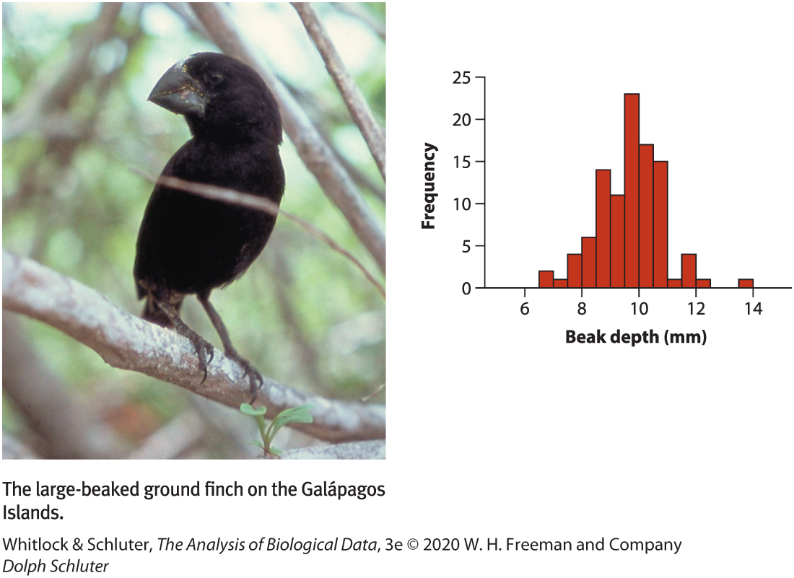
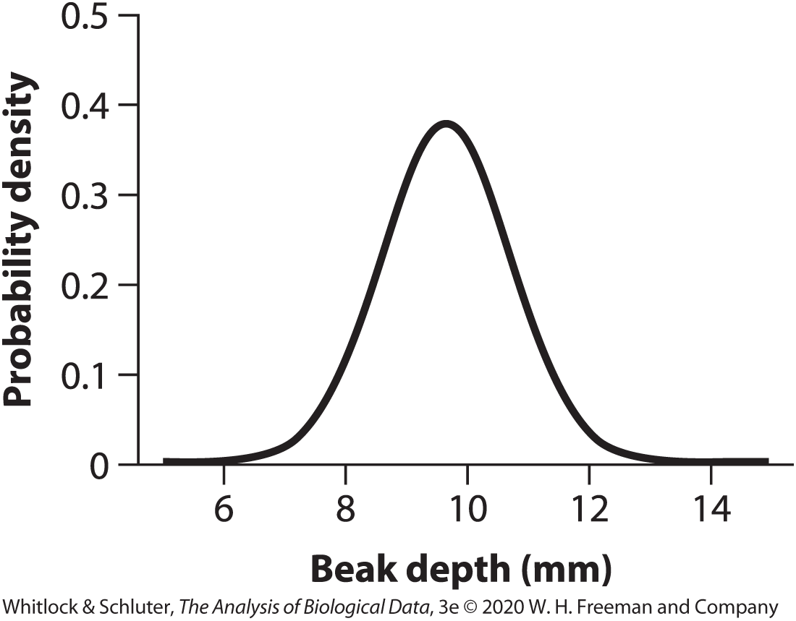

## Outline

```{r setup, include = F}
source("bb_theme.R")
library(tidyverse)
human_genes<-read_csv("../data/human_genes.csv")
crimes<-read_csv("https://whitlockschluter3e.zoology.ubc.ca/Data/chapter03/chap03t1.2ConvictionsFreq.csv")
library(gt)
```

-   Estimates of location
-   Estimates of width
-   Explanatory and exploratory figures
-   Best practices in figure design
-   How data types drive figure design
-   How to make effective tables

::: notes
today: location and width; next class plots
:::

## Learning Goals

-   **Differentiate between estimates of location and estimates of width.**
-   **Recognize that variability is not simply noise, but is a key parameter that can be estimated.**
-   **Become familiar with the most common descriptive statistics.**
-   **Know when the mean or median is a more appropriate summary of location.**
-   Distinguish between explanatory and exploratory figures.
-   Identify what makes a good graph.
-   Understand how data types drive figure design.
-   Understand how to make effective tables.

::: notes
These learning goals are for the entire topic/unit. They will also be available in the study guide.
:::

## Frequency vs. Probability Distribution

::::: columns
::: column
*Frequency Distribution* {width="363"}

-   sample
-   a snapshot of actual counts of outcomes in a given sample
:::

::: column
*Probably Distribution* {width="343"}

-   population
-   usually not known so based on probability rules: it represents the theoretical probability of all possible outcomes of a random variable
:::
:::::

## Descriptive Statistics

::: r-fit-text
Or **summary statistics**: quantities that capture important features of frequency distributions
:::

## Three Common Descriptions of Data

-   Location (**central tendency**)

-   Width (**spread**)

-   Association (**correlation**)

## Measures of location (central tendency) {.center background="#006475"}

## Measures of location {.center}

:::: r-fit-text
::: incremental
-   **Mean:** The weight of your data. The average value.

-   **Median:** A "typical individual". If I take an individual at random, this is the value we expect them to be closest to.

-   **Mode:** The typical individual **most common** value for an individual. The most likely answer for an individual selected at random.
:::
::::

## The ~~average~~ problem

::: goal
“Average” is often used synonymously with mean.
:::

-   But: medians and even modes are sometimes called an “average”.

-   When you see the word, “average”, pay attention to which measure of location it describes.

::: aside
In this course, you should use statistical terms precisely, i.e., to indicate the same consistently. So if you want to say mean, say mean, not average.
:::

## (Arithmetic) Mean

::: goal
The sum of values divided by the sample size.
:::

<font color =  #00a1b7>$$\bar{Y}=\frac{\sum_{i=1}^{n}Y_{i}}{n}$$ </font>

::::: columns
::: column
-   $\bar{Y}$ is the mean value of variable $Y$
-   $\sum$ signified "sum"
:::

::: column
-   $n$ is the number of individuals in the samples (sample size)
-   $Y_{i}$ is the observed value for the $i$-th individual
:::
:::::

. . .

**Example**: The mean of the set of 11 numbers: $1, 15,9, 16,6, 17, 10,  5, 12, 14, 13$ is

$\bar{Y} = 1+15+9+16+6+17+10+5+12+14+13/11 = 106.1818$

::: aside
This is the "arithmetic mean", the one you see most often. The three pytagorean means also include the geometric mean and the harmonic mean.
:::


## Practice: Mean from a frequency table

::: columns

::: column
- Frequency tables show the number of times, $n_{i}$ a value, $Y_{i}$, is observed in a sample of size $n_{total}$

- We calculate the mean from a frequency table by summing the product of $n_{i}$ and $Y_{i}$ all values and diving by $n_{total}$.

:::

::: column
```{r crimes, echo = F, fig.cap="A frequency table. Data from Farrington (1994) and  distributed at http://www.webapp.icpsr.umich.edu/cocoon/NACJD-STUDY/08488.xml."}
crimes |> gt()
```
:::

:::


## Practice: Mean from a frequency table

::: columns

::: {.column width = "60%"}

- Frequency tables show the number of times, $n_{i}$ a value, $Y_{i}$, is observed in a sample of size $n_{total}$

```{r crimes2}
#| tidy: true
#| tidy-opts: !expr list(width.cutoff = 30)
convictions<-c(0, 1, 2, 3, 4, 5, 6, 7, 8, 9, 10, 11, 12, 13, 14)
freqs<-c(265, 49, 21, 19, 10, 10, 2, 2, 4, 2, 1, 4, 3, 1, 2)
n_total<-sum(freqs) # 395

```


- We calculate the mean from a frequency table by summing the product of $n_{i}$ and $Y_{i}$ across all values and diving by $n_{total}$.

```{r crimes3}
#| tidy: true
#| tidy-opts: !expr list(width.cutoff = 30)

# multiply two vectors of same length

FinalMean <- sum(convictions * freqs)/n_total
FinalMean
```

:::

::: {.column width = "40%"}
```{r crimes4, echo = F}
crimes |> 
mutate(`ConvictionxFreq` = convictions*frequency) |> gt(caption = "A frequency table")
```

:::


:::
## Median

::: goal
The value halfway through an ordered list of observations.
:::

-   The $(n + 1) / 2$-th value for odd sized samples.
-   Mean of n/2 th and the $(n + 2) / 2$-th value for even sized samples.

. . .

**Example**: Using the same set of numbers as before (try):

-   First, order the numbers: $1,  5,  6,  9, 10, 12, 13, 14, 15, 16, 17$
-   The $(n + 1) / 2$-th value for odd sized samples: $12$

## Mean and Median in R

```{r mean}
# a vector with the numbers
mynumbers <- c(1, 15,9, 16,6, 17, 10,  5, 12, 14, 13)
# mean "manually"
mysum<-sum(mynumbers) #sum all numbers
l<-length(mynumbers) #number of elements in vector
mymean <- mysum/l
mymean
# note that you can use a built-in function for this:
mymean2 <- mean(mynumbers)
mymean2
# median with built-in function
mymedian <- median(mynumbers)
mymedian
# median "manually"
mynumbers2<-sort(mynumbers)
mynumbers2
#since l = 11 (odd) we select the l+1-th element, i.e, (11+1)/2=6
mynumbers2[6]

```

## That's all for today

{fig-alt="Forrest says \"And that's all I wanted to say about that\"" width="347"}
