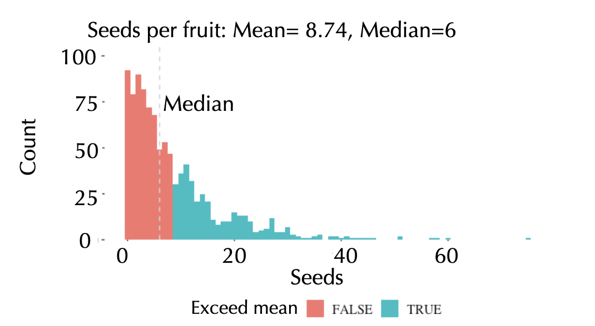
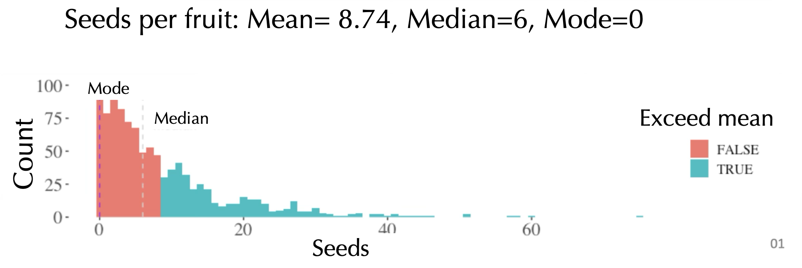

## Last time

```{r setup, include = F}
source("bb_theme.R")
library(tidyverse)
human_genes<-read_csv("../data/human_genes.csv")
crimes<-read_csv("https://whitlockschluter3e.zoology.ubc.ca/Data/chapter03/chap03t1.2ConvictionsFreq.csv")
library(gt)
chick20<-ChickWeight[ChickWeight$Time == 20,]$weight
```

-   Mean
-   Median

::: notes
today: location and width; next class plots
:::

## Today

-   Median example
-   Mode
-   Estimates of width
-   Explanatory and exploratory figures
-   Best practices in figure design
-   How data types drive figure design
-   How to make effective tables

## Attention

::::: columns
::: column
<font color = #00a1b7>Estimate = $\bar{Y}, \bar{x}, \text{etc.}$ </font> (sample mean)

-   Variable
:::

::: column
<font color =  #ad7237>Parameter = $\mu$ </font> (population mean) - Constant
:::
:::::

## Practice: Median with even sample size

::: goal
Calculate the median of the following 10 numbers: $12, 2,  9, 18,  4,  1, 10, 19, 14, 17$
:::

## Mean x Median

::::: columns
::: column
-   The mean is more convinient mathematically.

-   The mean is the center of gravity
:::

::: column
-   The median is a better descriptor for skewed population distributions.

-   The median is the middle measurement.
:::
:::::

. . .

::: goal
Both can lead to values that don’t actually exist in the sample. E.g., the average number of eggs laid by chickens in a farm might be 5.5 and the median number of children millennials have might be 1.2
:::

## Case Study

::: goal
*2005 U.S. Census*. The plot shows the income per household distribution for the bottom 98% of the population. Median = $\sim46$k; Mean: $\sim63$k.
:::

[{fig-align="left" width="600"}](http://visualeconsite.s3.amazonaws.com/wp-content/uploads/2005_income_distribution.gif)

::: notes
For measures like income, medians are generally preferable to means. Why? Populations are right-skewed (there are few very rich people), and we care more about the average person than the average of people.
:::

## Mean or Median?

::: goal
Number of seeds per fruit. Which one is better in this case?
:::



## Mode

::: goal
The most common value observed in a sample
:::

-   easy to pick out as the peak in a histogram

-   Useful because it **always reflects a value actually seen in the dataset, unlike mean and median**



## Mode

::: goal
The most common value observed in a sample
:::

-   Unimodal vs bimodal (multimodal)

-   Multimodal data usually reflects data has multiple (at least two) values that are equally common.

-   Often results from two or more underlying groups being measured together.

-   **Can be used with data that isn’t numeric**

## But how will you know how your data is distributed? {.center background="#006475"}

::: r-fit-text
First step: plot your data
:::

## Skewness

```{r, echo=FALSE, fig.height=4, fig.width=8, warning=FALSE, message=FALSE}
df<-data.frame(vals = c(rbeta(100000,2,5), 
                    rnorm(100000,.5,.15), 
                    rbeta(100000,5,2)), 
           skew = rep(c("Right Skewed","Not skewed", "Left Skewed"),each = 100000)) 
df |> ggplot(aes(x = vals, fill = skew)) + 
  geom_density(alpha = 0.9,show.legend = FALSE) + 
  facet_wrap(~skew) +
  scale_x_continuous(breaks = seq(.1,.9,.2), limits = c(0,1))+
  scale_fill_manual(values = wesanderson::wes_palette("AsteroidCity1")) +
  bb_theme()
```

## Skewness

**Left: Asymmetric** Few small values. $>1/2$ of values exceed the mean.

**Middle: Symmetric** As many large as small values. $\sim1/2$ of values exceed the mean.

**Right: Asymmetric** Few large values. $>1/2$ of values are less than the mean.

```{r echo=FALSE, fig.height=4, fig.width=8, message=FALSE, warning=FALSE}
df<-data.frame(vals = c(rbeta(100000,2,5), 
                    rnorm(100000,.5,.15), 
                    rbeta(100000,5,2)), 
           skew = rep(c("Right Skewed","Not skewed", "Left Skewed"),each = 100000)) 
df |> ggplot(aes(x = vals, fill = skew)) + 
  geom_density(alpha = 0.9,show.legend = FALSE) + 
  facet_wrap(~skew) +
  scale_x_continuous(breaks = seq(.1,.9,.2), limits = c(0,1))+
  scale_fill_manual(values = wesanderson::wes_palette("AsteroidCity1")) +
  bb_theme()
```

## Histograms reveal measures of center

::: goal
Recall the <font color =  #fdfbf7>`iris` </font> dataset
:::

{fig-align="center" width="450" height="175"}

## Histograms reveal measures of center

::: panel-tabset
### Figure

```{r hist, fig.height=4.5}
#| echo: false
#| tidy: true
#| tidy-opts: !expr list(width.cutoff = 50)
library(ggplot2)
ggplot(iris , 
       aes(x = Petal.Width, fill = Species) ) +
  geom_histogram(binwidth = .1, show.legend = FALSE, alpha = .9) +  
  xlab("Petal Width (cm)") + 
  facet_wrap(~ Species, ncol = 1) + 
  scale_x_continuous(breaks = seq(.5,2.5,.5)) +
  scale_fill_manual(values = wesanderson::wes_palette("AsteroidCity1")) +
  bb_theme()
```

### Code

```{r hist2}
#| echo: true
#| eval: false
#| tidy: true
#| tidy-opts: !expr list(width.cutoff = 50)
library(ggplot2)
ggplot(iris , 
       aes(x = Petal.Width, fill = Species) ) +
  geom_histogram(binwidth = .1, show.legend = FALSE, alpha = .9) +  
  xlab("Petal Width (cm)") + 
  facet_wrap(~ Species, ncol = 1) + 
  scale_x_continuous(breaks = seq(.5,2.5,.5)) +
  scale_fill_manual(values = wesanderson::wes_palette("AsteroidCity1")) +
  bb_theme()
```
:::

## Measures of dispersion

::: incremental
-   Range \[`max value - min value`\]

-   Quartiles, interquartile range \[`75th percentile - 25th percentile`\]

-   Variance \[<font color = #00a1b7> estimate = $s^2$ =$\frac{\Sigma(x_i - \bar{x})^2}{n-1}$</font>, <font color = #ad7237>param = $\sigma ^2$ = $\frac{\Sigma(x_i - \mu)^2}{n}$ \]</font>

-   Standard deviation \[<font color =  #00a1b7> estimate = $s$ =$\sqrt{s^2}$</font>, <font color = #ad7237>param = $\sigma$ = $\sqrt{\sigma^2}$ \]</font>

-   Coefficient of variation \[<font color =  #00a1b7> estimate = CV = $\frac{s}{\bar{Y}}$</font>, <font color = #ad7237>param = $\frac{\sigma}{\mu}$ \]</font>
:::

## Range

::: goal
The difference between the maximum and minimum observed values in a sample
:::

## Range

::: goal
Range of weight of 46 chicks at 20 days since birth
:::

```{r, eval = F}
data("ChickWeight")
chick20<-ChickWeight[ChickWeight$Time == 20,]$weight
chick20
```

Max and Min in this dataset at time 20:

```{r}
summary(chick20) 
#or
c(min(chick20), max(chick20))
# commonly the diff between them is shown
max(chick20)- min(chick20)
```

## That's all for today

{fig-alt="Forrest says \"And that's all I wanted to say about that\"" width="347"}
