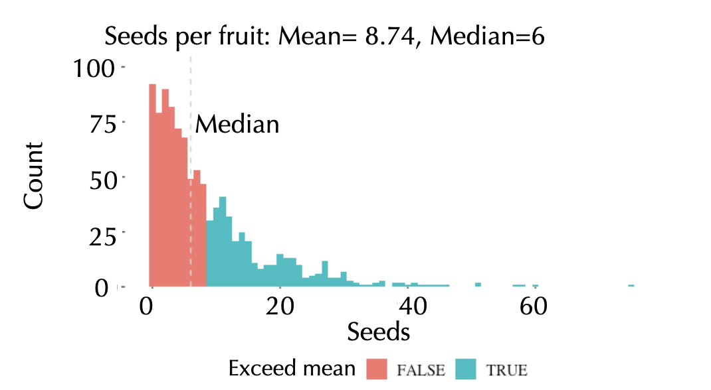

## Last time

```{r setup, include = F}
library(tidyverse)
source("bb_theme.R")
human_genes<-read_csv("../data/human_genes.csv")
crimes<-read_csv("https://whitlockschluter3e.zoology.ubc.ca/Data/chapter03/chap03t1.2ConvictionsFreq.csv")
library(gt)
chick20<-ChickWeight[ChickWeight$Time == 20,]$weight
```

-   Mean
-   Median

::: notes
today: location and width; next class plots
:::


## {.center}


Measures of spread


-   Range 

-   q-quantiles, interquartile range 

-   Variance

-   Standard deviation 

-   Coefficient of variation

## Width (aka variability) {.center}

::: r-fit-text
Variability of a population should not be ignored as simply noise about
the mean, but is biologically important in its own right.

Variation has a true value from a population that we estimate from a
sample.
:::


## Range (1/2)

::: goal
The range of a sample corresponds to the size of the narrowest interval containing all the data.
Operationally, it’s calculated as the difference between the maximum and minimum
:::

* Example: Range of weight of 46 chicks at 20 days since birth:
 
```{r, eval = T, echo=T}
chick20<-c(199, 209, 198, 160, 220, 160, 288, 125, 100, 120, 181, 195, 
91, 259, 133, 144, 115, 318, 164, 170, 76, 259, 236, 185, 212, 
279, 157, 235, 291, 156, 327, 361, 225, 169, 280, 250, 295, 199, 
269, 199, 197, 231, 210, 303, 233, 264)
```

Max and Min in this dataset at time 20:

```{r}
summary(chick20) 
#or
c(min(chick20), max(chick20))
# commonly the diff between them is shown
max(chick20)- min(chick20)
```

## Range (2/2)

* What happens to the range as sample size increases?

* What happens to the range if there are rare outliers?

* Not a good measure of spread. Let’s look for a better one. 

::: notes
Small samples tend to give lower estimates of the range than large samples.
So the sample range is a *biased estimator* of the true range of the
population. So sample range is a biased estimator of the true range of the
population.
:::

## Attention

::::: columns
::: column
<font color = #00a1b7>Estimate = $\bar{Y}, \bar{x}, \text{etc.}$ </font> (sample mean)

-   Variable
:::

::: column
<font color =  #ad7237>Parameter = $\mu$ </font> (population mean) - Constant
:::
:::::


## Histograms reveal measures of center

::: goal
Recall the <font color =  #fdfbf7>`iris` </font> dataset
:::

{fig-align="center" width="450" height="175"}

## Histograms reveal measures of center

::: panel-tabset
### Figure

```{r hist, fig.height=4.5}
#| echo: false
#| tidy: true
#| tidy-opts: !expr list(width.cutoff = 50)
library(ggplot2)
ggplot(iris , 
       aes(x = Petal.Width, fill = Species) ) +
  geom_histogram(binwidth = .1, show.legend = FALSE, alpha = .9) +  
  xlab("Petal Width (cm)") + 
  facet_wrap(~ Species, ncol = 1) + 
  scale_x_continuous(breaks = seq(.5,2.5,.5)) +
  scale_fill_manual(values = wesanderson::wes_palette("AsteroidCity1")) +
  bb_theme()
```

### Code

```{r hist2}
#| echo: true
#| eval: false
#| tidy: true
#| tidy-opts: !expr list(width.cutoff = 50)
library(ggplot2)
ggplot(iris , 
       aes(x = Petal.Width, fill = Species) ) +
  geom_histogram(binwidth = .1, show.legend = FALSE, alpha = .9) +  
  xlab("Petal Width (cm)") + 
  facet_wrap(~ Species, ncol = 1) + 
  scale_x_continuous(breaks = seq(.5,2.5,.5))
```
:::

## Measures of dispersion

::: incremental
-   Range \[`max value - min value`\]

-   Quartiles, interquartile range \[`75th percentile - 25th percentile`\]

-   Variance \[<font color = #00a1b7> estimate = $s^2$ =$\frac{\Sigma(x_i - \bar{x})^2}{n-1}$</font>, <font color = #ad7237>param = $\sigma ^2$ = $\frac{\Sigma(x_i - \mu)^2}{n}$ \]</font>

-   Standard deviation \[<font color =  #00a1b7> estimate = $s$ =$\sqrt{s^2}$</font>, <font color = #ad7237>param = $\sigma$ = $\sqrt{\sigma^2}$ \]</font>

-   Coefficient of variation \[<font color =  #00a1b7> estimate = CV = $\frac{s}{\bar{Y}}$</font>, <font color = #ad7237>param = $\frac{\sigma}{\mu}$ \]</font>
:::

## Range

::: goal
The difference between the maximum and minimum observed values in a sample
:::

## Range

::: goal
Range of weight of 46 chicks at 20 days since birth
:::

```{r, eval = F}
data("ChickWeight")
chick20<-ChickWeight[ChickWeight$Time == 20,]$weight
chick20
```

Max and Min in this dataset at time 20:

```{r}
summary(chick20) 
#or
c(min(chick20), max(chick20))
# commonly the diff between them is shown
max(chick20)- min(chick20)
```


## Mean or Median?

::: goal
Number of seeds per fruit. Which one is better in this case?
:::

