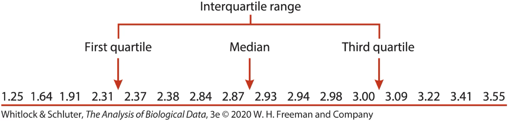

## Last time

```{r setup, include = F}
source("bb_theme.R")
library(tidyverse)
human_genes<-read_csv("../data/human_genes.csv")
crimes<-read_csv("https://whitlockschluter3e.zoology.ubc.ca/Data/chapter03/chap03t1.2ConvictionsFreq.csv")
library(gt)
chick20<-ChickWeight[ChickWeight$Time == 20,]$weight
beesDF<-read_csv("../data/chap20q16BeeLifespans.csv")
```

-   Mean, median, mode
-   Range

::: notes
today: location and width; next class plots
:::

## This week

-   Estimates of width (cont.)
-   Explanatory and exploratory figures
-   Best practices in figure design
-   How data types drive figure design
-   How to make effective tables


## Recall this histogram

::: panel-tabset
### Figure

```{r hist}
#| echo: false
#| tidy: true
#| tidy-opts: !expr list(width.cutoff = 50)
library(ggplot2)
ggplot(iris , 
       aes(x = Petal.Width, fill = Species) ) +
  geom_histogram(binwidth = .1, show.legend = FALSE, alpha = .9) +  
  xlab("Petal Width (cm)") + 
  facet_wrap(~ Species, ncol = 1) + 
  scale_x_continuous(breaks = seq(.5,2.5,.5)) +
  scale_fill_manual(values = wesanderson::wes_palette("AsteroidCity1")) +
  bb_theme()
```

### Mean and Median

```{r iris-summ}
#| echo: false
#| tidy: true
#| tidy-opts: !expr list(width.cutoff = 50)

library(tidyverse)

iris |> 
  group_by(Species) |> 
  summarise(mean = mean (Petal.Width), median = median(Petal.Width))
```
:::

## Measures of dispersion

-   Range \[`max value - min value`\] (cont.)

-   Quartiles, interquartile range
    \[`75th percentile - 25th percentile`\]

-   Variance \[<font color = #00a1b7> estimate = $s^2$
    =$\frac{\Sigma(x_i - \bar{x})^2}{n-1}$</font>,
    <font color = #ad7237>param = $\sigma ^2$ =
    $\frac{\Sigma(x_i - \mu)^2}{N}$ \]</font>

-   Standard deviation \[<font color =  #00a1b7> estimate = $s$
    =$\sqrt{s^2}$</font>, <font color = #ad7237>param = $\sigma$ =
    $\sqrt{\sigma^2}$ \]</font>

-   Coefficient of variation \[<font color =  #00a1b7> estimate = CV =
    $\frac{s}{\bar{Y}}$</font>, <font color = #ad7237>param =
    $\frac{\sigma}{\mu}$ \]</font>

## Width (aka variability) {.center background="#898928"}

::: r-fit-text
Variability of a population should not be ignored as simply noise about
the mean, but is biologically important in its own right.

Variation has a true value from a population that we estimate from a
sample.
:::

## Range

::: goal
Range of weight of 46 chicks at 20 days since birth
:::

```{r, eval = F}
data("ChickWeight")
chick20<-ChickWeight[ChickWeight$Time == 20,]$weight
chick20
```

Max and Min in this dataset at time 20:

```{r}
summary(chick20) 
#or
c(min(chick20), max(chick20))
# commonly the diff between them is shown
max(chick20)- min(chick20)
```


## Range

::: goal
If I take a sample of just 5 chicks from those 46 ...
:::

::::: columns
::: column
```{r chick20, echo = T}
range(chick20)
hist(chick20,xlab = "46 chicks")
```
:::

::: column
```{r chick5random}
#| eval: true
#| echo: true
#| tidy: true
#| tidy-opts: !expr list(width.cutoff = 20)
chick5random<-sample(x = chick20, size = 5, replace = F) 
range(chick5random)
hist(chick5random, xlab = " 10 chicks")
```
:::
:::::

## Small samples tend to give lower estimates of the range than large samples {.center}

. . .

::: r-fit-text
So the sample range is a *biased estimator* of the true range of the
population
:::

::: notes
So sample range is a biased estimator of the true range of the
population.
:::

## Scenario

::: goal
Salary range in a company will give a very good sense of the disparities
between the ones in each end, but not a good sense of what the “average”
employee earns

What can you do then?
:::

::: notes
You could calculate the median, sure, but what about the spread?
Interquartile range would be a better measure here
:::

## Interquartile Range (IQR)

::: goal
The difference between the 75th and 25th percentiles of the data.
A.k.a., the "middle 50%" of the data.
:::

-   less biased estimator than range
-   necessary for making boxplots

. . .

How?

. . .

## IQR

Imagine sorting your data.

-   The individual in the middle is the median.
-   The first and last individuals mark the range
-   The other two quantiles are the individuals ¼ and ¾ the way into
    your sorted list of data
-   The difference between these is the interquartile range



## IQR Example

::: goal
Example: Running speeds (cm/s) of Tidarren spiders before voluntary
amputation of pedipalp
:::

{fig-align="center"}

**Attention:**

-   **Quantiles** partition the data into $n$ parts
-   **Quartiles** partition the data into **quarters**

## IQR Example


::::::: columns
:::: column
::: fragment
$n=16$

1st quartile: $j=0.25n=4$

3rd quartile: $j=0.75n=12$
:::
::::

:::: column
::: fragment
If $j$ is integer, $\frac{Y_{j}+Y_{j+1}}{2}$

$\frac{Y_{4}+Y_{5}}{2}=\frac{2.31+2.37}{2}=2.34$

$\frac{Y_{12}+Y_{13}}{2}=\frac{3+3.09}{2}=3.045$
:::
::::
:::::::

::: aside
Note: software may use slightly different algorithms.
:::

## IQR in R

::: columns
::: {.column width = "40%"}

`summary()` gives quartiles and max/min

```{r iqr1}
# summary gives quartiles and max/min
summary(chick20)
```

The "long" route:

```{r iqr2}
as.numeric(
  summary(chick20)[5] - summary(chick20)[2]
  )
```

The shortcut

```{r}
IQR(chick20)
```
:::

::: {.column width = "60%"}

Boxplots reveal quartiles

```{r, fig.height = 7}
boxplot(chick20, names = "chicks day 20")
```

:::

:::

## IQR can give us more information than the range, but it’s still only looking at the values “in the middle” {.center background="#898928"}

## But there are metrics that look at all the values {background="#586028"}

::: r-fit-text
Variance, Standard Deviation, & Coefficient of Variation all communicate
how far individual observations are expected to deviate from the mean.
:::

::: aside
<font color = "#d1d9ce">Because (by definition) the differences between
all observations and the mean sum to zero ($\sum{Y_i-\bar{Y}=0}$), these
summaries work from the squared difference between observations and the
mean ($\sum{(Y_i-\bar{Y})^2}$).</font>
:::

## Variance

::: goal
Variance is a measure of dispersion of data points in a sample (or
population) around the mean of the sample (or population). It is the
expected squared difference between an observations and the mean.
:::

## Variance

::::: columns
::: column
<font color =  #ad7237>**Parameter**</font>

<font color =  #ad7237>$$\sigma^2=\frac{\sum_{i=1}^{N}(Y_{i}-\mu)^2}{N}$$
</font> $N$: number of individuals in population

$\mu$: population mean
:::

::: column
<font color = #00a1b7>**Estimate**</font>

<font color = #00a1b7>$$s^2=\frac{\sum_{i=1}^{n}(Y_{i}-\bar{Y})^2}{n-1}$$
</font> $n$: number of individuals in sample

$\bar{Y}$: sample mean
:::
:::::

::: aside
Note: the numerator here is called "sum of squares"
:::

## Sample variance (shortcut)

$$s^2=\left(\frac{n}{n-1}\right)\left(\frac{\sum^{n}_{i=1}{Y^2_i}}{n}-\bar{Y}^2\right)$$


## Variance Example

::: goal
Lifespan of 12 forager bees (in hours).
:::

::: panel-tabset

### Mean

> 2.3  2.3  3.9  4.0  7.1  9.5  9.6 10.8 12.8 13.6 14.6 18.2
18.2 19.0 20.9 24.3 25.8 25.9 26.5 27.1 30.0 33.3 34.8 34.8
35.7 36.9 41.3 44.2 54.2 55.8 65.8 71.1 84.7

$$\bar{Y} = \frac{\sum{Y_i}}{n} = \frac{919}{33}= 27.848\text{ hours}$$

### Sum of squares

```{r bees1}
beesDF |> 
mutate(`Y-meanY` = hours - mean(hours)) |> mutate(`(Y-meanY)^2`= (hours - mean(hours))^2)
```

### Sum of squares (cont)


```{r bees2}
beesDF<-beesDF |> 
    mutate(`Y-meanY` = hours - mean(hours)) |> mutate(`(Y-meanY)^2`= (hours - mean(hours))^2)
sum(beesDF[,3])
```

So

$$s^2 = \frac{13520.96}{33-1}=422.53\text{ hours}^2$$

Note: the unit here is hours **squared**. Also, note that we don't divide by $n$ but by $n-1$.

::: notes

4 differences from population mean:  
	s^2 instead of sigma^2;
  	uses sample size instead of population size, 
	taken as deviations from sample mean rather than population mean (which is not available);
	n-1, to account for bias caused by using Ybar (which is slightly closer to the individuals in the sample than the true mean is, because the sample mean is calculated from the sample too 

:::

:::

## Standard Deviation

::::: columns
::: column
<font color =  #ad7237>**Parameter**</font>

<font color =  #ad7237>$$\sigma=\sqrt{\frac{\sum_{i=1}^{N}(Y_{i}-\mu)^2}{N}}=\sqrt{\sigma^2}$$
</font> $N$: number of individuals in population

$\mu$: population mean
:::

::: column
<font color = #00a1b7>**Estimate**</font>

<font color = #00a1b7>$$s=\sqrt{\frac{\sum_{i=1}^{n}(Y_{i}-\bar{Y})^2}{n-1}}=\sqrt{s^2}$$
</font> $n$: number of individuals in sample

$\bar{Y}$: sample mean
:::
:::::

## Standard Deviation 

Using the previous example, with forager bees.

$$s^2 = \frac{13520.96}{33-1}=422.53\text{ hours}^2$$
$$s = \sqrt{422.53}=20.555$$
## In R

Variance
```{r var}

var(beesDF$hours)
```
Standard deviation

```{r sd}

sd(beesDF$hours)

sqrt(var(beesDF$hours))
```
## Coefficient of Variation (CV)

-   The variance and standard deviation increase with the mean.

-   The coefficient of variation allows for fair comparisons of
    variability between measures on different scales.

$$CV = 100\% \times \frac{s}{\bar{Y}}$$

## In summary

::: goal
Range: The difference between the largest and smallest values.

Interquartile Range: The difference between the 25th and 75th
percentile.

Variance & Standard Deviation: The difference between observations & the mean.

Coefficient of Variation: A measure of the standard deviation that’s
independent of the mean.
:::

## Variance, Standard Deviation or Coefficient of Variation? {.center background="#55cfd8"}

::::: columns
::: column
Variance and standard deviation convey the same information and are used
in many equations.
:::

::: column
The coefficient of variation is less directly used in equations, but is
ideal for comparing variation between different types of comparisons.
:::
:::::

## That's all for today

{fig-alt="Forrest says \"And that's all I wanted to say about that\""
width="347"}
