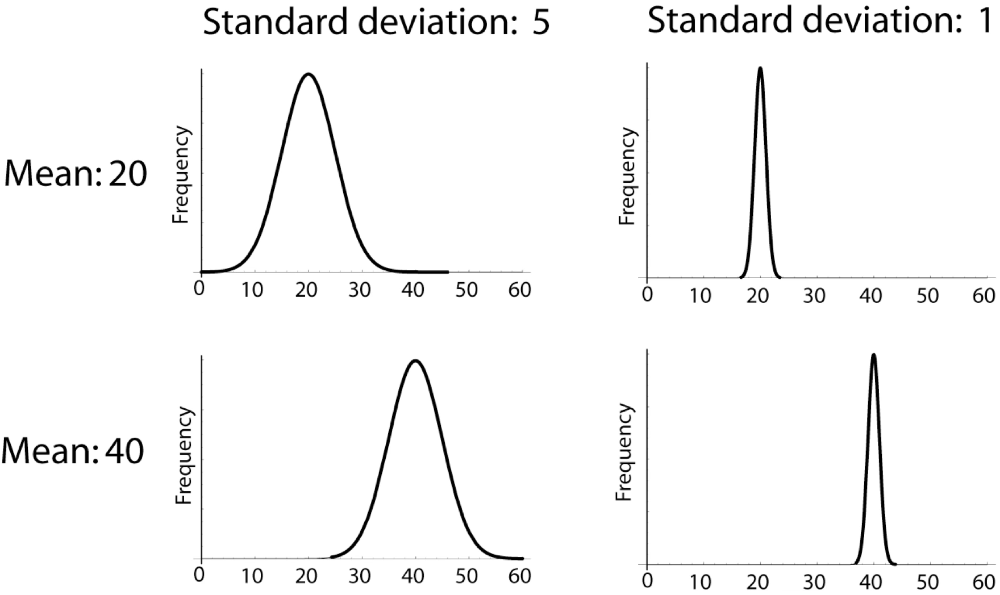
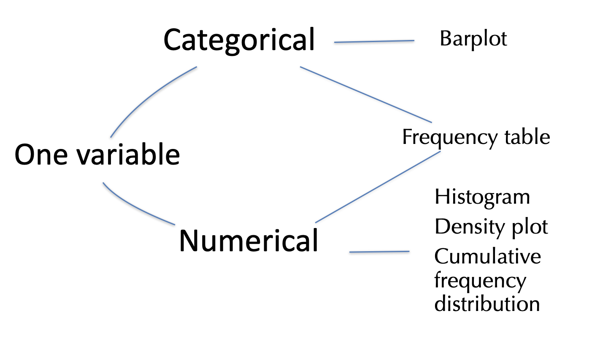

```{r setup, include=FALSE}
knitr::opts_chunk$set(echo = FALSE, tidy = TRUE)
library(forcats)
library(dplyr)
library(ggplot2)
library(ggforce)
library(tidyr)
library(stringr)
library(knitr)
library(ggthemes)
library(wesanderson)
library(emo)
library(forcats)
library(ggmosaic)
library(ggridges)
library(kableExtra)
library(gridExtra)
library(ggrepel)
library(RColorBrewer)
library(plotly)
library(readr)
library(colorblindr)
gg_color_hue <- function(n) {
  hues = seq(15, 375, length = n + 1)
  hcl(h = hues, l = 65, c = 100)[1:n]
}
source("bb_theme.R")
set.seed(1234)
my.sim <- data.frame( group = c(rep(1:20,each = 1000), 
                      rep(21:40,each = 700),
                      rep(41:60,each = 300),
                      rep(61:80,each = 100),
                      rep(81:110,each = 50), 
                      rep(111:140,each = 20), 
                      rep(141:180,each = 10), 
                      rep(181:300,each = 5))  , val = rnorm(45100,1,1)) 
tidy.anscombe <- cbind(gather(data = anscombe[,1:4], key = group, value = x) %>%
  mutate(group = LETTERS[as.numeric(
    str_replace_all(string = group, pattern = c("x"), replacement = "" ))]),
  gather(data = anscombe[,5:8], key = group2, value = y) %>%  
    mutate(group2 = LETTERS[as.numeric(str_replace_all(
      string = group2, pattern = c("y"), replacement = "" ))])) %>%
  select(-group2)

type.of.death <- data.frame(Number = c(6688,2093,1615,745,463,222,107,73,67,52,1653),
                            Cause_of_death =c("Accidents", "Homicide", "Suicide", "Malig. tumor", "Heart disease","Congen. abnor.","Chronic res. disease", "Flu/pneumonia", "Cerebrov. disease", "Other tumor","All other cause")) %>% 
  mutate( Cause_of_death = fct_reorder(Cause_of_death,Number) ) %>%
  mutate( Cause_of_death = fct_relevel(Cause_of_death, "All other cause" ,after = 0))

death <- ggplot(data = type.of.death, aes(x = Cause_of_death, y = Number)) + 
  ggtitle("Leading cause of death", subtitle =  "ages 15-19 (USA 1999)")+xlab("Cause of Death")+
  bb_theme()
hist_1 <- runif(5000) 
hist_2 <- c(rnorm(2500,.25,sd=.05),rnorm(2500,.70,sd=.15))
hist_3 <- rnorm(5000,.5,sd=.2)
hist_4 <- c(rnorm(5000,.35,sd=.1)+(rexp(5000,10)))
hist.dat <- data.frame( x = c(hist_1, hist_2, hist_3, hist_4), 
            type = rep( c("uniform", "bimodal", "bell shaped", "skewed"), 
                        times = c(length(hist_1), 
                                  length(hist_2), 
                                  length(hist_3), 
                                  length(hist_4))))
```

## Outline

-   CV example
-   Manipulating means and variance (example: converting units)
-   Why plot? Aren't numerical summaries enough?
-   Letting data type guide visualizations

## CV example

::: goal
Recall the bee lifespan example. We found that $\bar{Y}=27.848$ hours
and $s=20.555$ hours.
:::

. . .

$CV = 100\% \times \frac{s}{\bar{Y}}$

. . .

$CV = 100 \% \times \frac{20.555}{27.848}=100 \times 0.738 = 73.813$

::: aside
The CV does not have to be expressed as a percentage. You may also find
it as simply a proportion, i.e., $\frac{\sigma}{\mu}$ (parameter) or
$\frac{s}{\bar{Y}}$ (estimate).
:::

## Good estimators are unbiased

-   The expected value of an unbiased estimator equals the population
    parameter.

-   Biased estimators should be avoided if possible.

-   Biased estimators (often) change with the sample size.

-   The sample variance and sample standard deviation are divided by (n
    – 1), rather than n to minimize bias.

-   The range is a bad summary statistic because it is biased, and
    increases with sample size.

## Measures of width in graphical terms

::: goal
SD and var: Particularly informative for symmetric distributions, but
not for asymmetric ones
:::



## Manipulating means

-   The mean of the sum of two variables $X$ and $Y$:
    $E[X + Y] = E[X]+ E[Y]$

-   The mean of the sum of a variable $X$ and a constant $c$:
    $E[X + c] = E[X]+ c$

-   The mean of a product of a variable $X$ and a constant $c$:
    $E[cX] = cE[X]$

::: aside
$E$: expected value of a variable
:::

## Manipulating variance

-   The variance of the sum of two variables $X$ and $Y$:
    $Var[X + Y] = Var[X]+ Var[Y]$ (if and only if X and Y are
    independent).

-   The variance of the sum of a variable $X$ and a constant $c$:
    $Var[X + c] = Var[X]$

-   The variance of a product of a variable $X$ and a constant $c$:
    $Var[cX] = c^2 Var[X]$

## Example: converting units

::: goal
If the mean and variance in height (in centimers) in a sample are
$\bar{X}=169.8\text{ cm}$ and $s^2=131.98\text{ cm}^2$ and
$1\text{ cm} = 0.394$ inches, find the mean and variance in inches.
:::

. . .

Mean: $E[cX] = cE[X]$

$0.394\times169.8\text{ cm}=66.90\text{ inches}$

Variance: $Var[cX] = c^2 Var[X]$

$0.394^2\times131.98\text{ cm}^2 = 20.488\text{ inches}^2$

## Lastly: Rounding

-   Computers can return values with precision that exceeds biological
    interest.
-   When sharing results, round numbers to a reasonable number of
    significant figures.
-   Presenting one or two more digits than initially measured is a good
    rule of thumb.
-   DO NOT round while calculating or sharing intermediate results!
-   Round only the final results of the specific summaries of interest.

## How about plots? {.center background="#55cfd8"}

::: r-fit-text
Aren't numerical summaries enough?
:::

## No! {.center background="#55cfd8"}

## Case Study: Anscombe's Quartet

Four data sets (A-D) with identical summaries (mean and sd)

```{r anscombe, echo = T}
library(datasets)
head(anscombe)
str(anscombe)
```

::: notes
Four datasets (A-D) 11 observations per variable per dataset Each
dataset has x and y variables (both numerical)
:::

## Anscombe’s quartet: summary statistics

```{r ansc-tidy, echo = F}
library(gt)
tidy.anscombe %>%  
  group_by(group) %>%
  summarise(mean.x = mean(x), mean.y = mean(y), sd.x = sd(x), sd.y = sd(y), cor.xy = cor(x,y)) %>% 
 gt()
```

## Anscombe’s quartet: trendlines

Trendlines reveal no difference

```{r}
anscombe.plot <- ggplot(data = tidy.anscombe%>%rename(`data set` = group), aes(x = x, y = y, color = `data set`)) +
  stat_smooth(geom="line", method = "lm",se = FALSE, lwd = 1.5,
              show.legend = FALSE, fullrange=TRUE, alpha = .8) +
  facet_wrap(~ `data set`, ncol = 2, labeller = "label_both") +
  ggtitle(label =  "Four data sets. Identical summaries")+ 
  ylim(c(0,20))  +
  xlim(c(0,20))  +
  theme_light()  +
  bb_theme()

anscombe.plot
```

## Anscombe’s Quartet: Data

Showing the data reveals large differences

```{r,echo=FALSE}
anscombe.plot +
  geom_point(show.legend = FALSE, size = 3, alpha = .6) 
```

## Ascombe described the article as being intended to counter the impression among statisticians that "numerical calculations are exact, but graphs are rough." {.center background="#55cfd8"}

::: notes
Constructed by F. Anscombe (1973)

Demonstrates both the importance of graphing data when analyzing it, and
the effect of outliers and other influential observations on statistical
properties.
:::

## Displaying data is very important

::: r-fit-text
Displaying data helps you:

1)  Understand your data
2)  Communicate your results
:::

## Exploratory vs Explanatory Plots: Goals

::: r-fit-text
In **exploratory** data analysis, you aim to find the story of the data.

In **explanatory** data analysis, you aim to share the story of the
data.
:::

::: aside
Note: There is a continuum between explanatory and exploratory plots.
For example, the plot you show your lab is probably somewhere between
what you make for yourself and what you send to the New York Times.
:::

## Exploratory vs Explanatory Plots: Focus

::: r-fit-text
For **exploratory** plots: Don’t fuss about colors, labels, names etc.
The goal is for *you* to understand the data.

For **explanatory** plots: Fuss about all of this. You must consider
your *audience* may, for example, consist of:\
- People unfamiliar with your data\
- People who are colorblind
:::

::: aside
The suggestions we will cover will help the story of the data reveal
itself, and are therefore useful for exploratory & explanatory plots.
:::

## Which types of summaries and graphs to use? {background="#55cfd8"}

::: r-fit-text
Let data type guide presentation
:::

## To visualize data for a single variable...

Show its frequency distribution

{fig-align="center"}

## One categorical variable

::: goal
Barplot/bar graph
:::

::::: columns
::: {.column width="20%"}
-   What is the variable?
-   Notice the ordering
-   Absolute or relative frequencies?
-   Bar area reflects frequencies
:::

::: {.column width="80%"}
```{r causeOfDeath}
death + geom_bar(stat = "identity") + coord_flip()
```
:::
:::::

## One categorical variable

::: goal
Pie chart
:::

-   Same purpose as bar graph
-   Much harder to spot patterns
-   Bar graphs generally preferred

## One categorical variable

::: goal
Frequency table
:::

```{r freq-table}
type.of.death |> select(Cause_of_death, Number) |> gt(auto_align = TRUE)
```

::: notes
-   What is the variable?
-   Notice the ordering
-   Absolute or relative frequencies?
:::

## One numerical variable

**Goals**

-   Visualize the center ("average")
-   Visualize the spread (variability)
-   Visualize the shape (distribution)

## One numerical variable

::: goal
Histogram
:::

```{r temp-hist, fig.cap="30 bins", echo = T, tidy = "styler"}
datasets::airquality |> 
  ggplot(aes(x=Temp)) + 
  geom_histogram() + 
  xlab("Temp (in Fahrenheit)") + 
  ggtitle("Maximum Daily Temperature") +
  bb_theme() #this is just a theme I made to make plots look better
```

::: notes
30 bins
:::

## Histograms -- consider your bins

-   Each block of a histogram is called a “bin”
-   The size or “width” of a bin refers to the range in each block.
-   Changing bins can change stories
-   Don’t be fooled.
-   Don’t allow bad bin widths to obscure your data.

::: goal
DO NOT assume that default bin widths are appropriate.
:::

## One numerical variable

**Density Plots**

```{r distribs2}
                                        
ggplot(data = hist.dat, aes(x = x)) +  xlim(c(0,1)) +
  geom_density(fill = "lightgrey") +
  facet_wrap(~type, nrow = 2) +
  theme_light()+
  bb_theme() +
  scale_x_continuous(breaks = c(0,.25,.5,.75,1),labels = c("0","1/4","1/2","3/4","1"),limits = c(0,1))
```

## One numerical variable

::: goal
Frequency table
:::

{fig-align="center"}

-   11 bins

-   equally-sized


## Next week

- More on the types of plots/tables for different types of data
- Principles of good plots

## That's all for today!

{fig-alt="Forrest says \"And that's all I wanted to say about that\""
width="347"}
