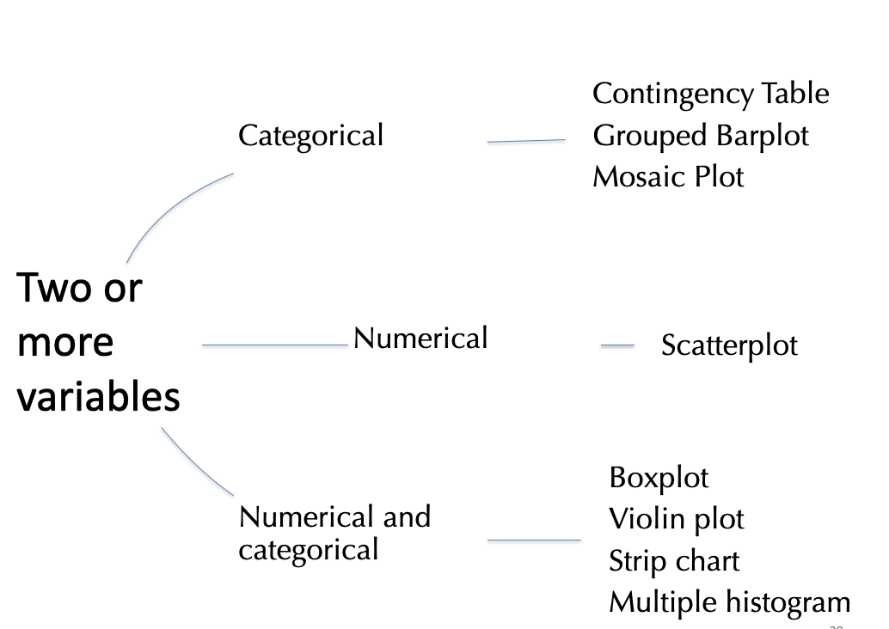

```{r setup, include=FALSE}
knitr::opts_chunk$set(echo = FALSE)
library(forcats)
library(dplyr)
library(ggplot2)
library(ggforce)
library(tidyr)
library(stringr)
library(knitr)
library(ggthemes)
library(wesanderson)
library(gt)
library(forcats)
library(ggmosaic)
library(ggridges)
library(kableExtra)
library(gridExtra)
library(ggrepel)
library(RColorBrewer)
library(plotly)
library(readr)
library(colorblindr)
gg_color_hue <- function(n) {
  hues = seq(15, 375, length = n + 1)
  hcl(h = hues, l = 65, c = 100)[1:n]
}
source("bb_theme.R")

# set the theme
theme_set(bb_theme())
set.seed(1234)
my.sim <- data.frame( group = c(rep(1:20,each = 1000), 
                      rep(21:40,each = 700),
                      rep(41:60,each = 300),
                      rep(61:80,each = 100),
                      rep(81:110,each = 50), 
                      rep(111:140,each = 20), 
                      rep(141:180,each = 10), 
                      rep(181:300,each = 5))  , val = rnorm(45100,1,1)) 
tidy.anscombe <- cbind(gather(data = anscombe[,1:4], key = group, value = x) %>%
  mutate(group = LETTERS[as.numeric(
    str_replace_all(string = group, pattern = c("x"), replacement = "" ))]),
  gather(data = anscombe[,5:8], key = group2, value = y) %>%  
    mutate(group2 = LETTERS[as.numeric(str_replace_all(
      string = group2, pattern = c("y"), replacement = "" ))])) %>%
  select(-group2)


type.of.death <- data.frame(Number = c(6688,2093,1615,745,463,222,107,73,67,52,1653),
                            Cause_of_death =c("Accidents", "Homicide", "Suicide", "Malig. tumor", "Heart disease","Congen. abnor.","Chronic res. disease", "Flu/pneumonia", "Cerebrov. disease", "Other tumor","All other cause"))

death0 <- ggplot(data = type.of.death, aes(x = Cause_of_death, y = Number)) + 
  ggtitle("Leading cause of death", subtitle =  "ages 15-19 (USA 1999)")+xlab("Cause of Death")

type.of.death <- data.frame(Number = c(6688,2093,1615,745,463,222,107,73,67,52,1653),
                            Cause_of_death =c("Accidents", "Homicide", "Suicide", "Malig. tumor", "Heart disease","Congen. abnor.","Chronic res. disease", "Flu/pneumonia", "Cerebrov. disease", "Other tumor","All other cause")) %>% 
  mutate( Cause_of_death = fct_reorder(Cause_of_death,Number) ) %>%
  mutate( Cause_of_death = fct_relevel(Cause_of_death, "All other cause" ,after = 0))

death <- ggplot(data = type.of.death, aes(x = Cause_of_death, Number, y = Number)) + 
  ggtitle("Leading cause of death", subtitle =  "ages 15-19 (USA 1999)")+xlab("Cause of Death")

hist_1 <- runif(5000) 
hist_2 <- c(rnorm(2500,.25,sd=.05),rnorm(2500,.70,sd=.15))
hist_3 <- rnorm(5000,.5,sd=.2)
hist_4 <- c(rnorm(5000,.35,sd=.1)+(rexp(5000,10)))
hist.dat <- data.frame( x = c(hist_1, hist_2, hist_3, hist_4), 
            type = rep( c("uniform", "bimodal", "bell shaped", "skewed"), 
                        times = c(length(hist_1), 
                                  length(hist_2), 
                                  length(hist_3), 
                                  length(hist_4))))

df<-data.frame(school_grade = 1:6, 
               Frequency_of_Students = c(23,20,15,12,10,8)
               )


BirdMalaria<-read.csv("~/Documents/GitHub/DataSetsb215/data-raw/chap02e3aBirdMalaria.csv")
measlesData <- read.csv("https://whitlockschluter3e.zoology.ubc.ca/Data/chapter02/chap02f4_1MeaslesOutbreaks.csv", stringsAsFactors = FALSE)
tigerData<-read.csv("~/Documents/GitHub/DataSetsb215/data-raw/chap02e2aDeathsFromTigers.csv")

educationSpending <- read.csv(url("https://whitlockschluter3e.zoology.ubc.ca/Data/chapter02/chap02f1_3EducationSpending.csv"), stringsAsFactors = FALSE)

spiderData <- read.csv(url("https://whitlockschluter3e.zoology.ubc.ca/Data/chapter03/chap03e2SpiderAmputation.csv"), stringsAsFactors = FALSE)

```

## Outline

-   Letting data type guide visualizations
-   Rules of data visualization - principles of good plots

## Cumulative Frequency Distributions

::: example
Number of students per grade
:::

```{r cumdist0, echo = F}
df |> gt()
```

The cumulative frequency of a value is the proportion of individuals
equal to or less than that value. In this case, equal or less than a
given grade.

Sort data, calculate cumulative frequency…

::: aside
Based on example from:
https://statisticsbyjim.com/basics/cumulative-frequency/
:::

## Cumulative Frequency Distributions

::: nonincremental
1.  Sort all values
2.  Calculate the fraction of values $\leq$ each value -- the cumulative
    relative frequency
:::

```{r cumdist2, echo = T}
library(dplyr)
df<-df |> 
  mutate(Cumul_Freq = cumsum(Frequency_of_Students))
df<-df |> 
  mutate(Rel_CFreq = Cumul_Freq/sum(Frequency_of_Students))
df
```

## Cumulative Frequency Distributions

::: nonincremental
3.  Plot the values on the $x$ and their cumulative relative frequencies
    on the $y$
4.  Connect the values with lines
:::

::: panel-tabset
### Plot

```{r cumdist3, echo = F, tidy = "styler"}
library(ggplot2)

ggplot(df, aes(x = school_grade))+
  stat_ecdf(geom = "step") 
```

### Code

```{r cumdist4, echo = T, eval = F, tidy = "styler", fig.height=5}
ggplot(df, aes(x = school_grade))+
  stat_ecdf(geom = "step") +
  theme_bw() #this is just to make the background clear

```
:::

## Cumulative Frequency Distributions

::: goal
example 2: Temperatures near LaGuardia (1973)
:::

```{r cumdist5, echo = T, fig.cap = "ECDF: empirical cumulative distribution function", tidy = "styler"}
datasets::airquality |> 
  ggplot(aes(x= Temp)) + 
  stat_ecdf(geom = "step") +
  theme_bw() #this is just to make the background clear
```

## Cumulative Frequency Distributions

::: goal
Example 3: Spider running speed
:::

{fig-align="center"}

Cumulative frequency distributions clearly communicate quantiles.

# 

::::: r-fit-text
Histograms, density plots, & cumulative frequency plots ...

:::: nonincremental
::: goal
-   can reveal the shapes of distributions

-   important for understanding data

-   and choosing a statistical approach
:::
::::
:::::

## Distribution shapes

**Histograms**

```{r distribs}


shape.baseplot <- ggplot(data = hist.dat, aes(x = x)) +  xlim(c(0,1)) +
  facet_wrap(~type, nrow = 2) +
  theme_light()+
  bb_theme()

shape.baseplot +  geom_histogram(binwidth = .02, col = "lightgrey") +
  scale_x_continuous(breaks = c(0,.25,.5,.75,1),labels = c("0","1/4","1/2","3/4","1"),limits = c(0,1))
```

## Distribution shapes

**Cumulative Frequency Distributions**

```{r distribs3}
shape.baseplot +  stat_ecdf(geom = "step")   +
  scale_x_continuous(breaks = c(0,.25,.5,.75,1),labels = c("0","1/4","1/2","3/4","1"),limits = c(0,1))

```

## Less common plots for one numerical variable

These are more often used to look at the association between a numerical
and a categorical variable:

::: nonincremental
-   Boxplots
-   Violin plots
-   Strip charts
:::

##  {.center background="#55cfd8"}

::: r-fit-text
Two or more variables ...
:::

##  {background="#55cfd8"}

{fig-align="center"}

## Categorical x Categorical

::: goal
Contingency Table
:::


## Categorical x Categorical

::: goal
Grouped bar plot
:::


## Categorical x Categorical

::: goal
Mosaic plot
:::


2+ variables. No upper limit, but too many variables may be confusing

Width indicates the relative proportion of the corresponding value

## Numerical x Numerical

**Scatter Plot**

::: panel-tabset
### Plot

```{r scatter}
#| echo: false
#| tidy-opts: !expr list(width.cutoff = 50)
library(ggplot2)
ggplot(iris , 
       aes(x = Petal.Width, y = Petal.Length)) + 
  geom_point()+
  xlab("Petal Width (cm)") + 
  ylab("Petal Length (cm)")
```

### Code

```{r scatterb, fig.height = 5}
#| echo: true
#| eval: false
#| tidy: styler
#| tidy-opts: !expr list(width.cutoff = 50)
library(ggplot2)
ggplot(iris,aes(x = Petal.Width, y = Petal.Length)) + 
  geom_point()+
  xlab("Petal Width (cm)") + 
  ylab("Petal Length (cm)")
```
:::

## Numerical x Numerical

**Scatter Plot**

::: panel-tabset
### Plot

```{r scatter2}
#| echo: false
#| tidy-opts: !expr list(width.cutoff = 50)
library(ggplot2)
ggplot(iris , 
       aes(x = Petal.Width, y = Petal.Length)) + geom_point()+
  xlab("Petal Width (cm)") + 
  ylab("Petal Length (cm)")+
  geom_smooth(method = "lm", se = F)
```

### Code

```{r scatter2b}
#| echo: true
#| eval: false
#| tidy-opts: !expr list(width.cutoff = 50)
library(ggplot2)
ggplot(iris, aes(x = Petal.Width, y = Petal.Length)) + 
  geom_point()+
  xlab("Petal Width (cm)") + 
  ylab("Petal Length (cm)") +
  geom_smooth(method = "lm", se = F)
```
:::

## Numerical x Categorical

**Multiple Histograms**

```{r hist}
#| echo: false
#| tidy: styler
#| tidy-opts: !expr list(width.cutoff = 50)
library(ggplot2)
ggplot(iris , 
       aes(x = Petal.Width, fill = Species) ) +
  geom_histogram(binwidth = .1, show.legend = FALSE, alpha = .9) +  
  xlab("Petal Width (cm)") + 
  facet_wrap(~ Species, ncol = 1) + 
  scale_x_continuous(breaks = seq(.5,2.5,.5)) +
  scale_fill_manual(values = wesanderson::wes_palette("AsteroidCity1")) +
  bb_theme()
```

## Numerical x Categorical

**Strip Chart**

```{r strip}
#| echo: false
#| tidy: styler
#| tidy-opts: !expr list(width.cutoff = 50)
library(ggplot2)
ggplot(iris , 
       aes(x = Species, y = Petal.Width, color = Species))+
  geom_jitter(show.legend = F) +  
  xlab("") + 
  scale_color_manual(values = wesanderson::wes_palette("AsteroidCity1")) +
  bb_theme()
```

## Numerical x Categorical

**Boxplot**

```{r box}
#| echo: false
#| tidy: true
#| tidy-opts: !expr list(width.cutoff = 50)
library(ggplot2)
ggplot(iris , 
       aes(x = Species, y = Petal.Width, color = Species)) +
  geom_boxplot(show.legend = F) +  
  xlab("") + 
  scale_color_manual(values = wesanderson::wes_palette("AsteroidCity1")) +
  bb_theme()
```

## Numerical x Categorical

**Violin Plot**

```{r strip2}
#| echo: false
#| tidy: true
#| tidy-opts: !expr list(width.cutoff = 50)
library(ggplot2)
ggplot(iris , 
       aes(x = Species, y = Petal.Width, color = Species))+
  geom_violin(show.legend = F) +  
  xlab("") + 
  scale_color_manual(values = wesanderson::wes_palette("AsteroidCity1")) +
  bb_theme()
```

## Numerical (2) + Categorical

**Multiple Scatterplots with legend**

```{r scatter3}
#| echo: false
#| tidy-opts: !expr list(width.cutoff = 50)
library(ggplot2)
ggplot(iris , 
       aes(x = Petal.Width, y = Petal.Length, group = Species, color = Species)) + 
  geom_point(aes(x = Petal.Width, y = Petal.Length, group = Species, color = Species))+
 # geom_smooth(method = "lm", se = F)+
  xlab("Petal Width (cm)") + 
  ylab("Petal Length (cm)")+
  scale_color_manual(values = wesanderson::wes_palette("AsteroidCity1")) +
  bb_theme()
```

## Numerical (2) x Categorical

**Multiple scatterplots plotted separately**

```{r scatter4, fig.align='center'}
#| echo: false
#| tidy-opts: !expr list(width.cutoff = 50)
library(ggplot2)
ggplot(iris , 
       aes(x = Petal.Width, y = Petal.Length, group = Species, color = Species)) + 
  geom_point(aes(x = Petal.Width, y = Petal.Length, group = Species, color = Species),show.legend = F)+
  facet_wrap(~Species)+
 # geom_smooth(method = "lm", se = F)+
  xlab("Petal Width (cm)") + 
  ylab("Petal Length (cm)")+
  scale_color_manual(values = wesanderson::wes_palette("AsteroidCity1"))
```

## Visualizations Over Time and Space

**Line Graphs Show Data Over Time**

For temporal data, note all observations with a data point, and connect
each point with a line.

```{r laguardia}
airquality |> 
  dplyr::filter(Month == 7) |> 
  ggplot(aes(x = Day, y = Temp)) + 
  geom_point(size=0.5) + 
  geom_line() + 
  ggtitle("Maximum Daily Temperature (F)", 
          subtitle = "Laguardia, NY (1973)")+
  bb_theme() 

```

## Small multiples line chart

A grid of line charts that uses the same scales and axes

```{r laguardia2, align = "center"}
airquality |>
    dplyr::filter(Month < 8) |>
    ggplot(aes(x = Day, y = Temp)) + 
    geom_point(size = 0.5) + 
    geom_line() + 
    ylab("Daily Temperature")+
    facet_wrap(vars(Month), ncol = 1 )+
    ggtitle("Maximum Daily Temperature (F)", 
            subtitle = "Laguardia, NY (1973)") + theme(axis.title.y = element_text(angle = 90))


```

## To show spatial data

**Maps**

Spatial data does not have to be a geographical map

```{r anatom}
library(gganatogram)

gganatogram(data = mmFemale_key,
            organism = "mouse", sex = "female",
            fill = "value",
            fillOutline = "#a6bddb") +
  theme_void() + 
  scale_fill_viridis_c() +
  coord_fixed()

```

##  {.center background="#55cfd8"}

::: r-fit-text
How to make good plots
:::

## 

:::: r-fit-text
::: goal
1.  **Show** the data.
2.  Make patterns **easy** to see.
3.  Display magnitudes **honestly**.
4.  Draw graphics **clearly**.
:::
::::

##  {.dark-theme}

::: r-fit-text
Mistakes in displaying data:

1.  Hiding the data
:::

## What is the main problem here?

::::::: columns
::::: {.column width="30%"}
:::: goal
::: nonincremental
A)  Hide the data.
B)  Make patterns hard to see.
C)  Display magnitudes dishonestly.
D)  Draw graphics unclearly.
:::
::::
:::::

::: {.column width="70%"}
```{r}
spiderData |> 
  group_by(treatment) |> 
  summarize(mean_speed = mean(speed)) |>
    ggplot(aes(x = treatment, y = mean_speed)) +
    geom_col() +
    ylab("Mean Speed") +
  ggtitle("Mean speed in spiders before and after pedipalp removal")

```
:::
:::::::

## 👎 Not showing data, just summaries

::::::: columns
::::: {.column width="25%"}
:::: goal
::: nonincremental
A)  **Hide the data.**
B)  Make patterns hard to see.
C)  Display magnitudes dishonestly.
D)  Draw graphics unclearly.

This plot hides the variation between positions.
:::
::::
:::::

::: {.column width="75%"}
```{r spider}
spiderData |> 
  group_by(treatment) |> 
  summarize(mean_speed = mean(speed)) |>
    ggplot(aes(x = treatment, y = mean_speed)) +
    geom_col() +
    ylab("Mean Speed") +
  ggtitle("Speed in spiders before and after pedipalp removal")

```
:::
:::::::

## What is the main problem here?

::::::: columns
::::: {.column width="25%"}
:::: goal
::: nonincremental
A)  Hide the data.
B)  Make patterns hard to see.
C)  Display magnitudes dishonestly.
D)  Draw graphics unclearly.
:::
::::
:::::

::: {.column width="75%"}
```{r spider2}
spiderData |> 
  group_by(treatment) |> 
    ggplot(aes(x = treatment, y = speed)) +
    geom_point() +
    ylab("Speed") +
  ggtitle("Speed in spiders before and after pedipalp removal")

```
:::
:::::::

## 👎 Not showing data, overplotting

::::::: columns
::::: {.column width="25%"}
:::: goal
::: nonincremental
A)  Hide the data.
B)  Make patterns hard to see.
C)  Display magnitudes dishonestly.
D)  Draw graphics unclearly.
:::
::::
:::::

::: {.column width="75%"}
```{r spider2b}
spiderData |> 
  group_by(treatment) |> 
    ggplot(aes(x = treatment, y = speed)) +
    geom_point() +
    ylab("Speed") +
  ggtitle("Speed in spiders before and after pedipalp removal")

```
:::

Over-plotting hides data by placing data points on top of each other.
:::::::

## 👍 Showing data by jittering

```{r spider3}
spiderData |> 
  group_by(treatment) |> 
    ggplot(aes(x = treatment, y = speed)) +
    geom_jitter(width = 0.1, alpha = 0.8) +
    ylab("Speed") +
  ggtitle("Speed in spiders before and after pedipalp removal")

```

This plot shows all the observations

##  {.center background="#55cfd8"}

::: r-fit-text
👎 **How to hide data**

-   Provide only statistical summaries.
-   Over-plotting - too many points.

👍 **How to reveal data**

-   Present all of the data points.
-   Allow all points to be seen.
:::

##  {.dark-theme}

::: r-fit-text
Mistakes in displaying data:

2.  Making patterns hard to see
:::

## What's the main problem here?

```{r death}
death0 + geom_bar(stat = "identity") + coord_flip()
```

## Nonsensical order hides pattern

Reordering factors makes pattern clear

```{r death2}
death + geom_bar(stat = "identity") + coord_flip()
```

## Tables should follow similar rules

::::: columns
::: {.column width="40%"}
```{r freq-table}
type.of.death |> 
  select(Cause_of_death, Number) |> 
  sample_n(11)  |>
  gt(auto_align = TRUE)

```
:::

::: {.column width="\"60%"}
👎

-   Nonsense order hides patterns

-   Alphabetical order is usually a bad idea.
:::
:::::

## Tables should follow similar rules

::::: columns
::: {.column width="40%"}
```{r freq-table2}
type.of.death |> 
  select(Cause_of_death, Number) |> 
  gt(auto_align = TRUE)

```
:::

::: {.column width="\"60%"}
👍

-   Order to reveal patterns

-   List ordinal factors in a meaningful order

-   List nominal factors from greatest to least, with “all others” last.
:::
:::::

## 

::::::::: columns
::::: {.column align="center"}
**How to hide patterns** 👎

:::: goal
::: nonincremental
-   Make one plot and call it good
-   Unreasonable scales
-   Arrange factors nonsensically
:::
::::
:::::

::::: column
**How to reveal patterns** 👍

:::: goal
::: nonincremental
-   Explore multiple potential plots
-   Use appropriate scales
-   Arrange factors meaningfully
-   Order ordinal factors meaningfully (e.g., January to December.
-   Order nominal factors by count
-   If there is a grab bag category, place it after the lowest count
:::
::::
:::::
:::::::::

## Problem?

```{r spider4}
spiderData |> 
    ggplot(aes(x = treatment, y = speed)) +
    geom_jitter() +
  ylim(0,50)+
    ylab("Speed") +
  ggtitle("Speed in spiders before and after pedipalp removal")
```

## Bad Axis-Limits Hide Patterns 👎

In this plot, the large scale hides the pattern (difference between the
two groups)

```{r spider5}
spiderData |> 
    ggplot(aes(x = treatment, y = speed)) +
    geom_jitter() +
  ylim(0,50)+
    ylab("Speed") +
  ggtitle("Speed in spiders before and after pedipalp removal")
```


## That's all for today

{fig-alt="Forrest says \"And that's all I wanted to say about that\""
width="347"}
