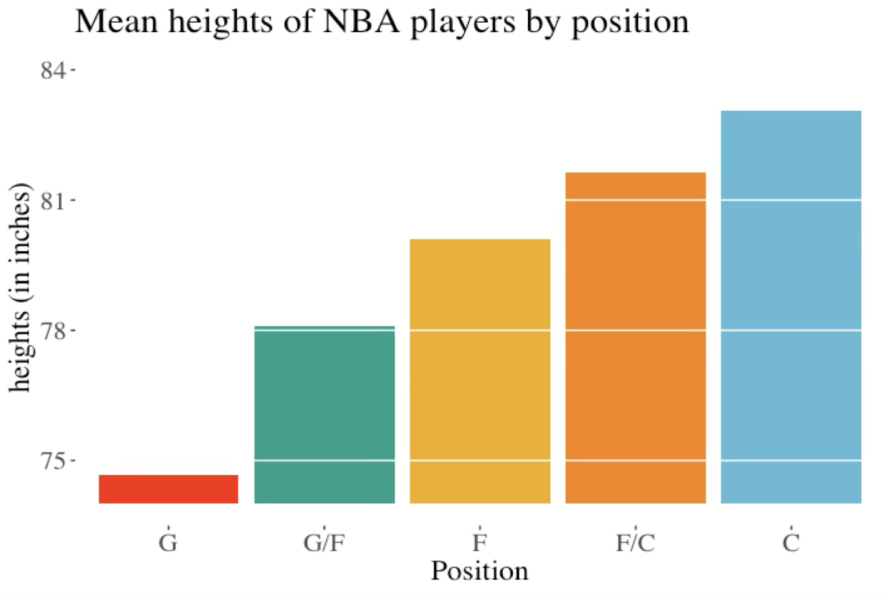
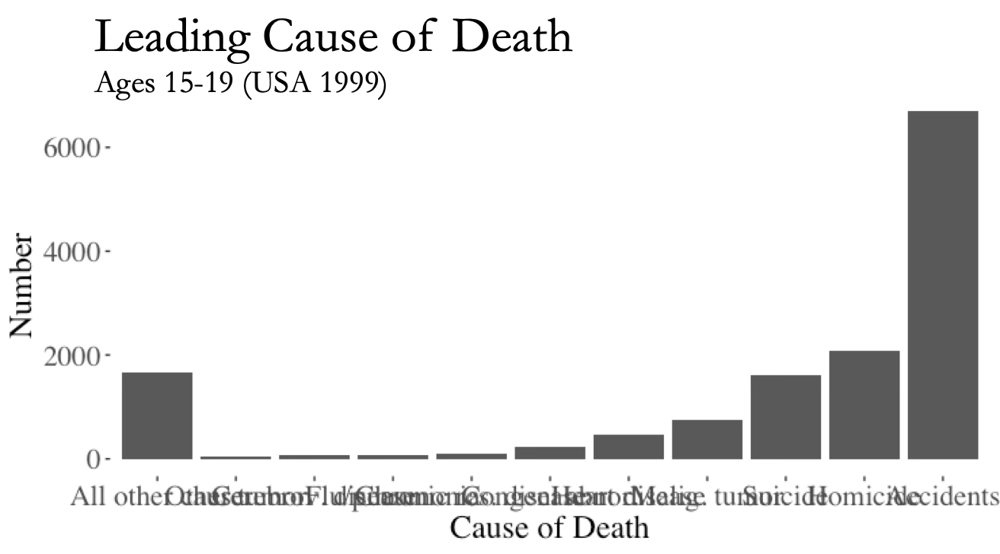
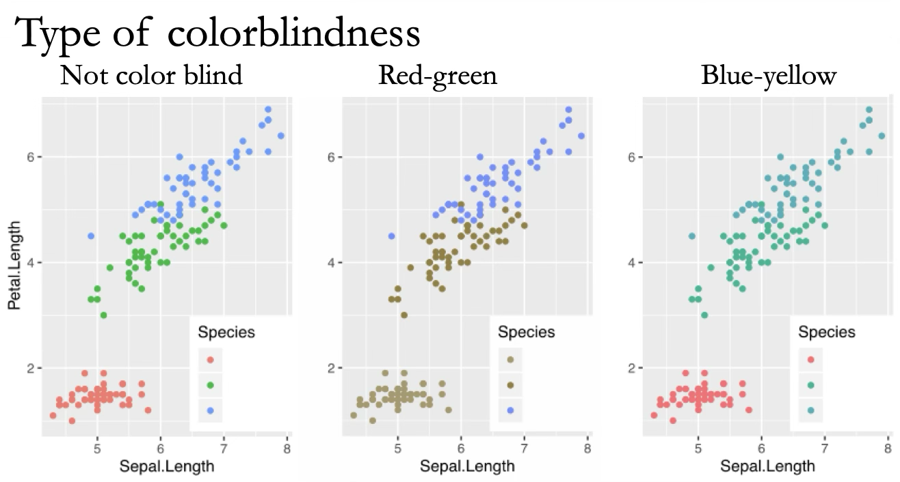
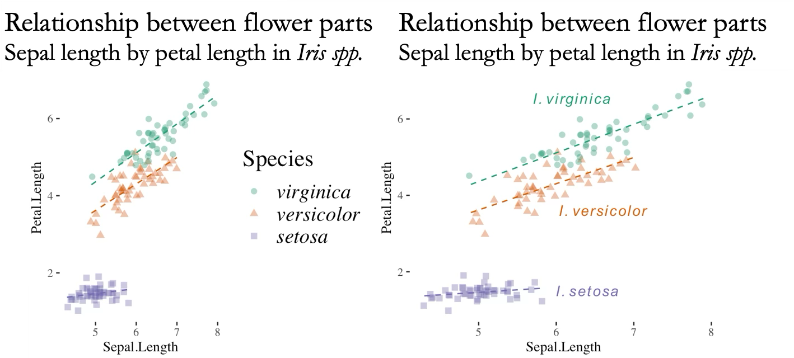
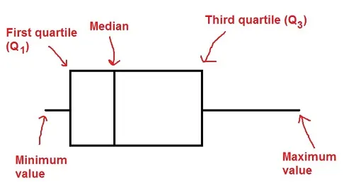

```{r setup, include=FALSE}
knitr::opts_chunk$set(echo = FALSE)
library(forcats)
library(dplyr)
library(ggplot2)
library(ggforce)
library(tidyr)
library(stringr)
library(knitr)
library(ggthemes)
library(wesanderson)
library(gt)
library(forcats)
library(ggmosaic)
library(ggridges)
library(kableExtra)
library(gridExtra)
library(ggrepel)
library(RColorBrewer)
library(plotly)
library(readr)
library(colorblindr)
gg_color_hue <- function(n) {
  hues = seq(15, 375, length = n + 1)
  hcl(h = hues, l = 65, c = 100)[1:n]
}
source("bb_theme.R")

# set the theme
theme_set(bb_theme())
set.seed(1234)
my.sim <- data.frame( group = c(rep(1:20,each = 1000), 
                      rep(21:40,each = 700),
                      rep(41:60,each = 300),
                      rep(61:80,each = 100),
                      rep(81:110,each = 50), 
                      rep(111:140,each = 20), 
                      rep(141:180,each = 10), 
                      rep(181:300,each = 5))  , val = rnorm(45100,1,1)) 
tidy.anscombe <- cbind(gather(data = anscombe[,1:4], key = group, value = x) %>%
  mutate(group = LETTERS[as.numeric(
    str_replace_all(string = group, pattern = c("x"), replacement = "" ))]),
  gather(data = anscombe[,5:8], key = group2, value = y) %>%  
    mutate(group2 = LETTERS[as.numeric(str_replace_all(
      string = group2, pattern = c("y"), replacement = "" ))])) %>%
  select(-group2)


type.of.death <- data.frame(Number = c(6688,2093,1615,745,463,222,107,73,67,52,1653),
                            Cause_of_death =c("Accidents", "Homicide", "Suicide", "Malig. tumor", "Heart disease","Congen. abnor.","Chronic res. disease", "Flu/pneumonia", "Cerebrov. disease", "Other tumor","All other cause"))

death0 <- ggplot(data = type.of.death, aes(x = Cause_of_death, y = Number)) + 
  ggtitle("Leading cause of death", subtitle =  "ages 15-19 (USA 1999)")+xlab("Cause of Death")

type.of.death <- data.frame(Number = c(6688,2093,1615,745,463,222,107,73,67,52,1653),
                            Cause_of_death =c("Accidents", "Homicide", "Suicide", "Malig. tumor", "Heart disease","Congen. abnor.","Chronic res. disease", "Flu/pneumonia", "Cerebrov. disease", "Other tumor","All other cause")) %>% 
  mutate( Cause_of_death = fct_reorder(Cause_of_death,Number) ) %>%
  mutate( Cause_of_death = fct_relevel(Cause_of_death, "All other cause" ,after = 0))

death <- ggplot(data = type.of.death, aes(x = Cause_of_death, Number, y = Number)) + 
  ggtitle("Leading cause of death", subtitle =  "ages 15-19 (USA 1999)")+xlab("Cause of Death")

hist_1 <- runif(5000) 
hist_2 <- c(rnorm(2500,.25,sd=.05),rnorm(2500,.70,sd=.15))
hist_3 <- rnorm(5000,.5,sd=.2)
hist_4 <- c(rnorm(5000,.35,sd=.1)+(rexp(5000,10)))
hist.dat <- data.frame( x = c(hist_1, hist_2, hist_3, hist_4), 
            type = rep( c("uniform", "bimodal", "bell shaped", "skewed"), 
                        times = c(length(hist_1), 
                                  length(hist_2), 
                                  length(hist_3), 
                                  length(hist_4))))

df<-data.frame(school_grade = 1:6, 
               Frequency_of_Students = c(23,20,15,12,10,8)
               )


BirdMalaria<-read.csv("~/Documents/GitHub/DataSetsb215/data-raw/chap02e3aBirdMalaria.csv")
measlesData <- read.csv("https://whitlockschluter3e.zoology.ubc.ca/Data/chapter02/chap02f4_1MeaslesOutbreaks.csv", stringsAsFactors = FALSE)
tigerData<-read.csv("~/Documents/GitHub/DataSetsb215/data-raw/chap02e2aDeathsFromTigers.csv")

educationSpending <- read.csv(url("https://whitlockschluter3e.zoology.ubc.ca/Data/chapter02/chap02f1_3EducationSpending.csv"), stringsAsFactors = FALSE)

spiderData <- read.csv(url("https://whitlockschluter3e.zoology.ubc.ca/Data/chapter03/chap03e2SpiderAmputation.csv"), stringsAsFactors = FALSE)

macaques<-read_tsv("../data/BuckEtAl2025_AJBA_HybridMacaqueSize.txt")

```

## Outline

-   Wrap-up: Rules of data visualization - principles of good plots

## Problem? 👎

```{r mammals}
mammals<-read.csv("~/Documents/GitHub/DataSetsb215/data-raw/SleepInMammals.csv")

ggplot(mammals, 
       aes(x = Body_Weight_kg, y = life_span_years)) +
  geom_point() +
  ylab("Maximum Lifespan \n(in years)") +
  xlab("Adult Body Weight \n(in kg)")
```

::: aside
Lifespan by body size in mammals, data from Allison & Cicchetti 1976
:::

## Transform Data to Reveal Patterns 👍

```{r mammals2}
ggplot(mammals, 
       aes(x = log10(Body_Weight_kg), y = life_span_years)) +
  geom_point() +
  ylab("Maximum Lifespan \n(in years)") +
  xlab("Adult Body Weight \n(in kg)")
```

##  {.dark-theme}

::: r-fit-text
Mistakes in displaying data:

3.  Displayig Magnitudes Dishonestly
:::

## Problem?



## Presenting magnitudes dishonestly

-   This plot suggests that centers are 20X taller than guards.


## 

How to represent magnitudes dishonestly: 👎

-   Start bar plots at a non-zero value

How to represent magnitudes honestly: 👍

-   Start bar plots at zero (if the variable starts at zero)

::: goal
Why? The height of a bar plot makes us think in magnitudes.
:::

##  {.dark-theme}

::: r-fit-text
Mistakes in displaying data:

4.  Draw elements unclearly
:::

## Problem? 👎



-   x-axis labels obscure one another.

## 👍 Flip Axes to Present Graphics Clearly

```{r}
death + geom_col() + coord_flip()

```

## 👍 Clear Graphics for Everyone

Consider your audience

{fig-align="center" width="77%"}

::: aside
Colorblind simulator:
[www.color-blindness.com/coblis-color-blindness-simulator/](www.color-blindness.com/coblis-color-blindness-simulator/)
:::

## Direct Labelling May Clarify Graphics

{height="38%"}

Labels directly on plots may also help with clarifying patterns

##  {.center}

::::: r-fit-text
::: goal
How to draw graphical elements unclearly: 👎
:::

-   Unthinkingly accept default options from plotting programs

-   Do not consider how a diverse audience will consume your figure

::: goal
How to draw graphical elements clearly: 👍
:::

-   Reflect on plot design

-   Consider the diverse audience you are reaching and how they may
    interact with your plot
:::::

## A note about boxplots

-   There is more than one way to define the whiskers in a boxplot

-   R (both base and ggplot) use the following. If there are no
    outliers, whiskers go up to max and min value

-   But how are outliers defined?

## Case 1: If there are no outliers in the dataset

R uses the popular method of $\text{lower fence}=Q1–1.5(IQR)$ and
$\text{upper fence}=Q3+1.5(IQR)$. If there are no values beyond these
limits, it considers the dataset to not have outliers for the purposes
of a boxplot:

{fig-align="center"}

::: aside
Image: https://www.mathbootcamps.com/how-to-read-a-boxplot/
:::

## Case 2: there are outliers

If there are outliers, whiskers go up to $Q3+1.5IQR$ and down to
$Q1-1.5IQR$ and outliers are shown as circles

{fig-align="center"
width="478"}


::: aside
Image: https://www.mathbootcamps.com/how-to-read-a-boxplot/
:::

## Please contribute! {.center}

A thread on plots that could use some TLC:

<https://piazza.com/class/mekmad7xwqw14d/post/12>

## That's all for today

{fig-alt="Forrest says \"And that's all I wanted to say about that\""
width="347"}
