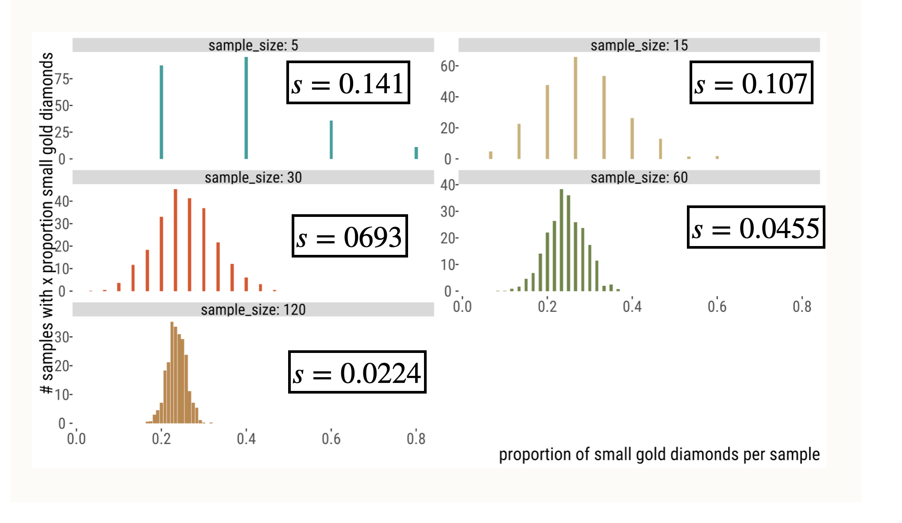

```{r setup, include=FALSE}
#knitr::opts_chunk$set(echo = FALSE)
library(tidyverse)
library(forcats)
library(dplyr)
library(ggplot2)
library(ggforce)
library(tidyr)
library(stringr)
library(knitr)
library(ggthemes)
library(wesanderson)
library(gt)
library(RColorBrewer)
library(plotly)
library(readr)
library(thematic)
library(infer)
library(kableExtra)

gg_color_hue <- function(n) {
  hues = seq(15, 375, length = n + 1)
  hcl(h = hues, l = 65, c = 100)[1:n]
}
source("bb_theme.R")

# set the theme
theme_set(bb_theme())
#theme_set(theme_bw())
#thematic_rmd(font = "Roboto Condensed", qualitative = asteroidcity1())
set.seed(12345)

tigerData<-read.csv("~/Documents/GitHub/DataSetsb215/data-raw/chap02e2aDeathsFromTigers.csv")

DieRoll<-function(times = 1){
  sample(x = 1:6,size = times, replace = T)
}

## to fix annoying ggplot2 issue ----
##https://rstudio-pubs-static.s3.amazonaws.com/991178_746a3f129f4d46829bda51127a8cb8f7.html
StatCount2 <- ggproto(
  "StatCount2", StatCount,
  compute_panel = function (self, data, scales, ...) {
    if (ggplot2:::empty(data)) 
      return(ggplot2:::data_frame0())
    groups <- split(data, data$group)
    stats <- lapply(groups, function(group) {
      self$compute_group(data = group, scales = scales, ...)
    })
    non_constant_columns <- character(0)
    
    stats <- mapply(function(new, old) {
      if (ggplot2:::empty(new)) return(ggplot2:::data_frame0())
      # Edit 1: Identify exceptions where a variable is constant *within values of x*
      within_x_constant <- vapply(old, function(x) nlevels(interaction(x, old$x, drop = TRUE)) == max(old$x), logical(1L))
      # Edit 2: Columns to keep
      kept <- unique(old[, within_x_constant])
      # Edit 3: Don't test non-constant-ness of `kept` columns
      old <- old[, !(names(old) %in% c(names(new), names(kept))), drop = FALSE]
      non_constant <- vapply(old, function(x) length(unique0(x)) > 1, logical(1L))
      non_constant_columns <<- c(non_constant_columns, names(old)[non_constant])
      # Edit 4: Add `kept` columns
      vctrs::vec_cbind(
        new,
        kept[, setdiff(names(kept), "x"), drop = FALSE],
        old[rep(1, nrow(new)), setdiff(names(old), names(kept)), drop = FALSE],
      )
    }, stats, groups, SIMPLIFY = FALSE)
    
    non_constant_columns <- ggplot2:::unique0(non_constant_columns)
    dropped <- non_constant_columns[!non_constant_columns %in% self$dropped_aes]
    if (length(dropped) > 0) {
      cli::cli_warn(c(
        "The following aesthetics were dropped during statistical transformation: {.field {glue_collapse(dropped, sep = ', ')}}",
        "i" = "This can happen when ggplot fails to infer the correct grouping structure in the data.",
        "i" = "Did you forget to specify a {.code group} aesthetic or to convert a numerical variable into a factor?"
      ))
    }

    # Finally, combine the results and drop columns that are not constant.
    data_new <- ggplot2:::vec_rbind0(!!!stats)
    data_new[, !names(data_new) %in% non_constant_columns, drop = FALSE]
  }
)

n.stars <- c(n_gold_small  =14*3,
             n_gold_medium = 8*3,
             n_gold_large  = 6*3,
             n_blue_small  = 6*3,
             n_blue_medium = 8*3,
             n_blue_large  = 3*3,
             n_red_small   = 7*3,
             n_red_medium  = 8*3,
             n_red_large   = 0*3)
stars <- tibble(color = rep( (str_extract(names(n.stars), "n_..*_") |> 
                    str_replace_all(pattern = "n|_","")),  times= n.stars), 
                size = rep((str_replace(names(n.stars), "n_","") )  |> 
                             str_extract( "_..*") |> 
                             str_replace_all(pattern = "_",""),  times = n.stars)) |>
  sample_n(size = sum(n.stars), replace = FALSE)  |>
  mutate(x = rep(1:14, times = 14)[1:sum(n.stars)],
         y = rep(1:14, each = 14)[1:sum(n.stars)],
         size = fct_relevel(size, "small","medium","large"))

human_genes<-read_csv("~/Documents/GitHub/Matb215f2025/Rlabs/lab6/human_genes.csv") |> filter(size <=15000)
```

## Key Learning Objectives

-   Understand that because <font color = #E69F00>estimates</font> take
    values by chance, they will differ from true population <font color = #006475>parameters</font>.
-   Connect the spread of the sampling distribution to uncertainty in
    estimates.
-   Recognize the standard error as the standard deviation of the
    **sampling distribution**.
-   Understand the confidence interval as a plausible range of a
    parameter, given an estimate and uncertainty in it.

## Outline {visibility="hidden"}

-   Sampling - what’s the point?

-   Getting a feel for sampling

-   The sampling distribution

-   Pseudo-replication

-   Standard error

-   Standard error of the mean

-   Confidence intervals

-   CI of the mean

-   Error bars - common mistakes

## Samples Take Their Value by Chance

-   Sets of samples from the same distribution can be different.

-   Therefore, estimates obtained from samples from the same population
    can differ by chance.

::: aside
Note: This unit focuses on sampling error and assumes that samples are
not biased - i.e, they are random.
:::

## Samples: what's the point?

-   We sample because we cannot measure the entire population.

-   When we take samples, we cannot see the sampling distribution.

-   Still, considering the process of sampling allows us to quantify the
    uncertainty in estimates.

::: goal
Estimation: from samples to parameters (hopefully)
:::

## Two Ways to Conceptualize Sampling

Okay, so how do we do this?

Here are the two right\* ways to think about the process of taking a
sample from a population.

1.  If you had a full population and made an estimate from a sample of
    size $n$.

2.  Think about the PROCESS that generates your population data: what
    would a sample generated by this process look like? (e.g. flipping a
    coin).

-   But sometimes one is more convenient than the other.

## Some definitions

::: goal
Estimation: a process of inferring a population parameter from sample
data. This estimated value is almost never exactly identical to the true
parameter value.
:::

::: goal
Sampling error affects precision of estimates. It is basically
inevitable because it is inherent to random sampling.
:::

::: aside
Note: This unit focuses on sampling error and assumes that samples are
not biased - i.e, they are random.
:::

## Generating samples from a population

In two easy steps:

1.  Take a sample of size n.

2.  Calculate the parameter estimates.

This is how we do science.

## Example {.dark-theme .center}

## A Population of Diamonds

::::: columns
::: {.column width="55%"}
A population of 180 diamonds of different sizes and colors.

```{r pop,eval=T, echo = F, tidy="styler"}
ggplot(stars, aes(x = x, y = y, color = color, size = size)) +
  geom_point(shape = 18, show.legend = FALSE) + 
  scale_color_manual(values = asteroidcity1()) +
  bb_theme() +
  ylab("") + xlab("") +
  theme(axis.text.x = element_blank(), axis.text.y = element_blank())

```
:::

::: {.column width="45%"}
```{r kable1, echo = F}
table(stars |> 
        select(-x, -y)) |>  
  kable()  |>
  kable_styling()      |>
  row_spec(row = 1,color = "#0A9F9D")|>
  row_spec(row = 2,color = "#CEB175")|>
  row_spec(row = 3,color = "#E54E21")|>
  scroll_box(width = "300px")
```

```{r kable2, echo = F, include=F, eval= F}
stars |> group_by(size) |> tally() |> kable() 
  
```

```{r kable3, echo = F,  include=F, eval= F}
stars |> group_by(color) |> tally() |> arrange(desc(n)) |> kable() |>  kable_styling()      |>
    row_spec(row = 2,color = "#0A9F9D")|>
    row_spec(row = 1,color = "#CEB175")|>
    row_spec(row = 3,color = "#E54E21")
```
:::
:::::

## A sample of 20 diamonds

```{r sample20plot, fig.height=3.5, fig.width=7, warning=FALSE, tidy = "styler", fig.align='center'}
star.sample.size <- 20
stars.sample <- sample_n(stars, size = star.sample.size, replace = FALSE)
ggplot(stars.sample, aes(x = x, y = y, color = color, size = size)) +
  geom_point(shape = 18, show.legend = FALSE) + 
  scale_color_manual(values = asteroidcity1()) +
  bb_theme() + 
  ylab("") + 
  xlab("") +
   theme(axis.text.x = element_blank(), axis.text.y = element_blank())


```

```{r kable4, echo = F}
table(stars.sample |> select(-x, -y)) |>  kable() |>
  kable_styling()      |>
  row_spec(row = 1,color = "#0A9F9D")|>
  row_spec(row = 2,color = "#CEB175")|>
  row_spec(row = 3,color = "#E54E21")
```

## Another sample of 20 diamonds

```{r sample20-2-plot, fig.height=3.5, fig.width=7, warning=FALSE, tidy="styler", fig.align='center'}
star.sample.size <- 20
stars.sample <- sample_n(stars, size = star.sample.size, replace = FALSE)
ggplot(stars.sample, aes(x = x, y = y, color = color, size = size)) +
  geom_point(shape = 18, show.legend = FALSE) + 
  scale_color_manual(values = asteroidcity1()) +
  bb_theme() + 
  ylab("") + ylab("") +   
  theme(axis.text.x = element_blank(), axis.text.y = element_blank())
```

```{r kable5, echo = F}
table(stars.sample |> select(-x, -y)) |>  kable() |>
  kable_styling()      |>
  row_spec(row = 1,color = "#0A9F9D")|>
  row_spec(row = 2,color = "#CEB175")|>
  row_spec(row = 3,color = "#E54E21")
```

## Aaaand ... another

```{r sample20-3-plot, fig.height=3.5, fig.width=7, warning=FALSE, tidy="styler", fig.align='center'}
star.sample.size <- 20
stars.sample <- sample_n(stars, size = star.sample.size, replace = FALSE)
ggplot(stars.sample, aes(x = x, y = y, color = color, size = size)) +
  geom_point(shape = 18, show.legend = FALSE) + 
  scale_color_manual(values = asteroidcity1()) +
  bb_theme() + 
  ylab("") + 
  xlab("") +
   theme(axis.text.x = element_blank(), axis.text.y = element_blank())
```

```{r kable6, echo = F}
table(stars.sample |> select(-x, -y)) |>  kable() |>
  kable_styling()      |>
  row_spec(row = 1,color = "#0A9F9D")|>
  row_spec(row = 2,color = "#CEB175")|>
  row_spec(row = 3,color = "#E54E21")
```

## One Last Sample of 20 Diamonds

```{r sample20-4-plot, fig.height=3.5, fig.width=7, warning=FALSE, fig.align='center'}
star.sample.size <- 20
stars.sample <- sample_n(stars, size = star.sample.size, replace = FALSE)
ggplot(stars.sample, aes(x = x, y = y, color = color, size = size)) +
  geom_point(shape = 18, show.legend = FALSE) + 
  scale_color_manual(values = asteroidcity1()) +
  bb_theme() + 
  ylab("") + 
  xlab("") +
  theme(axis.text.x = element_blank(), axis.text.y = element_blank())
```

```{r kable7, echo = F}
table(stars.sample |> select(-x, -y)) |>  kable() |>
  kable_styling()      |>
  row_spec(row = 1,color = "#0A9F9D")|>
  row_spec(row = 2,color = "#CEB175")|>
  row_spec(row = 3,color = "#E54E21")
```

## Sampling Diamonds: Lessons Learned

1.  "*Sampling is random*"

    Estimates from sampling efforts varied and did not perfectly capture
    the true population values. I.e, there is sampling error involved.

2.  Random *DOES NOT* mean that all outcomes are equally probable. E.g.:

-   There are no <font color = #E54E21>**LARGE RED**</font> diamonds in
    the population so we never sampled a LARGE RED diamond.

-   The most common diamond color in the population is
    <font color = #CEB175>**gold**</font>.
    <font color = #CEB175>**Gold**</font> is often the most common color
    in a sample.

::: aside
There are some other great interactive simulators out there to help you grasp
the sampling distribution. I share one later.
:::

## The sampling distribution! {.dark-theme .center}

## The sampling distribution

::: incremental

-   The sampling distribution is the distribution of the parameter
    estimate of interest from these samples

-   It is basically a histogram of all the values that a sample
    statistic can take on

-   They are super important: when you take a sample from a population,
    you base your conclusions on that sample, but we know samples vary
    randomly (even in the absence of bias)

-   To be able to interpret your sample results (say, mean bill length
    in a sample of 20 penguins from a given population) you need they
    stand amongst the "crowd"

-   The "crowd" of all possible sample statistics you can possibly get
    is the sampling distribution
:::

## Generating a sampling distribution

In three easy steps:

1.  Take a sample of size $n$.

2.  Calculate the parameter estimates.

3.  Rinse and repeat many times.

::: aside
Assumption: you can sample repeatedly from the population of interest
and your sampling does not in iteself change the population of interest.
When this is not possible to do, you can bootstrap! (which we did in Lab
6, more on this later). In the meantime, [check this out.](https://online.stat.psu.edu/stat555/node/119/)
:::

## Example: The Sampling Distribution of Diamonds

```{r sampdist, echo = F, fig.width=8}
stars <- stars |>  select(-x, -y) 

stars.sampling.dist <- stars |> 
  rep_sample_n(size = star.sample.size, replace = FALSE, reps =  1000) |>
  group_by(replicate, color, size) |>
  summarise(prop = n()/ star.sample.size)

#stars.sampling.dist |> 
# # ungroup()|> 
#   spread(key = size, value = prop, fill = 0)   |> 
#   group_by(replicate) |>
#   summarise(small_blue = sum(as.numeric(color == "#0A9F9D") *small * 20),
#             medium_blue = sum(as.numeric(color == "#0A9F9D") *medium * 20),
#             large_blue = sum(as.numeric(color == "#0A9F9D") *large * 20),
#             small_gold = sum(as.numeric(color == "#CEB175") *small * 20),
#             medium_gold = sum(as.numeric(color == "#CEB175") *medium * 20),
#             large_gold = sum(as.numeric(color == "#CEB175") *large * 20),
#             small_red = sum(as.numeric(color == "#E54E21") *small * 20),
#             medium_red = sum(as.numeric(color == "#E54E21") *medium * 20),
#             large_red = sum(as.numeric(color == "#E54E21") *large * 20))

stars.sampling.dist    |>
  spread(key = size, value = prop, fill = 0)  |> 
  filter(replicate %in% c(1:2, 999:1000)) |>
  kable()              |>
  kable_styling()      |>
  row_spec(row = seq(1,12,3),color = "#0A9F9D")|>
  row_spec(row = seq(2,12,3),color = "#CEB175")|>
  row_spec(row = seq(3,12,3),color = "#E54E21")|>
  scroll_box(width = "800px", height = "1000px") 
  
```

## Sampling distribution of diamond size

```{r fig.height= 5, echo = F}
true.prop.large   <- sum(n.stars[grep("large",names(n.stars))]) / sum(n.stars)
sampling.dist.large <- stars.sampling.dist |> 
  filter(size== "large") |>   
  ungroup() |>  
  group_by(replicate) |>
  summarise(prop = sum(prop))

stars |> 
    rep_sample_n(size = star.sample.size, replace = FALSE, reps =  1000) |>
    mutate(grp = paste0(size, " ", color)) |> group_by(replicate, grp) |> tally() |> pivot_wider(names_from=grp, values_from=n, values_fill = 0) |> 
  select(c(contains("small"), contains("medium"), contains("large"))) |>
  filter(replicate %in% c(1,2, 999, 1000)) |>
  kable() |>
  kable_styling()      |>
  column_spec(col = seq(2,10,3),color = "#0A9F9D")|>
  column_spec(col = seq(3,9,3),color = "#CEB175")|>
  column_spec(col = seq(4,9,3),color = "#E54E21")
```

## Sampling distribution of diamond size

```{r sampdist-plot, tidy="styler", fig.caption="the bin size was set to 1/sample_size in all cases."}
ggplot(sampling.dist.large, aes(x = prop)) + 
  geom_histogram(binwidth = 1/ star.sample.size, color = "lightgray", fill = "#006475")+
  geom_vline(xintercept = true.prop.large, lty = 2, color = "white") +
  ggtitle(sprintf("Sampling distribution: Proportion large diamonds (n = %s)", star.sample.size),
          subtitle = "Dotted white line is the population parameter") +
  xlab("proportion")+
  ylab("# of replicates\n(of 1000 simulations)")+
  bb_theme()

```

## The joint sampling distribution

```{r jointsampdist, warning = FALSE, tidy="styler", echo = F}
ggplot(stars.sampling.dist,aes(x = prop, fill = color)) + 
  geom_histogram(binwidth = 1/star.sample.size, color = "white", show.legend = FALSE)+
  scale_fill_manual(values = c("#0A9F9D", "#CEB175", "#E54E21")) +
  facet_grid(size~ color)
```

## How does variability in an estimate change with sample size? {.dark-theme .center}

## Variability in Estimates Decreases with *N*

```{r variab, warning=FALSE, message = FALSE, fig.height=5.5, tidy="styler", echo = F}
stars2 <- rbind(stars |>  rep_sample_n(size = c(5), replace =  FALSE, reps =  1000) |> 
        ungroup()|>
        mutate(replicate = replicate + 0,   n_reps = 5),
      stars |>  rep_sample_n(size = c(15), replace = FALSE, reps =  1000) |> 
        ungroup() |> 
        mutate(replicate = replicate + 1000, n_reps= 15),
      stars |>  rep_sample_n(size = c(30), replace = FALSE, reps =  1000) |> 
        ungroup() |> 
        mutate(replicate = replicate + 2000, n_reps = 30),
      stars |>  rep_sample_n(size = c(60), replace = FALSE, reps =  1000) |> 
        ungroup() |> 
        mutate(replicate = replicate + 3000, n_reps = 60),
      stars |>  rep_sample_n(size = c(120), replace = FALSE, reps =  1000) |> 
        ungroup() |> 
        mutate(replicate = replicate + 4000, n_reps = 120)) |>
  group_by(replicate, color, size) |> 
  summarize(n = n()) |> 
  ungroup() |> 
  group_by(replicate) |>
  mutate(prop = n / sum(n), sample_size = sum(n)) |>
  filter(color == "gold" & size == "small") |>
  ungroup()


#ggplot(data  = stars2, aes(x = prop, y = factor(sample_size), group = sample_size, fill= factor(sample_size))) +
#  geom_density_ridges(scale = 1, size = 0.25, rel_min_height = 0.03,scale = 1/.000001, show.legend = FALSE) +
#  theme_tufte() + 
#  geom_vline(xintercept = true_prop_gold_small, lty = 2)  +
 # scale_y_discrete(expand = c(0,0))+
#  ggtitle("Proportion of small gold stars per sample") +
#  yb_theme + 
#  ylab("sample size")
stars3<-stars2 |> group_by(sample_size,.drop=F) |> summarise(SD=sd(prop))

stars2 |> 
  ggplot(aes(x = prop, y = prop, fill = factor(sample_size)) )+
  geom_bar(stat = "identity", show.legend = FALSE) +
  facet_wrap(~sample_size, labeller = "label_both", scales = "free_y", ncol = 2) + 
  scale_fill_manual(values=asteroidcity1())+
  xlab("proportion of small gold diamonds per sample")+ ylab("# samples with x proportion small gold diamonds") +
bb_theme() 
```

## Variability in Estimates Decreases with *N*




## Standard Error {.dark-theme .center}

## The Standard Error: Definition

- The standard error reflects the difference between an estimate and the target parameter value. 

- The standard error predicts the sampling error
of the estimate.

## The Standard Error of the Mean (SEM)

-   Because we rarely know the population standard deviation,<font color = #ad7237>$\sigma$</font>,
    we cannot find the parameter <font color = #ad7237>
    $\sigma_{\bar{Y}}=\frac{\sigma_{Y}}{\sqrt{n}}$</font> , the standard
    error of the <font color = #ad7237>population mean</font>.

-   But, we can use the sample standard deviation, <font color = #00a1b7>$s$</font>, to estimate
    <font color = #00a1b7>$SEM_{\bar{Y}}=\frac{s}{\sqrt{n}}$</font>, the
    standard error of the <font color = #00a1b7>sample mean</font>.

Also:

::: goal
The standard error of an estimate is *the standard deviation of its
sampling distribution*!
:::

## Example: human gene lengths {.dark-theme .center}

## Human gene lengths

```{r geneleng, fig.cap="Note: parameters shown are for full dataset (n=20,290) but 26 genes with length > 15,000 \nwere omitted from this plot.", tidy="styler"}
ggplot(human_genes , aes(x=size)) + geom_histogram(aes(y=after_stat(count / sum(count))),bins=60, color="lightgray", fill="#006475") + xlab("Gene Length (basepairs)") + 
  ylab("Relative Frequency")+
  annotate('text', x = 10000, y = 0.04, 
        label = "mu==3511.5",parse = TRUE,size=10) +
  annotate('text', x = 10000, y = 0.03, 
        label = "sigma==2833.2",parse = TRUE,size=10)+
  bb_theme()
```

##  {visibility="hidden"}

{width="576"}

## Sampling Distribution: from textbook

[{fig-align="center"
width="424"}](https://www.zoology.ubc.ca/~whitlock/Kingfisher/SamplingNormal.htm)

## That's all for today

{fig-alt="\"Forrest says \"And that's all I wanted to say about that\""
width="347"}
