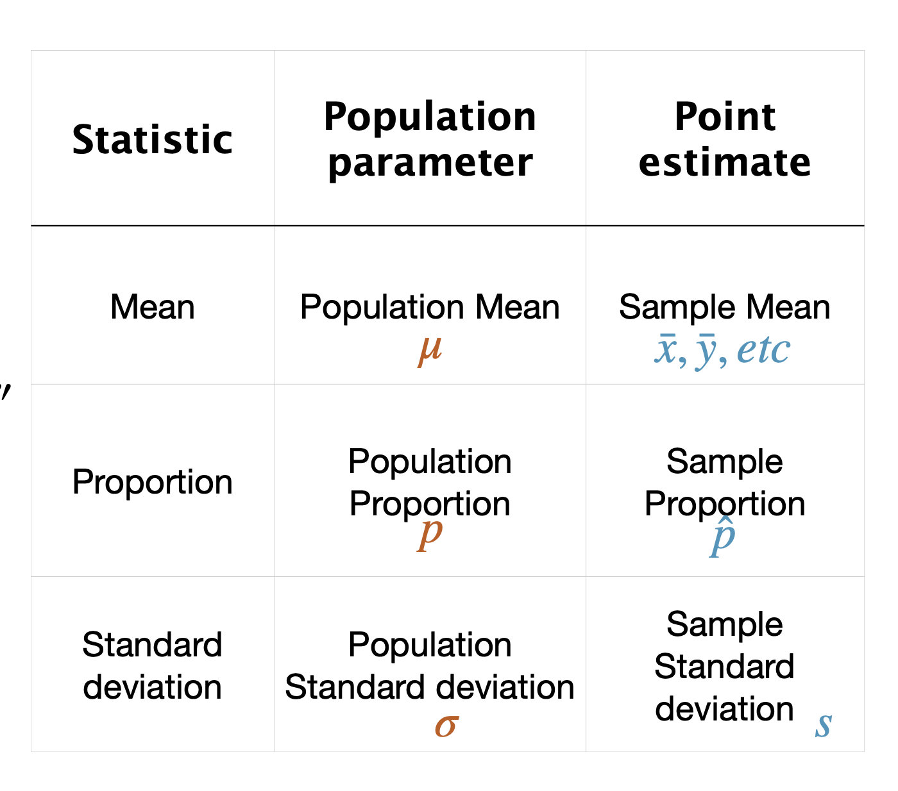

```{r setup, include=FALSE}
knitr::opts_chunk$set(collapse=T)
library(tidyverse)
library(forcats)
library(dplyr)
library(ggplot2)
library(ggforce)
library(tidyr)
library(stringr)
library(knitr)
library(ggthemes)
library(wesanderson)
library(gt)
library(RColorBrewer)
library(plotly)
library(readr)
library(thematic)
library(infer)
library(kableExtra)
library(gridExtra)


gg_color_hue <- function(n) {
  hues = seq(15, 375, length = n + 1)
  hcl(h = hues, l = 65, c = 100)[1:n]
}
source("bb_theme.R")

# set the theme
theme_set(bb_theme())
#theme_set(theme_bw())
#thematic_rmd(font = "Roboto Condensed", qualitative = asteroidcity1())
set.seed(12345)

tigerData<-read.csv("~/Documents/GitHub/DataSetsb215/data-raw/chap02e2aDeathsFromTigers.csv")

DieRoll<-function(times = 1){
  sample(x = 1:6,size = times, replace = T)
}

## to fix annoying ggplot2 issue ----
##https://rstudio-pubs-static.s3.amazonaws.com/991178_746a3f129f4d46829bda51127a8cb8f7.html
StatCount2 <- ggproto(
  "StatCount2", StatCount,
  compute_panel = function (self, data, scales, ...) {
    if (ggplot2:::empty(data)) 
      return(ggplot2:::data_frame0())
    groups <- split(data, data$group)
    stats <- lapply(groups, function(group) {
      self$compute_group(data = group, scales = scales, ...)
    })
    non_constant_columns <- character(0)
    
    stats <- mapply(function(new, old) {
      if (ggplot2:::empty(new)) return(ggplot2:::data_frame0())
      # Edit 1: Identify exceptions where a variable is constant *within values of x*
      within_x_constant <- vapply(old, function(x) nlevels(interaction(x, old$x, drop = TRUE)) == max(old$x), logical(1L))
      # Edit 2: Columns to keep
      kept <- unique(old[, within_x_constant])
      # Edit 3: Don't test non-constant-ness of `kept` columns
      old <- old[, !(names(old) %in% c(names(new), names(kept))), drop = FALSE]
      non_constant <- vapply(old, function(x) length(unique0(x)) > 1, logical(1L))
      non_constant_columns <<- c(non_constant_columns, names(old)[non_constant])
      # Edit 4: Add `kept` columns
      vctrs::vec_cbind(
        new,
        kept[, setdiff(names(kept), "x"), drop = FALSE],
        old[rep(1, nrow(new)), setdiff(names(old), names(kept)), drop = FALSE],
      )
    }, stats, groups, SIMPLIFY = FALSE)
    
    non_constant_columns <- ggplot2:::unique0(non_constant_columns)
    dropped <- non_constant_columns[!non_constant_columns %in% self$dropped_aes]
    if (length(dropped) > 0) {
      cli::cli_warn(c(
        "The following aesthetics were dropped during statistical transformation: {.field {glue_collapse(dropped, sep = ', ')}}",
        "i" = "This can happen when ggplot fails to infer the correct grouping structure in the data.",
        "i" = "Did you forget to specify a {.code group} aesthetic or to convert a numerical variable into a factor?"
      ))
    }

    # Finally, combine the results and drop columns that are not constant.
    data_new <- ggplot2:::vec_rbind0(!!!stats)
    data_new[, !names(data_new) %in% non_constant_columns, drop = FALSE]
  }
)

n.stars <- c(n_gold_small  =14*3,
             n_gold_medium = 8*3,
             n_gold_large  = 6*3,
             n_blue_small  = 6*3,
             n_blue_medium = 8*3,
             n_blue_large  = 3*3,
             n_red_small   = 7*3,
             n_red_medium  = 8*3,
             n_red_large   = 0*3)
stars <- tibble(color = rep( (str_extract(names(n.stars), "n_..*_") |> 
                    str_replace_all(pattern = "n|_","")),  times= n.stars), 
                size = rep((str_replace(names(n.stars), "n_","") )  |> 
                             str_extract( "_..*") |> 
                             str_replace_all(pattern = "_",""),  times = n.stars)) |>
  sample_n(size = sum(n.stars), replace = FALSE)  |>
  mutate(x = rep(1:14, times = 14)[1:sum(n.stars)],
         y = rep(1:14, each = 14)[1:sum(n.stars)],
         size = fct_relevel(size, "small","medium","large"))

human_genes_raw<-read_csv("~/Documents/GitHub/Matb215f2025/Rlabs/lab6/human_genes.csv")

human_genes<-read_csv("~/Documents/GitHub/Matb215f2025/Rlabs/lab6/human_genes.csv") |> filter(size <=15000)

DieRoll<-function(times = 1){
  sample(x = 1:6,size = times, replace = T)
}
CoinToss<-function(times=1){
  sample(x=c("heads", "tails"), size=times, replace=T)
}
```

## Outline

-   Go over the importance of the sampling distribution (again)
-   Interactive activity to help with this
-   Practice SEM calculations

## Big Picture

Two key goals of inferential statistics:

1.  estimate the characteristics of a population of interest based on a
    limited sample

2.  hypothesis testing

## Inferential Statistics

[{fig-alt="https://www.geeksforgeeks.org/data-science/what-is-inferential-statistics/"}](https://www.geeksforgeeks.org/data-science/what-is-inferential-statistics/)

# Is everything meaningless?

Q: If sampling error is unavoidable, how can I trust an estimate? What
is its precision? Why measure anything anyway? HELP!!!!

. . .

A: if we know something about how the samping process might affect the
estimates I get, that can inform my confidence in my estimates and the
significance level in hypothesis testing.

## Inferential Statistics

Q: Why do we need this?

A:

-   To learn about the whole **population**.

-   Test claims or hypotheses.

-   Make **predictions** with statistical models.

-   **Calculate confidence intervals and p-values to measure
    uncertainty.**

## So there IS a way to deal with this uncertainty?

Q: How??

. . .

A: yes, young padawans. We use the sampling distribution -- I know,
panic not

## The sampling distribution is at the heart of statistics

Q: But why do we need the sampling distribution?

A:

[{fig-alt="https://medium.com/@nikhil_garg/a-compilation-of-comics-explaining-statistics-data-science-and-machine-learning-eeefbae91277"}](https://medium.com/@nikhil_garg/a-compilation-of-comics-explaining-statistics-data-science-and-machine-learning-eeefbae91277)

## The Sampling Distribution

Let's start from the very beginning. Consider the roll of a six-sided
die.

This probability distribution shows all possible outcomes of a
**single** die roll and how likely they are. I.e., in the long term, if
you roll the die MANY times, you would expect equal proportions of each
result.

```{r heads}
plot.one.toss.prob  <- data.frame(outcome = c(1:2), probability = 1/2) |>
ggplot(aes(x = outcome, y = probability)) +
  geom_bar(stat  = "identity", show.legend = FALSE, fill = "#006475") +
  ggtitle("Probability Distribution", subtitle = "Outcome of a fair coin")+
  scale_x_continuous(breaks = 1:2)+
  scale_y_continuous(expand = c(0,0), limits  = c(0,.6))+
  ylab("Expected probability")+
  bb_theme()+
 # scale_fill_manual(values = "#006475")+
  theme(axis.ticks = element_blank())
plot.one.toss.prob
```

## What about a streak?

[{fig-alt="DOESN'T WORK LIKE THAT. THE PREVIOUS RESULTS DON'T AFFECT THE PROBABILITY OF FUTURE EVENTS. THE CHANCES OF FLIPPING SIX HEADS IN A ROW ARE 1 IN 64 BUT THE CHANCES OF FLIPPING HEADS AFTER 5 IN A ROW ARE STILL 50:50.  WOW! I'VE FLIPPED FIVE HEADS IN A ROW. THIS NEXT ONE'S GOTTA BE TAILS, THEN.  WHILE YOU WERE BUSY LECTURING, I FLIPPED ANOTHER 20 HEADS IN A ROW. WHAT'S YOUR LOGIC SAY TO THAT?  VEGAS ROAD TRIP? T'LL START PACKING."
width="444"}](https://www.treelobsters.com/2009/08/76-dumb-luck.html)

The sampling distribution can help us here.

##  {.center}

::: {r-fit-text}
The sampling distribution of a statistic is the distribution of that
statistic, considered as a random variable, when derived from a random
sample of size $n$ .

It may be considered as the distribution of the statistic for all
possible samples from the same population of a given sample size.
:::

## What does the sampling distribution depend on?

-   the **underlying distribution** of the population (in the coin
    example, uniform)
-   the statistic being considered (say, the number of sixes expected if
    I toss the coin a number of times)
-   the sampling procedure employed
-   **the sample size used.** (in this example, how many heads)

## Example: possible outcomes of tossing a fair coin 20 times

One possible outcome leads to this histogram:

```{r coin2}
i = 1
df<-tibble(x = c("heads", "tails")) |> 
    rep_sample_n(size = 20, replace = T,reps = i) |> 
    group_by(replicate, heads = x=="heads") |> tally() |> filter(heads == TRUE) |> mutate(prop=n/20)

ggplot(df, aes(x = prop)) + 
  geom_histogram(bins=21) + ggtitle(stringr::str_wrap(paste0("Proportion of heads in 20 tosses (", i, " simulations)"), 30)) +
  scale_x_continuous(limits=c(0,1),breaks=0:20/20)+
  xlab(stringr::str_wrap("Proportion of heads in 20 tosses",20))+
  ylab(stringr::str_wrap("Number of simulations",10))+
  xlim(0,1)+
  bb_theme() 
```

## Repeat this process 10 times

```{r}
i = 10
df<-tibble(x = c("heads", "tails")) |> 
    rep_sample_n(size = 20, replace = T,reps = i) |> 
    group_by(replicate, heads = x=="heads") |> tally() |> filter(heads == TRUE) |> mutate(prop=n/20)

ggplot(df, aes(x = prop)) + 
  geom_histogram(bins=21) + ggtitle(stringr::str_wrap(paste0("Proportion of heads in 20 tosses (", i, " simulations)"), 30)) +
  scale_x_continuous(limits=c(0,1),breaks=0:20/20)+
  xlab(stringr::str_wrap("Proportion of heads in 20 tosses",20))+
  ylab(stringr::str_wrap("Number of simulations",10))+
  xlim(0,1)+
  bb_theme() 
```

## 100 times

```{r}
i = 100
df<-tibble(x = c("heads", "tails")) |> 
    rep_sample_n(size = 20, replace = T,reps = i) |> 
    group_by(replicate, heads = x=="heads") |> tally() |> filter(heads == TRUE) |> mutate(prop=n/20)

ggplot(df, aes(x = prop)) + 
  geom_histogram(bins=21) + ggtitle(stringr::str_wrap(paste0("Proportion of heads in 20 tosses (", i, " simulations)"), 30)) +
  scale_x_continuous(limits=c(0,1),breaks=0:20/20)+
  xlab(stringr::str_wrap("Proportion of heads in 20 tosses",20))+
  ylab(stringr::str_wrap("Number of simulations",10))+
  xlim(0,1)+
  bb_theme() 
```

## 10000

```{r}
i = 10000
df<-tibble(x = c("heads", "tails")) |> 
    rep_sample_n(size = 20, replace = T,reps = i) |> 
    group_by(replicate, heads = x=="heads") |> tally() |> filter(heads == TRUE) |> mutate(prop=n/20)

ggplot(df, aes(x = prop)) + 
  geom_histogram(bins=21) + ggtitle(stringr::str_wrap(paste0("Proportion of heads in 20 tosses (", i, " simulations)"), 30)) +
  scale_x_continuous(limits=c(0,1),breaks=0:20/20)+
  xlab(stringr::str_wrap("Proportion of heads in 20 tosses",20))+
  ylab(stringr::str_wrap("Number of simulations",10))+
  xlim(0,1)+
  bb_theme() 
```

## That was a sampling distribution (of a proportion) {.center}

## Attention! {.dark-theme .center}

::: center
Population distribution

$$\neq$$

Sam*ple* distribution

$$\neq$$

Sampl*ING* distribution
:::

## Population distribution

In our previous example, we were interested in the lengths of human
genes.

1)  **Population distribution:** contains all values (all human gene
    lengths). Here is the histogram

```{r}
human.hist<-ggplot(human_genes , aes(x=size)) + geom_histogram(aes(y=after_stat(count / sum(count))),bins=60, color="lightgray", fill="#006475") + 
  xlab("Gene length (basepairs)") + 
  ylab("Relative Frequency")+
  ggtitle(stringr::str_wrap("Population Distribution of Human Gene Lengths", width = 20))+
  annotate('text', x = 10000, y = 0.04, 
        label = "mu==3511.5",parse = TRUE,size = 8) +
  annotate('text', x = 10000, y = 0.03, 
        label = "sigma==2833.3",parse = TRUE,size = 8)+
  bb_theme()
human.hist

```

## SamPLE distribution of gene lengths

Say, from one sample of 20 genes.

2)  the samPLE distribution will be based on the individual values of
    the individuals from my sample (in this case, 20 genes, sampled
    without replacement)

```{r}
library(infer)
set.seed(1985)
samp20<-human_genes_raw |>
  rep_sample_n(size = 20, replace = FALSE,reps = 1)
#[1] 2533.9 mean
# [1] 1517.998 sd
samp20.p<-samp20 |> ggplot(aes(x=size)) + 
  geom_histogram(aes(y=after_stat(count / sum(count))),bins=60, color="lightgray", fill="#E69F00") + 
  xlab("Gene length (basepairs)") + 
  ylab("Relative Frequency")+
  ggtitle(stringr::str_wrap("One SamPLE distribution of gene lengths (n = 20 genes)", width = 20))+
  annotate('text', x = 3500, y = 0.08, 
        label = "bar(X)== 2534",parse = TRUE,size = 5) +
  annotate('text', x = 3500, y = 0.07, 
        label = "s==1518",parse = TRUE,size = 5)+
  ylim(0, 0.20)+
  bb_theme()
samp20.p
```

## Another 20 genes sample

```{r}
set.seed(1985)
samp20<-human_genes_raw |>
  rep_sample_n(size = 20, replace = FALSE,reps = 1)
#> mean(samp20$size)
#[1] 2533.9
#> sd(samp20$size)
#[1] 1517.998

samp20.p<-samp20 |> ggplot(aes(x=size)) + 
  geom_histogram(aes(y=after_stat(count / sum(count))),bins=60, color="lightgray", fill="#E69F00") + 
  xlab("Gene length (basepairs)") + 
  ylab("Relative Frequency")+
  ggtitle(stringr::str_wrap("SamPLE distribution (n = 20 genes)", width = 20))+
  annotate('text', x = 3500, y = 0.08, 
        label = "bar(X)== 2534",parse = TRUE,size = 5) +
  annotate('text', x = 3500, y = 0.07, 
        label = "s==1518",parse = TRUE,size = 5)+
  ylim(0, 0.20)+
  bb_theme()

set.seed(1986)
samp20b<-human_genes |>
  rep_sample_n(size = 20, replace = FALSE,reps = 1)
#2412 mean
# 1258.08 sd
samp20.p2<-samp20b |> ggplot(aes(x=size)) + 
  geom_histogram(aes(y=after_stat(count / sum(count))),bins=60, color="lightgray", fill="#E69F00") + 
  xlab("Gene length (basepairs)") + 
  ylab("Relative Frequency")+
  ggtitle(stringr::str_wrap("SamPLE distribution (n = 20 genes)", width = 20))+
  annotate('text', x = 3500, y = 0.08, 
        label = "bar(X)==2412",parse = TRUE,size = 5) +
  annotate('text', x = 3500, y = 0.07, 
        label = "s==1258",parse = TRUE,size = 5)+
  ylim(0, 0.20)+
  bb_theme()
grid.arrange(samp20.p, samp20.p2, nrow = 1)

```

## Another

```{r}
set.seed(1987)
samp20c<-human_genes_raw |>
  rep_sample_n(size = 20, replace = FALSE,reps = 1)
#> mean(samp20c$size)
#[1] 2345.25
#> sd(samp20c$size)
#[1]  1668.036
samp20.p3<-samp20c |> ggplot(aes(x=size)) + 
  geom_histogram(aes(y=after_stat(count / sum(count))),bins=60, color="lightgray", fill="#E69F00") + 
  xlab("Gene length (basepairs)") + 
  ylab("Relative Frequency")+
  ggtitle(stringr::str_wrap("SamPLE distribution (n = 20 genes)", width = 20))+
  annotate('text', x = 3500, y = 0.08, 
        label = "bar(X)== 2911.45",parse = TRUE,size = 5) +
  annotate('text', x = 3500, y = 0.07, 
        label = "s==1569.516",parse = TRUE,size = 5)+
  bb_theme()
grid.arrange(samp20.p, samp20.p2, samp20.p3, nrow = 1)
```

## SampLING distribution {.dark-theme .center}

## SampLING distribution

In this case, the samplING distribution of mean gene lengths.

We can start building this by collecting the individual samPLE means we
calculated before: $\bar{X}=\{3110.3,2412,2911.45,...\}$, and making a
histogram of $\bar{X}$s.

```{r}
samp20_3<-bind_rows(samp20, samp20b |> mutate(replicate = 2), samp20c |> mutate(replicate = 3)) |> select(size)
samp20_3_summ<-samp20_3 |> summarise(xbar=mean(size), sample_sd=sd(size))
#> mean(samp20_3_summ$xbar)
#[1] 2430.383
#> sd(samp20_3_summ$xbar)
#[1] 95.65911
ggplot(samp20_3_summ, aes(x = xbar)) +
  geom_histogram(aes(y=after_stat(count / sum(count))),bins=60, color="lightgray", fill="#E69F00") + 
  xlab(expression(bar(X)~"(basepairs)"))+
  ylab("Relative Frequency")+
  ylim(0, 0.5)+
   annotate('text', x = 2500, y = 0.15, 
        label = "\'mean\' (bar(X))== 2430.4",parse = TRUE,size = 5) +
  annotate('text', x = 2497, y = 0.10, 
        label = "s[bar(X)]==95.7",parse = TRUE,size = 5)

```

## Increasing number of repetitions...

If instead of taking 3 independent samples of 20 genes we take, say,
100,000, we see a sampling distribution

```{r}
set.seed(01)
samp20_100000<-human_genes |>
  rep_sample_n(size = 20, replace = FALSE,reps = 100000) |> select(size)

samp20_100000_summ<-samp20_100000 |> summarise(xbar=mean(size), sample_sd=sd(size))
#> round(mean(samp20_100000_summ$xbar))
#1] 3405
#> round(sd(samp20_100000_summ$xbar))
#[1] 543
samp.dist20<-ggplot(samp20_100000_summ, aes(x = xbar)) +
  geom_histogram(aes(y=after_stat(count / sum(count))),bins=60, color="lightgray", fill="#E69F00") + 
  xlab(expression(bar(X)~"(basepairs)"))+
  ylab("Relative Frequency")+
   #ylim(0, 0.5)+
  ggtitle(expression(Sampling~distribution~of~bar(X)~(n==20~genes)))+
   annotate('text', x = 4000, y = 0.07, 
        label = "\'mean\' (bar(X))==3405",parse = TRUE,size = 5) +
  annotate('text', x = 4000, y = 0.06, 
        label = "s[bar(X)]==543",parse = TRUE,size = 5)

samp.dist20
```

## Compare

```{r}
grid.arrange(human.hist, samp.dist20, nrow=1)
```

Grand mean of $\bar{X}$ approaches population mean $\mu$

## Standard Error of the mean (SEM)

Compare:

Parameter:

$\sigma_{\bar{X}}=\frac{\sigma}{n}=\frac{2833.3}{\sqrt{20}}\approx 633.5$

Estimates:

$s_{\bar{X}}=543$

estimated form the sampling distribution

$SEM_{\bar{X}}=\frac{1517.998}{\sqrt{20}}\approx339.4$

estimated from the first sample of 20 genes

## Simulators to help you grasp this:

-   http://shiny.calpoly.sh/Sampling_Distribution/
-   https://shiny.abdn.ac.uk/Stats/apps/app_sampling/
-   https://www.zoology.ubc.ca/\~whitlock/Kingfisher/SamplingNormal.htm

## SE Decreases with Sample Size

```{r}

tibble(sample_size=seq(5,1000, 15), SEM = 2833.3/sqrt(sample_size)) |> ggplot(aes(x = sample_size, y = SEM)) +
    ylab(expression(sigma[bar(X)])) + xlab("Sample size")+geom_point()
```

## How we report SEM

-   $\bar{X}\pm SE$

-   In our previous example, our first sample had $\bar{X}=2533.9$ and
    $s_{X}=1517.998$, so
    $SEM_{\bar{X}}=\frac{1517.998}{\sqrt{20}}\approx339.4$

So we would report $2533.9 \pm339.4 \text{ (SEM)}$. Later we will also
see how the $SEM$ is used in plots (error bars).

## Standard error - Summary

::: goal
-   Estimates with smaller standard errors are more precise
-   The smaller the sampling error, the less uncertainty there is about
    the target parameter in the population (“out there”).
-   You can calculate the standard error for any estimate, not just the
    mean.
-   The SE of the sample mean if sometimes referred to as SE, but this
    is ambiguous - use SEM instead of SE
-   For huge sample sizes, the SEM is always tiny, even if the data have
    considerable spread (SD).
-   Small samples underestimate the SD of the population
-   Both SD and SEM are expressed in the same unit as the data
:::

## Practice question

Estimate the standard error of the mean for a sample of size 16 that has a standard deviation of 25:

A) 0.3125

B) 1.25

C) 1.5625

D) 6.25

## Practice question {visibility="hidden"}

Estimate the standard error of the mean for a sample of size 16 that has a standard deviation of 25:

A) 0.3125

B) 1.25

C) 1.5625

**D) 6.25**

$SEM=\frac{s}{\sqrt{n}}=\frac{25}{\sqrt{16}}=6.25$

## Confidence Interval: Plausible values of a parameter {.dark-theme .center}

## Recap

::::: columns
::: column
-   A point estimate is any single number that is calculated from a
    “parameter space” and serves as your “best guess” or “best estimate”
    of an unknown population parameter
-   Your parameter is constant (usually denoted by a greek letter)
:::


::: column

:::

:::

## That's all for today

{fig-alt="\"Forrest says \"And that's all I wanted to say about that\""
width="347"}

