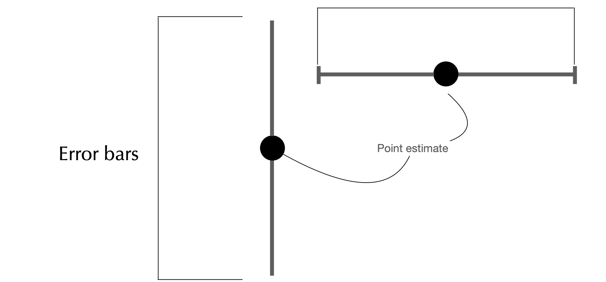
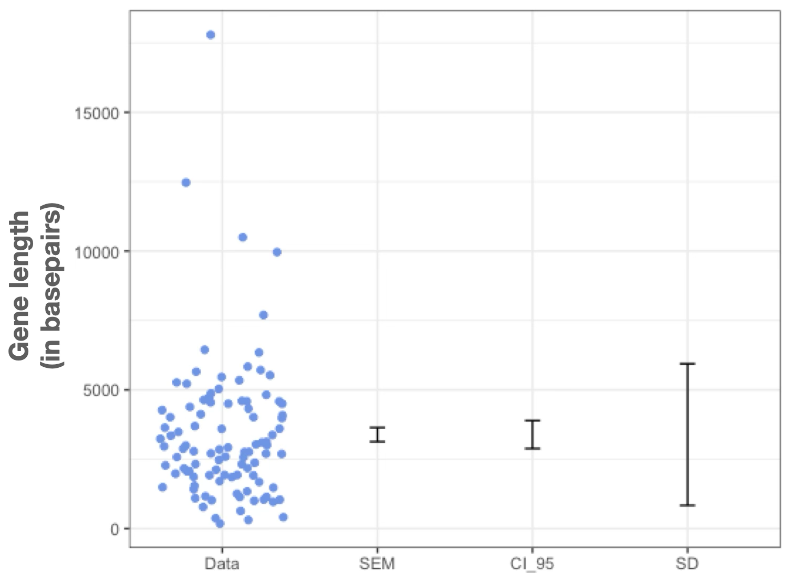
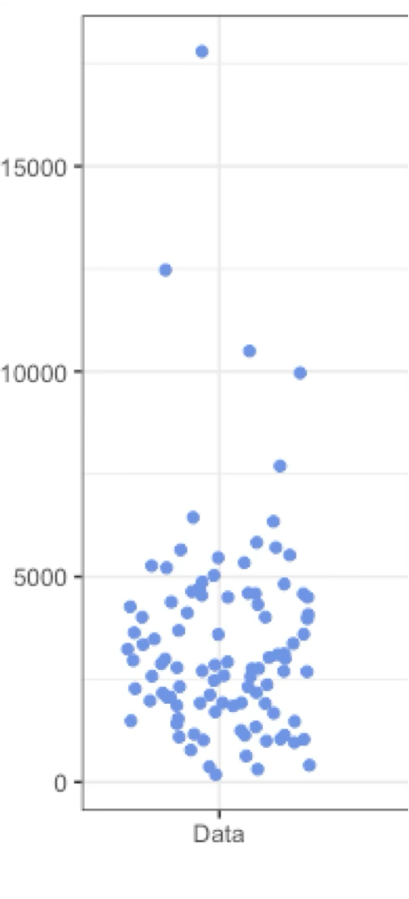
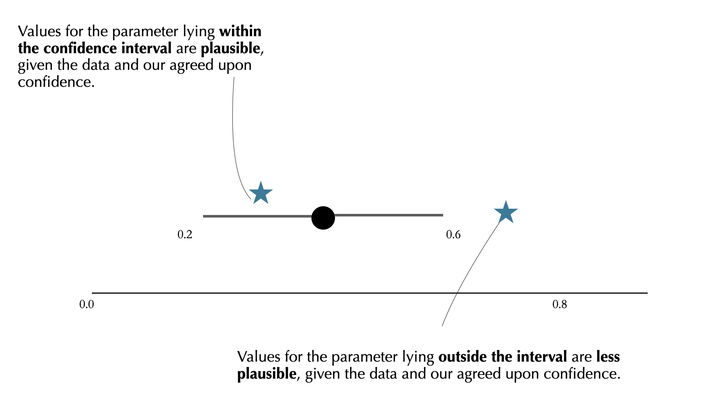
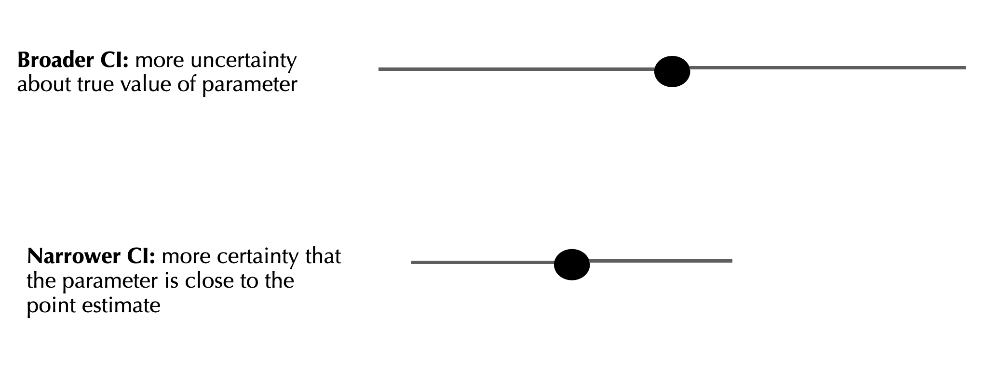
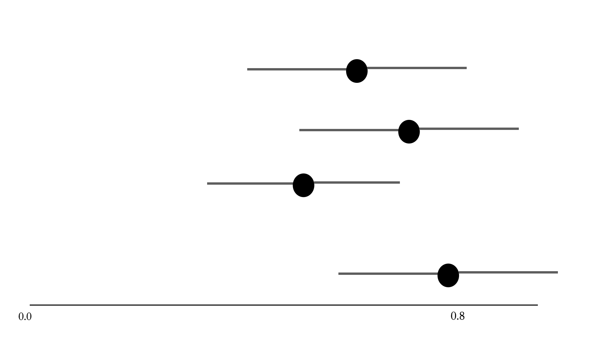

```{r setup, include=FALSE}
knitr::opts_chunk$set(collapse=T)
library(tidyverse)
library(forcats)
library(dplyr)
library(ggplot2)
library(ggforce)
library(tidyr)
library(stringr)
library(knitr)
library(ggthemes)
library(wesanderson)
library(gt)
library(RColorBrewer)
library(plotly)
library(readr)
library(thematic)
library(infer)
library(kableExtra)
library(gridExtra)


gg_color_hue <- function(n) {
  hues = seq(15, 375, length = n + 1)
  hcl(h = hues, l = 65, c = 100)[1:n]
}
source("bb_theme.R")

# set the theme
theme_set(bb_theme())
#theme_set(theme_bw())
#thematic_rmd(font = "Roboto Condensed", qualitative = asteroidcity1())

## to fix annoying ggplot2 issue ----
##https://rstudio-pubs-static.s3.amazonaws.com/991178_746a3f129f4d46829bda51127a8cb8f7.html
StatCount2 <- ggproto(
  "StatCount2", StatCount,
  compute_panel = function (self, data, scales, ...) {
    if (ggplot2:::empty(data)) 
      return(ggplot2:::data_frame0())
    groups <- split(data, data$group)
    stats <- lapply(groups, function(group) {
      self$compute_group(data = group, scales = scales, ...)
    })
    non_constant_columns <- character(0)
    
    stats <- mapply(function(new, old) {
      if (ggplot2:::empty(new)) return(ggplot2:::data_frame0())
      # Edit 1: Identify exceptions where a variable is constant *within values of x*
      within_x_constant <- vapply(old, function(x) nlevels(interaction(x, old$x, drop = TRUE)) == max(old$x), logical(1L))
      # Edit 2: Columns to keep
      kept <- unique(old[, within_x_constant])
      # Edit 3: Don't test non-constant-ness of `kept` columns
      old <- old[, !(names(old) %in% c(names(new), names(kept))), drop = FALSE]
      non_constant <- vapply(old, function(x) length(unique0(x)) > 1, logical(1L))
      non_constant_columns <<- c(non_constant_columns, names(old)[non_constant])
      # Edit 4: Add `kept` columns
      vctrs::vec_cbind(
        new,
        kept[, setdiff(names(kept), "x"), drop = FALSE],
        old[rep(1, nrow(new)), setdiff(names(old), names(kept)), drop = FALSE],
      )
    }, stats, groups, SIMPLIFY = FALSE)
    
    non_constant_columns <- ggplot2:::unique0(non_constant_columns)
    dropped <- non_constant_columns[!non_constant_columns %in% self$dropped_aes]
    if (length(dropped) > 0) {
      cli::cli_warn(c(
        "The following aesthetics were dropped during statistical transformation: {.field {glue_collapse(dropped, sep = ', ')}}",
        "i" = "This can happen when ggplot fails to infer the correct grouping structure in the data.",
        "i" = "Did you forget to specify a {.code group} aesthetic or to convert a numerical variable into a factor?"
      ))
    }

    # Finally, combine the results and drop columns that are not constant.
    data_new <- ggplot2:::vec_rbind0(!!!stats)
    data_new[, !names(data_new) %in% non_constant_columns, drop = FALSE]
  }
)

human_genes<-read_csv("~/Documents/GitHub/Matb215f2025/Rlabs/lab6/human_genes.csv")

DieRoll<-function(times = 1){
  sample(x = 1:6,size = times, replace = T)
}
CoinToss<-function(times=1){
  sample(x=c("heads", "tails"), size=times, replace=T)
}
MakeSampleMeansGraph <- function(samples, actual.mean,x_lim = NA,...){
  if(is.na(x_lim)){x_lim <-range(c(samples))}
  sample.means <- colMeans(samples)
  sample.SEs   <- apply(samples,2,sd)/sqrt(nrow(samples))
	plot(1,xlim = x_lim , ylim = c(0,(1+ncol(samples))),
		type="n",axes = FALSE, ylab = "",...)
	segments(x0 = (sample.means - 2 * sample.SEs) , 
           y0 = seq_along(samples[1,]), 
           x1 = (sample.means + 2 * sample.SEs),  
           y1 =  seq_along(samples[1,]), 
           col="blue" )
	abline(v=actual.mean, col = "red")
	box()
	axis(1)
	mtext("sample", side =2 ,line = .5)
}
MakeSampleMeansGraph2 <- function(samples, actual.mean,title="title", x_lim = NA,...){
  if(is.na(x_lim)){x_lim <-range(c(samples$size))}
  sample_means<-samples |> summarise(sample_mean=mean(size), sample_sd=sd(size), n=n(),sem=sample_sd/sqrt(n), CI_U=sample_mean+2*sem, CI_L=sample_mean-2*sem)
qtext<-stringr::str_wrap(paste0(sample_means |> group_by(Logic=actual.mean >= CI_L & actual.mean <=CI_U) |> tally() |> filter(Logic==TRUE) |> pull(n), "/", max(samples$replicate),  " CIs include population mean"),16)
 
p1<-ggplot(sample_means, aes(x = sample_mean, y=replicate))+
   geom_point(color="#D55E00")+
   geom_errorbar(aes(xmin=CI_L, xmax=CI_U)) + 
   ylab("sample") +
   xlab(stringr::str_wrap("Mean gene length (basepairs)",20)) + 
   geom_vline(xintercept=actual.mean,colour = "#0072B2", lty=2,linewidth = 1)+
  annotate(geom = "text",x=actual.mean+2000,y = 103, label="Population mean",colour = "#0072B2")+
  annotate(geom = "text", x = 12000, y = 50, label=qtext)+
  #xlim(0, 15000)+
  ggtitle(title)+
   bb_theme()+
  theme(axis.text.y = element_blank(), axis.ticks.y = element_blank())
}


MakeSampleMeansGraph3 <- function(samples, actual.mean,title="title", x_lim = NA,...){
  if(is.na(x_lim)){x_lim <-range(c(samples$size))}
  sample_means<-samples |> group_by(replicate) |> summarise(sample_mean=mean(size), sample_sd=sd(size), n=n(),sem=sample_sd/sqrt(n), CI_U=sample_mean+2*sem, CI_L=sample_mean-2*sem)
qtext<-stringr::str_wrap(paste0(sample_means |> group_by(Logic=actual.mean >= CI_L & actual.mean <=CI_U) |> tally() |> filter(Logic==TRUE) |> pull(n), "/", max(samples$replicate),  " CIs include population mean"),16)
 
p1<-ggplot(sample_means, aes(x = sample_mean, y=replicate))+
   geom_point(colour = "#D55E00")+
   geom_errorbar(aes(xmin=CI_L, xmax=CI_U), color="#616571") + 
   ylab("sample") +
   xlab(stringr::str_wrap("Mean gene length (basepairs)",20)) + 
   geom_vline(xintercept=actual.mean,colour = "#0072B2", lty=2,linewidth = 1)+
  annotate(geom = "text",x=actual.mean+2000,y = 103, label="Population mean",colour = "#0072B2")+
  annotate(geom = "text", x = 12000, y = 50, label=qtext)+
  xlim(0, 15000)+
  ggtitle(title)+
   bb_theme()+
  theme(axis.text.y = element_blank(), axis.ticks.y = element_blank())
}
```

## Key points for today

-   Error bars

-   Confidence intervals

    -   definition
    -   how to interpret
    -   how to calculate CI of the mean (approximation and bootstrap)

-   Pseudoreplication

## Recap

Estimate the standard error of the mean for a sample of size $n=16$ that
has $s=25$:

## Recap

Estimate the standard error of the mean for a sample of size $n=16$ that
has $s=25$:

$SEM=\frac{s}{\sqrt{n}}=\frac{25}{\sqrt{16}}=6.25$

## Recap

::: columns

::: {.column width="60%"}
| Statistic          | Parameter (population) | Point estimate (sample)       |
|-------------------|---------------------------|--------------------------|
| Mean               | $\mu$                  | $\bar x, \bar y, \bar X$, etc |
| Proportion         | $p$                    | $\hat{p}$                     |
| Standard deviation | $\sigma$               | $s$                           |

:::

::: {.column width="40%"}

-   Your parameter is constant (usually denoted by a greek letter)
-   A point estimate is any single number that is calculated from a
    “parameter space” and serves as your “best guess” or “best estimate”
    of an unknown population parameter
:::
:::

## Standard Error - Key points

-   A standard error is just the standard deviation of a statistic
-   We use “standard error” to talk about the distribution of a
    statistic, whereas “standard deviation” is usually used to talk
    about the distribution of data itself (either the whole population
    or a sample)

## Error Bars {.dark-theme .center}

## Error bars

::: columns
::: column
**What are they?**

Lines that extend from a point estimate to reflect the degree of
uncertainty of the parameter being estimated

We've seen them several times in this lecture!


:::

::: column
**What do they measure?**

Unfortunately, it depends on what one wants to convey:

-   Confidence intervals
-   1 Standard error
-   2 Standard errors
-   etc
:::
:::

## Only use error bars to convey uncertainty, not spread!


Disclaimer: this is a general statistical principle and for this course
we will abide to it. Standard deviation is a measure of
spread/variability, not of uncertainty. It is possible that you learn
elsewhere that in a specific field this is tolerated more than others.




## If goal is to show variation among data

::: columns
::: {.column width="65%"}
If =\< 100 data points: just plot it all in a strip chart (remember to
add jitter and transparency)

Otherwise, to avoid clutter: violin plot, CFD, boxplot
:::

::: {.column width="35%"}
{width="344"}
:::
:::

## If goal to show how precisely you have estimated a parameter

::: columns
::: {.column width="40%"}
Use CI (easier to interpret, wider) or SEM (narrower, harder to
interpret) to compare:

-   two or more means
-   your estimate vs. model predictions

Example: showing that the second plague (Yersinia pestis) pandemic
shaped the gene pool of certain populations
:::

::: {.column width="60%"}
[{fig-alt="Legend: Crucial info! Every figure must have an informative legend! The mean Gaelic genetic ancestry of the three temporal groups from Trondheim, based on the ADMIXTURE results with 95% CI shown as error bars."
width="472"}](https://www.ncbi.nlm.nih.gov/core/lw/2.0/html/tileshop_pmc/tileshop_pmc_inline.html?title=Click%20on%20image%20to%20zoom&p=PMC3&id=9671091_gr2.jpg)
:::
:::

## ERROR BARS- CAUTIONARY TALES {.dark-theme .center}

## Mistake 1: assuming distributions are Gaussian (bell-shaped)

{fig-alt="Shows a right skewed distribution"}

## Mistake 1: assuming distributions are Gaussian (bell-shaped)

If you were only told the mean and SD here are 101 and 43 or only saw
plot A), below, you would imagine something like B, but C or D have
these same summaries!

{fig-alt="The mean and SD can be misleading. All four data sets in the graph have approximately the same mean (101) and SD (43). If you were only told those two values or only saw the bar graph (A), you’d probably imagine that the data look like Data set B. Data sets C and D have very different distributions, but the same mean, SD, and SEM as Data set B. Example from: Intuitive Biostatistics"}

## Mistake 2: Plotting mean and error bars without defining how bars were computed

How will your reader know if it’s the SD, SEM, CI, range, or something
else?

{fig-alt="Source: Mentioned in Intuitive Biostatistics as Frazer et al. (2006), a study of the bladder-relaxing effects of norepinephrine in old rats."}

## Confidence Interval: a plausible range for a parameter {.dark-theme .center}

## Interval Estimation

-   Loosely, attempt to define a range of numbers that might include the
    parameter of interest

-   Also a way of quantifying uncertainty

## Confidence Interval (CI): Definition

::: incremental
A "1 − 𝛼" confidence interval is an interval $(v_1, v_2)$, where $v_1$
and $v_2$ are instances of random variables satisfying
$$𝑃(v_1 < \theta < v_2) \geq  1 − 𝛼$$

if $\alpha=0.05$, we have a $95\%$ CI.

if $\alpha=0.01$, we have a $99\%$ CI.

95% and 99% are difference *confidence levels*

, etc ...
:::

## CIs define "plausible" parameter values

[{fig-alt="Figure shows point estimate as a point in the middle of a line. A start outside the dot but within the line reads: \"Values for the parameter lying within the confidence interval are plausible, given the data and our agreed upon confidence.\". A star outside the dot and the line reads \"Values for the parameter lying outside the interval are less plausible, given the data and our agreed upon confidence\"."
width="791"}](https://bbitarello.github.io/b215f2025/slides/Estimation4.html)

## CI width

[{fig-alt="Figure shows two confidence intervals. Both have a point at the center of a horizontal line. At the top, the line is longer, symbolizing the width of the CI. At the bottom the line is shorter. Text at the top: \"broader CI: more uncertainty about true value of parameter\". Text at the bottom: \"Narrower CI: more certainty that the parameter is close to the point estimate\"."}](https://bbitarello.github.io/b215f2025/slides/Estimation4.html#)

## Different samples can have different CIs

{width="622"}

## In summary: why does the CI vary?

::: incremental

1)  **Sample size:** all other things being equal, bigger $n$ means lower
    CI
2)  **Confidence level:** 0.90 gives narrower range than 0.95 In the
    long run, \~95% of 95% CIs estimated from random samples will
    include the population parameter of interest!
3)  **Random sampling:** just like point estimates such as the mean, are
    prone to the randomness of a given sample

:::

## CI notation

::: goal
E.g. for a confidence interval encompassing from values 0.1 to 0.5
(inclusive)
:::

**Preferable:**

Using the parameter (e.g. if we're estimating the mean): $0.1<\mu<0.5$

$\left[0.1,0.5\right]$

$0.3\pm 0.2$

**Fine:**

0.1 to 0.5

Do *not* use: 0.1-0.5 or 0.1--0.5

Why? This can be confusing for negative numbers

## Interpreting CIs {.dark-theme .center}

## Interpreting CIs

::: columns
::: {.colum width="50%"}

✅ Correct ✅

-   \~95% of 95% confidence intervals calculated from samples *include*
    the population mean.

-   We are 95% confident that the **population mean** lies within the
    95% confidence interval.
:::

::: {.colum width="50%"}
😔 Incorrect

-   There’s a 95% probability that the population mean is within the 95%
    confidence interval.

Why? The CI either contains the parameter or it does not contain it. The
probability is associated with the process that generated the interval.
And if we repeat this process many times, 95% of all intervals should in
fact contain the true value of the parameter.
:::
:::

::: notes
(the population mean is what it is)
:::

## CIs for any parameter

-   CIs can be calculated for means, proportions, correlations,
    differences between means, regression lines, and much more ...
-   We won’t learn yet how to calculate this, but rather focus on how to
    interpret CIs.

## CI and sample sizes

The width of the CI is *_approximately_* proportional to the reciprocal of
the square root of the sample size

$$CI\propto \frac{1}{\sqrt{n}}$$

-   Translating: to reduce your CI by a factor of 2, you need to
    increase your sample size by a factor of 4; to reduce the CI by a
    factor of 10, you would need to increase your sample size by a
    factor of 100!

::: aside
If this looks familar, it is not a coincidence. The CI and SE are
intertwined
:::

## How do we calculate CIs?

Two ways, mainly:

1)  If certain assumptions are met (more on this soon), we will learn in
    a few weeks how to do it

For all other cases:

2)  Simulations! (resampling)

## The 2SE Rule of Thumb for the 95% CI of the mean

**Assumptions**

If and only if:

-   Sample is random, accurate, and composed of independent observations
-   Population variable of interest is distributed in a Gaussian/Normal
    manner (at least approximately)
-   Population standard deviation for the variable of interest is known
    (or we have a decent sample estimate), but population mean is
    unknown.

*THEN* ...

## The 2SE Rule of Thumb for the 95% CI of the mean

If assumptions are met, then...

a **rough** estimate of the 95% CI for the mean is:

Lower 95% CI: $\bar X - 2\times SEM_{\bar X}$

Upper 95% CI: $\bar X + 2\times SEM_{\bar X}$

::: aside
Whenever you use the rule of thumb you should state it as such and
justify its use. Later in the course we will learn how to calculate
actual CIs using the Normal distribution. These assumptions also applies
to the classical approach, that uses the Normal distribution to get more
precise estimates than the rule of thumb does
:::

## Where does this come from? {visibility="hidden"}

General form of a CI: A confidence interval estimates are intervals
within which the parameter is expected to fall, with a certain degree of
confidence.

The general form:

$\text{estimate} \pm \text{critical value} × \text{std.dev of the estimate}$

$\text{estimate} \pm \text{margin of error}$

For example:

$\text{sample mean} \pm \text{critical value} × \text{estimated standard error}$

In the "2 SE" rule of thumb, we are using 2 as a critical value. This is
only a rough approximation if the problem meets the assumptions
mentioned. We will learn how to calculate this without approximation in
a couple of weeks.

[{fig-alt="https://online.stat.psu.edu/stat504/lesson/confidence-intervals"}](https://online.stat.psu.edu/stat504/lesson/confidence-intervals)

## EXAMPLE: HUMAN GENE LENGTHS {.dark-theme .center}

## Example

100 replicate of $n=5$ genes samples from all human genes

```{r}
library(infer)
set.seed(01010101010)
#par(mfrow = c(1,3), mar = c(5,2,3,1))
sample.5 <- rep_sample_n(human_genes,size = 5,replace=F, reps=100)
sample.5.mat<-matrix(sample.5 |> pull(size), byrow=T, nrow=5)
sample.20 <- rep_sample_n(human_genes,size = 20,replace=F, reps=100)
sample.20.mat<-matrix(sample.20 |> pull(size), byrow=T, nrow=20)
sample.100 <- rep_sample_n(human_genes,size = 100,replace=F, reps=100)
sample.100.mat<-matrix(sample.100 |> pull(size), byrow=T, nrow=100)
p1<-MakeSampleMeansGraph2(sample.5, mean(human_genes$size), title = "95% CIs (n = 5 genes)")
p1
#MakeSampleMeansGraph(sample.5.mat, mean(human_genes$size), main = "95% CI Estimated mean gene length (n = 5)",xlab = "Gene length (basepairs)")
#MakeSampleMeansGraph(sample.20.mat, mean(human_genes$size), main = "95% CI Estimated mean gene length (n = 20)",xlab = "Gene length (basepairs)")
#MakeSampleMeansGraph(sample.100.mat, mean(human_genes$size), main = "95% CI Estimated mean gene length (n = 20)",xlab = "Gene length (basepairs)")
```

## Example

Another 100 replicates of n=5

```{r}
set.seed(1985)
sample.5 <- rep_sample_n(human_genes,size = 5,replace=F, reps=100)
sample.20 <- rep_sample_n(human_genes,size = 20,replace=F, reps=100)
sample.100 <- rep_sample_n(human_genes,size = 100,replace=F, reps=100)
p1<-MakeSampleMeansGraph2(sample.5, mean(human_genes$size), title = "95% CIs (n = 5 genes)")
#p1
p2<-MakeSampleMeansGraph2(sample.20, mean(human_genes$size), title = "95% CIs (n = 20 genes)")
library(patchwork)
#p1+p2
p3<-MakeSampleMeansGraph2(sample.100, mean(human_genes$size), title = "95% CIs (n = 100 genes)")
p1
```

## Larger sample size narrows CI

```{r}
actual.mean<-mean(human_genes$size)
actual.sd<-sd(human_genes$size)
set.seed(1985)
sample.1000 <- rep_sample_n(human_genes,size = 1000,replace=F, reps=100)
allSizes<-bind_rows(sample.5 |> select(replicate, size) |> mutate(ss=n()), sample.20 |> select(replicate, size) |> mutate(ss=n()))
allSizes<-bind_rows(allSizes,sample.100 |> select(replicate, size) |> mutate(ss=n()))
allSizes <-bind_rows(allSizes,sample.1000 |> select(replicate, size) |> mutate(ss=n()))
allSizes<-allSizes |> ungroup() |> group_by(ss, replicate) |> summarise(meanL=mean(size), sdL=sd(size), sem=sdL/sqrt(ss), CI_L=meanL-(2*sem), CI_U=meanL+(2*sem)) |> distinct() |> ungroup()
allSizes5_20<-allSizes |> filter(ss %in% c(5, 20))
ggplot(allSizes5_20, aes(x=meanL, y=replicate, group=ss)) + 
  geom_point(colour = "#D55E00",size=1) + 
  geom_errorbar(aes(xmax=CI_U, xmin=CI_L), color="#616571") + 
  geom_vline(xintercept=actual.mean, lty=2, show.legend = T, colour="#0072B2",linewidth = 1)+ 
  annotate(geom = "text",x=actual.mean+2000,y = 103, label="Pop. mean",colour = "#0072B2") +
  facet_wrap(vars(ss))+
  bb_theme()
```

## Larger sample size narrows CI

```{r}
actual.mean<-mean(human_genes$size)
actual.sd<-sd(human_genes$size)
set.seed(1985)
sample.1000 <- rep_sample_n(human_genes,size = 1000,replace=F, reps=100)
allSizes<-bind_rows(sample.5 |> select(replicate, size) |> mutate(ss=n()), sample.20 |> select(replicate, size) |> mutate(ss=n()))
allSizes<-bind_rows(allSizes,sample.100 |> select(replicate, size) |> mutate(ss=n()))
allSizes <-bind_rows(allSizes,sample.1000 |> select(replicate, size) |> mutate(ss=n()))
allSizes<-allSizes |> ungroup() |> group_by(ss, replicate) |> summarise(meanL=mean(size), sdL=sd(size), sem=sdL/sqrt(ss), CI_L=meanL-(2*sem), CI_U=meanL+(2*sem)) |> distinct() |> ungroup()
allSizes100_1000<-allSizes |> filter(ss %in% c(100, 1000))
ggplot(allSizes100_1000, aes(x=meanL, y=replicate, group=ss)) + 
  geom_point(colour = "#D55E00",size=1) + 
  geom_errorbar(aes(xmax=CI_U, xmin=CI_L), color="#616571") + 
  geom_vline(xintercept=actual.mean, lty=2, show.legend = T, colour="#0072B2",linewidth = 1)+ 
  annotate(geom = "text",x=actual.mean+500,y = 103, label="Pop. mean",colour = "#0072B2") +
  facet_wrap(vars(ss))+
  bb_theme()
```

## Larger sample size narrows CI

```{r}
ggplot(allSizes, aes(x=meanL)) + 
  geom_histogram(bins=40, color="black") + 
  geom_vline(xintercept=actual.mean, lty=2, show.legend = T, colour="#0072B2")+ 
  xlab(stringr::str_wrap("Mean gene length (basepairs)",20))+
  ylab("Frequency")+
  facet_wrap(~ss, ncol=2)+
  ggtitle(stringr::str_wrap("Sampling dist of mean human gene lengths", 30))+
  bb_theme()
```

## That's all for today

{fig-alt="\"Forrest says \"And that's all I wanted to say about that\""
width="347"} 
