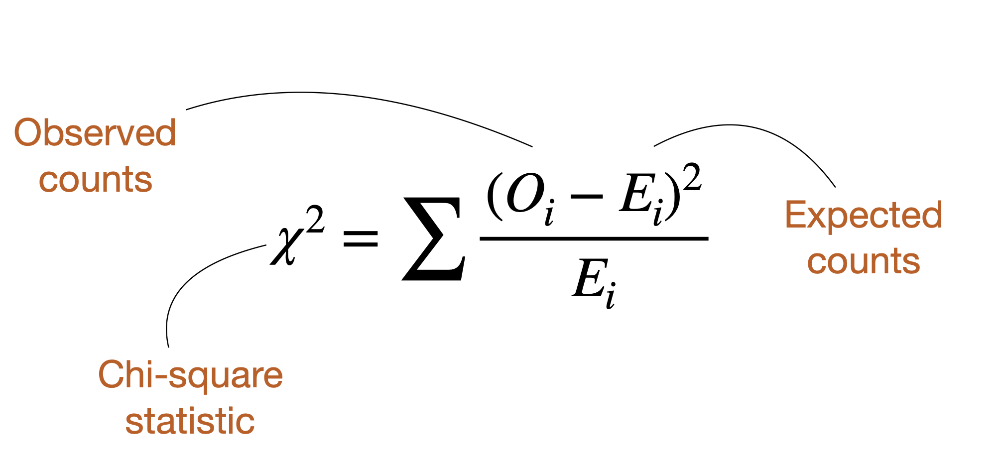

```{r setup, include=FALSE}
knitr::opts_chunk$set(collapse=T)
library(tidyverse)
library(forcats)
library(dplyr)
library(ggplot2)
library(ggforce)
library(tidyr)
library(stringr)
library(knitr)
library(ggthemes)
library(wesanderson)
library(gt)
library(RColorBrewer)
library(plotly)
library(readr)
library(thematic)
library(infer)
library(kableExtra)
library(gridExtra)
library(emoGG)
library(emo)

gg_color_hue <- function(n) {
  hues = seq(15, 375, length = n + 1)
  hcl(h = hues, l = 65, c = 100)[1:n]
}
source("bb_theme.R")
options(digits = 3)

# set the themeb_theme()
theme_set(bb_theme())

birds_original <- data.frame(Age = c("Old","Young","Old", "Young"),
                      Species = c("Junco", "Junco", "Finch", "Finch"),
                      Number = c(4, 7, 9, 9))
nhl <- tibble( month = c("Jan", "Feb", "Mar", "Apr", "May", "June", "Jul", "Aug", "Sep", "Oct", "Nov", "Dec"),
        month.num = 1:12,
        births = c(133, 125, 114, 119, 119, 123, 96, 91, 83, 84,73,85)) |> 
  mutate(month = fct_reorder(.f = month, .x = month.num,.desc = TRUE))


human_births<-tibble( month = c("Jan","Feb","Mar","April","May",
                                "June","Jul","Aug","Sept","Oct","Nov","Dec"),
                             `births (%)`  = 100*c(Jan = 0.0794, Feb = .0763, Mar = .0872,
                              April = .0863, May = .0895, June = .0857, Jul = .0876,
                              Aug = .085, Sept =  .0854, Oct = .0819, Nov = .0770,
                              Dec = .0787) )

lousy.fish <- tibble(num_parasites = 0:6, num_fish = c(103, 72, 44, 14, 3, 1, 1)) 
fish.sum   <- lousy.fish |> summarise(total_fish = sum(num_fish), 
                                       total_parasites = sum(num_fish* num_parasites))

births<-tibble( month = c("Jan","Feb","Mar","April","May","June","Jul","Aug","Sept","Oct","Nov","Dec"),
        `births (%)`  = 100*c(Jan = 0.0794, Feb = .0763, Mar = .0872, April = .0863, May = .0895, June = .0857, Jul = .0876, Aug = .085, Sept =  .0854, Oct = .0819, Nov = .0770, Dec = .0787) ) 
```

## Outline

•Goodness-of-fit tests

•The proportional model

•The $\chi^2$ distribution

•Degrees of freedom

•The $\chi^2$ test

•Using $\chi^2$ to test if data are distributed according to a poisson
distribution

## Goodness of Fit Tests

::: r-fit-text
<font size = 7>Does <font color = "#E69F00">data</font> come from a
<font color = "#56B4E9">given distribution</font> with specified
<font color = "#56B4E9">parameters</font>?</font>
:::

## NHL player birth months `r ji("puck")`

::: goal
**Biological hypothesis**: Being born earlier in the year makes players
stand out when young, helping them achieve later success.
:::

::::: columns
::: {.column width="35%"}
$H_0$: Elite hockey players are born randomly across the year.

$H_A$: Elite hockey players are NOT born randomly across the year.
:::

::: {.column width="\"65%"}
```{r, fig.height=3.4, fig.width=5,echo=FALSE, warning=FALSE, message=FALSE}

ggplot(data = nhl, aes(x = month, y = births))    + 
  geom_bar(stat = "identity", fill = "#C18748") + coord_flip()+ annotate(geom = "text", x = 12:1, y = 5,label = nhl$births, color = "white" ) + ggtitle("Number of NHL players born by month") + theme_tufte() + bb_theme() + theme(axis.ticks = element_blank())+coord_flip() 
```
:::
:::::

## Testing!

::::: columns
::: {.column width="30%"}
$H_0$: Prop birth months of NHLers is like that of other humans.

$H_A$: Prop birth months of NHLers is unlike that of other humans.
:::

::: {.column width="70%"}
```{r}

#births |>t()|> kable() |> kable_styling(full_width = FALSE,font_size = 20)
births |> kable(caption = "Human  births by month") |> kable_styling(full_width = FALSE,font_size = 20,position = "center")
```
:::
:::::

::: aside
Ventura et al. (2001). Births: final data for 1999. National Vital
Statistics Reports Vol. 49, No. 1.
:::

## Introducing $\chi^2$

$\chi^2$ summarizes the fit of **categorical** data to expectations.


{fig-alt="shows chi-squared formula with annotations: O=observed, E=expected, chi-squared (greek symbol)"
fig-align="center"}

$\chi^2 = 0$: Data perfectly match null hypothesis expectations

$χ^2 > 0$: Data show deviation from null hypothesis expectations

## Finding Expectations

::::: columns
::: column
Expected number of births in month $i$ is:

$E[X] = n_{total} × \text{Null proportion}$

$n_{total} = 1245$ (just add up the births column)

$$E[X_i] = n_{total} \times \text{expected propotion}_i$$

```{r, echo  = TRUE, eval= F}
nhl |> 
  mutate(expected.prop = c(.0794, .0763, .0872, .0863, 
                           .0895, .0857, .0876, .0850, 
                           .0854, .0819, .0770, .0787)) |>
  mutate(expected.n = expected.prop * sum(births), 
         `expected %` = 100 * expected.prop)
```
:::

::: column
```{r}
nhl <- nhl |> 
  mutate(expected.prop = c(.0794, .0763, .0872, .0863, 
                           .0895, .0857, .0876, .0850, 
                           .0854, .0819, .0770, .0787)) |>
  mutate(expected.n = expected.prop * sum(births), 
         `expected %` = 100 * expected.prop)

nhl2<-nhl|> select(month,births, `expected %`, expected.n) |> mutate(expected.n = round(expected.n,digits = 2)) |> kable() |> kable_styling(full_width = FALSE,font_size = 18) 
nhl2
```
:::
:::::

## Finding $\chi^2$ \[1/2\]

::::: columns
::: column
```{r}
nhl2

```
:::

::: column
Example: January

$E=98.9$

$O=133$

$\frac{(O_{i}-E_{i})^2}{E_{i}}=?$

$\frac{(133-98.9)^2}{98.9}=\frac{1162.81}{98.9}=11.76$
:::
:::::

## Finding $\chi^2$ \[2/2\]

```{r nhl2b, echo = T, eval=F}
nhl |> 
  mutate(`sq_dev_over_expect` = 
           (expected.n - births)^2 / expected.n) 
```

```{r nhl2}
nhl3 <- nhl |> 
  mutate(`sq_dev_over_expect` = (expected.n - births)^2 / expected.n) |>
  kable() |> kable_styling(full_width = T,font_size = 18) 
nhl3
nhl<-nhl |> 
  mutate(`sq_dev_over_expect` = 
           (expected.n - births)^2 / expected.n) 
```

Now find $\chi^2$ by summing over all
$\frac{(\text{O}_i - \text{E}_i)^2}{\text{E}_i}$

```{r chi, echo=TRUE}
obs.chi2 <-  nhl |> summarise( 
                       chi2 = sum(`sq_dev_over_expect`))      
obs.chi2
```

<font size = 10>
$\chi^2 = `r round(pull(obs.chi2 ), digits = 2)`$</font>

## From Test Stat to P-value \[1/2\]


::: columns

::: {.column width="50%"}
***By simulation***

• Randomly assign hockey players birth dates. $\chi^2$ 

• Calculate $\chi^2$ for these random data following the null. 

:::

::: {.column width="50%"}
• Repeat this many times. 

• Compare observed to generated under the null.

:::

:::

```{r chi2, fig.align="center"}
n.reps   <- 10000
sim.many <- tibble(replicate = rep(1:n.reps , each = sum(nhl$births)),
                   month = with(nhl, sample(x = month, size = sum(births) * n.reps,
                                replace = TRUE, prob = expected.prop ) )) |>
  group_by(replicate,month)           |> 
  summarise(births = n())             |>
  arrange(replicate,desc(month))      |> 
  mutate(expected.n = nhl$expected.n) |>
  mutate(sqdev.over.expect = (expected.n - births)^2 / expected.n)  |>
  summarise(chi2 = sum(sqdev.over.expect))

p1<-ggplot(data = sim.many, aes(x = chi2)) +
  geom_histogram(aes(y = after_stat(density) ), bins = 80) +
  annotate(geom = "text",x = pull(obs.chi2), y = .06, label = "observed", color = "#D55E00",hjust = 1.2, size = 5)  +
  annotate(geom = "text",x = 10, y = .025, label = "simulated \ndistribution", color = "white")  +
  geom_vline(xintercept  = pull(obs.chi2), col = "#D55E00",lty = 2, size = 2) +
  ggtitle(stringr::str_wrap("Observed birth dates are quite improbable under the null model",45)) +
  theme_tufte() +  
  bb_theme()
p1
```

## From Test Stat to P-value \[2/2\]

The $\chi^2$ distribution describes expected values of $\chi^2$ under
$H_0$.\
The p-value is the area under the upper tail of the distribution.\
You can see solid agreement between our simulations and the $\chi^2$
distribution. We often use the $\chi^2$ for testing comparing
categorical counts to expectations.

```{r error=FALSE, warning=FALSE}

ggplot(data = sim.many, aes(x = chi2)) +
  geom_histogram(aes(y = after_stat(density )), bins = 80) +
  stat_function(fun = dchisq, args = list(df = 11),
                color = "#0072B2", lwd = 2, alpha = .4)             +
  annotate(geom = "text",x = pull(obs.chi2), y = .06, label = "observed", color = "#D55E00",hjust = 1.2, size = 5)  +
  annotate(geom = "text",x = 11, y = .025, label = "simulated \ndistribution", color = "white", size = 5)  +
  annotate(geom = "text",x = 32, y = .075, label = "paste(atop(chi^2~distribution,df == 11))",
           color = "#0072B2",hjust = 1.2,size = 5, parse=T)  +
  geom_vline(xintercept  = pull(obs.chi2), col = "#D55E00",lty = 2) +
  xlab(label = expression(chi^2))+
  xlab(expression(chi^2))  +
  ggtitle(stringr::str_wrap("Observed birth dates are\nquite improbable\nunder the null model", 50)) +
  theme_tufte()+  
  bb_theme()
```

# WHY DOES THIS WORK? {.dark-theme}

THE $\chi^2$ DISTRIBUTION’S

PROPERTIES

## Introduction to $\chi^2$ distribution

• The $\chi^2$ distribution describes the sampling distribution of
$\chi^2$ under a null hypothesis predicting expected categorical counts.

• There are many $\chi^2$ distributions, each associated with a
different number of degrees of freedom. 

• The $\chi^2$ distributions are
continuous probability distributions, so we use the *area under the
curve* (not the height of the curve) to obtain an **APPROXIMATE** P-value. NOTE: This is a one-tailed test!

## Introduction to $\chi^2$ distribution

```{r, warning=FALSE, message=FALSE, fig.height=5}
p2<-tibble(x = seq(0,40,.01))|>mutate(p=dchisq(x = x,df = 11),gr20 = x > 20) |>
  ggplot(aes(x = x, y = p, fill = gr20)) +   
  geom_density(stat = "identity", alpha = .4, show.legend = FALSE, color = "#0072B2") +
  geom_line(color = "#0072B2", lwd = 2, alpha = .4)   +
  scale_fill_manual(values = c("#6C8645","black"))+
  ggtitle(label = expression(chi^2~distribution:~chi^2 == 20~and~df == 11))+
  theme_tufte() +
  geom_vline(xintercept = 20, alpha = .4, lty = 2, color = "black") +
  xlab(expression(chi^2))   +
  annotate(geom = "text", x = 30, y = .045, alpha = .8, color = "black",
           label = sprintf("The integral \n of the  shaded \n are equals %s", 
                           round(pchisq(q = 20, df = 11, lower.tail = F),digits =3),size = 5))+
  bb_theme()
p2
```

## What Is A Degree of Freedom?

<font size = 7> For $\chi^2$ tests,</font>\
df = \# categories - 1 - \# params estimated from data

<font size = 7> More broadly... </font>\
How many data points can "wobble around" following initial estimation of
your model.

E.g. $s^2=\frac{\sum (x-\bar x)^2}{n-1}; n=10$

• First we calculate the mean and then we need to calculate each
$(x−\bar x)^2$ for each data point.

• But note that only $n−1$ data points are truly free to have *any*
value. I.e., if you know the value $x$ for 9 of your 10 data points, the
last one can be inferred. So this statistic has $n− 1$ degrees of
freedom.

## Assumptions of $\chi^2$ tests

-   No expected values $< 1$\
-   No more than $20\%$ of expected values $< 5.$

. . .

Do we meet these?

. . .

```{r}
nhl |> 
  select(month, expected.n) |>
  mutate(expected.n= round(expected.n)) |> 
  t() |>
  kable() |>
  kable_styling(full_width = FALSE,font_size = 20) 
```

## $\chi^2$ P-Value and Stats Tables

<font color = #6C8645>**Statistical Table A**</font> in your book \[old
fashioned, for  exam\].

```{r,}
tmp <- bind_cols(df = 1:12,data.frame(t(sapply(1:12, function(X){
  qchisq(p = c(.1,.05,10^(-2:-7)), df = X, lower.tail = FALSE)}
  )))) |> 
  select('df | a' = df, '0.1' = X1, '0.05' = X2, `10^-2` = X3, `10^-3` = X4, `10^-4` = X5 ,  
         `10^-5` = X6,  `10^-6` = X7 ,  `10^-7` = X8)
tmp |>  kable(format = "html", escape = F, digits = 2) |> 
  kable_styling( position = "left") |>
  row_spec(0,  color = "lightgrey", background = "black") |>
  #row_spec(1:12, font_size =  0) |>
  column_spec(2:8, width_min = 10, width_max = 10) 
```

## $\chi^2$ P-Value and Stats Tables

We had $\chi^2=44.89; df=12-1-0=11$

```{r}
tmp |>  filter(`df | a` == 11) |> kable(format = "html", escape = F, digits = 2) |> 
  kable_styling( position = "left") |>
  row_spec(0,  color = "lightgrey", background = "black") |>
  #row_spec(1:12, font_size =  0) |>
  column_spec(2:8, width_min = 10, width_max = 10) 
```

Note: The critical value of a test statistic that marks the boundary of
a specified area in the tail (or tails) of the sampling distribution
under $H_{0}$. For $df=11$ and $\alpha=0.05$, the critical value here is
19.7.

We can determine that $10^{-6}<P<10^{-5}$

```{r echo = T}
#find pval for chisq test without stats table
pchisq(q=44.89,df=11,lower.tail=F)
```

P is very small. Data like these would rarely be generated under the null.

We reject $H_0$ & conclude that birth months of NHL players do not
follow that of the rest of the population.

Note: This is a one tailed test by definition– we only care if data are
too far from expectations, not if they’re too close.

## To summarize what we just did

• This was an example of using the $\chi^2$ goodness-of-fit test to test
if the data follows a proportional model

• The proportional model is a probability model in which the frequency
of occurrence of events is proportional to the number of opportunities.

• Critical values are used in association with statistical tables to
determine whether the P-value is below a pre-determined threshold

• You don’t need critical values when you use something like R to calculate your P-value

• Always best to report actual p-value than a range

• P-values are always approximate because is a continuously distributed
variable

## The $\chi^2$ Distribution is Versatile: We Can Use It for Any Discrete Distribution

• Provided the aforementioned assumptions are met

• In the next, we test the null hypothesis that meiosis in monkey flower
hybrids follows the expectations from a Punnett square.

• We use a $\chi^2$ goodness of fit test to see if data meet binomial
expectations. Note that this is not a binomial test, know the
difference.

## Is Meiosis in monkey flower Fair?

::: {style="float:left;position: relative; top: 0px; left: -10px;"}

:::

When making hybrids between monkey flower species, in one cross [Lila
Fishman](https://www.fishmanlab.org/) found:

• 48 GG homozygotes

• 37 GN heterozygotes

• 4 NN homozygotes

• This surprised her.

What’s the probability that Lila would see this (or something more
extreme) under chance alone?

::: aside
Data from: Fishman & Saunders. 2008. Science 322: 1559-1562
:::

## Are these genotype frequencies unusual?

$H_0$: Genotypes follow Mendelian expectations of 1:2:1.\
$H_A$: Genotypes do not follow Mendelian expectations of 1:2:1.

$df =$ \# categories - 1 - \# params estimated $= 3 - 1 - 0 = 2$

```{r, echo=T}
monkeyflowers <- tibble(geno = c("GG","GN","NN"), 
       observed = c(48,37,4), 
       expected.prop = c(.25,.5,.25)); monkeyflowers |> kable() |>  kable_styling( full_width = FALSE)

```

## Are these genotype frequencies unusual?

```{r, echo=T}
monkeyflowers <- tibble(geno = c("GG","GN","NN"), 
       observed = c(48,37,4), 
       expected.prop = c(.25,.5,.25)) |> 
  mutate(expected.n = sum(observed ) * expected.prop, 
         sq_dev = (expected.n - observed)^2/expected.n)                                               |>  mutate(sq_dev = round(sq_dev,digits = 3)); monkeyflowers |> kable() |>  kable_styling( full_width = FALSE)

```

## Meiosis isn't fair in monkey flowers

```{r echo = T}
monkey_chi <- monkeyflowers |> summarise(chi2 = sum(sq_dev)) |> pull()
monkey_p   <- pchisq(q = monkey_chi, df = 2, lower.tail = FALSE)
monkey_p
```

We observe a $\chi_{2}^2$ value of 46, and a p-value of
$1.01 \times 10^{-10}$.

**Remember:** The low P-value reflects the weight of evidence against
the null hypothesis, not how big the difference is between the true
proportion and the null expectation.

We reject the null hypothesis. Meiosis isn't fair.

## 

<font size = 6> Centromere-Associated Female Meiotic Drive Entails Male
Fitness Costs in Monkeyflowers </font>

> Female meiotic drive, in which paired chromosomes compete for access
> to the egg, is a potentially powerful but rarely documented
> evolutionary force. In interspecific monkeyflower (Mimulus) hybrids, a
> driving M. guttatus allele (D) exhibits a 98:2 transmission advantage
> via female meiosis. We show that extreme interspecific drive is most
> likely caused by divergence in centromere-associated repeat domains
> and document cytogenetic and functional polymorphism for drive within
> a population of M. guttatus. In conspecific crosses, D had a 58:42
> transmission advantage over nondriving alternative alleles. However,
> individuals homozygous for the driving allele suffered reduced pollen
> viability. These fitness effects and molecular population genetic data
> suggest that balancing selection prevents the fixation or loss of D
> and that selfish chromosomal transmission may affect both individual
> fitness and population genetic load.

::: aside
Fishman & Saunders. 2008. Science 322: 1559-1562
:::

## 


