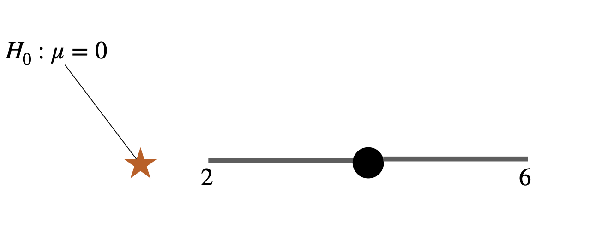
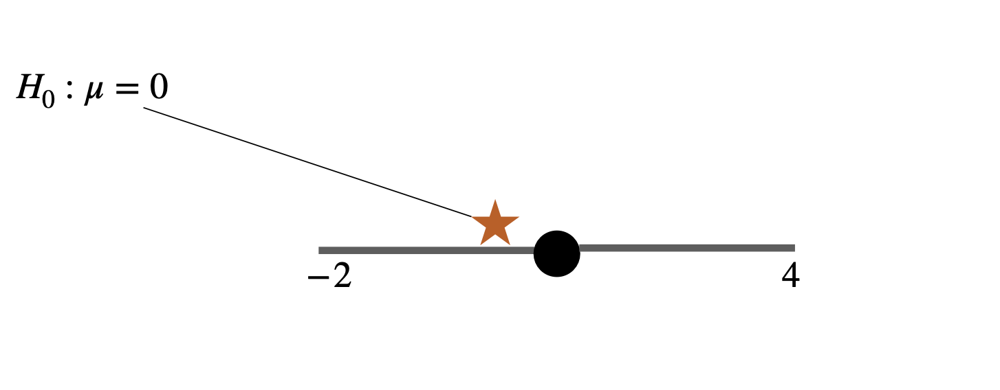

```{r setup, include=FALSE}
knitr::opts_chunk$set(collapse=T)
library(tidyverse)
library(forcats)
library(dplyr)
library(ggplot2)
library(ggforce)
library(tidyr)
library(stringr)
library(knitr)
library(ggthemes)
library(wesanderson)
library(gt)
library(RColorBrewer)
library(plotly)
library(readr)
library(thematic)
library(infer)
library(kableExtra)
library(gridExtra)
library(emoGG)
library(emo)

sample.dist  <- data.frame(estimate = replicate(50000,mean(rnorm(20,0,1))) )

gg_color_hue <- function(n) {
  hues = seq(15, 375, length = n + 1)
  hcl(h = hues, l = 65, c = 100)[1:n]
}
source("bb_theme.R")

# set the theme
theme_set(bb_theme())
```

# Key learning goals

-   Be able to describe the Null Hypothesis.
-   Understand the practice of Null Hypothesis Significance Testing.
-   Master the meaning of a P-value.
-   Have the basis to be critical and skeptical of P-values.
-   Explain the concepts of false positives and false negatives and why
    they happen.
-   Understand when to use one vs two-tailed tests.
-   Understand the relationship between p-values and CIs

## 


## Outline

-   Estimating p-value and interpreting it
-   Cautionary tales
-   Type I and type II errors in hypothesis testing
-   Estimation vs. hypothesis testing
-   Philosophical/historical digression/discussion about p-values (optional readings posted in [course website](https://bbitarello.github.io/b215f2025/schedule.html#sec-lec))

## Recap Question 1

Which of the choices below is an appropriate alternative hypothesis for
a null hypothesis which reads: "the mean systolic blood pressure for men
is 120"?

A. The mean systolic blood pressure for men differs from 120.

B. The mean systolic blood pressure for men differs from that of women.

C. The mean systolic blood pressure for men is less than 120.

D. The mean systolic blood pressure for men is more than 120.

## Recap Question 2

The P-value is best described as the probability that

A. We would observe the data we do if the null hypothesis is false.

B. We would observe the data we do if the null hypothesis is true.

C. The null hypothesis is false.

D. The null hypothesis is true.

## Recap: The Steps of Hypothesis Testing {transition="convex" transition-speed="fast"}

::: incremental
1.  State $H_0$ and $H_A$.

2.  Calculate a test statistic.

3.  Generate the null distribution.

4.  Find critical value at specified $\alpha$, and the p-value.
:::

## The P-value: a measure of surprise {.dark-theme .center}

{width="268"}

## P-value

::: goal
The p-value is the probability a sample from the null model would be as
or more extreme than our sample. It quantifies your surprise if you
assumed that the null was true.

More formal definitions:

(a) The strength of evidence in the data against the null hypothesis

(b) The long-run frequency of getting the same result or one more
    extreme if the null hypothesis is true.
:::

```{r,echo=FALSE, fig.height=3.7}
my.ps <- sample.dist %>% 
  summarize(lower.area.2 = round(mean( estimate <= -.2), digits = 3),
            upper.area.2 =  round(mean( estimate > .2), digits = 3), 
            p.val.2 = lower.area.2 + upper.area.2,
            lower.area.7 = round(mean( estimate <= -.7), digits = 3),
            upper.area.7 =  round(mean( estimate > .7), digits = 3), 
            p.val.7 = lower.area.7 + upper.area.7) %>%
  unlist()

two.tail.unremakable <- ggplot(data = sample.dist, aes(x = estimate, fill = abs(estimate) >= .2)) +
  geom_histogram(breaks = seq(-1,1,.02), color = "white", lwd = .1, aes(y = ..count../sum(..count..)), alpha = .5, show.legend = FALSE) +
  ylab("probability") + 
  xlab("Estimates of test statistic from sampling distribution") +  
  annotate(geom = "text", x = .55, y = .02, 
           label = "my test\nstatistic", 
           size=6,
           color = "steelblue", 
           alpha = .9)+
  annotate(geom = "text", x = c(-.65,.65), y = c(.0075, .0075), 
           label = c(sprintf("Area = %s",my.ps["lower.area.2"]),sprintf("Area = %s",my.ps["upper.area.2"])), 
           color = "#D55E00", 
           size=6,
           alpha = .9)+  
  geom_segment(aes(x=.55, xend=.2, y=.016, yend=0), 
               size = 1, 
               color = "steelblue",
               arrow = arrow(length = unit(0.1, "npc")), alpha = .4)+ 
  ggtitle("Sampling distribution under the null", subtitle = sprintf("Test Stat = .2; P-value = %s",my.ps["p.val.2"])) +
  scale_fill_manual(values = c("#999999","#D55E00")) +
  theme_tufte() +
  bb_theme()   

two.tail.unremakable
```

## P-value

p-value = the probability of obtaining a test statistic at least as
extreme as the one from the data at hand, assuming:

-   the model assumptions for the inference procedure used are all true,
    and
-   the null hypothesis is true, and
-   the random variable is the same (including the same population), and
-   the sample size is the same.

Notice that this is a **conditional probability**
($P(\text{observed_effect}|\text{null hypothesis is true})$: The
probability that something happens, given that various other conditions
hold. One common misunderstanding is to neglect some or all of the
conditions.

::: aside
Credit: This slide uses materials from Martha Smith's blog:
https://web.ma.utexas.edu/users/mks/statmistakes/misinterppvalues.html
:::

## Finding P-values

-   Evaluating where the test statistic lies on a sampling distribution
    built from the null model.

-   We generate this null sampling distribution by:

-   Simulation

-   Permutation (shuffling)

-   Mathematical results developed by professional statisticians. These
    are built from the logic of probability theory.

## Unremarkable P-value

We would not be surprised if the sample below came from the null model.

```{r}
two.tail.unremakable
```

## A remarkable P-value

We would be very surprised if the sample below came from the null model.

```{r remarkable}

two.tail.remarkable<-ggplot(data = sample.dist, aes(x = estimate, fill = abs(estimate) >= .7)) +
  geom_histogram(breaks = seq(-1,1,.02), color = "white", lwd = .1, aes(y = ..count../sum(..count..)), alpha = .5, show.legend = FALSE) +
  ylab("probability") + 
  xlab("Estimates of test statistic from sampling distribution") +  
  annotate(geom = "text", x = .55, y = .02, 
           label = "my test statistic", 
           color = "#0072B2", 
           size=6,
           alpha = .9)+
  annotate(geom = "text", x = c(-1.2,1.2), y = c(.0075, .0075), hjust =c(0,1),
           label = c(sprintf("Area = %s",my.ps["lower.area.7"]),sprintf("Area = %s",my.ps["upper.area.7"])), 
           color = "#D55E00", 
           size=6,
           alpha = .9)+  
  geom_segment(aes(x=.55, xend=.7, y=.016, yend=0), 
               size = 1, 
               color = "#0072B2",
               arrow = arrow(length = unit(0.1, "npc")), alpha = .4)+ 
  ggtitle("Sampling distribution under the null", subtitle = sprintf("Test Stat = .7; P-value = %s",my.ps["p.val.7"])) +
  scale_fill_manual(values = c("grey","#D55E00"))+
  theme_tufte() +
  bb_theme()
two.tail.remarkable
```

## Most Tests Are Two-Tailed

-   This means that a deviation in either tail of the distribution would
    be worth reporting.

```{r,echo=FALSE, fig.height=3.7}
two.tail.unremakable
```

## One-tailed P-values

-   If a tail of the distribution is nonsense, calculate a P-value
    without it. We'll see that $\chi^2$ tests and F-tests are usually
    1-tailed.

```{r onetail,echo=FALSE, fig.height=3.7}
ggplot(data = sample.dist, aes(x = estimate, fill = estimate >= .2)) +
  geom_histogram(breaks = seq(-1,1,.02), color = "white", lwd = .1, aes(y = ..count../sum(..count..)), alpha = .5, show.legend = FALSE) +
  ylab("probability") + 
  xlab("Estimates of test statistic from sampling distribution") +  
  annotate(geom = "text", x = .55, y = .02, 
           label = "my test statistic", 
           color = "#0072B2", 
           size=6,
           alpha = .9)+
  annotate(geom = "text", x = c(.62), y = c(.0075), 
           label = sprintf("Area = %s",my.ps["upper.area.2"]), 
           color = "#D55E00", 
           size=6,
           alpha = .9)+  
  geom_segment(aes(x=.55, xend=.2, y=.016, yend=0), 
               size = 1, 
               color = "#0072B2",
               arrow = arrow(length = unit(0.1, "npc")), alpha = .4)+ 
  ggtitle("Sampling distribution under the null", subtitle = sprintf("Test Stat = .2; One-tailed P-value = %s",my.ps["upper.area.2"]) )+
  scale_fill_manual(values = c("#999999","#D55E00"))+
  theme_tufte() +
  bb_theme()   
```

## One vs two-tailed tests


**One-tailed**

-   When planning a study, choosing a one-tailed P value gives you a
    more focused hypothesis and so reduces the necessary sample size.
-   A study designed to use a one-tailed P value requires about 20%
    fewer subjects than the same study de-signed to use a two-tailed P
    value (Moyé & Tita, 2002). This reduces costs
-   Once the data are collected, the appeal is
    clear: assuming you predicted the direction of the effect correctly,
    a one-tailed P value equals 1/2 of the two-tailed P value (not always true, but true for most statistical
    tests).
-   ***You should only report a one-tailed P value when you have
    predicted which treatment group will have the larger mean (or
    proportion, survival time, etc.) before you collect any data*** and
    have recorded this prediction (so you can’t be tempted to change
    your “prediction” after viewing the data)

::: aside
Credit: This slide uses materials from the textbook Intuitive
Biostatistics, Motulsky, 4th edition
:::

## One vs two-tailed tests

**Two-tailed**

-   When in doubt, use a two-tailed P value
-   The relationship between P values and CIs is more straightforward
-   Some tests compare three or more groups, in which case the concept
    of one or two tails makes no sense.
-   The practical effect of choosing a one-tailed P value is to make it
    appear that the evidence is stronger (because the P value is lower).
    But this is not due to any data collected in the experiment, but
    rather to a choice (or perhaps a belief) of the experimenter.
-   Some reviewers or editors may criticize any use of a one-tailed P
    value, no matter how well you justify it.
::: aside
Credit: This slide uses materials from the textbook Intuitive
Biostatistics, Motulsky, 4th edition
:::

## A Guide To P-values From

The
[ASA](https://amstat.tandfonline.com/doi/abs/10.1080/00031305.2016.1154108#.XF_ODc9KjOS)

-   P-values can indicate how *incompatible* the data are with a
    specified statistical model (aka, the null hypothesis).

-   P-values *DO NOT* measure the probability that the studied
    hypothesis is true, NOR the probability that the data were produced
    by random chance alone.

-   P-values *DO NOT* measure the size of an effect or the importance of
    a result. (you can have small effects and very significant p-values
    and vice-versa)

-   Scientific conclusions & business or policy decisions should not be
    based only on whether a P-value passes a specific threshold.

-   A <font color = "black">p-value,</font> or statistical significance,
    <font color = "black">does not measure</font> the
    <font color = "black">size</font> of an effect or the
    <font color = "black">importance</font> of a result.

-   By itself, a p-value does not provide a good measure of evidence
    regarding a model or hypothesis.

-   Proper inference requires full reporting and transparency.

## Statistical Significance and Making Binary Decisions {.dark-theme .center}

## Statistical Significance

-   The significance level, $\alpha$, is the probability used as the
    criterion for rejecting the null hypothesis.

-   The significance level $\alpha$ is the probability of making the
    wrong decision when the null hypothesis is true.

-   If the P-value is $\leq \alpha$, we reject the null hypothesis, and
    say the result is *"statistically significant"*

-   The value of the test statistic required to achieve $P \leq \alpha$
    is called the *"critical value"*

## Wrestlers' shirt color example

Step: 4-5: Find the critical Value & P-Value

::::: columns
::: {.column width="30%"}
-   What is the probability of obtaining data as extreme or more extreme
    (in relation to the null distribution) than the one I obtained?
-   Because finding the critical value depends on the sampling
    distribution, we will not go into it now but we will once we talk
    about specific tests. In this problem specifically the sampling
    distribution is the binomial and it has known properties.
:::

::: {.column width="70%"}
```{r wrestlesim}
wrestle.sim <- data.frame(red_wins = rbinom(n = 10000,size = 20, prob = .5)) |>
  mutate(as_or_more_extreme = abs(10 - red_wins) >= 6)

ggplot(wrestle.sim, aes(x = red_wins)) +
  geom_histogram(fill = "#999999", binwidth = 1, color = "white", aes(y = after_stat(count)/sum(count))) +
  ylab(stringr::str_wrap("Expected proportion under the null",20)) + 
#  scale_fill_manual(values = c("#999999","red"), name = "As (or more)\nextreme than\nobserved")+
  scale_y_continuous(expand = c(0,0)) +
  xlab("Number of red victories (of 20 bouts)") +
  ggtitle(stringr::str_wrap("Null distribution for number of red victories", 40)) +
  theme_tufte() +
  bb_theme() #+ theme(legend.position = c(0.85, 0.75))

```
:::
:::::

## Wrestlers' shirt color example

Step: 4-5: Find the critical Value & P-Value

::::: columns
::: {.column width="30%"}
-   In our example, we have 20 trials (rounds), and we expect victories
    to be equally distributed across shirt colors worn by wrestlers
    ($p_{success}=0.5$). We had 16 rounds won by red shirt-wearing
    wrestlers ($\hat p=16/20 = 0.80$):

Two tailed P-value: $P(X \leq 4)+ P(X \geq 16)$

$=0.0059 + 0.0059 \approx 0.01182$
:::

::: {.column width="70%"}
```{r wrestlesim2}
each.side <- round(pbinom(4,20,.5),digits = 4)
ggplot(wrestle.sim,aes(x = red_wins, fill =as_or_more_extreme )) +
  geom_histogram(binwidth = 1, color = "white", aes(y = ..count../sum(..count..))) +
  ylab(stringr::str_wrap("Expected proportion under the null", 20)) + 
  scale_fill_manual(values = c("lightgrey","#D55E00"), name = "As (or more) extreme than observed")+
  scale_y_continuous(expand = c(0,0)) +
  xlab(stringr::str_wrap("Number of red victories (of 20 bouts)", 20)) +
  ggtitle("Null distribution for number of red victories", subtitle = sprintf("Of twenty bouts. p = %s", 2*each.side))  +
  theme_tufte() +
  geom_vline(xintercept = c(5,15), lty = 2)+
  annotate(geom = "text",x = 15,y = .1,label = " critical value \n (alpha = 0.05)", hjust = 0) +
  annotate(geom = "text",x = 15.8,y = .015,label = sprintf(" Area = %s",each.side), color = "#D55E00", hjust = 0)+
  annotate(geom = "text",x = 4.2,y = .015,label = sprintf(" Area = %s",each.side), color = "#D55E00", hjust = 1)+
  theme(legend.position = "top", legend.direction = "horizontal")+
bb_theme()
```
:::
:::::

## Decide and conclude

$P =$ `r 2*each.side`, so this result is unlikely under the null.

We reject $H_0$ at the $\alpha = 0.05$ significance threshold.

We conclude that red shirts perform better than we can reasonably expect
by chance.

But we recognize that given many tries a pattern this extreme (or even
more extreme) can occur without any dependence between victory and
shorts color.

## Hypothesis Testing: What Could Go Wrong?

Even if you do everything right, hypothesis testing can get it wrong.

Hypothesis testing can go wrong in two types of ways:

-   Rejecting a true null (False positive or type I error, aka
    $\alpha$).
-   Not rejecting a false null (False negative or type II error).
    Incorrectly concluding that there is no effect in the population
    when there truly is an effect.

Type I and type II errors are theoretical concepts. When you are
analyzing a sample you don’t know whether you are making this kind of
error or not. The only exception is when you’re simulating a scenario
and checking the performance of a test on simulated data.

## Statistical power

-   A measure of the capacity of an experiment to find an effect (a
    'statistically significant result') when there truly is an effect.
-   The probability that a random sample will lead to rejection of a
    false null hypothesis.
-   Very difficult to quantify - we usually don’t know how different the
    truth is from the null hypothesis.

**What improves statistical power?**

1.  Larger sample size
2.  The magnitude of the true discrepancy from the null hypothesis (aka
    the “effect size”)
3.  Low variability in the population of interest

## Effects of Sample Size

The exact relationship between several features of the experiment: the
threshold for significance ($\alpha$), size of the expected effect,
variation present in the population (variance), alternative hypothesis
(one or two sided), nature of the test (paired or unpaired), and sample
size.

```{r, warning=FALSE, message=FALSE}
sample.size <- c(2^(1:9))
tibble(p_reject = 
         c(sapply(sample.size , function(X){
           mean(replicate( 1000, unlist(t.test(rnorm(X),mu = .3)["p.value"]) <.05))}),
           sapply(sample.size , function(X){
             mean(replicate(1000, unlist(t.test(rnorm(X),mu = .0)["p.value"]) <.05))})))  %>%
  mutate(H_0 = factor(rep(c(" False"," True"), each = length(sample.size )), 
         levels = c(" True"," False")))%>%
  mutate(sample.size  = rep(sample.size, 2)) %>% 
  ggplot(aes(x = sample.size, y = p_reject, color = H_0)) +
  geom_point(show.legend = FALSE) +
  geom_smooth(se = FALSE, show.legend = FALSE) +
  facet_wrap(~H_0, labeller = label_both) +
  scale_x_continuous(trans = "log2") +
  geom_hline(yintercept =  .05) +
  theme_light() +
  bb_theme()    + 
  ylim(c(0,1))+
  ylab(expression(Prob.~of~rejecting~null~'('~alpha~""==0.05~')')) +
  ggtitle("The probability of reject the null hypothesis")+
  scale_color_manual(values=c("#0072B2","#CC79A7"))+
  theme(plot.subtitle = element_text(size = 15)) +
  bb_theme()
  
```

## Hypothesis Testing vs. Confidence Intervals {.dark-theme .center}

> <font color = "white">"Imperfectly understood CIs are more useful and
> less dangerous than incorrectly understood P values." -- Hoenig and
> Heisey (2001) </font>The abuse of power: the pervasive fallacy of
> power calculations for data analysis. The American Statistician,
> 55(1), 19-24.

## Would confidence intervals and hypothesis tests on the same data give same answer?

::::: columns
::: column
If the parameter value stated in the null hypothesis falls outside of
the 95% confidence interval you estimated, it is almost certain your
P-value will be significant at α = 0.05


:::

::: column
If the parameter value stated in the null hypothesis falls inside of the
95% confidence interval you estimated, it is almost certain your P-value
will be nonsignificant at α = 0.05


:::
:::::

## Why not ditch the P-value and hypothesis testing in general and just use the CI, then? {.dark-theme .center}

## Estimation vs. Hypothesis Testing

Both use sample data to make inferences about the underlying population

::::: columns
::: column
**CI**

-   Estimation is **quantitative:** it quantifies, puts a bound on the
    likely values of a parameter, and gives me the size of the effect

-   More revealing about the magnitude of the parameter or treatment
    effects

-   Does everything hypothesis testing can do

-   And yet are way less used in biological research
:::

::: column
**Hypothesis Testing**

-   Hypothesis testing is more **qualitative:** does the estimated
    parameter value differ from a null model? Is there any effect at all
    (yes or no)

-   Widely used in biology

-   Decide (yes/no) whether sufficient evidence has been presented to
    support a scientific claim
:::
:::::

::: goal
They work very well together. Providing P- values and point estimates +
CI is currently the best way to go
:::

## Caveats and Cautionary Tails {.dark-theme .center}

## Reminders

-   Correlation $\neq$ causation

-   Confounding variables: an unmeasured variable that may cause both X
    and Y

-   Observations *vs.* Experiments:

    -   Observed correlations are intriguing, and can generate plausible
        and important hypotheses.

    -   Correlations in treatment (x) and outcome (y) in well-controlled
        experimental manipulations more strongly imply causation because
        we can (try to) control for confounding variables.

## Statistical Significance <br> $\neq$ Biological Importance

-   High powered Genome Wide Association Studies (GWAS) often identify
    loci associated with negligible increases in the chance of acquiring
    some disease.

[{fig-alt="From: www.smbc-comics.com/comic/the-satan-gene"
width="319"}](https://www.smbc-comics.com/comic/the-satan-gene)

## Significant? Important?

|   | <font size = 7>Important </font> | <font size = 7>Not \n Important </font> |
|------------------------|----------------------------|--------------------|
| <font size = 7>Significant</font> | <font size = 5>Polio vaccine reduces incidence of polio</font> | <font size = 5> Things you don’t care about, or already well known things </font> |
| <font size = 7>Not \n Significant</font> | <font size = 5> Suggestive evidence in a small study, leading to future work. **OR** No support for a thing thought to matter in a large study. </font> | <font size = 5>Studies with small sample size and high P-value **OR** Things you don’t care about.</font> |

## Multiple testing

-   If you perform several hypothesis tests within one study, there is a
    chance you will get at least one significant p-value.
-   Methods exist to control for multiple testing for this reason.
-   Most popular tool is called the Bonferroni correction

## Example: astrology and health conditions

::: goal
In a study, authors searched through a health database of 10 million
residents of Ontario, Canada, collecting their reason for admission into
a hospital and their astrological sign. They then asked if people with
certain astrological signs are more likely to be admitted to the
hospital for certain conditions
:::

Result: 72 diseases occurred more frequently in people with one
astrological sign than in people with all other astrological signs, and
this different was found to be statistically significant

<font color = #E54E21> **WOW!!!** </font>

::: aside
Credit: This example was taken from the textbook Intuitive
Biostatistics, Motulsky, 4th edition
:::

## ...Wow, right?

-   Their significant level going in was α = 0.05
-   I.e., the null hypothesis is rejected if a result as or more extreme
    than the one observed occurs with p \< 0.05
-   Conclusion: there is a conniving relationship between astrological
    sign and health outcomes of individuals...right?

## Not quite

-   Problem: Austin et al. looked at 233 conditions and 12 astrological
    signs, meaning they did 233 × 12 = 2,796 different hypothesis tests
    in this study
-   Therefore: they would expect to find a false positive in
    $0.05 \times 2796 = 139.75$ times! In reality, they only found 72
-   The result was not impressive at all!
-   Note: this study was not an epic fail. It wasn’t looking at this
    relationship “for real” but rather the difficulty of interpreting
    statistical results.

::: aside
Austin et al. (2006). Testing multiple statistical hypotheses resulted
in spurious associations: a study of astrological signs and health.
Journal of clinical epidemiology, 59(9), 964-969.
:::

## Family-wise error rate

-   Whenever you perform a hypothesis test, there is a chance of
    committing a type I error (rejecting the null hypothesis when it is
    actually true).

-   For ONE hypothesis test: the type 1 error rate (false positive) is
    simply α--the significance level!

-   When we conduct multiple hypothesis tests at once, we have to deal
    with something known as a family-wise error rate, which is the
    probability that at least one of the tests produces a false
    positive:

$$\text{Family-wise error rate}= 1-(1-\alpha)^n$$ $\alpha$: The
significance level for a single hypothesis test

$n$: The total number of tests

## Family-wise error rate

**Astrology example:**

::: incremental
For one hypothesis test:
$\text{Family-wise error rate}= 1- (1- 0.05)^1=0.05$

For 5 hypothesis tests:
$\text{Family-wise error rate}= 1- (1- 0.05)^5=0.23$

For 2,676 hypothesis tests:
$\text{Family-wise error rate}= 1- (1- 0.05)^{2796}=1$
:::

## The Bonferroni correction for multiple testing

-   There are many methods in the literature for dealing this
-   The most widespread (albeit very conservative) is the Bonferroni
    correction

$$\alpha_{new}=\frac{\alpha_{orig}}{n}$$

Using the previous example, to keep the probability of making a type I
error at 5% in such a study, our new significance level would have to
be:

remember: there were 2,796 hypothesis tests in the study and they used a
criterion of $\alpha=0.05$

. . . 

$\alpha_{new}=\frac{0.05}{2796}=1.79\times 10^{-5}$

##


