```{r setup, include=FALSE}
knitr::opts_chunk$set(collapse=T)
library(tidyverse)
library(forcats)
library(dplyr)
library(ggplot2)
library(ggforce)
library(tidyr)
library(stringr)
library(knitr)
library(ggthemes)
library(wesanderson)
library(gt)
library(RColorBrewer)
library(plotly)
library(readr)
library(thematic)
library(infer)
library(kableExtra)
library(gridExtra)
library(emoGG)
library(emo)

sample.dist  <- data.frame(estimate = replicate(50000,mean(rnorm(20,0,1))) )

gg_color_hue <- function(n) {
  hues = seq(15, 375, length = n + 1)
  hcl(h = hues, l = 65, c = 100)[1:n]
}
source("bb_theme.R")

# set the theme
theme_set(bb_theme())
```

## Which Mr. Data are you today?

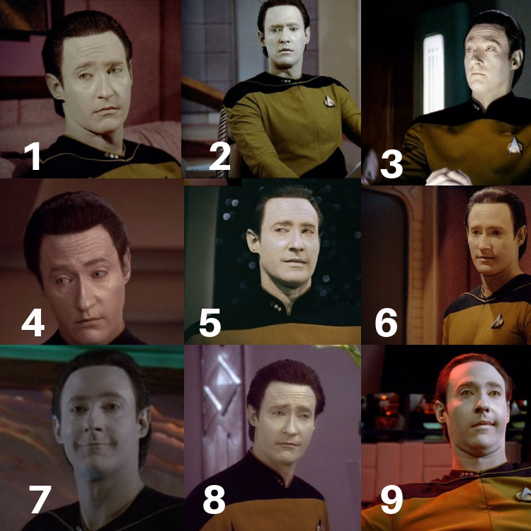{fig-alt="Mr. Data from Start Trek with several faces" fig-align="center"}

## P-hacking

> the misuse of data analysis to find patterns in data that can be presented as statistically significant, thus dramatically increasing and understating the risk of false positives. This is done by performing many statistical tests on the data and only reporting those that come back with significant results. – Wikipedia (<https://en.wikipedia.org/wiki/Data_dredging>)

> "P-hacking; it is also known as data-dredging, snooping, fishing, significance-chasing and double-dipping. “P-hacking,” says Simonsohn, “is trying multiple things until you get the desired result” — even unconsciously." -- Nuzzo. “Scientific method: Statistical errors. Nature

## 

[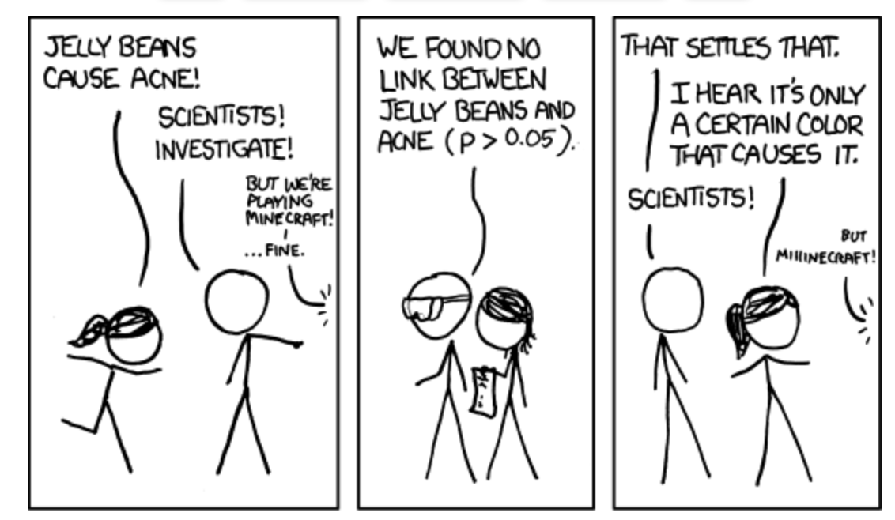{alt="So, uh, we did the green study again and got no link. It was probably a-- \"RESEARCH CONFLICTED ON GREEN JELLY BEAN/ACNE LINK; MORE STUDY RECOMMENDED! From: https://xkcd.com/882/\"." fig-alt="Comic about data dredging (aka p-hacking)" fig-align="center"}](https://xkcd.com/882/)

## 

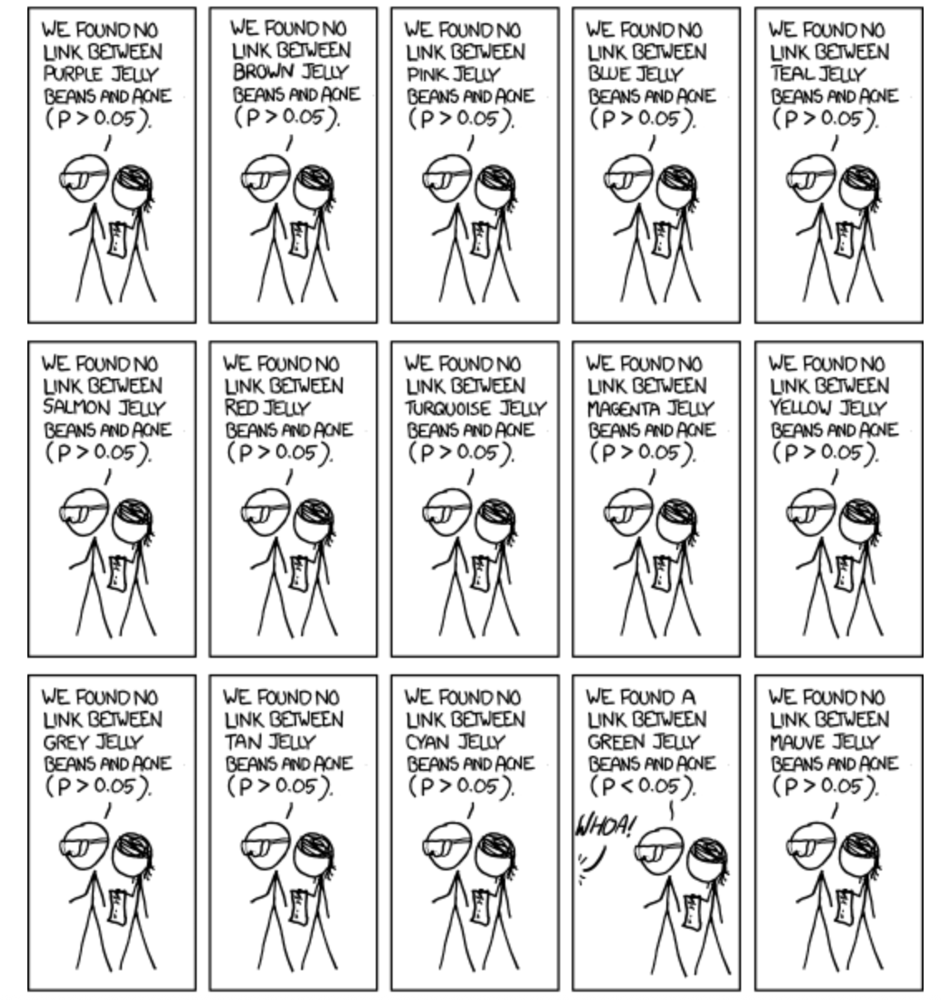{fig-alt="part 2 of same comic" fig-align="center" width="499"}

## 

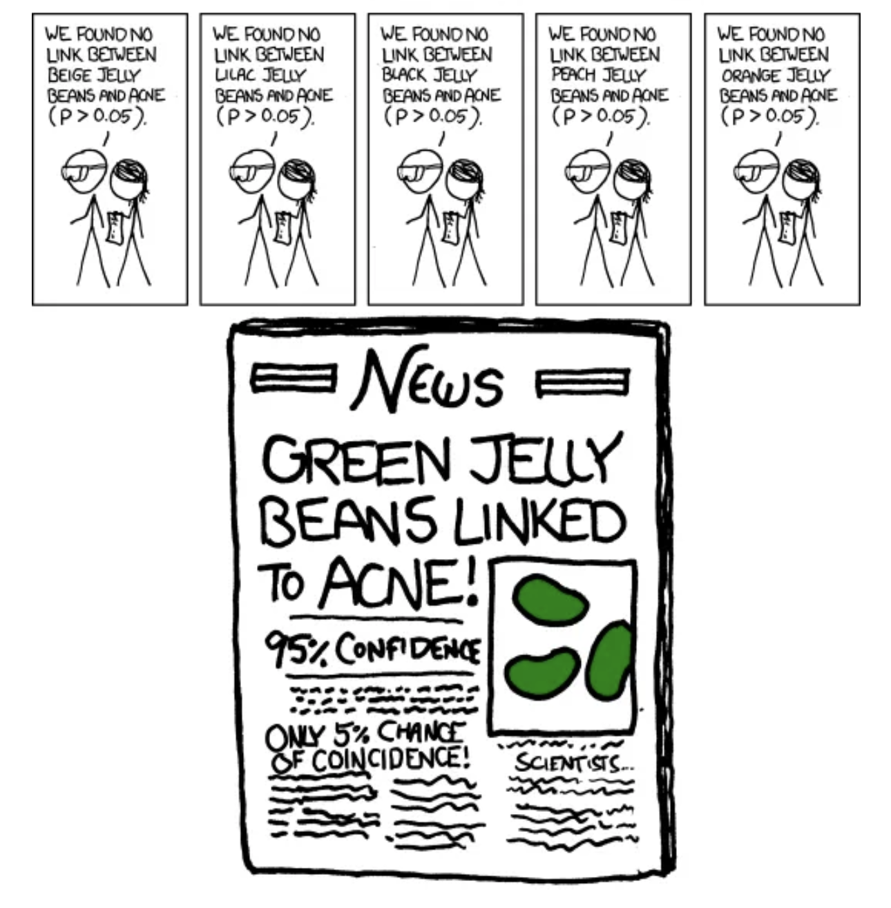{fig-align="center" width="753"}

## The multiple testing problem

When conducting multiple hypothesis tests simultaneously, we increase the probability of false positives (Type I errors).

. . .

Suppose we perform $n$ independent hypothesis tests, each with a signif. level $\alpha$.

The probability of making *at least one* Type I error (false positive) is:

$$P(\text{at least one false positive})=1−(1−\alpha)^n$$

This probability is known as Family-wise error rate (FWER).

There are two groups of approaches to deal with this:

1)  controlling the family-wise error rate (FWER)

2)  controlling the false discovery rate (FDR)

-   Both quantify the risks of multiple testing but in different ways.
-   Both have strengths and weaknesses but first I want to show you how they are different.

## FWER

> FWER is a metric that quantifies the risk caused by multiple testing. It's the probabilityof making [one or more]{.underline} false discoveries (type I errors) when performing multiple hypotheses tests.

::::: columns
::: {.column width="50%"}
[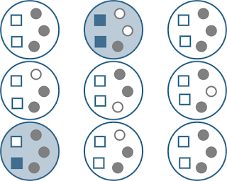{fig-alt="https://www.serjeonstats.com/2017/05/family-wise-error-vs-false-discovery.html" fig-align="center"}](https://www.serjeonstats.com/2017/05/family-wise-error-vs-false-discovery.html)
:::

::: {.column width="50%"}
Large circles: sets of tests corrected for family-wise error. Small squares are null effects, small circles are real effects. Filled circles and squares represent rejections of the null hypothesis ("positives"). Two studies (filled large circles) produced one or more Type I errors (filled blue squares). Thus, $FWER=2/9=0.22$.
:::
:::::

::: notes
Answer: 2/9. If you control the FWER at .05, then in at least 95% of your studies, all of the significant results will be from true effects. In the other 5% of your experiments, one or more of the effects will represent Type I errors. Putting this another way, 5% of your families of tests will produce Type I errors. (This does not mean that 5% of the null effects will produce Type I errors, or that 5% of your effects are really nulls.)
:::

## FDR

> Simply put, $FDR = FP / (FP + TP)$, where $FP$: false positive; $TP$: true positive.

::::: columns
::: {.column width="50%"}
[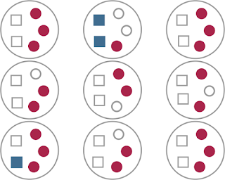{fig-alt="https://www.serjeonstats.com/2017/05/family-wise-error-vs-false-discovery.html" fig-align="center"}](https://www.serjeonstats.com/2017/05/family-wise-error-vs-false-discovery.html)
:::

::: {.column width="50%"}
These are the same 'data' depicted in the first figure, but highlighting the information relevant to FDR. We have a total of 24 null rejections/significant effects (filled squares and circles), of which 3 are Type I errors (filled blue squares). So $FDR=3/24=0.125$
:::
:::::

## Controlling FWER and FDR

**Controlling FWER:** ensures that no more than $100\times \alpha\%$ of your *studies* will produce *any* ($\geq1$) Type I errors. One way ( the most common) to do that is through the Bonferroni correction, which we saw last time.

**Controlling FDR:** ensures, that across your statistical tests, at most $\alpha\%$ of your significant results are really Type I errors. One way to correct for FDR (and the most common) is the Benjamin–Hochberg procedure (BH).

## FWER and FDR takeaways

-   FDR will generally produce more Type I errors, but buys you more power (produces fewer Type II errors).
-   Choosing between the two approaches always involves a trade-off between avoiding type I errors at the cost of reduced power.

. . .

[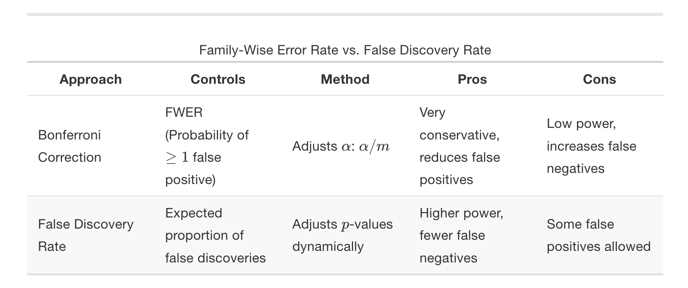{fig-alt="Table showing FDR vs FWER and their correction methods." fig-align="center" width="410"}](https://bookdown.org/mike/data_analysis/sec-false-discovery-rate.html#sec-false-discovery-rate)

## Recommendations

::::: columns
::: {.column width="50%"}
Use FDR correction when:\

-   You perform many hypothesis tests (e.g., genomics).

-   You want to balance false positives and false negatives.

-   Bonferroni is too strict, leading to low power.
:::

::: {.column width="50%"}
Do NOT use FDR correction if:

-   Strict control of any false positives is required (e.g., drug approval studies).

-   There are only a few tests, in which case Bonferroni is appropriate.
:::
:::::

-   In either case, always report your p-values as they are (e.g., $p=0.0312$ instead of $p<0.05$). If using corrected p-values to assess significance, make sure you say that clearly.
-   The `p.adjust()` function from base R performs both and also other types of corrections defined by the argument `methods`.

## P-values: Q & A

**Q: Can P values be negative?** No. P values are fractions, so they are always between 0.0 and 1.0.

**Q: Can a P value equal 1.0?** A P value would equal 1.0 only in the rare case in which the treatment effect in your sample precisely equals the one defined by the null hypothesis. When a computer program reports that the P value is 1.0000, it often means that the P value is greater than 0.9999.

**Q: Should P values be reported as fractions or percentages?** By tradition, P values are always presented as fractions and never as percentages.

**Q: Is a one-tailed P value always equal to half the two-tailed P value?** Not always. Some sampling distributions are asymmetrical. Even if the distribution is symmetrical (as most are), the one-tailed P value is only equal to half the two-tailed value if you correctly predicted the direction of the difference (correlation, association, etc.) in advance. If the effect actually went in the opposite direction to your prediction, the one-tailed P will be \>0.5 and greater than the two-tailed P value.

## PHILOSOPHICAL/HISTORICAL DIGRESSION {.dark-theme}

[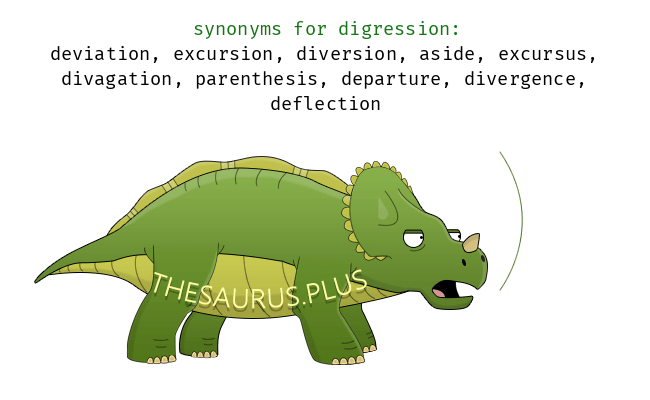{fig-align="center" width="222"}](https://thesaurus.plus/synonyms/digression)

## P-values are not very reproducible

A reasonable definition of the P value is that it measures the strength of evidence against the null hypothesis. However, unless statistical power is very high (\>90%), the P value does not do this reliably.

. . .

::::: columns
::: {.column width="40%"}
[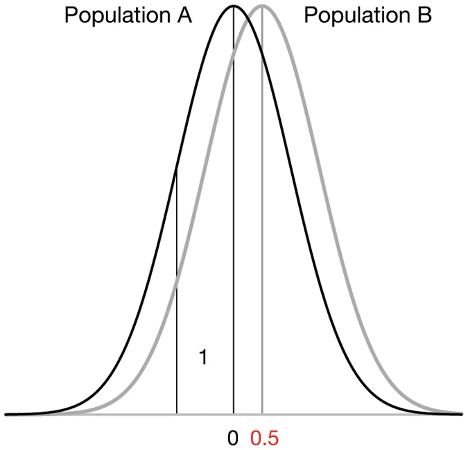{fig-alt="Shows two normal distributions. The difference between the mean values is 0.5, which is the true (population) effect size. The standard deviation (the spread of values) of each population is 1." width="247"}](https://www.nature.com/articles/nmeth.3288)
:::

::: {.column width="60%"}
[{fig-alt="We drew samples of ten values at random from each of the populations A and B from Figure 1 to give four simulated comparisons. Horizontal lines denote the mean. We give the estimated effect size (the difference in the means) and the P value when the sample pairs are compared."}](https://www.nature.com/articles/nmeth.3288#Sec1)
:::
:::::

::: aside
From: Halsey, L., Curran-Everett, D., Vowler, S. et al. (2015) The fickle P value generates irreproducible results. Nat Methods 12, 179–185. https://doi.org/10.1038/nmeth.3288
:::

## Mistake: believing that statistical hypothesis is an essential part of statistical analyses

| Approach | Questions Answered |
|---------------------------|---------------------------------------------|
| Confidence Interval | What range of true effect is consistent with the data? |
| P-value | What is strength of the evidence that the true effect is not zero? |
| Hypothesis Test | Is there enough evidence to make a decision based on a conclusion that the effect is not zero? |

## Mistake: believing that statistical hypothesis is an essential part of statistical analyses

-   In many scientific situations, it is not necessary - and even counterproductive - to reach an all or nothing conclusion that a result is either statistically significant or not
-   With P-values and CIs you can assess the scientific evidence without ever using the phrase "statistically significant"
-   Stargazing: the process of over-emphasizing statistical significance.
-   “Significosis”: a dreadful condition that leads afflicted individuals to fail to identify that just because something is unlikely to have occurred by chance doesn’t mean it’s important/relevant
-   When reading the scientific literature, focus instead on the size of the association (difference, correlation etc) and its CI

## Why P-values are confusing

::: incremental
-   P-values are often misunderstood because they answer a question that you never thought to ask.

-   In many situations, you know before collecting any data that the null hypothesis is almost certainly false.The difference or correlation or association in the overall population might be trivial, but it almost certainly isn’t zero.

-   The null hypothesis is usually that in the populations being studied there is zero difference between the means, zero correlation, etc.

-   People rarely conduct experiments or studies in which it is even conceivable that the null hypothesis is true.

-   Clinicians and scientists find it strange to calculate the probability of obtaining results that weren’t actually obtained. The math of theoretical probability distributions is beyond the easy comprehension of most scientists.
:::

::: aside
Credit: This slide uses materials from the textbook Intuitive Biostatistics, Motulsky, 4th edition
:::

## History of statistics

-   Modern statistics was in many ways an offshoot of evolutionary biology
-   A lot of the methods used in frequentist statistics stem from Francis Galton, Karl Pearlson, and Ronal Fisher

## Francis Galton

-   Studied correlations between parents/offspring for quantitative traits - height, weight, a measure of “intelligence” (later known as IQ test)
-   The earliest challenge for the application of eugenics was to encourage marriages between individuals of presumed high intellectual calibre — something unacceptable as an official policy in most modern societies
-   This original meaning was a very different concept (although historically intertwined) with what later became the Nazi policy

## Ronald Fisher

-  UK statistician/eugenicist/geneticist who created many of the tools we use in statistics
- Fisher became enthusiastic about the potential for eugenics based on Mendelian inheritance 
- He founded the Cambridge University Eugenics Society
- In 1918 this became a highly influential paper in population genetics: *"The correlation between relatives on the supposition of Mendelian inheritance"*.  
- Proposed “voluntary sterilization” should be a legislation in the UK. It was not approved. 


::: aside
From: https://evolution-institute.org/ronald-fisher-is-not-being-cancelled-but-his-eugenic-advocacy-should- have-consequences/ Bodmer et al. (2021) https://doi.org/10.1038/s41437-020-00394-6
:::

## R. Fisher (cont.)

- Fisher’s primary concern was the genetic future of England should elite members of society (by which he included himself) fail to reproduce at the same level as the poor. 
- Fisher advocated against birth control and called on the government to provide economic subsidies – what he referred to as family allowances – for those of high talent and ability commensurate with the number of children they produced.


::: aside
From: https://evolution-institute.org/ronald-fisher-is-not-being-cancelled-but-his-eugenic-advocacy-should- have-consequences/ Bodmer et al. (2021) https://doi.org/10.1038/s41437-020-00394-6
:::

## Is $\alpha$ (Somewhat) Arbitrary?

::: columns

::: {.column width="70%}


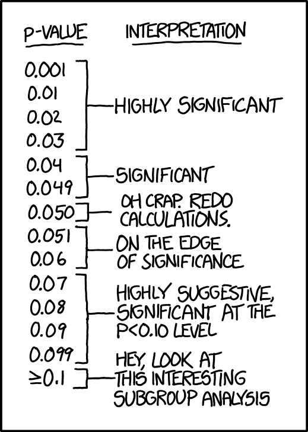{fig-alt="Funny comic about arbitrary significance thresholds in hypothesis testing."}

:::

::: {.column width="30%}
“If all else fails use significance at the $\alpha=0.05$ level and hope no one notices”. https://xkcd.com/1478/

:::
:::

## Yes {.dark-theme .center}

## The P-value was created with the goal of encouraging a closer look

-   R. Fisher:Invented the P-value 100 years ago
-   R. Fisher’s goal: give one a sense of how likely (or unlikely) a given set of “results” would be to be generated by pure chance. It’s a reality check in a sense.
-   He did NOT propose them as definitive criteria.

::: aside
Regine Nuzzo (2014). Scientific Method: Statistical Errors, Nature News
:::

## Why $\alpha=0.05$?

> The value for which P=0.05, or 1 in 20 … is convenient to take this point as a limit in judging whether a deviation ought to be considered significant or not…”

> “If one in twenty does not seem high enough odds, we may … draw the line at one in fifty …, or one in a hundred…. *_Personally, the writer prefers to set a low standard of significance at the 5 per cent point, and ignore entirely all results which fail to reach this level_*.”

> It is usual and convenient for experimenters to take 5 per cent as a standard level of significance, in the sense that they are prepared to ignore all results which fail to reach this standard, and, by this means, to eliminate from further discussion the greater part of the fluctuations which chance causes have introduced into their experimental results. — R.A Fisher (statistician/eugenicist/geneticist)

## But why did everyone else for the next 100 years keep using $\alpha=0.05$

Ok, I am exagerating, but you get the point.

::::: columns
::: column
-   While Fisher’s competitors proposed other things like CIs
-   …people with less statistical knowledge started using this as the ultimate criterium
:::

::: column
[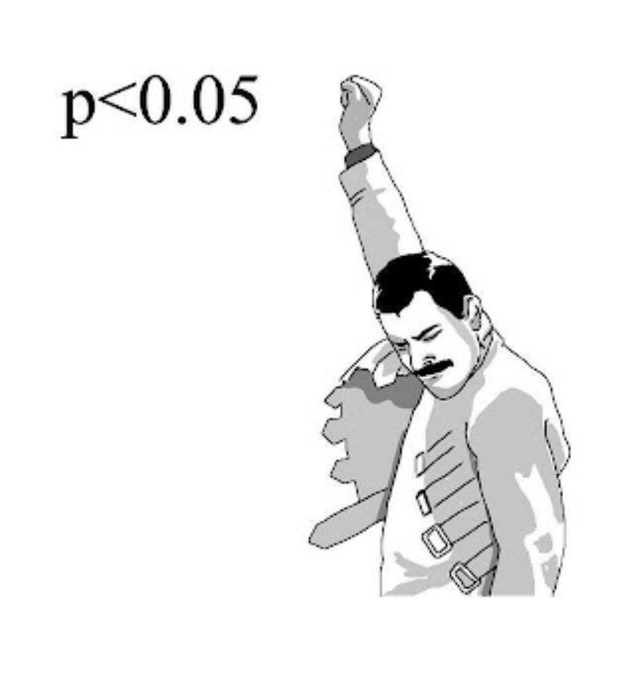{fig-alt="Freddie Mercury apparently feeling very accomplished by a p<0.05"}](https://notawfulandboring.blogspot.com/)
:::
:::::

## Two philosophical views of P-value

**1) Absolutists**

> “Every time you say ‘trending towards significance’, a statistician somewhere trips and falls down.” -- someone on twitter

Consider statistics with nuance (e.g. “nearly statistically significant”) a sin

Reject things like declaring a P-value much smaller than 0.05 “highly significant”

::::: columns
::: column
**Strengths:**

-   Strengths: Forces decision about the strength of evidence that one’s looking for before you see the results of your analysis
-   Prevents change of criteria after the test
:::

::: column
**Weaknesses**

-   Is $P=0.052$ different from $P=0.048$?
-   Why is $0.05$ enough to reject the null but no $0.051$?
-   Risk of P hacking
:::
:::::

::: aside
From: http://notawfulandboring.blogspot.com/
:::

## Two philosophical views of P-value

**2) Continualists**

Consider the job of the P-value is to express the strength of evidence against the null hypothesis

Reasoning: P-values as continuous variables that are prone to sampling error. If strength of evidence is continuous (rather than binary), our inferential conclusions should be too

Report p-values (usually with CIs of sample statistic) and let reader interpret based on their level of skepticism.

::::: columns
::: {.column width="60%"}
**Strengths**

-   Sees P-value as subject to sampling error (which it is!)

-   Recognizes and distinguishes between results that provide weak evidence, moderate evidence, and strong evidence against the null.
:::

::: {.column width="40%"}
**Weaknesses**

-   Harder to remain objective and skeptical when one can keep looking for “trends”
:::
:::::

As always, there is a trade-off. Just don't change strategies after you run your tests.

## END OF DIGRESSION {.dark-theme .center}

## Hypothesis Testing: Key Points {visibility="hidden"}

-   We test hypotheses about populations from sample estimates.
-   A P-Value is the probability that a boring population would generate a sample estimate as or more extreme than we observe.
-   We reject the null hypothesis when this probability is low & fail to reject it otherwise.
-   Hypothesis testing can go wrong: We can reject true nulls and fail to reject false ones.
-   Hypothesis testing requires extreme care.

## 

{fig-alt="Forrest says \"And that's all I wanted to say about that\"" width="347"}
