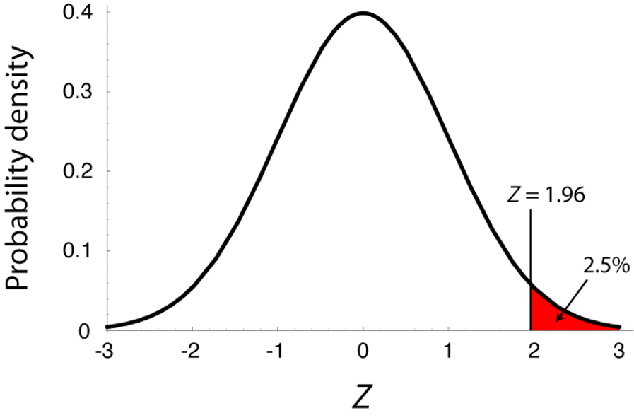
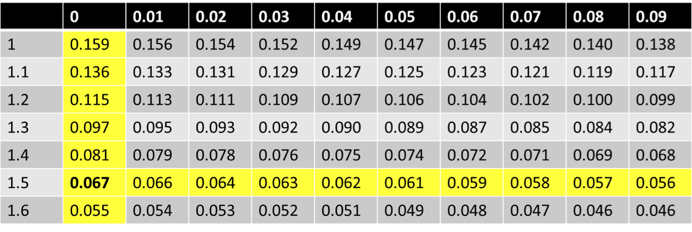

```{r setup, include=FALSE}
knitr::opts_chunk$set(collapse=T)
library(tidyverse)
library(forcats)
library(dplyr)
library(ggplot2)
library(ggforce)
library(tidyr)
library(stringr)
library(knitr)
library(ggthemes)
library(wesanderson)
library(gt)
library(RColorBrewer)
library(plotly)
library(readr)
library(thematic)
library(infer)
library(kableExtra)
library(gridExtra)
library(emoGG)
library(emo)
library(ggmosaic)

gg_color_hue <- function(n) {
  hues = seq(15, 375, length = n + 1)
  hcl(h = hues, l = 65, c = 100)[1:n]
}
source("bb_theme.R")
options(digits = 3)

# set the themeb_theme()
theme_set(bb_theme())

birds_original <- data.frame(Age = c("Old","Young","Old", "Young"),
                      Species = c("Junco", "Junco", "Finch", "Finch"),
                      Number = c(4, 7, 9, 9))
nhl <- tibble( month = c("Jan", "Feb", "Mar", "Apr", "May", "June", "Jul", "Aug", "Sep", "Oct", "Nov", "Dec"),
        month.num = 1:12,
        births = c(133, 125, 114, 119, 119, 123, 96, 91, 83, 84,73,85)) |> 
  mutate(month = fct_reorder(.f = month, .x = month.num,.desc = TRUE))


human_births<-tibble( month = c("Jan","Feb","Mar","April","May",
                                "June","Jul","Aug","Sept","Oct","Nov","Dec"),
                             `births (%)`  = 100*c(Jan = 0.0794, Feb = .0763, Mar = .0872,
                              April = .0863, May = .0895, June = .0857, Jul = .0876,
                              Aug = .085, Sept =  .0854, Oct = .0819, Nov = .0770,
                              Dec = .0787) )

lousy.fish <- tibble(num_parasites = 0:9, num_fish = c(103, 72, 44, 14, 3, 1, 1,0,0,0)) 
fish.sum   <- lousy.fish |> summarise(total_fish = sum(num_fish), 
                                       total_parasites = sum(num_fish* num_parasites))

births<-tibble( month = c("Jan","Feb","Mar","April","May","June","Jul","Aug","Sept","Oct","Nov","Dec"),
        `births (%)`  = 100*c(Jan = 0.0794, Feb = .0763, Mar = .0872, April = .0863, May = .0895, June = .0857, Jul = .0876, Aug = .085, Sept =  .0854, Oct = .0819, Nov = .0770, Dec = .0787) ) 

birth.weight <- data.frame( weight = seq(.25,14.75,.25) , 
                            count = c(0,0,1,9,5,8,17,25,12,20,21,27,
                                      28,33,24,57,65,98,107,161,189,
                                      310,393,611,837,1096,1273,1682,
                                      1684,1814,1520,1681,1220,1028,
                                      718,702,385,294,173,135,69,36,
                                      29,24,9,4,7,3,0,0,0,0,0,0,0,1,
                                      0,0,0))
mean.birth <- with(birth.weight, sum(weight * count)/sum(count))
sdev.birth <- with(birth.weight, sd(rep(weight , count)))
norm.birth <- dnorm(birth.weight$weight, mean = mean.birth, sdev.birth)
norm.birth <- (norm.birth/sum(norm.birth)) * sum(birth.weight$count)

temp.data<- read_delim("data/temp_data.txt",
                       col_names = FALSE,delim = "    ")%>% 
  dplyr::mutate(X1 = as.numeric(X1), X3 = as.numeric(X3), X2 = dplyr::case_when(X2 == 1~"male", X2 == 2~"female")) %>% 
  dplyr::select(temp = X1, gender = X2, heart_rate = X3) %>% na.omit()

temp.data.hist <- hist(temp.data$temp, breaks = seq(96,101,.3), plot=FALSE)
mean.temp <- mean(temp.data$temp)
sdev.temp <- sd(temp.data$temp)
norm.temp <- dnorm(temp.data.hist$mids, mean = mean.temp, sd = sdev.temp)
norm.temp <- (norm.temp/sum(norm.temp)) * length(temp.data$temp)
temp.data <- data.frame(temp = temp.data.hist$mids, count = temp.data.hist$counts)


egg.data <- c(5308, 3908, 5093, 5519, 3467, 5526, 5594, 8824, 5931, 
              3665, 4739,5587, 4735, 5350, 4851, 4726, 5912, 5852, 
              4410, 3838, 6317, 6059, 5790, 5786, 6418, 6363, 4309, 
              4861, 4477, 6182, 6133, 6819, 4727, 6370, 5757, 7232, 
              7368, 6757, 6959, 4323, 6708, 5171)
egg.data.hist <- hist(egg.data, breaks = seq(0,10000,500), plot=FALSE)
mean.egg <- mean(egg.data)
sdev.egg <- sd(egg.data)
norm.egg <- dnorm(egg.data.hist$mids, mean = mean.egg, sd = sdev.egg)
norm.egg <- (norm.egg/sum(norm.egg)) * length(egg.data)
egg.data <- data.frame(number_eggs = egg.data.hist$mids, count = egg.data.hist$counts)
mean.birth <- with(birth.weight, sum(weight * count)/sum(count))
sdev.birth <- with(birth.weight, sd(rep(weight , count)))
norm.birth <- dnorm(birth.weight$weight, mean = mean.birth, sdev.birth)
norm.birth <- (norm.birth/sum(norm.birth)) * sum(birth.weight$count)

temp.data<- read_delim("http://jse.amstat.org/datasets/normtemp.dat.txt",
                       col_names = FALSE,delim = "    ")%>% 
  dplyr::mutate(X1 = as.numeric(X1), X3 = as.numeric(X3), X2 = dplyr::case_when(X2 == 1~"male", X2 == 2~"female")) %>% 
  dplyr::select(temp = X1, gender = X2, heart_rate = X3) %>% na.omit()

temp.data.hist <- hist(temp.data$temp, breaks = seq(96,101,.3), plot=FALSE)
mean.temp <- mean(temp.data$temp)
sdev.temp <- sd(temp.data$temp)
norm.temp <- dnorm(temp.data.hist$mids, mean = mean.temp, sd = sdev.temp)
norm.temp <- (norm.temp/sum(norm.temp)) * length(temp.data$temp)
temp.data <- data.frame(temp = temp.data.hist$mids, count = temp.data.hist$counts)


egg.data <- c(5308, 3908, 5093, 5519, 3467, 5526, 5594, 8824, 5931, 
              3665, 4739,5587, 4735, 5350, 4851, 4726, 5912, 5852, 
              4410, 3838, 6317, 6059, 5790, 5786, 6418, 6363, 4309, 
              4861, 4477, 6182, 6133, 6819, 4727, 6370, 5757, 7232, 
              7368, 6757, 6959, 4323, 6708, 5171)
egg.data.hist <- hist(egg.data, breaks = seq(0,10000,500), plot=FALSE)
mean.egg <- mean(egg.data)
sdev.egg <- sd(egg.data)
norm.egg <- dnorm(egg.data.hist$mids, mean = mean.egg, sd = sdev.egg)
norm.egg <- (norm.egg/sum(norm.egg)) * length(egg.data)
egg.data <- data.frame(number_eggs = egg.data.hist$mids, count = egg.data.hist$counts)
```

## Key Learning Goals {visibility="hidden"}

-   Recognize that the normal distribution is common in nature (and
    why).
-   Know how to parameterize a normal distribution.
-   Know how to use the standard normal table & conduct a
    Z-transformation.
-   Find the probability that a sample mean is within a given range.
-   Explain the central limit theorem and its significance.
-   Describe the difference between the standard normal distribution - Z
    -, and the t-distribution.
-   Use the t-distribution to find the 95% confidence interval for a
    sample from the normal distribution.
-   Test the null hypothesis that a sample mean comes from a population
    with some parameter value using a one-sample t-test
-   Know how to carry out a one-sample t-test and when it is indicated.

## Key Learning Goals (in R) {visibility="hidden"}

1.  Transform non normal data to become normal

2.  Use the `_norm()` family of functions to:

-   simulate random numbers from a normal distribution - `rnorm()`
-   calculate the probability density of an observation from a specified
    normal distribution - `dnorm()`
-   calculate the probability of finding a value more extreme than some
    number of interest from a specified normal distribution - `pnorm()`

3.  find a specified quantile of a normal distribution with - `qnorm()`

## Outline

-   Getting to know the normal distribution
-   Sums are normally distributed
-   The Normal distribution in nature
-   Discrete vs continous probability distributions
-   Probability mass vs probability density
-   Normal distribution: definitions & properties
-   Using R to calculate a probability density
-   The standard Normal distribution
-   The Z distribution

## Get to know the normal distribution

-   The normal distribution (aka the **“bell curve”**, aka the
    **Gaussian**) is incredibly common in the world!
-   It is also mathematically convenient.
-   Therefore, much of statistics is based off of the normal
    distribution.

## Sums are normally distributed

Because most quantitative variables are sums (or averages) of a bunch of
things, the normal distribution is incredibly common!

For example:

-   Human height is realized as the addition of lot of genetic effects
    and a lot of environmental factors.
-   The distance a seed moves is the sum of a lot of wind currents.

## But WHY???

Why that distribution? Why is it special? Why not some other
distribution? Are there other statistical distributions where this
happens?

Teaser: yes, there are other distributions that are special in the same
way as the Normal distribution. The Normal distribution is still the
most special because:

1.  it requires the least math
2.  it is the most common in real-world situations -e.g. biology!
3.  notable exception: the stock market

-   The full answer has to do with the central limit theorem - SOON!

## Examples: The Normal Distribution in Nature {.dark-theme .center}

## Human Birth weight

-   Birth weight is (roughly) normally distributed

```{r birthw, echo=FALSE}
ggplot(data = birth.weight, aes(x = weight, y = count)) + 
  geom_bar(stat = 'identity', fill = "#D55E00") +
  theme_classic()             +
  scale_y_continuous(expand = c(0, 0)) + 
  labs(title = "Distribution of human birth weight") +
  xlab("Birth weight (lbs)")+
  geom_line( aes(x = weight, y = norm.birth ), colour = "#6C8645" ,lwd=1.5 )+
  annotate(geom = "text", label= "observed", x = 13, y = 1500, size = 5, col = "#D55E00") + 
  annotate(geom = "text", label= "normal prediction", x = 13, y = 1300, size = 5, col = "#6C8645") +
  annotate(geom = "text", label= sprintf("mean = %s", round(mean.birth,digits=2)), x = 13, y = 1100, size = 5) + 
  annotate(geom = "text", label= sprintf("s = %s", round(sdev.birth,digits=2)), x = 13, y = 900, size = 5) +
  theme_tufte()             +
  bb_theme()
#geom_vline(xintercept = mean.birth, lwd = 1.5, lty =2)
```

::: aside
[Data:Pethybridge et al.
(1974).](http://www.ncbi.nlm.nih.gov/pmc/articles/PMC478809/pdf/brjprevsmed00013-0013.pdf)
"Some features of the distribution of birthweight of human infants"
:::

## Human body temperature

-   Body temp is (roughly) normally distributed

```{r temp, echo=FALSE}
ggplot(data = temp.data, aes(x = temp, y = count)) + 
  geom_bar(stat = 'identity', fill = "#D55E00") +
  labs(title = "Distribution of human body temperature") +
  xlab(label = "body temp \n(Fahrenheit)") +
  geom_line( aes(x = temp, y = norm.temp ), colour = "#6C8645", lwd = 1.5  )+
  annotate(geom = "text", label= "observed", x = 100, y = 23, size = 5, col = "#D55E00") + 
  annotate(geom = "text", label= "normal prediction", x = 100, y = 20, size = 5, col = "#6C8645") +
  annotate(geom = "text", label= sprintf("mean = %s", round(mean.temp,digits=2)), x = 100, y = 17, size = 5) + 
  annotate(geom = "text", label= sprintf("s = %s", round(sdev.temp,digits=2)), x = 100, y = 14, size = 5) +
  theme_tufte()             +
  bb_theme()
```

::: aside
[Data: Shoemaker
(1996).](http://www.amstat.org/publications/jse/v4n2/datasets.shoemaker.html)"What's
Normal? -- Temperature, Gender, and Heart Rate"
:::

## Drosophila egg number

-   *Drosophila* egg number is (roughly) normally distributed

```{r dros, echo=FALSE}
ggplot(data = egg.data, aes(x = number_eggs, y = count)) + 
  geom_bar(stat = 'identity', fill = "#D55E00") +
  theme_classic()             +
  labs(title = "Distribution of fly egg number") +
  xlab("Egg number")+
  geom_line( aes(x = number_eggs, y = norm.egg ), colour = "#6C8645" , lwd = 1.5 )+
  annotate(geom = "text", label= "observed", x = 9000, y = 8, size = 5, col = "#D55E00") + 
  annotate(geom = "text", label= "normal prediction", x = 9000, y = 6.5, size = 5, col = "#6C8645") +
  annotate(geom = "text", label= sprintf("mean = %s", round(mean.egg,digits=0)), x = 9000, y = 5, size = 5) + 
  annotate(geom = "text", label= sprintf("s = %s", round(sdev.egg,digits=0)), x = 9000, y = 3.5, size = 5) +
  theme_tufte()             +
  bb_theme()
```

::: aside
[Paaby et al
(2014).](http://onlinelibrary.wiley.com/doi/10.1111/evo.12546/abstract%22)
"A highly pleiotropic amino acid polymorphism in the *Drosophila*
insulin receptor contributes to life-history adaptation"
:::

## The Normal Distribution: Definitions & Properties {.dark-theme .center}

## Recap: Discrete probability distributions {visibility="hidden"}

-   The binomial distribution is a **discrete distribution**
-   We can write down every possible outcome (zero success, one success,
    etc… $n$ successes) and calculate its probability. Adding these up
    will sum to one

$$\sum p_{x}=1$$ \* Probabilities of these possible outcomes (those
which sum to one within discrete distributions) are called probability
masses. \* E.g. the probability of heads on a coin toss is called its
**probability mass**.

## Recap: Continuous probability distributions

-   The probability of any one outcome from a **continuous
    distribution**, like the **normal distribution**, is
    *infinitesimally small* because there are infinite numbers in any
    range.
-   We therefore describe continuous distributions with **probability
    densities**.
-   Probability densities **integrate to one:** $$\int p_{x}=1$$

## Warning: integrals! Don't panic, you don't need to integrate anything {.dark-theme .center}

## The Normal Probability Density (1/)

-   The probability density of each value $x$ from a normal distribution
    with mean $\mu$ and variance $\sigma^2$ is:

$$f[x]=\frac{1}{\sqrt{2\pi\sigma^2}}e^{-\frac{(x-\mu)^2}{2\sigma^2}}$$
\* Thus, across sample space, probability densities integrate to 1,
meaning

$$\int_{-\infty}^{+\infty}\frac{1}{\sqrt{2\pi\sigma^2}}e^{-\frac{(x-\mu)^2}{2\sigma^2}}=\int_{-\infty}^{+\infty}f(x)dx=1$$
, meaning the integral of the PDF (probability density function) over
its entire range integrates to 1.

## Concept check in (1/2)

-   This normal distribution has points with a probability density \> 1.
-   We know that probabilities cannot be greater than 1, so how can this
    be the case?

```{r concept, echo=F}
ggplot(tibble(x=seq(-1,1,.001), prob_density = dnorm(x, mean = 0,sd = .21)), 
       aes(x = x, y = prob_density)) + 
  geom_density(stat = "identity", fill = "#D55E00", alpha = .6) + 
  scale_y_continuous(expand = c(0, 0)) + 
  #labs(title = expression(paste(mu, "=0, ", sigma, "=1"))) + 
  ylab(label = "Probability\ndensity")  +
  theme_tufte()             +
  bb_theme()
```

## Concept check in (2/2)

-   Answer: prob. densities integrate to one, aka the area under the
    curve, corresponding to probabilities. (i.e., $\int p_{x}=1$).
    Individual probability densities can exceed 1 though.
-   Does this mean probability densities can be \<1?
-   Answer: No!The probability density function is non-negative for all
    possible values of the random variable. The total area under the
    probability density function is equal to 1.

## Parameters of the Normal Distribution (1/2)

$N(\mu, \sigma^2)$: These parameters - mean and variance (or standard
deviation, $\sigma$) - fully specify a normal distribution

$X\sim N(\mu, \sigma)$: $X$ is normally distributed and the distribution
is specified by a mean $\mu$ and a standard deviation $\sigma$

## Parameters of the Normal Distribution (2/2)

-   $X\sim N(\mu, \sigma)$: $X$ is normally distributed; normal is
    specified by $\mu$ and $\sigma$

```{r, dens2, echo=F, eval=requireNamespace("ggplot2", quietly=TRUE),warning=FALSE, fig.height=3.5}
set.seed(123)
x1 <- data.frame(v1=rnorm(300000,0,1), v2=rnorm(300000, -5, 2))
p1<-ggplot(x1, aes(x=v1)) +
  geom_density(aes(y=after_stat(density)), 
               colour="black", fill="#046C9A", 
               alpha=0.4, linewidth=1.5)+
  labs(y="Probability density",x="X")+ ylim(0,0.5)+
  ggtitle(paste0("Normal distribution with mean 0 and sd 1"))
p1 + bb_theme()
```

## Visualizing Probability Densities

```{r dens, echo=F, eval=requireNamespace("ggplot2", quietly=TRUE),warning=FALSE}
set.seed(123)
x1 <- data.frame(v1=rnorm(300000,0,1), v2=rnorm(300000, -5, 2))
library(reshape2)
x2<-melt(x1)
expr1<-latex2exp::TeX("$N(0,1)$")
expr2<-latex2exp::TeX("$N(-5,2.5)$")
p3<-ggplot(x2, aes(x=value, group=variable, color=variable, fill=variable)) +
  geom_density(aes(y=after_stat(density)), colour="black",alpha=0.4, linewidth=1.5)+
  labs(y="Probability density",x=quote(X))+ ylim(0,0.5)+
  scale_fill_manual(values=c("#046C9A","#C27D38"))+
  annotate(geom="text", x=3.8, y=0.35, label=expr1, parse=T, size=5, col="#046C9A")+
  annotate(geom="text", x=3.8, y=0.32, label=expression(mu~"=0"), parse=T, size=5, col="#046C9A")+
  annotate(geom="text", x=3.8, y=0.29, label=expression(sigma~"=1"), parse=T, size=5, col="#046C9A")+
  annotate(geom="text", x=-10, y=0.23, label=expr2, parse=T, size=5, col="#C27D38")+
  annotate(geom="text", x=-10, y=0.20, label=expression(mu~"=-5"), parse=T, size=5, col="#C27D38")+
  annotate(geom="text", x=-10, y=0.17, label=expression(sigma~"=2.5"), parse=T, size=5, col="#C27D38")
p3 + bb_theme() + theme(legend.position="none")

```

## A Normal Distribution is symmetric around its mean

```{r dens3,fig.height = 3, fig.width=8, echo=F}
my.mean <- 2;  my.sd <-1
tibble(x = seq(-2,6,length=1000), prob_density = dnorm(x,mean=my.mean,sd=my.sd))  %>%
  ggplot(aes(x=x, y =  prob_density))+
  geom_density(stat = "identity", fill = "#046C9A", alpha = .6) + 
  scale_y_continuous(expand = c(0, 0)) + 
  ylab(label = "Probability\ndensity")  +
  theme_tufte()             +
  scale_x_continuous(labels = NULL)+ 
  geom_vline(xintercept = my.mean, color = "#C27D38")+
  bb_theme()+
  geom_segment(data = tibble(x = c(1,3), y = dnorm(x,mean=my.mean,sd=my.sd)), aes(x=x, xend = 1,y=y, yend = y), size = 1, arrow = arrow(length = unit(0.2, "inches"),ends = "both")) + 
  geom_segment(data = tibble(x = c(1,3), y = dnorm(x,mean=my.mean,sd=my.sd)), aes(x=x, xend = c(1,3),y=y, yend = 0), size = 1, lty = 3)
```


## Properties of the normal

-   The normal is symmetric around its mean
-   The normal has a single mode
-   The probability density is highest exactly at the mean.
-   It follows that the mean, median, and mode are all equal to each
    other for the normal distribution!


## Probability that $X$ falls in a given range (1/2)

-   Probability that $X$ lies between two values, $a$ and $b$:

$$P[a<X<b]=\int_{a}^{b}\frac{1}{\sqrt{2\pi\sigma^2}}e^{-\frac{(x-\mu)^2}{2\sigma^2}}dx$$

Ouch...

## Probability that $X$ falls in a given range (2/2)

-   Some helpful (approximate) ranges:

```{r probx, fig.height=1.8, fig.width=6, echo=FALSE}
tibble(x = seq(-5,5,.001), `66% within 1 sd of mean` = dnorm(x = x), `95% within 2 sd of mean` = dnorm(x = x)) %>%
  gather(key = dist, value = prob_density,-x) %>%
  mutate(z = ifelse(dist == "66% within 1 sd of mean" & x >-1 & x < 1, "c", ifelse(dist == "95% within 2 sd of mean" & x >-2 & x< 2, "b","a"))) %>%
  ggplot(aes(x=x, y =  prob_density, fill = z))+
  geom_density(stat = "identity", alpha = 1, show.legend = FALSE) +
  scale_y_continuous(expand = c(0, 0), limits  = c(0,.45)) +
  ylab(label = "probability\n density")  +
  facet_wrap(~dist)+
  scale_x_continuous(breaks = seq(-4,4,2), labels =
                       c( expression(-4~sigma),  expression(-2~sigma),
                          expression(mu),
                         expression(2~sigma),  expression(4~sigma)))+
  scale_fill_manual(values = c("white","lightblue","lightblue"))+
  theme_minimal()+
  theme(axis.line = element_line(),
        strip.text = element_text(size = 14))
```

-   These are approximations!

# Nerd humor {visibility="hidden"}

```{r nerd,echo=FALSE, eval=T, fig.align='center', fig.width=2, fig.height=1}
knitr::include_graphics("https://imgs.xkcd.com/comics/normal_distribution.png")
```

::: aside
https://imgs.xkcd.com/comics/normal_distribution.png
:::

## Using R to calculate a probability density (1/2) {visibility="hidden"}

-   Like the `dbinom()` function calculates the probability of a given
    observation from a binomial distribution by doing the math of the
    binomial distribution for us...
-   `dnorm()` calculates the probability density of an observation from
    a normal distribution by plugging and chugging through the equation
    shown.

## Using R to calculate a probability density (2/2) {visibility="hidden"}

For example, for `x=0.4` for $N(0.5, 0.01)$, the probability density is:
$f[x]=\frac{1}{\sqrt{2\pi\sigma^2}}e^{-\frac{(x-\mu)^2}{2\sigma^2}}=>f[0.4]=\frac{1}{\sqrt{2\pi0.01}}e^{-\frac{(0.01}{0.02}}\approx 2.42$

`dnorm()` can do this for you!

```{r, eval=T}
#Try this now. Prob[X=4] under X~N(0.5, 0.1)
dnorm(x=0.4, mean=0.5, sd=0.1)
```

-   Warning: `dbinom()` does something similar but because the binomial
    is discrete, it returns an actual probability, whereas `dnorm()`
    returns a probability density!

## The standard normal distribution {.dark-theme .center}

::: r-fit-text
A normal with $\mu=0$ and $\sigma=1$
:::

## One Normal Distribution to Rule Them (1/2)

-   Normal distributions can have distinct values of $\mu$ and $\sigma$
    but must have the same shape.
-   Of the infinite normal distributions, the **standard normal
    distribution** – a normal distribution with $\mu=0$ and $\sigma=1$
    is particularly useful.

## One Normal Distribution to Rule Them (2/2)

```{r lot2, echo=F, eval=requireNamespace("ggplot2", quietly=TRUE),warning=FALSE, fig.height=4}
expr1<-latex2exp::TeX("$N(0,1)$")
p1<-ggplot(x1, aes(x=v1)) +
  geom_density(aes(y=after_stat(density)), 
               colour="black", fill="#046C9A", 
               alpha=0.4, linewidth=1.5)+
  labs(y="Probability density",x="X")+ 
  ggtitle("Normal distribution (with mean=0, sd=1)")+
  annotate(geom="text", x=2.8, y=0.35, label=expr1, parse=T, size=5, col="#046C9A")+
  annotate(geom="text", x=2.8, y=0.32, label=expression(mu~"=0"), parse=T, size=5, col="#046C9A")+
  annotate(geom="text", x=2.8, y=0.29, label=expression(sigma~"=1"), parse=T, size=5, col="#046C9A")
p1+bb_theme()
```

## The $Z$-distribution

The $Z$-distribution describes the probability that a random draw from the
standard normal is greater than a given value.

```{r zdistr}
ggplot(data = tibble(x=seq(0,5,.001), prob_density = dnorm(x, mean = 0,sd = 1), gr1.5 = x>1.5), 
       aes(x = x, y = prob_density, fill = gr1.5)) + 
  geom_density(stat = "identity", alpha = .6,show.legend = FALSE) + 
  scale_y_continuous(expand = c(0, 0), limits = c(0,.45)) + 
  #labs(title = expression(paste(mu, "=0, ", sigma, "=1"))) + 
  ylab(label = "Probability \ndensity")  +
  ggtitle(label = "The standard normal distribution", subtitle=expression(paste(~mu," = ",0,", ",~sigma," = ",1)))+
  scale_fill_manual(values = c("lightgrey","#046C9A"))+ 
  theme_tufte()             +
  annotate(geom = "text",x = 1.5,y=.08,label = "P[X>1.5] = 0.067", color = "#046C9A", alpha = .8,hjust=-.5,size = 6)+
  bb_theme()

```


In `R` `pnorm(x = 1.5, lower.tail = FALSE) =` `r round(pnorm(q = 1.5, lower.tail = FALSE), digits = 3)`
In R: `pnorm(q = 1.5, lower.tail = F)`: 0.0668

## The Standard Normal Table (1/)

-   We use the symbol $Z$ to indicate a variable that has a standard
    normal distribution.
-   The standard normal table: gives the probability of getting a random
    draw from a standard normal distribution greater than a given value

```{r,echo=FALSE, eval=T, fig.align='center', out.width="45%",fig.cap="Figure 10.3-2 from textbook"}

```

## The Standard Normal Table (2/)

-   Rows contain the 1st two digits of Z
-   Columns contain the 3rd digit
-   The value is probability that a random draw from the standard normal
    is $>Z$. E.g. $P(Z>1.5)$

```{r,echo=FALSE, eval=T, fig.align='center', fig.width=2, fig.height=1}

```

## Using the Z distribution

-   The standard normal is symmetric about zero, so:
    $$𝑃[𝑋 < -Z]=P[Z > X]$$, i.e. the probability that a random sample,
    $X$, is less than $-Z$ equals the probability that a random sample
    is greater than $Z$.

-   The normal integrates to one, so:
$$P[X < Z]=1 − P[X > Z]$$, i.e. the
    probability that a random sample is less than $Z$ equals one minus
    the probability that a random sample is greater than $Z$.

## The Z transform

-   Any normal distribution can be **converted** to the standard normal
    distribution by subtracting the population mean $\mu$ from each
    value and dividing by the population standard deviation $\sigma$:

$$Z=\frac{X-\mu}{\sigma}$$ \* E.g., by a $Z$ transform, a value of $X=0.4$
from a normal distribution with $\mu=0.5$ and $\sigma=0.1$ will be
$\frac{0.4-0.5}{0.1}=\frac{-0.1}{0.1}=-1$

::: aside
Z is called a "standard normal deviate"
:::

## Why use the Z transform?

-   The $Z$ transform is useful because we can then have a simple way to
    talk about results on a **common scale**.
-   I think of a $Z$ value as the number of standard deviations between an
    observation and the population mean.

$$Z=\frac{X-\mu}{\sigma}$$ 

- The benefits are similar to using the CV
to compare standard deviations across different scales

-   The other advantage: the standard Normal table

## Example: British spies {.dark-theme .center}

## British spies (1/)

-   MI5 (the UK's CIA) says a man has to be shorter than 180.3 cm tall
    to be a spy.
-   Height of British men is normally distributed with mean 177.0 cm,
    and standard deviation 7.1cm.
-   What proportion of British men are excluded from a career as a spy
    by this height criteria?

Let's work on this!

## British spies (2/)

-   MI5 (the UK's CIA) says a man has to be shorter than 180.3 cm tall
    to be a spy.
-   Height of British men is normally distributed with mean 177.0 cm,
    and standard deviation 7.1cm.
-   What proportion of British men are excluded from a career as a spy
    by this height criteria?

$\mu=177$

$\sigma=7.1$

What are we looking for? $P[\text{height}>180.3|\mu=177,\sigma=7.1]=?$

Make a rough sketch:

## British spies (3/)

```{r spies, echo=F, eval=requireNamespace("ggplot2", quietly=TRUE),warning=FALSE}
expr1<-latex2exp::TeX("$N(177,7.1)$")
set.seed(1985)
p2<-tibble(x = seq(140, 210), prob_density=dnorm(x=x, mean=177, sd=7.1))  |> gather(key = dist, value = prob_density,-x) |> mutate(z=ifelse(x>=180.3, 1, 2)) |> ggplot(aes(x=x, y=prob_density, fill = z)) + geom_density(stat = "identity", color="white", show.legend = F) + scale_fill_continuous(palette = c("#046C9A", "lightgray")) + geom_vline(xintercept = 180.3, lty=2, alpha=0.5) + bb_theme()
p2

```


## British spies (4/)

$$P[Z>180.3|\mu=177,\sigma=7.1]=?$$

1.  $Z$-transform: $$(180.3-177)/7.1=0.46$$
2.  Look this up in the standard normal table:

```{r britishtable}
tmp <- t(sapply(seq(.3,.5,.1),function(X){  
  round( pnorm(seq(X,(X+.09),.01),lower.tail=FALSE),digits=3 ) 
}))
rownames(tmp) <- seq(.3,.5,.1)
colnames(tmp) <- seq(0,.09,.01)
tmp %>% kable() %>% kable_styling(font_size = 14,full_width = FALSE) 
```

Conclude that $\sim 32.3\%$ of British men are too tall to be a spy.

## British spies (4/)

```{r british, echo = T}
#Probability of a random man in the UK being >= 180.3 cm tall.
pnorm(q=180.3, mean=177, sd=7.1, lower.tail=FALSE)

# probability of being <= 180.3 cm tall
pnorm(q=180.3, mean=177, sd=7.1, lower.tail=TRUE)

#or 1- P(>180.3)
1-pnorm(q=180.3, mean=177, sd=7.1, lower.tail=FALSE)
```

## The sampling distribution of means from samples taken from a normal distribution {.dark-theme .center}

## Sample Means From a Normal

- Means of normally distributed variables are normally distributed.

$$\mu=\bar Y, \sigma_{\bar{Y}}=\frac{\sigma}{\sqrt{n}}$$
- The mean of the sample means equals μ.
The standard deviation of the sample means is the standard error, and equals $\frac{\sigma}{\sqrt{n}}$


##


