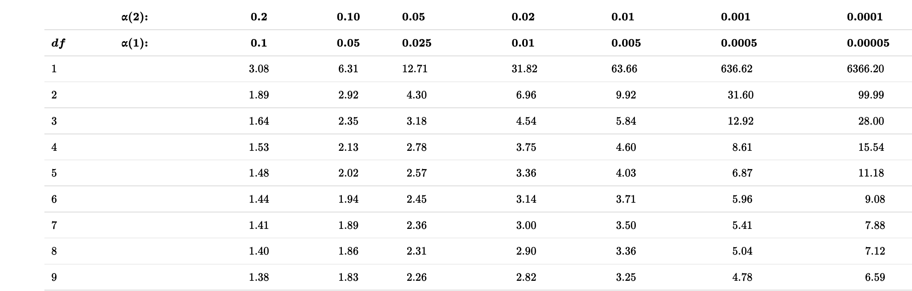

```{r setup, include=FALSE}
knitr::opts_chunk$set(collapse=T)
library(tidyverse)
library(knitr)
library(wesanderson)
library(RColorBrewer)
library(thematic)
library(infer)
library(kableExtra)
library(gridExtra)

gg_color_hue <- function(n) {
  hues = seq(15, 375, length = n + 1)
  hcl(h = hues, l = 65, c = 100)[1:n]
}
source("bb_theme.R")
options(digits = 10)

# set the bb_theme()
theme_set(bb_theme())

birds_original <- data.frame(Age = c("Old","Young","Old", "Young"),
                      Species = c("Junco", "Junco", "Finch", "Finch"),
                      Number = c(4, 7, 9, 9))
nhl <- tibble( month = c("Jan", "Feb", "Mar", "Apr", "May", "June", "Jul", "Aug", "Sep", "Oct", "Nov", "Dec"),
        month.num = 1:12,
        births = c(133, 125, 114, 119, 119, 123, 96, 91, 83, 84,73,85)) |> 
  mutate(month = fct_reorder(.f = month, .x = month.num,.desc = TRUE))


human_births<-tibble( month = c("Jan","Feb","Mar","April","May",
                                "June","Jul","Aug","Sept","Oct","Nov","Dec"),
                             `births (%)`  = 100*c(Jan = 0.0794, Feb = .0763, Mar = .0872,
                              April = .0863, May = .0895, June = .0857, Jul = .0876,
                              Aug = .085, Sept =  .0854, Oct = .0819, Nov = .0770,
                              Dec = .0787) )

lousy.fish <- tibble(num_parasites = 0:9, num_fish = c(103, 72, 44, 14, 3, 1, 1,0,0,0)) 
fish.sum   <- lousy.fish |> summarise(total_fish = sum(num_fish), 
                                       total_parasites = sum(num_fish* num_parasites))

births<-tibble( month = c("Jan","Feb","Mar","April","May","June","Jul","Aug","Sept","Oct","Nov","Dec"),
        `births (%)`  = 100*c(Jan = 0.0794, Feb = .0763, Mar = .0872, April = .0863, May = .0895, June = .0857, Jul = .0876, Aug = .085, Sept =  .0854, Oct = .0819, Nov = .0770, Dec = .0787) ) 

birth.weight <- data.frame( weight = seq(.25,14.75,.25) , 
                            count = c(0,0,1,9,5,8,17,25,12,20,21,27,
                                      28,33,24,57,65,98,107,161,189,
                                      310,393,611,837,1096,1273,1682,
                                      1684,1814,1520,1681,1220,1028,
                                      718,702,385,294,173,135,69,36,
                                      29,24,9,4,7,3,0,0,0,0,0,0,0,1,
                                      0,0,0))
mean.birth <- with(birth.weight, sum(weight * count)/sum(count))
sdev.birth <- with(birth.weight, sd(rep(weight , count)))
norm.birth <- dnorm(birth.weight$weight, mean = mean.birth, sdev.birth)
norm.birth <- (norm.birth/sum(norm.birth)) * sum(birth.weight$count)


temp.data<- read_delim("data/temp_data.txt",
                       col_names = FALSE,delim = "    ")%>% 
  dplyr::mutate(X1 = as.numeric(X1), X3 = as.numeric(X3), X2 = dplyr::case_when(X2 == 1~"male", X2 == 2~"female")) %>% 
  dplyr::select(temp = X1, gender = X2, heart_rate = X3) %>% na.omit()


temp.data.hist <- hist(temp.data$temp, breaks = seq(96,101,.3), plot=FALSE)
mean.temp <- mean(temp.data$temp)
sdev.temp <- sd(temp.data$temp)
norm.temp <- dnorm(temp.data.hist$mids, mean = mean.temp, sd = sdev.temp)
norm.temp <- (norm.temp/sum(norm.temp)) * length(temp.data$temp)
x3<-data.frame(Value=c(rnorm(10000,10,1), rnorm(10000, 70,15)), Group=c(rep("Anxious",10000), rep("Not anxious",10000)))

#temp.data <- data.frame(temp = temp.data.hist$mids, count = temp.data.hist$counts)


egg.data <- c(5308, 3908, 5093, 5519, 3467, 5526, 5594, 8824, 5931, 
              3665, 4739,5587, 4735, 5350, 4851, 4726, 5912, 5852, 
              4410, 3838, 6317, 6059, 5790, 5786, 6418, 6363, 4309, 
              4861, 4477, 6182, 6133, 6819, 4727, 6370, 5757, 7232, 
              7368, 6757, 6959, 4323, 6708, 5171)
egg.data.hist <- hist(egg.data, breaks = seq(0,10000,500), plot=FALSE)
mean.egg <- mean(egg.data)
sdev.egg <- sd(egg.data)
norm.egg <- dnorm(egg.data.hist$mids, mean = mean.egg, sd = sdev.egg)
norm.egg <- (norm.egg/sum(norm.egg)) * length(egg.data)
egg.data <- data.frame(number_eggs = egg.data.hist$mids, count = egg.data.hist$counts)
mean.birth <- with(birth.weight, sum(weight * count)/sum(count))
sdev.birth <- with(birth.weight, sd(rep(weight , count)))
norm.birth <- dnorm(birth.weight$weight, mean = mean.birth, sdev.birth)
norm.birth <- (norm.birth/sum(norm.birth)) * sum(birth.weight$count)

temp.data<- read_delim("data/temp_data.txt",
                       col_names = FALSE,delim = "    ")%>% 
  dplyr::mutate(X1 = as.numeric(X1), X3 = as.numeric(X3), X2 = dplyr::case_when(X2 == 1~"male", X2 == 2~"female")) %>% 
  dplyr::select(temp = X1, gender = X2, heart_rate = X3) %>% na.omit()


temp.data.hist <- hist(temp.data$temp, breaks = seq(96,101,.3), plot=FALSE)
mean.temp <- mean(temp.data$temp)
sdev.temp <- sd(temp.data$temp)
norm.temp <- dnorm(temp.data.hist$mids, mean = mean.temp, sd = sdev.temp)
norm.temp <- (norm.temp/sum(norm.temp)) * length(temp.data$temp)
temp.data <- data.frame(temp = temp.data.hist$mids, count = temp.data.hist$counts)


egg.data <- c(5308, 3908, 5093, 5519, 3467, 5526, 5594, 8824, 5931, 
              3665, 4739,5587, 4735, 5350, 4851, 4726, 5912, 5852, 
              4410, 3838, 6317, 6059, 5790, 5786, 6418, 6363, 4309, 
              4861, 4477, 6182, 6133, 6819, 4727, 6370, 5757, 7232, 
              7368, 6757, 6959, 4323, 6708, 5171)
egg.data.hist <- hist(egg.data, breaks = seq(0,10000,500), plot=FALSE)
mean.egg <- mean(egg.data)
sdev.egg <- sd(egg.data)
norm.egg <- dnorm(egg.data.hist$mids, mean = mean.egg, sd = sdev.egg)
norm.egg <- (norm.egg/sum(norm.egg)) * length(egg.data)
egg.data <- data.frame(number_eggs = egg.data.hist$mids, count = egg.data.hist$counts)
```

## Outline/Learning Goals {visibility="hidden"}
- CLT
- Probability of sample mean in a given range
- T-distribution
- One sample t-test
- CI

## Key Learning Goals

- Explain the relationship between the t-distribution & the Z-distribution.
- Estimate uncertainty in the population mean from a normally distributed sample of size n.
- Know when/how to conduct a 1-sample t-test.
- Come up with mean values under the null.
- Estimate uncertainty in variability.

## Recap

- $Z$ and $t$ distributions are not the same
- As sample size increases, $t$ becomes more similar to $Z$

## What do we use the t-distribution for?


1. Confidence intervals
1. Hypothesis testing


## Recap elephant CI example

* Five elephants that gave birth after 547, 551, 571, 567, 580 days pregnant.
* How confident are we about our mean estimate here? Let's find the 95% CI.

$95\%\text{ CI } = 563.2 \pm (t_{\alpha(2),4} \times 6.2)$

$$ = 563.2 + (2.776445 \times 6.2)=580.41$$
$$ = 563.2 - (2.776445 \times 6.2)=545.986$$
$$545.99<\mu<580.41$$


## One sample t-test

The one-sample t-test compares the mean of a random sample from a normal population with the population mean proposed in a null hypothesis.

Test statistic for one-sample t-test:

$$t=\frac{\bar{Y}-\mu_{0}}{s/\sqrt{n}}$$

$\mu_{0}$ os the hypothesized population parameter (aka the mean value stated in the $H_{0}$).

## Back to the elephants (1/)

::: goal
Assume we know that elephant gestational period is normally distributed with $\mu=525$ days. We already know that our 95% CI (last lecture) does not include that value, suggesting we will reject the null here through formal testing, but let's do it anyway.
:::

$H_{0}$: This sample of elephants came from a population with $\mu=525$ days of gestation.

$H_{A}$: This sample of elephants did NOT come from a population with $\mu=525$ days of gestation.

## Back to the elephants (2/)

Recall: $n=5, \mu_{0}=525, \bar{Y}=562.2, s=13.86$

$t=\frac{\bar{Y}-\mu_{0}}{s/\sqrt{n}}=\frac{563.2-525}{13.86/\sqrt{5}}=6.16$

```{r,  echo=F}

```

 $t_{0.05(2),4}=2.78$: $0.01<p<0.001$

Conclusion: we reject that null hypothesis that the population mean is $525$ days.

## In R

```{r, echo = T}
elephants<-c(547, 551, 571, 567, 580)
c(mean(elephants), sd(elephants))
t.test(elephants, alternative = "two.sided",mu = 525)
```

## Assumptions of the One-sample t-test

- Random samples
- Independent Samples
- Normally distributed values
- Or, more precisely, normally distributed sampling distributions.

## Some practice problems for later

- [https://bookdown.org/blazej_kochanski/statistics2/readnorm.html](https://bookdown.org/blazej_kochanski/statistics2/readnorm.html)


## Alternatives to the one-sample t-test

- Permutations (for hypothesis testing)
- Bootstrap (for estimating uncertainty)
- Non-parametric tests. E.g. sign test – i.e. a binomial test asking if the proportion of observations > μ0 differs from ½.

## Parametric vs Nonparametric tests (1/)

- Parametric tests are statistical tests that make specific assumptions about the data. 
- They assume the data follows a particular distribution, usually the normal distribution. 
- These tests need the measurement scale to be interval or ratio. 
- Parametric tests use population parameters like the mean and standard deviation in their calculations.
- E.g. t-test (one and 2 sample), ANOVA.


::: aside
From: https://www.statology.org/understanding-the-difference-between-parametric-and-nonparametric-tests/
:::

## Parametric vs Nonparametric (2/)

- Nonparametric tests are statistical tests that do not assume a specific distribution for the data. 
- They are used when data do not meet the assumptions of parametric tests, like normality. 
- These tests are often used with ordinal data or when sample sizes are small. 
- They may, for example, compare medians instead of means.
- E.g. Chi-square test, Mann–Whitney U test, Wilcoxon signed-rank test, Spearman’s rank correlation

::: aside
From: https://www.statology.org/understanding-the-difference-between-parametric-and-nonparametric-tests/
:::

## Parametric vs Nonparametric tests (3/)

::: columns


::: column

Parametric Pros:

- When assumptions are met, can detect differences more easily.
- Give estimates of population parameters.
- Handle more complex models, like regression or ANOVA.

:::


::: column
Parametric Cons:

- Need assumptions such as normality and interval data.
- Extreme values can distort results; 
- When the sample size is small, the normality assumption may be violated.
:::
:::

## Parametric vs Nonparametric tests (4/)
::: columns
::: column

Nonparametric Pros:

- Do not need normal distribution or homogeneity of variance.
- Less affected by extreme values.
- Can be used with smaller sample sizes.

:::

::: column
Nonparametric Cons:

- Generally have less statistical power compared to parametric tests.
- Only test for differences in medians or ranks, not means.
- Fewer tests available for complex designs.

:::
:::

## Is it normal? {.dark-theme .center}


## Is it normal? (1/)

* A lot of the statistics we've been learning relies on the "normality" of the data
* While there are statistical procedures to test the null hypothesis that data come from a normal distribution, we almost never use these because a deviation from a normal distribution can be most important when we have the least power to detect it.
* For that reason,we usually use **our eyes** (believe it or not), rather than null hypothesis significance testing to see if data are approximately normal.

## Is it normal? (2/)
* Few variables in biology show a perfect match to a normal distribution
* There are methods (e.g., QQplots) to assess whether you believe the assumption holds
* A method is **robust** if the answer it gives is not senstitive to modest departures from the assumption
* How do you know if a method is robust? This is a more advanced discussion we won't go into, but, basically, we can assess this through computer simulations


## “Quantile-Quantile” plots and the eye test (1/)

* The qqplot is a visual way of assessing whether our data are normally distributed by comparing the quantiles of our z-transformed data to those expected under a "perfect" Normal distribution
* In a “quantile-quantile” (or QQ) plot $x$ is $y$’s $z$-transformed expectation, i.e.: `mutate(data, qval = rank(y)/(n+.5), x = qnorm(qval))`, and $y$ is the data. 


## “Quantile-Quantile” plots and the eye test (2/) 

Recall the button pressing time example: a non-normal distribution
```{r, eval=T, echo=F}
pressing_buttons<-x3
colnames(pressing_buttons)[1]<-"Time"
```

```{r, echo=F}
ppressing<-pressing_buttons %>% 
  ggplot(aes(x=Time)) +
  geom_histogram(aes(y=after_stat(density)), 
               colour="black", fill="#046C9A", 
               alpha=0.4, linewidth=1.5)+
 #              stat_function(fun = dnorm, args = list(mean = meanpress, sd = sdpress),
 #              colour = "#C27D38", linewidth=2, alpha=0.6)+
 # ggtitle("Histogram of Time \n Before Button is Pressed")+
  labs(x="Time (seconds)", y="Frequency")
ppressing

```


## QQ-plots and the eye test (3/)

In R We can make a qq-plot with the `geom_qq()` function and add a line with `geom_qq_line()`, here we map our quantity of interest onto the attribute, sample. 

For this non-normal distribution, values fall far away from the QQ line.
```{r, echo=F,eval=requireNamespace("ggplot2", quietly=TRUE),warning=FALSE, fig.height=3.5}
meanpress<-pressing_buttons %>% 
  summarise(meanx=mean(Time)) %>% pull(1)
sdpress<-pressing_buttons %>% 
  summarise(mean=sd(Time)) %>% pull(1)

ppressing2<-pressing_buttons %>%
         ggplot(aes(sample=Time)) + # x is z transformed data, y is data
         geom_qq() +
         geom_qq_line(col="#C27D38") +
    xlab("Theoretical Quantiles")+
    ylab("Sample Quantiles")
        
cowplot::plot_grid(ppressing, ppressing2, nrow=1)
```
* The red line shows where values should fall if $y$ is normally distributed.


## QQ-plots and the eye test (4/)

For this normally distributed data, values fall nicely on the QQ line 

```{r, echo=F, eval=requireNamespace("ggplot2", quietly=TRUE),warning=FALSE}
meanpetal<-iris %>% 
  filter(Species == "versicolor") %>%
  summarise(meanx=mean(Petal.Length)) %>% pull(1)
sdpetal<-iris %>% 
  filter(Species == "versicolor") %>%
  summarise(mean=sd(Petal.Length)) %>% pull(1)
pris1<-iris %>% 
  filter(Species == "versicolor") %>% 
  ggplot(aes(x=Petal.Length)) +
  geom_histogram(aes(y=after_stat(density)), 
               colour="black", fill="#046C9A", 
               alpha=0.4, linewidth=1.5)+
               stat_function(fun = dnorm, args = list(mean = meanpetal, sd = sdpetal),
               colour = "#C27D38", linewidth=2, alpha=0.6)+
  ggtitle("Histogram of Petal Length")+
  labs(x="Petal Length", y="Frequency")
  
pris2<-iris %>%
  filter(Species == "versicolor") %>%
  ggplot(aes(sample = Petal.Length))+
  ggtitle("QQ-plot of Petal Length")+
  geom_qq()+
  geom_qq_line(colour="#C27D38")
cowplot::plot_grid(pris1, pris2)
```

* The red line shows where values should fall if $y$ is normally distributed.


## QQ-plots and the eye test (5/) 

* Points seem to be pretty close to the predicted line, but both the small  and large values are a bit smaller than we expect. 
* Is this a big deal? Is this deviation surprising? To find out we need to get a sense of the variability we expect from a normal distribution.

```{r, echo=F,eval=requireNamespace("ggplot2", quietly=TRUE),warning=FALSE,fig.align='center'}

pris2
```

## What normal distributions look like

* I am always surprised about how easily I can convince myself that a sample does not come from a normal distribution. 
* To give you a sense: run this about ten times for five quite different sample sizes to get a sense for the variability in how normal a sample from the normal distribution looks. 
* This basically takes your sample size, `n`, and simulates random data from the standard normal by running this R code `tibble(x = rnorm(n = n, mean = 0, sd = 1))`, and then plotting the output:


[https://brandvain.shinyapps.io/standardnormal/](https://brandvain.shinyapps.io/standardnormal/)

## Violation of normality assumption (1/)

* The Normal distribution is _very common_ and the CLT is very useful
* There are a bunch of statistical approaches made for data with some form of normality assumption.  
* But sometimes data are _too far_ from normal to be modeled as if they are normal


## Violation of normality assumption (2/)

* Or, details of a statistical distribution lead to breaking other assumptions of statistical tests. When this happens, we have a few options:  

1. We can transform the data to meet our assumptions   
2. Use non-parametric tests (don't make assumptions about underlying distributions)
3. We can permute and bootstrap! (sampling/simulation approaches)
4. We can use/develop tools to model the data as they are actually distributed

::: aside
Of all of these, number 1 is the one I least recommend and yet the one that you will most likely find, so here we go
:::

## Rules for legit transformations (1/) 

1. There is nothing "natural" about linear scale, so there is nothing wrong about transforming data to a different scale. 
2. We should estimate & test hypotheses on a **meaningful scale**. 
3. An **appropriate transformation** will often result in normal-ish distributed data.  
4. **Let biology guide you**. Often you can think through what transformation is appropriate by thinking about a mathematical model describing your data. E.g.,  if values naturally grow exponentially, you should probably log-transform  your data.   


## Rules for legit transformations (2/) 


5. Apply the same transformation to each individual.  

6. Transformed values must have one-to-one correspondence to original values - don't square if some values are >0 and some are <0.      

7. Transformed values must have a monotonic relationship with the original values - e.g., larger values stay larger, so be careful with trigonometric transformations.

8. Conduct your statistical tests AFTER you settle on the appropriate transformation. 

9. **_Do not bias your results by losing data points when transforming the data._** 


## Common transformations

* There are numerous common transformations that will make data normal, depending on their initial shape.  


Name | Formula| What type of data?
------------- | -------------|---
Log | $Y'=\log_x(Y + \epsilon)$ | Right skewed
Square-root | $Y'=\sqrt{Y+1/2}$ | Right skewed
Reciprocal | $Y'=1/Y$ | Right skewed
Square | $Y'=Y^2$ | Left skewed
Exponential | $\displaystyle Y'=e^Y$ | Left skewed

* We saw an example in lab 10


## The log transformation (1/)

* We have seen that the normal distribution arises when we add up a bunch of things.  
* If we multiply a bunch of things, we get an exponential distribution. 
* Because adding logs is like multiplying untransformed data, a log transform makes exponential data look normal! 
* Be careful when log-transforming!! All data with a value of zero or less will disappear. For this reason, we often use a `log1p` transform, which adds one to each number before logging them.    
   


## The log transformation (2/)

* Body weight in mammals
```{r logmam, message=FALSE, eval=requireNamespace("ggplot2", quietly=TRUE),warning=FALSE, echo=F, fig.align='center'}
library(dplyr)
library(ggplot2)
msleep <- readr::read_csv("data/SleepInMammals.csv")
# log10 transform
msleep <-  mutate(msleep, log10_bodywt = log10(Body_Weight_kg))
# let's evaluate normality          
cowplot::plot_grid(
  ggplot(msleep, aes(x = Body_Weight_kg))            + geom_histogram() + labs(title = "Raw body weight"),
  ggplot(msleep, aes(x = log10_bodywt))      + geom_histogram() + labs(title = "log10(body weight)") ,
  ggplot(msleep, aes(sample =  Body_Weight_kg))       + geom_qq()        + geom_qq_line(color="#C27D38") + labs(title="QQplot (raw)"),
  ggplot(msleep, aes(sample = log10_bodywt)) + geom_qq()        + geom_qq_line(color="#C27D38") + labs(title="QQplot (log scale)"),
  ncol =2, labels = "AUTO", rel_heights = c(5,4.5))
```


## Practice Problems {.dark-theme .center}


## Problem 1: Notation

What is the correct representation for the 3% critical t-value for a sample with 14 degrees of freedom?


## Problem 2: Coconut attack

A four-year review at the Provincial Hospital in Alotau, Papua New Guinea (Barss 1984), found that about 1/2 of their hospital admissions were injuries due to falling coconuts. If coconuts weigh on average 3.2kg and the upper bound of the 95% confidence interval is 3.5kg what is the lower bound of this confidence interval? Assume a normal distribution of coconut weights.
 
 

## Problem 3: Using the Student's t table

Using your table of critical t-values, what value of t corresponds to the location with 95% of the area under the curve to the left and 5% to the right when there are 18 degrees of freedom?

1.330

1.734

2.101

2.214


## Problem 4: Using the Student's t table

Using your table of critical t-values, what values of t correspond to the ones that bound a central region containing 95% of the distribution when there are 18 degrees of freedom?

1. −2.101 to 2.101

1. −1.734 to 1.734

1. −1.051 to 1.051

1. −0.867 to 0.867

## Problem 5: 
If the sample mean matches the hypothesized population mean, then the t-statistic and P-value of the test would be which of the following?

1. 0, 1

1. 1, 0

1. 1, 1

1. Cannot be determined, depends on the sample size.

## Problem 6: 


How many standard errors wide is a 95% confidence interval for a population mean, based on a sample of size 10?


## Problem 7: 

If we have a 95% confidence interval of 20.68 <  μ < 21.32 based on a sample of 18 values, what is the standard deviation of the sample?


## Problem 8:

Consider a situation in which Michael collects 12 frogs from a population that he thinks (based on published reports) has an average of 21 spots. His sample has a mean of 23 with a standard deviation of 3.1, however. Conduct a one-sample t-test. State the hypotheses, calculate df, t, and find a range for the P-value. What can you conclude?

## Problem 9: Swimming in syrup

It is unknown whether the increase in the friction of the body moving through the syrup (slowing the swimmer down) is compensated by the increased power of each stroke. Experiment: researchers filled one pool with water mixed with syrup and another pool with normal water. They had 18 swimmers swim laps in both pools in random order. Data: the relative speed of each swimmer in syrup (speed in the syrup pool divided by his or her speed in the water pool). If the syrup has no effect on swimming speed, then relative swim speed should have a mean of 1. I calculated the mean and sd for you: $\bar{X}=1.011667$, $s=0.04232229$

1. Test the hypothesis that relative swim speed in syrup has a mean of 1.
1. How uncertain are we about true relative swimming speed in syrup? Use the 99% confidence interval to find out.
~~1. Quantify the effect size using Cohen's d. ~~ [ignore this one]

## Problem 10: Has Climate Change Moved Species Uphill? (1/)

Chen et al. (2011) wanted to test the idea that organisms move to higher elevation as the climate warms. To test this, they collected data from 31 species:

```{r, echo=F}
library(ggthemes)
range_shift_file <- "https://whitlockschluter3e.zoology.ubc.ca/Data/chapter11/chap11q01RangeShiftsWithClimateChange.csv"
range_shift <- read_csv(range_shift_file) %>%
  mutate(x = "", uphill = elevationalRangeShift > 0)
range_data<-range_shift %>%
  separate(col = "taxonAndLocation", into = c("taxon","location"), sep = "_") %>%
  ggplot(aes(x = elevationalRangeShift))+
  geom_histogram(color="lightgray")+
  scale_fill_colorblind()
range_data
```

## Has Climate Change Moved Species Uphill? (2/)

```{r eleva1,eval=requireNamespace("ggplot2", quietly=TRUE),warning=FALSE, fig.cap="Change in the elevation of 31 species. Data from @Chen2011.", fig.height=2,fig.width=4, message=FALSE, warning=FALSE, echo=F}
range_shift_file <- "https://whitlockschluter3e.zoology.ubc.ca/Data/chapter11/chap11q01RangeShiftsWithClimateChange.csv"
range_shift <- read_csv(range_shift_file) %>%
  mutate(x = "", uphill = elevationalRangeShift > 0)
ggplot(range_shift, aes(x = x, y = elevationalRangeShift))+
  geom_jitter(aes(color = uphill), width = .05, height = 0, size = 2, alpha = .7)+
  geom_hline(yintercept = 0, lty= 2)+
  stat_summary(fun.data = "mean_cl_normal") +
  scale_color_colorblind()+
  theme(axis.title.x = element_blank())
```


## Has Climate Change Moved Species Uphill? (3/)

**Estimation**

The first step is to summarize the data

```{r, echo=T}
elevationRangeShift<-c(58.9, 7.8, 108.6, 44.8, 11.1, 19.2, 61.9, 30.5, 12.7, 35.8, 
7.4, 39.3, 24, 62.1, 24.3, 55.3, 32.7, 65.3, -19.3, 7.6, -5.2, -2.1, 31, 69, 88.6, 39.5, 20.7, 89, 69, 64.9, 64.8)
```

. . . 

```{r, eval=T}
mu_0 <- 0
range_shift_summary  <- range_shift %>%
  summarise(n = n(), 
            this_mean = mean(elevationalRangeShift),
            this_sd   = sd(elevationalRangeShift ),
            this_sem = this_sd/sqrt(n()))
range_shift_summary |> kable()
```
Ranges have shifted about 39.3 meters upwards - > 1 SD change in elevation across species.

## Has Climate Change Moved Species Uphill? (4/)
*Evaluating assumptions*

* Are data biased? I hope not, but it would depend on aspects of study design etc. For example, we might want to know if species had as much area to increase in elevation as to decrease etc…. How were species picked….
* Are data independent? Check out the data above. My sense is that they aren’t all independent. So much data is from the UK. What if there is something specific about low elevation regions in the UK? Anyways, I wouldn’t call this a reason to stop the analysis, but it is a good thing to consider.
* Is the mean a meaningful summary of the data?  My sense is yes, but look for yourself!
* Are samples (or more particularly, the sampling distribution) normal? My sense is yes, but look for yourself! My sense is yes, but look for yourself!
* How? QQ-plot, histogram, density plot...

## QQplot

```{r}

ggplot(range_shift, aes(sample = elevationalRangeShift)) + geom_qq()+ 
  geom_qq_line(color="#C27D38") + 
  labs(title="QQplot (log scale)")
```

## Hypothesis Testing
Let’s lay out the null and alternative hypotheses:

$H_{0}:$ On average organisms have not increased or decreased their elevation.

$H_{A}:$ On average organisms have increased or decreased their elevation.

First let's calculate $t$ and then use `pt()` to find the probability and multiply by two.

## Hypothesis Testing
```{r, echo=T}
mu_0 <- 0 # null hypothesis, zero change

range_shift_summary %>%
  mutate(df = n - 1,
         se =  this_sd / sqrt(n),
         t  = (this_mean - mu_0) / se,
         p_val = 2 * pt(q = abs(t), df = df, lower.tail = FALSE) ) %>%
  dplyr::select(df, t,        p_val) |> kable()
```
* A really small p-value, meaning that the null hypothesis would rarely generate such extreme data. 
* Since p < traditional $\alpha$ threshold we reject the $H_{0}$ and conclude that ranges have shifted upward.
* Note this doesn’t mean the null is wrong, it just means that we’re proceeding as if it is.


## For future refence

* Statistics for Biologists - *Nature* collection of articles highlighting important statistical issues that biologists should be aware of and provides practical advice to help them improve the rigor of their work.[nature.com/collections/qghhqm](https://www.nature.com/collections/qghhqm)

* G\*power: a tool to compute statistical power analyses for many different t tests, F tests, χ2 tests, z tests and some exact tests. G*Power can also be used to compute effect sizes and to display graphically the results of power analyses.
[www.psychologie.hhu.de/arbeitsgruppen/allgemeine-psychologie-und-arbeitspsychologie/gpower](https://www.psychologie.hhu.de/arbeitsgruppen/allgemeine-psychologie-und-arbeitspsychologie/gpower)

* The `pwr` package in R is a powerful tool for conducting power analysis. Power analysis is essential in determining the sample size needed to detect an effect of a given size with a certain level of confidence. It is widely used in experimental design and statistical hypothesis testing.
[data-wise.github.io/doe/appendix/r-packages/pwr.html](https://data-wise.github.io/doe/appendix/r-packages/pwr.html)
* Our course website!  [https://bbitarello.github.io/b215f2025/](https://bbitarello.github.io/b215f2025/)


