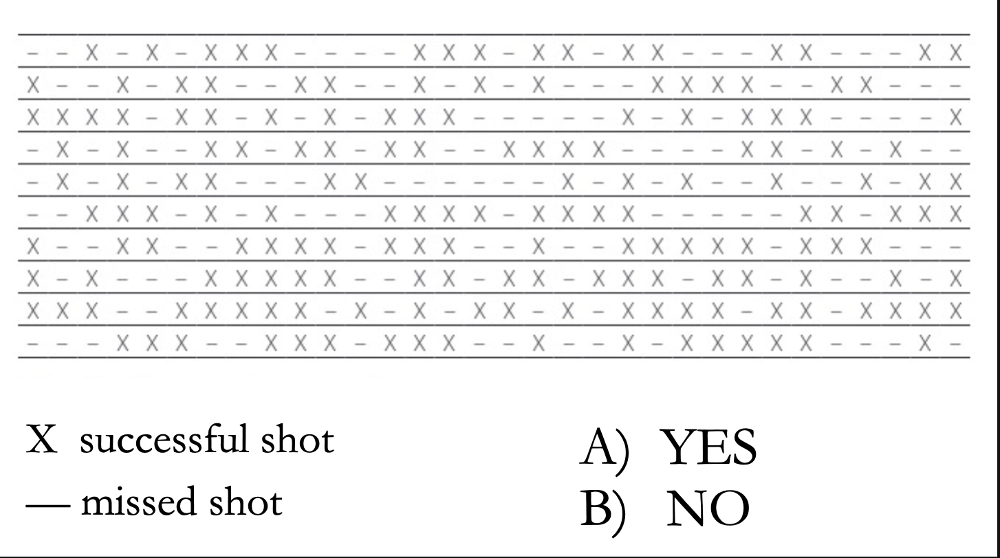

```{r setup, include=FALSE}
knitr::opts_chunk$set(echo = FALSE)
library(forcats)
library(dplyr)
library(ggplot2)
library(ggforce)
library(tidyr)
library(stringr)
library(knitr)
library(ggthemes)
library(wesanderson)
library(gt)
library(RColorBrewer)
library(plotly)
library(readr)
gg_color_hue <- function(n) {
  hues = seq(15, 375, length = n + 1)
  hcl(h = hues, l = 65, c = 100)[1:n]
}
source("bb_theme.R")

# set the theme
theme_set(bb_theme())
set.seed(1234)

tigerData<-read.csv("~/Documents/GitHub/DataSetsb215/data-raw/chap02e2aDeathsFromTigers.csv")


```

## Outline

-   Understand once and for all that statistics and probability are NOT
    intuitive
-   Definitions, terminology & notations

- Next week: 
  
  - Foundational concepts: random trials, exclusive and non-exclusive outcomes, probability rules
  
  - Probability distributions and sampling distributions


## Other learning goals {visibility="hidden"}

-   Understand why probability theory is the foundation for statistical
    reasoning.
-   Think addition upon hearing “OR”.
-   Think multiplication upon hearing “AND”.
-   Calculate probabilities of complex events by using standard rules of
    probability theory.
-   Explain probabilities and proportions.
-   Explain the binomial – when would you use it
-   Understand the binomial distribution and connect it to simple
    probability rules.

##  {.dark-theme .center}

::: r-fit-text
Motivation
:::

## Why sample?

We almost never sample an entire population. So we can’t nail down
parameters from populations.

But we can make educated guesses of
<font color = #00a1b7>parameters</font> by making
<font color =  #C0532B>estimates</font> from samples.

## Estimation with uncertainty

-   We know that estimates will differ from parameters by chance.

-   So, we must incorporate **uncertainty** in our estimation.

-   How can we rigorously *quantify* this uncertainty?

##  Statistics (and probability, in particular) are not intuitive {.dark-theme .center}

::: r-fit-text


“If something has a 50% chance of happening, then 9 times out of 10 it will”
                                                              — Yogi Berra

:::

## Meaning of “intuitive”

1)  “easy to understand”

2)  “instinctive, or acting on what one feels to be true even without
    reason"

## Each row is a basketball player

Do you spot any patterns?

{width="531"}

##  {visibility="hidden"}

These were randomly generated!

. . .

And yet, many people report seeing patterns there.

## Generalizing from a sample to a population seems to be hard-wired into our brains

[{width="517"}](https://www.bbc.com/future/article/20140730-why-do-we-see-faces-in-objects)

## Statistics (and probability, in particular) are not intuitive {.dark-theme .center}

-   we see patterns in random data

## 

Pick a range that you think has a 90% chance of containing the right
answer

::: goal
Don't consult anything/anyone. The goal is to quantify your uncertainty.
If you truly have no idea, you can use the broadest range that is
plausible (which you can be 100% sure includes the answer) but try to
narrow down your answers to a range that you are 90% sure contains the
right answer.
:::

::::: columns
::: column
1)  Martin Luther King Jr’s age at death
2)  Length of the Nile river (miles; km)
3)  Number of countries in OPEC[^1]
4)  Number of books in the Old Testament
5)  Diameter of the moon (miles; km)
6)  Weight of an empty Boeing 747 (lbs; kg)
:::

::: column
7)  Year Mozart was born
8)  Gestation period of an Asian elephant (days)
9)  Distance from London to Tokyo (miles; km)
10) Deepest know point in the ocean (miles; km)
:::
:::::

[^1]: Organization of the Petroleum Exporting Countries

## How many did you get “right”? {visibility="hidden"}

1)  Martin Luther King Jr’s age at death: 39
2)  Length of the Nile river: 4,187 miles or 6.738 km
3)  Number of countries in OPEC: 13
4)  Number of books in the Old Testament: 39
5)  Diameter of the moon: 2,160 miles or 3,476 km
6)  Weight of an empty Boeing 747: 390,000 lbs or 176,901 kg
7)  Year Mozart was born: 1756
8)  Gestation period of an Asian elephant (in days): 645 days
9)  Distance from London to Tokyo: 5,989 miles or 9,638 km
10) Deepest know point in the ocean: 6.9 miles or 11 km

## 99% of people are overconfident in this test

::: goal
These questions were used in a study by Russo and Shoemaker (1989) and
99% of $~1,000$ participants, but most of them included narrow ranges
that included 30 to 60% of correct answers.
:::

Similar studies done with experts answering questions in their own field
of expertise led to similar results.

::: aside
Russo, J. E., & Schoemaker, P. J. H. (1989). Decision traps. The ten barriers to brilliant decision-asking and how to overcome them. New York: Simon & Schuster. 
:::

## Statistics (and probability, in particular) are not intuitive {.dark-theme .center}

-   we see patterns in random data
-   we tend to be overconfident


## That's all for today

{fig-alt="Forrest says \"And that's all I wanted to say about that\""
width="347"}
