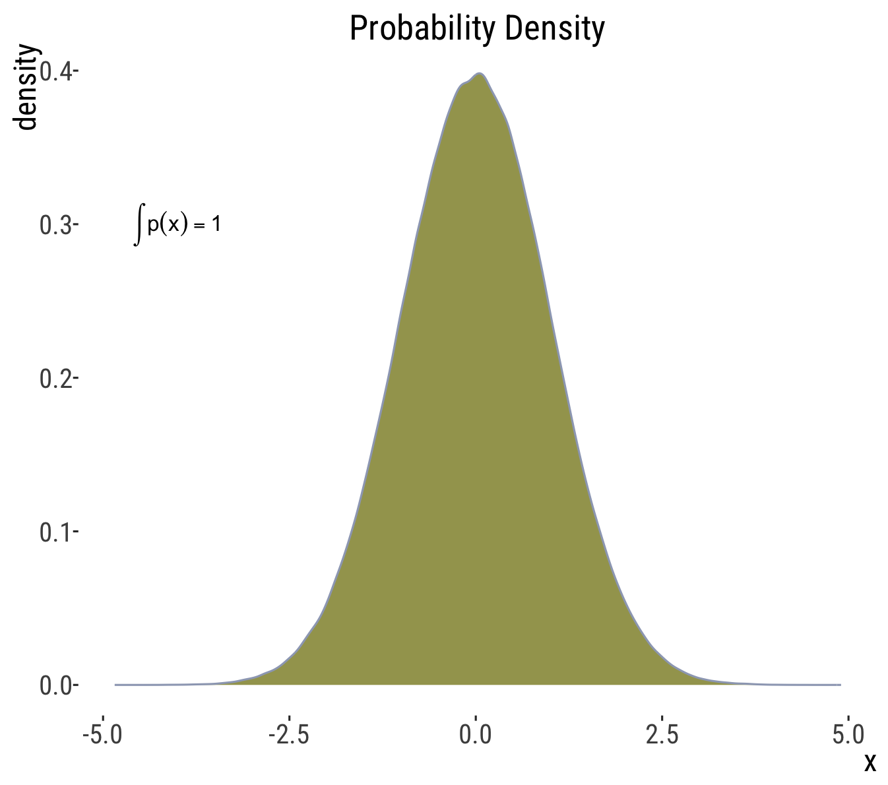

```{r setup, include=FALSE}
knitr::opts_chunk$set(echo = TRUE)
library(tidyverse)
library(forcats)
library(dplyr)
library(ggplot2)
library(ggforce)
library(tidyr)
library(stringr)
library(knitr)
library(ggthemes)
library(wesanderson)
library(gt)
library(RColorBrewer)
library(plotly)
library(readr)
library(thematic)

gg_color_hue <- function(n) {
  hues = seq(15, 375, length = n + 1)
  hcl(h = hues, l = 65, c = 100)[1:n]
}
source("bb_theme.R")

# set the theme
theme_set(bb_theme())
#theme_set(theme_bw())
#thematic_rmd(font = "Roboto Condensed", qualitative = asteroidcity1())
set.seed(12345)

DieRoll<-function(times = 1){
  sample(x = 1:6,size = times, replace = T)
}

## to fix annoying ggplot2 issue ----
##https://rstudio-pubs-static.s3.amazonaws.com/991178_746a3f129f4d46829bda51127a8cb8f7.html
StatCount2 <- ggproto(
  "StatCount2", StatCount,
  compute_panel = function (self, data, scales, ...) {
    if (ggplot2:::empty(data)) 
      return(ggplot2:::data_frame0())
    groups <- split(data, data$group)
    stats <- lapply(groups, function(group) {
      self$compute_group(data = group, scales = scales, ...)
    })
    non_constant_columns <- character(0)
    
    stats <- mapply(function(new, old) {
      if (ggplot2:::empty(new)) return(ggplot2:::data_frame0())
      # Edit 1: Identify exceptions where a variable is constant *within values of x*
      within_x_constant <- vapply(old, function(x) nlevels(interaction(x, old$x, drop = TRUE)) == max(old$x), logical(1L))
      # Edit 2: Columns to keep
      kept <- unique(old[, within_x_constant])
      # Edit 3: Don't test non-constant-ness of `kept` columns
      old <- old[, !(names(old) %in% c(names(new), names(kept))), drop = FALSE]
      non_constant <- vapply(old, function(x) length(unique0(x)) > 1, logical(1L))
      non_constant_columns <<- c(non_constant_columns, names(old)[non_constant])
      # Edit 4: Add `kept` columns
      vctrs::vec_cbind(
        new,
        kept[, setdiff(names(kept), "x"), drop = FALSE],
        old[rep(1, nrow(new)), setdiff(names(old), names(kept)), drop = FALSE],
      )
    }, stats, groups, SIMPLIFY = FALSE)
    
    non_constant_columns <- ggplot2:::unique0(non_constant_columns)
    dropped <- non_constant_columns[!non_constant_columns %in% self$dropped_aes]
    if (length(dropped) > 0) {
      cli::cli_warn(c(
        "The following aesthetics were dropped during statistical transformation: {.field {glue_collapse(dropped, sep = ', ')}}",
        "i" = "This can happen when ggplot fails to infer the correct grouping structure in the data.",
        "i" = "Did you forget to specify a {.code group} aesthetic or to convert a numerical variable into a factor?"
      ))
    }

    # Finally, combine the results and drop columns that are not constant.
    data_new <- ggplot2:::vec_rbind0(!!!stats)
    data_new[, !names(data_new) %in% non_constant_columns, drop = FALSE]
  }
)
```

## Outline

-   Definition(s) & Foundational Concepts
    -   Probability vs. Odds
    -   Probability as long-term frequency
    -   Random trials
    -   Types of events (exclusive and non-exclusive)
    -   Probability distributions x probability densities x proportions
-   Probability rules
    -   the addition principle
    -   the general multiplication principle

## Recap

::: goal
Statistics and probability are not intuitive. Our brains do a bad job of
interpreting data
:::

-   we see patterns in random data
-   we tend to be overconfident
-   we tend to jump to conclusions
-   we don’t realize that coincidences are common
-   we have incorrect feelings about probability
-   we don’t expect variability to depend on sample size
-   we find it hard to combine probabilities (coming up soon)

::: notes
We saw a lot of these last week
:::

## To help us when generalizing from sample to population, we need Probability Theory: The foundation of statistical thinking {.dark-theme .center}

## Definitions, Terminologies, and Notations {.dark-theme .center}

## Why do we need probabilities?

We can use probability theory to connect <font color = #C0532B>sample
**estimates**</font>

-   Which we can obtain from data.
-   Which take their values by chance
    (<font color = #C0532B>**variable**</font>).

To <font color =  #00a1b7>population **parameters**</font>:

-   Which we can almost never obtain.
-   With values free from chance (<font color =  #00a1b7>population
    **constant**</font>).

## What is probability?

-   It depends.
-   Probability is super complex.
-   Entire books have been written on it and there are fiery debates
    about what even *IS* a probability.

## Some definitions

1.  Probability “out there” - outside your head.

But also...

::: incremental
2)  Probability that is "inside your head" — as strength of subjective
    beliefs; may vary among people or even different assessments by the
    same person.

3)  "Probabilities" used to quantify ignorance -- e.g. probability that
    a pregnant person is pregnant with a girl

4)  Quantitive predictions of one time events -- e.g., presidential
    polls
:::

::: aside
From: Kruschke’s (2011) terminology.
:::

## Probability “out there” - outside your head

What we deal with in biology most of the time

::: goal
-   This is probability as long-term frequency
-   The probability that a certain event will happen has a definite
    value (a parameter)
-   We rarely have enough data to know that value precisely (or good
    data to know it accurately), but we estimate it and give it
    different levels of confidence
:::

## Probability as long-term frequency

-   The probability of an event is its true relative frequency - “out
    there”

-   This is the proportion of times the event would occur if we repeated
    the same process over and over again

## Example

::: goal
Example: what’s the probability that a fair die will give me 2 if I roll
it once?
:::

-   This is probability as long-term frequency
-   It comes from the notion that if I could roll this die many, many
    times, I would get a 2 in about $1/6$ of the times
-   So we say the answer here is $1/6$


## Probability as long-term frequency

Two subtypes:

**1) Probabilities as predictions from a model**

-   e.g. odds of a baby being XY or XX is 50:50 based on meiosis alone

**2) Probabilities based on data**

-   in reality, long-term data cross many countries suggest odds of XY
    to XX baby are 51.7:50

## Probability Theory & Statistics

Probabilities take values from 0-1 (or 0-100%)

They are used to quantify a prediction about a future event ***OR*** the
certainty of a belief

:::::::::::: {layout-ncol="3"}
::::: column
:::: goal
::: {.fragment .fade-in}
A probability of zero (0%) indicates:

-   An event is impossible\
    [***OR***]{.underline}
-   Someone is absolutely (100%) sure that a statement is wrong
:::
::::
:::::

::::: column
:::: goal
::: {.fragment .fade-in}
A probability of one (100%) indicates:

-   An event is certain to happen\
    [***OR***]{.underline}
-   Someone is absolutely (100%) sure that a statement is correct
:::
::::
:::::

::::: column
:::: goal
::: {.fragment .fade-in}
A probability of 0.5 (50%) indicates:

-   An event is equally likely to happen or not happen\
    [***OR***]{.underline}
-   Someone believes that a statement is equally likely to be true or
    false
:::
::::
:::::
::::::::::::

## Lingo: Odds vs probability

-   They express the same thing
-   Probabilities can be expressed as odds
-   Odds can be expressed as probability
-   No consistency across fields and no advantage of one over the other
-   I learned and most often use “probability” - It sounds less
    ambiguous to me than odds, which people use more in normal parlance

## Example: Sex ratio

::: goal
Worldwide, the boy to girl sex ratio of babies born has been estimated
to be 1.07. What is the probability of a random birth being a boy?
:::

. . .

[**Odds:**]{.underline} Probability that event will occur (male born)
divided by probability it will not occur (female born). Can be any value
0 or positive (not negative).

-   Odds of having boy versus girl is:$p[boy]/p[girl]=1.07$ -- can also
    be phrased as $1.07 \text{ to } 1$ or $1.07:1$

-   Equivalent to $107 \text{ to } 100$ ($107:100$),
    $1070 \text{ to } 1000$ ($1070:1000$), etc

[**Probability:**]{.underline} if there are 107 boys born for every 100
girls, $107/(100+107)=51.7\%$ or $0.517$ is the probability of having a
boy.

## Foundational Concepts in Probability Theory {.center .dark-theme}

## Random Trials

::: goal
Example: Probability of getting a 4 in one roll (trial) of a six-sided
die
:::

-   A random trial is a process or experiment that has two or more
    possible outcomes whose occurrence cannot be predicted with
    certainty.

-   Only one outcome is observed from each repetition of a random trial.


## Types of Events

::: goal
Example: possible numbers in a die roll
:::

::::: columns
::: {.column width="30%"}
<font color = #586028>Mutually Exclusive</font>

If $A$ and $B$ are mutually exclusive:

-   Either $A$ or $B$ are individually plausible outcomes
-   $A\&B$ is not plausible (i.e., $P(A\&B)=0$)
:::

::: {.column width="70%"}
```{r even_odd}
even_numbers<-c(2,4,6)
odd_numbers<-c(1,3,5)
l<-list(even = even_numbers, odd = odd_numbers, all = sort(c(even_numbers, odd_numbers)))
library(ggvenn)

p1<-ggvenn(l[c(1:2)], 
       fill_color = asteroidcity1(),
       show_elements = TRUE, text_size = 12) + 
 ggtitle("Cannot be even AND odd")+
  theme(plot.title = element_text(family = "Roboto Condensed", size = 20))
p1
```

E.g., $P(\text{even AND odd})=0$ in a die roll
:::
:::::

## Types of Events

::: goal
Example: possible numbers in a die roll
:::

::::: columns
::: {.column width="30%"}
<font color = #586028>Non-mutually exclusive</font>

If $A$ and $B$ are *not* mutually exclusive:

-   There's a chance of outcome $A$ and $B$
-   I.e., it is plausible that $P(A\&B)\neq0$
:::

::: {.column width="70%"}
```{r even_prime}
l2<-list(even = even_numbers, `prime` = c(2,3,5))
p2<-ggvenn(l2, 
       fill_color = asteroidcity1(),
       show_elements = TRUE, text_size = 12) + 
  ggtitle("Can be even AND prime")+
  theme(plot.title = element_text(family = "Roboto Condensed", size = 19))
p2
```

E.g., $P(\text{even AND prime}) \neq 0$ in a die roll -- in fact, what
is it?
:::
:::::

::: notes
only one nummber out of the six is both even and prime,so: 2/6=1/3
:::

## Probability distributions {.dark-theme .center}

A probability distribution is the true relative frequency of all
possible values of a random variable.

## Probability: Distributions vs. Densities

::::: columns
::: {.column width="25%"}
Probability distributions describe **discrete** variables.

Probability distributions sum to 1.

$\sum{p[x]}=1$
:::

::: {.column width="75%"}
```{r probdist}
ns<-rnorm(1000000)
ggplot(tibble(x=ns), 
       aes(x = x)) + 
  geom_histogram(color = banff()[7], fill="#00a1b7", bins = 30, alpha = .4) + 
  ggtitle("Probability Distribution") +
 annotate("text", x = -4, y = 1e05, parse = TRUE,
           label = "sum(P(x))==1", size = 4)  
  #bb_theme()
```
:::
:::::

::: aside
Technically, only discrete variables have probability distributions,as
all discrete values have a finite probability.
:::

## Example: probability distribution for rolling a die

::::: columns
::: {.column width="25%"}
All possible values: $x=\{1,2,3,4,5,6\}$

Probabilities of particular outcomes: $p[1]=1/6$

$p[2]=1/6,\text{etc}$

Sum of probabilities of all possible outcomes:

$\sum{p[x]}=1$
:::

::: {.column width="75%"}

:::
:::::

## Probability: Distributions *vs.* Densities

::::: columns
::: {.column width="25%"}
-   The probability of any value from a **continuous** distribution is
    infinitesimally small.

-   Probability densities integrate to 1.

$\int{p[x]}=1$
:::

::: {.column width="75%"}
{width="374"}

```{r probdens, eval = F}
ggplot(tibble(x=ns), aes(x = x)) + geom_density(fill = banff()[5], color = banff()[7],alpha = .8) + 
  ggtitle("Probability Density")+
  annotate("text", x = -4, y = 0.3, parse = TRUE,
           label = "integral(f(x)*dx, a, b)", size = 4)

```
:::
:::::

## Example: the normal distribution!

Area under the curve gives you the probability of values in a range
$\left[a,b\right]$ Each value has an an infinitesimal probability value


## Proportion

-   The proportion is the number of times an event occurs divided by the
    number of tries.

-   We can think of a proportion as a realized sample from our
    probability distribution.

## Proportion: Outcome of a Die 🎲

```{r dice1}
plot.one.dice.prob  <- data.frame(outcome = c(1:6), probability = 1/6) |>
ggplot(aes(x = outcome, y = probability, fill = factor(outcome))) +
  geom_bar(stat  = "identity", show.legend = FALSE) +
  ggtitle("Probability Distribution", subtitle = "Outcome of a fair die")+
  scale_x_continuous(breaks = 1:6)+
  scale_y_continuous(expand = c(0,0), limits  = c(0,.32))+
  ylab("Expected probability")+
  bb_theme()+
  scale_fill_manual(values = banff())+
 
  theme(axis.ticks = element_blank())
df <- data.frame(Outcome = DieRoll(times = 6), NrRolls = 6)

one.roll<-ggplot(df, aes(x = Outcome, fill = factor(Outcome))) + 
  geom_bar(aes(y = after_stat(count)/sum(count)), show.legend = FALSE)+
  ggtitle("Proportions Observed", subtitle = "Outcome of a fair die\n(n = 6 trials)")+
  scale_fill_manual(values = banff())+
  scale_x_continuous(breaks = 1:12)+
  ylab(label = "Observed proportion")+
  theme(axis.ticks = element_blank())
library(patchwork)
plot.one.dice.prob + one.roll
```

## The Sampling Distribution

The sampling distribution is the distribution of the parameter estimate
of interest from these samples.

The sampling distribution is among the most important probability
distributions for statistics.

::: aside
We will come back to this a lot in the coming weeks.
:::

## Sampling Distribution 🎲

If we repeat die rolls a number of times, we can plot the proportions of
{1,2,3,4,5,6} observed throughout many trials

```{r dice3}
#| code-line-numbers: "13"
#| echo: false

df2<-data.frame(Outcome = DieRoll(times = 24), NrRolls = 24)
df2<-rbind(df2, data.frame(Outcome = DieRoll(times = 48), NrRolls = 48))
df2<-rbind(df2, data.frame(Outcome = DieRoll(times = 192), NrRolls = 192))
df<-rbind(df, data.frame(Outcome = DieRoll(times = 384), NrRolls = 384))
df2<-rbind(df2, data.frame(Outcome = DieRoll(times = 768), NrRolls = 768))
df2$Outcome<-factor(df2$Outcome)
df2$NrRolls<-factor(df2$NrRolls)
df2<-as_tibble(df2)
ggplot(df2, aes(x = Outcome, fill = Outcome)) + 
  geom_bar(aes(y = after_stat(prop), group=1, fill = Outcome),stat="count2", show.legend = FALSE)+
  scale_fill_manual(values = banff())+
  #scale_x_continuous(breaks = 1:12)+
  ylab(label = "Observed proportions")+
  theme(axis.ticks = element_blank())+
  facet_wrap(~NrRolls,scales = "free_y")
  

```

## Probability rules {.dark-theme}

::: {r-fit-text}
-   The general multiplication principle

-   The general addition principle
:::

## The general addition principle (“this OR that”)

$P[A \text{ OR } B]=P[A] + P[B] - P[A \text{ and } B]$

## Let's practice

::: goal
What is the probability of a die roll resulting in an even number OR a
prime number?
:::

$P[A \text{ OR } B]$

$+P[A]$

$+P[B]$

$- P[A \text{ and }B]$

## Let's practice

Even numbers: $\{2,4,6\}$

Prime numbers: $\{2,3,5\}$

Even and prime: $\{2\}$

$P[\text{even}]=3/6=1/2$

$+P[\text{ prime}=3/6=1/2]$

$-P[\text{even AND prime} = 1-1/6=5/6\sim0.833$

## A special case of the addition principle

***IF*** $A$ and $B$ are mutually exclusive, i.e.,
$P[A \text{ AND } B]=0$, so:

Thus,

$P[A \text{ OR } B]=P[A]+P[B]$

## Example 1: probability of a range

::: goal
What is the probability the sum of two dice is between six and eight?
:::

```{r dice4}
plot.two.dice.prob <- data.frame(Outcome = factor(  c(sapply(1:6,function(X){X+1:6})))) |>
  ggplot(aes(x = Outcome))+
  geom_bar(aes(y = after_stat(count)/sum(count)), group=1, show.legend = FALSE)+
  ggtitle("Probability Distribution", subtitle="Outcome of the sum of two fair dice")+
  scale_x_discrete(breaks = 1:12)+
  scale_y_continuous(expand = c(0,0), limits  = c(0,.20))+
  ylab("Expected probability")+
  bb_theme()+
  theme(axis.ticks = element_blank())
plot.two.dice.prob
```

## Example 1 (cont.)

$P[6]+P[7]+P[8] - P[6 \text{ AND } 7 \text{ AND } 8]$

```{r dice6}
data.frame(
  outcome =  factor(c(2, 3, 4, 5, "6:8", 9, 10, 11, 12),
            levels = c(2, 3, 4, 5, "6:8", 9, 10, 11, 12)),
           prob =  c(1, 2, 3, 4, 5 + 6+ 5, 4, 3, 2, 1) / 36)|>
  mutate(my.col = (outcome == "6:8")) |>
  ggplot(aes(x = outcome, y = prob, fill = my.col))+
  geom_bar(stat = "identity",show.legend = FALSE)+
  ggtitle("Outcome of the sum of two fair dice")+
  scale_y_continuous(expand = c(0,0), limits  = c(0,.5))+ 
 bb_theme() +
  ylab("Expected probability")+
  scale_fill_manual(values = c("lightgray","#006475"))+
  xlab(bquote(1^{st}~+~2^{nd}~roll))+
  theme(axis.ticks = element_blank()) 
```

## Example 2: probability of NOT

::: goal
The probability the sum of two dice is ***not*** between six and eight.
:::

. . .

We know that $\sum{P[X]}=1$, so $P[\text{ not }X]=1-P[X]$

```{r dice7}
#| tidy: styler
dice7<-data.frame(outcome =  factor(c("Not between 6 & 8", "Between  6 & 8"), levels = c("Not between 6 & 8", "Between  6 & 8")),prob    =  c((1+2+3+4+4+3+2+1) , (5 +6+5) ) / 36)

dice7 |>
  mutate(my.col = (outcome == "6:8")) |>
  ggplot(aes(x = outcome, y = prob, fill = outcome)) +
  geom_bar(stat = "identity",show.legend = FALSE) +
  ggtitle("Outcome of the sum of two fair dice") +
  ylab("Expected probability") +
  scale_fill_manual(values = c("lightgray","#006475")) +
  scale_y_continuous(expand = c(0,0), limits  = c(0,.7))+ 
  bb_theme()+
  xlab(bquote(1^{st}~+~2^{nd}~roll))+
  theme(axis.ticks = element_blank())
```

## Another example

::: goal
Probability that the sum of two dice is odd or between 6 and 8.
:::

Subtract P\[A & B\] to avoid double counting nonexclusive events

$P[A \text{ or } B] = P[A] + P[B] - P[A \text{ and } B]$

```{r dice-again}
#| tidy: styler
two.die.revisited <- data.frame(
  Outcome =  c(2, 3, 4, 5, 6, 7, 8, 9, 10, 11, 12),
  prob    =  c(1, 2, 3, 4, 5, 6, 5, 4, 3, 2, 1) / 36) |>
  mutate(sixeight = Outcome >5 & Outcome <9,
         odd      = Outcome %%2 ==1,
         oddandsixeight = sixeight &  odd, 
         oddorsixeight =  sixeight|odd)

dice.theme <- ggplot(two.die.revisited, aes(x = Outcome, y = prob)) +
  ylab("")+
  scale_y_continuous(expand = c(0,0), limits  = c(0,.2))+ 
  scale_x_continuous(breaks = 1:12) +
  bb_theme() +
 xlab(bquote(1^{st}~+~2^{nd}~roll))


sixthrougheight <- dice.theme +  
  geom_bar(aes(fill = sixeight),stat = "identity",show.legend = FALSE) + 
  scale_fill_manual(values = c("lightgray","#006475")) 

odd <- dice.theme +  
  geom_bar(aes(fill = odd),stat = "identity",show.legend = FALSE) +
  scale_fill_manual(values = c("lightgray","#006475"))+ 
  ylab("PLUS")

seven <- dice.theme +  
  geom_bar(aes(fill = oddandsixeight),stat = "identity",show.legend = FALSE) +
  scale_fill_manual(values = c("lightgray","#C0532B"))+ 
  ylab("MINUS")
tots <- dice.theme +  
  geom_bar(aes(fill = oddorsixeight),
           stat = "identity",show.legend = FALSE) + scale_fill_manual(values = c("lightgray","#006475"))+ 
  ylab("EQUALS")  

library(patchwork)
sixthrougheight+ odd+ seven+ tots

```


## That's all for today

{fig-alt="\"Forrest says \"And that's all I wanted to say about that\""
width="347"}

