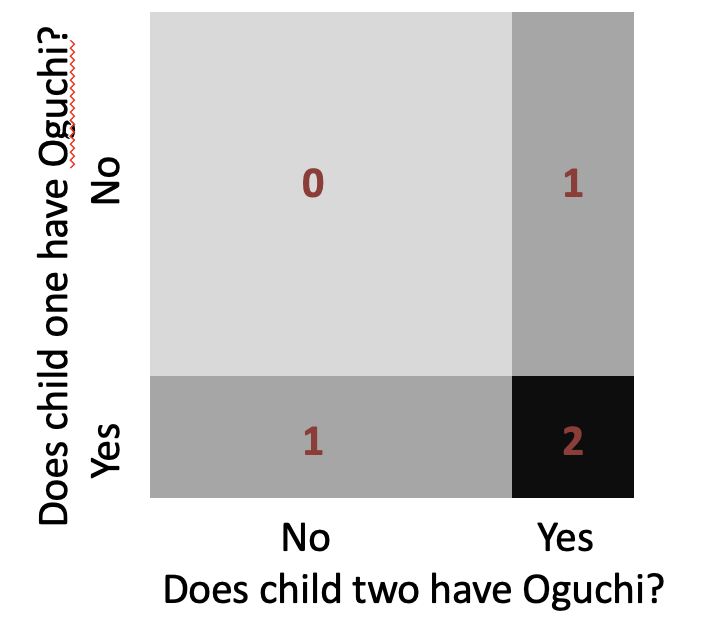
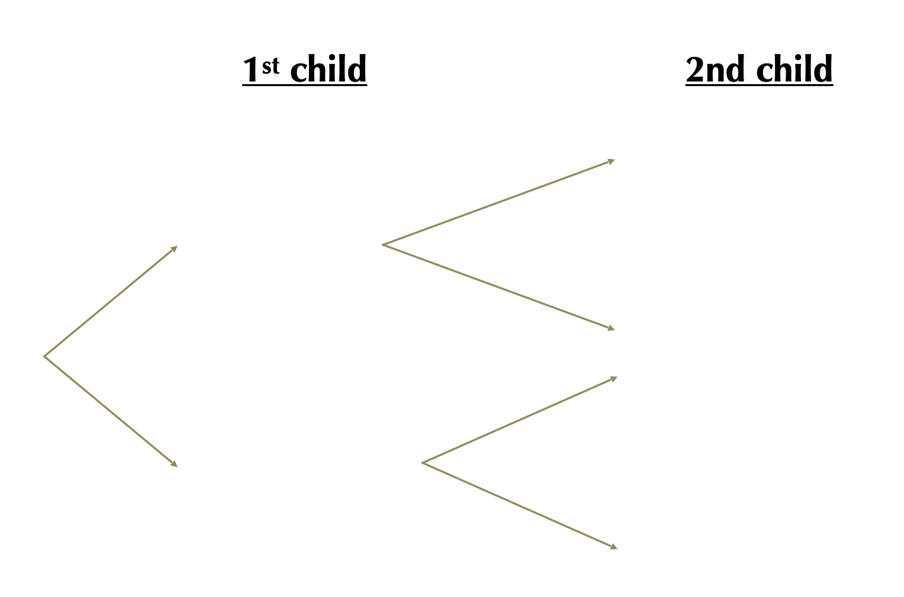
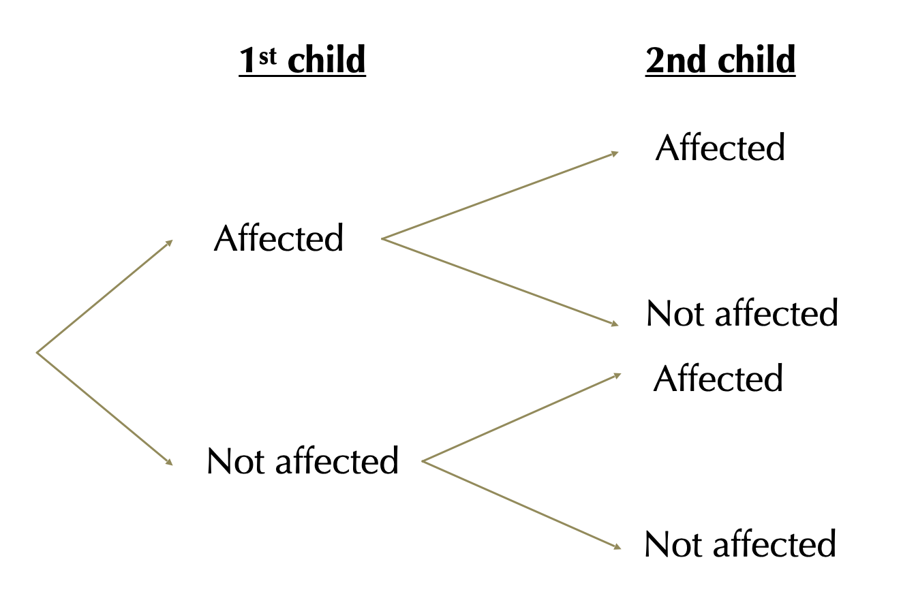
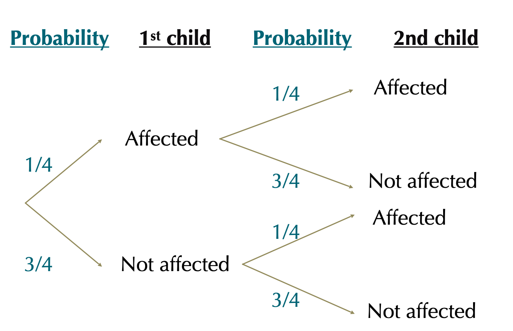
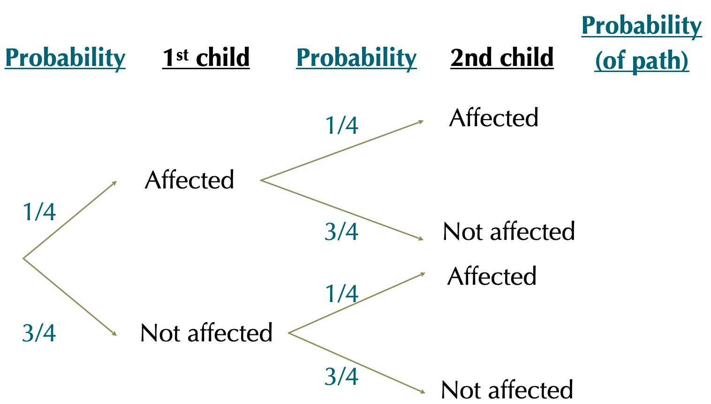
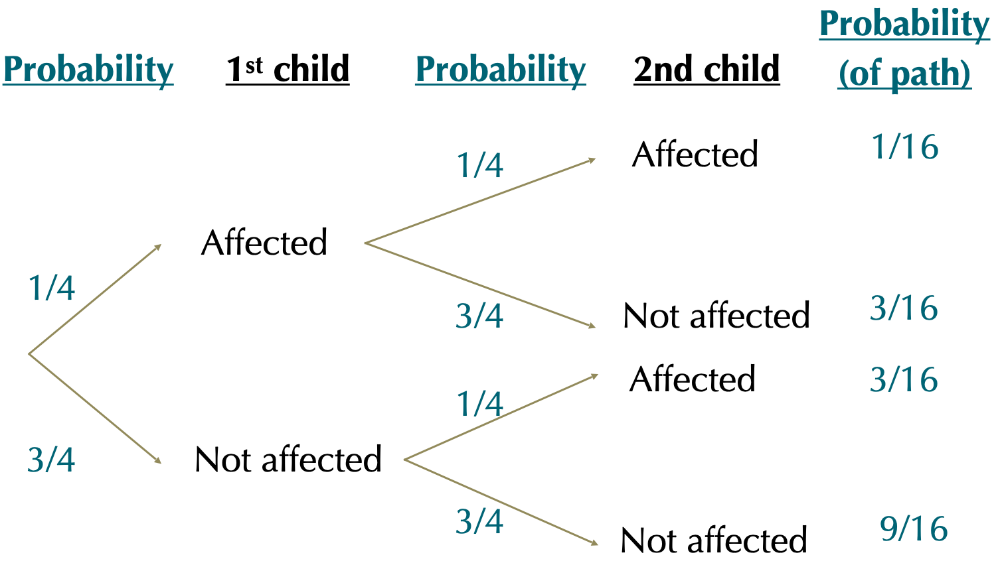
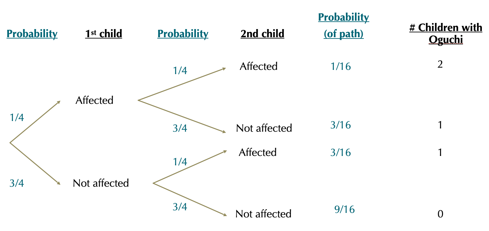
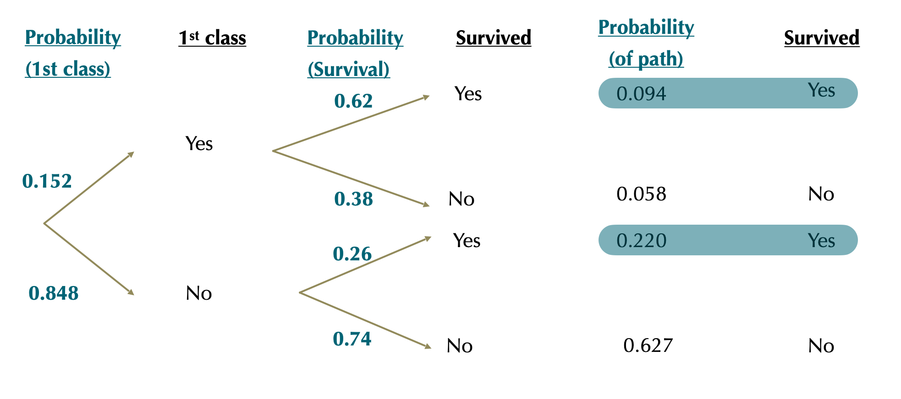
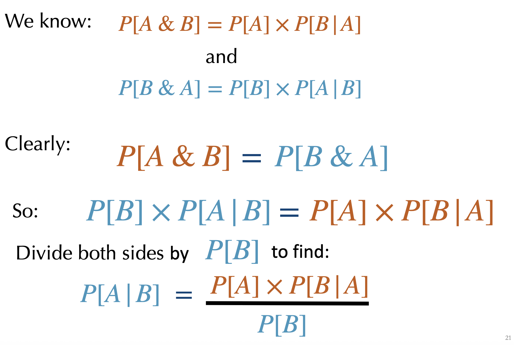

```{r setup, include=FALSE}
knitr::opts_chunk$set(echo = FALSE)
library(tidyverse)
library(forcats)
library(dplyr)
library(ggplot2)
library(ggforce)
library(tidyr)
library(stringr)
library(knitr)
library(ggthemes)
library(wesanderson)
library(gt)
library(RColorBrewer)
library(plotly)
library(readr)
library(thematic)

gg_color_hue <- function(n) {
  hues = seq(15, 375, length = n + 1)
  hcl(h = hues, l = 65, c = 100)[1:n]
}
source("bb_theme.R")

# set the theme
theme_set(bb_theme())
#theme_set(theme_bw())
#thematic_rmd(font = "Roboto Condensed", qualitative = asteroidcity1())
set.seed(12345)

tigerData<-read.csv("~/Documents/GitHub/DataSetsb215/data-raw/chap02e2aDeathsFromTigers.csv")

DieRoll<-function(times = 1){
  sample(x = 1:6,size = times, replace = T)
}

## to fix annoying ggplot2 issue ----
##https://rstudio-pubs-static.s3.amazonaws.com/991178_746a3f129f4d46829bda51127a8cb8f7.html
StatCount2 <- ggproto(
  "StatCount2", StatCount,
  compute_panel = function (self, data, scales, ...) {
    if (ggplot2:::empty(data)) 
      return(ggplot2:::data_frame0())
    groups <- split(data, data$group)
    stats <- lapply(groups, function(group) {
      self$compute_group(data = group, scales = scales, ...)
    })
    non_constant_columns <- character(0)
    
    stats <- mapply(function(new, old) {
      if (ggplot2:::empty(new)) return(ggplot2:::data_frame0())
      # Edit 1: Identify exceptions where a variable is constant *within values of x*
      within_x_constant <- vapply(old, function(x) nlevels(interaction(x, old$x, drop = TRUE)) == max(old$x), logical(1L))
      # Edit 2: Columns to keep
      kept <- unique(old[, within_x_constant])
      # Edit 3: Don't test non-constant-ness of `kept` columns
      old <- old[, !(names(old) %in% c(names(new), names(kept))), drop = FALSE]
      non_constant <- vapply(old, function(x) length(unique0(x)) > 1, logical(1L))
      non_constant_columns <<- c(non_constant_columns, names(old)[non_constant])
      # Edit 4: Add `kept` columns
      vctrs::vec_cbind(
        new,
        kept[, setdiff(names(kept), "x"), drop = FALSE],
        old[rep(1, nrow(new)), setdiff(names(old), names(kept)), drop = FALSE],
      )
    }, stats, groups, SIMPLIFY = FALSE)
    
    non_constant_columns <- ggplot2:::unique0(non_constant_columns)
    dropped <- non_constant_columns[!non_constant_columns %in% self$dropped_aes]
    if (length(dropped) > 0) {
      cli::cli_warn(c(
        "The following aesthetics were dropped during statistical transformation: {.field {glue_collapse(dropped, sep = ', ')}}",
        "i" = "This can happen when ggplot fails to infer the correct grouping structure in the data.",
        "i" = "Did you forget to specify a {.code group} aesthetic or to convert a numerical variable into a factor?"
      ))
    }

    # Finally, combine the results and drop columns that are not constant.
    data_new <- ggplot2:::vec_rbind0(!!!stats)
    data_new[, !names(data_new) %in% non_constant_columns, drop = FALSE]
  }
)
```

## Announcements

-   Please answer this poll before 10/20:
    https://piazza.com/class/mekmad7xwqw14d/post/13

-   Exam content will be up to 10/20 (more on Piazza, stay tuned)

-   PS2 posted yesterday (due 10/22)

-   Coding Assignment 1 will be posted by Friday

## Outline

-   Probability rules
    -   ~~the addition principle~~
    -   addition principle: one more example
    -   the general multiplication principle
    -   using probability trees to solve probability problems
    -   dependent events and conditional probabilities
    -   the Law of Total Probability
-   Principles
    -   Bayes theorem

## Recap: Addition Principle

-   The probability of OR involves addition:
    $P[A \text{ OR } B] = P[A] + P[B]− P[A \& B]$

-   If two events are mutually exclusive: P\[A & B\] = 0

::: goal
Therefore for mutually exclusive events: $P[A OR B] = P[A] + P[B]$
:::

## Example 3

::: goal
Probability that the sum of two dice is odd or between 6 and 8.
:::

. . .

-   Subtract P\[A & B\] to avoid double counting nonexclusive events:
    $P[A \text{ or } B] = P[A] + P[B] - P[A \text{ and } B]$

. . .

```{r dice-again, fig.height=5}
#| tidy: styler
two.die.revisited <- data.frame(
  Outcome =  c(2, 3, 4, 5, 6, 7, 8, 9, 10, 11, 12),
  prob    =  c(1, 2, 3, 4, 5, 6, 5, 4, 3, 2, 1) / 36) %>%
  mutate(sixeight = Outcome >5 & Outcome <9,
         odd      = Outcome %%2 ==1,
         oddandsixeight = sixeight &  odd, 
         oddorsixeight =  sixeight|odd)

dice.theme <- ggplot(two.die.revisited, aes(x = Outcome, y = prob))+
  ylab("")+
  scale_y_continuous(expand = c(0,0), limits  = c(0,.2))+ 
  scale_x_continuous(breaks = 1:12)+
  bb_theme() +
  xlab(bquote(1^{st}~+~2^{nd}~roll))


sixthrougheight <- dice.theme +  
  geom_bar(aes(fill = sixeight),stat = "identity",show.legend = FALSE) + 
  scale_fill_manual(values = c("lightgray","#006475")) 

odd <- dice.theme +  
  geom_bar(aes(fill = odd),stat = "identity",show.legend = FALSE) +
  scale_fill_manual(values = c("lightgray","#006475"))+ 
  ylab("PLUS")
seven <- dice.theme +  
  geom_bar(aes(fill = oddandsixeight),stat = "identity",show.legend = FALSE) +
  scale_fill_manual(values = c("lightgray","#C0532B"))+ 
  ylab("MINUS")

tots <- dice.theme +  geom_bar(aes(fill = oddorsixeight),stat = "identity",show.legend = FALSE) + scale_fill_manual(values = c("lightgray","#006475"))+ 
  ylab("EQUALS")  

library(patchwork)
sixthrougheight+ odd+ seven+ tots

```

##  {.dark-theme .center}

[The General Multiplication principle ("this AND that")]{.r-fit-text}

## The General Multiplication Principle

$$P[A \text{ & } B] = P[A] \times P[B|A]$$

-   The probability of "$A \text{ & }B$" equals:

    the probability of one event ***times*** the probability of the
    other, conditioned on the first.

-   Read $A\|B$ as “$A \text{ given }B$”

. . .

**Independence:**

::: incremental
-   Two events are independent if the occurrence of one gives no
    information about whether the second will occur.

-   $A$ and $B$ are independent if $P[B | A] = P[B]$
:::

::: aside
Note: (in)dependence does not imply any mechanistic or causative
relationship.
:::

## A special case of the multiplication principle

::: goal
Probabilities for independent variables
:::

-   General multiplication principle:
    $P[A \text{ & } B] = P[A] × P[B | A]$

-   If $A$ & $B$ are independent: $P[B| A] = P[B]$

-   So $P[A\text{ & }B]=P[A]\times P[B]$

-   I.e., if $A$ & $B$ are independent, the probability of
    "$A \text{ AND }B$" is the product of their probabilities.

## Example: Oguchi Disease

> Oguchi disease, also called congenital stationary night blindness,
> Oguchi type 1 or Oguchi disease 1, is an autosomal recessive form of
> congenital stationary night blindness associated with (…) abnormally
> slow dark adaptation (From: Wikipedia)

**Autosomal:** not sex chromosome;

**Recessive:** phenotype only expressed if two copies are present (in
diploids).

## Example: Oguchi Disease

::: goal
Scenario 1: If both of parents have an affected chromosome but no
disease, what’s the probability that their child will have Oguchi
disease?
:::

\[work in pairs for a few mins\]

## Oguchi Disease (answer)

**Thinking:**

A child has a ½ chance of inheriting mom’s affected chromosome AND a ½
chance of inheriting dad’s affected chromosome.

**Answer**

The probability that a given child of heterozygotes has the disease ½ x
½ = ¼.

## Scenario 2: Child of Two Oguchi Carriers

::: goal
If both of parents have an affected chromosome but no disease, what’s
the probability that ***both*** of their children will have Oguchi
disease?
:::

\[Work in pairs for a few minutes\]

## Scenario 2: Answer

::::: columns
::: {.column width="60%"}
{width="435"}

```{r oguchi, eval = F, echo = F}
punnet <- cbind(no.oguchi= c(no.oguchi = 3/4,oguchi = 1/4),
                oguchi=c(3/4 *1/4,1/4*1/4))

par(mar = c(6,2,2,0))
mosaicplot(punnet,col= c("#ad7237","#55cfd8","#9158a2","#898928"), main = "", cex.axis = 1,xlab = "Child 1", ylab=
             "Child 2")
text(x = 1.5/4, y = 2.2/4,labels = "Neither has Oguchi",cex = 1.1)
text(x = 1.5/4, y = 1/14,labels = "Child 1 has Oguchi",cex = 1.1)
text(x = 3.4/4, y = 2.2/4,labels = "Child 2 \nhas Oguchi",cex = 1.1)
text(x = 3.4/4, y = 1/14,labels = "Both \nhave Oguchi",cex = 1.1)
```
:::

::: {.column width="40%"}
$P[\text{Both kids have Oguchi}]=$

$P[\text{Child 1 has it}]\times P[\text{Child 2 has it}]\times$

$=1/4\times 1/4=1/16$
:::
:::::

## Using probability trees {.center}

## Why?

::: {r-fit-text}
Probability theory can be hard.

Being explicit about what you’re doing makes this easier.

Probability trees offer a simple way to follow accounting.
:::

## How to make probability trees

1.  Write down all possible outcomes for event one, two… etc. and
    connect them.

2.  Write down the probability of each outcome, conditional on their
    path.

3.  Multiply each value down a path to find the probability of that
    path.

    Repeat 1-3 for all paths.

4.  Find probability: sum paths that lead to the same destination - i.e.
    the same outcome.

## Scenario 3: Children of Oguchi Carriers

::: goal
If both of parents have an affected chromosome but no disease, what’s
the probability that ***none, one or both (three separate questions
here)*** of their children will have Oguchi disease?
:::

Let’s use probability trees!

## Step 1: Write down all possible outcomes



## Step 1: Write down all possible outcomes



## Step 2. Write down the probability of each outcome, conditional on their path



## Step 3. Multiply each value down a path to find the probability of that path



## Step 3. Multiply each value down a path to find the probability of that path



## Step 4. Sum paths that lead to the same destination

$P[2\text{Affected }] = 1/16$; $P[1\text{ Affected }] = 6/16$ ;
$P[0 \text{ Affected }= 9/16]$



## Dependent events & Conditional Probabilities {.dark-theme .center}

## Dependent Events

Events are dependent when the probability of one event depends on the
outcome of another.

E.g. The Probability of $A$ depends on the value of $B$.

If $A$ depends on $B$:

$$P[A\text{ & }B]\neq P[A]\times P[B]$$

## Example: Surviving the Titanic

::: goal
Of the 2092 Adults on the Titanic

-   319 \[$\approx 0.152$\] sat in 1st class.\
-   654 \[$\approx 0.312$\] survived.
:::

**Hypothesis:** ***If*** survival and sitting in 1st class are
**independent**:

$$P[\text{ 1st class & survived }] = P[\text{ 1st class }] x P[\text{ survived }]$$

-   Expected number of 1st class adults to survive:

    $0.152\times0.312=0.047424 \times2092 = 99.7256\approx100$ 1st class
    adults would survive.

-   Expected number of non-1st class adults to survive: we expect

    $0.848\times0.312=0.2649 =0.26\times2092 \approx 554$ other adults
    would survive

## Surviving the titanic

### Actually ...

-   *More* 1st class passengers survived than expected.

    -   197 of the 319 people in 1st class survived. (\~ 62%)
    -   This severely exceeds the 100 expected survivors.

-   *Fewer* other passengers survived than expected.

    -   457 of the 1773 other passengers survived. (\~ 26%)
    -   This is way less than the 554 expected survivors.

::: aside
We will learn soon how to test how likely (or unlikely) such an event is
under the assumption of independence.
:::

## Conditional Probability

-   The conditional probability of an event is the probability of that
    event occurring given that a condition is met.

-   $P[X|Y]$ (read “$|$” as "given".)

-   $P[X|Y]$ means the probability of $X$ if $Y$ is true.

## Example: Surviving the Titanic Conditional on Class

::: goal
Hypothesis: If survival and sitting in 1st class are not independent
:::

$P[\text{ Survive| Adult in 1st class}] = 197/319 = 0.62$

$P[\text{ Survive| Adult NOT in 1st class}] = 457/1773 = 0.26$

## The Law of Total Probability

> Convert conditional probabilities ($P[X|Y_{i}$\]) to total
> probabilities ($P[X]$) by weighting conditional probabilities by the
> probability of the condition ($Y_{i}$) and summing over all
> conditions.

$$P[X]=\sum{(P[X|Y_{i}]\times P[Y_{i}])}$$

## Example: The Total Probability of Surviving the Titanic

$P[X]=\sum{(P[X|Y_{i}]\times P[Y_{i}])}$

Of the 2092 Adults on the Titanic

-   319 \[$\approx0.152$\] sat in 1st class.

-   654 \[$\approx0.312$\] survived.

-   197 of the 319 people in 1st class survived. ($\approx0.62$)

-   457 of the 1773 other passengers survived. ($\approx0.26$)

## Example: The Total Probability of Surviving the Titanic

$$P[X]=\sum{(P[X|Y_{i}]\times P[Y_{i}])}$$

$P[\text{Survive}]=\sum{(P[\text{Survive}|\text{Class}_{i}]\times P[\text{Class}_{i}])}$

$P[\text{Survive}]=\sum{(P[\text{Survive}|\text{1st class}]\times P[\text{1st class}])}$

$+$

$P[\text{Survive}|\text{NOT 1st class}]\times P[\text{NOT 1st class}])$

$P[\text{Survive}]=(0.62\times 0.152)+(0.26\times 0.848)$

$P[\text{Survive}]=0.314$

## Titanic survival conditional on class with probability trees



We recover $P[\text{survive}]=0.094+0.220=0.314$

## Bayes' Theorem {.dark-theme .center}

## Bayes' Theorem: Definition

> The probability of "$A$ given $B$" equals the probability of $B$ given
> $A$ times the probability of $A$ divided by the probability of $B$.

$$P[A|B]=\frac{P[B|A] \times P[A]}{P[B]}$$

## Bayes’ Theorem: Derivation



## Bayes’ Theorem: Titanic Example

::: goal
Find the probability that an adult survivor was in 1st class.
:::

-   319 of the 2092 adults on the Titanic where in 1st class.

-   197 of the 319 adults in 1st class survived.

-   457 of the other adults survived.

$P[\text{1st class}|\text{Survive}]=?$

\[work in pairs\]

## Solution

$P[\text{1st class}|\text{Survive}]=\frac{P[\text{Survive}|\text{1st class}]\times P[\text{1st class}]}{P[\text{Survive}]}$

$P[\text{1st class}|\text{Survive}]=\frac{197/319\times(319/2092)}{[(197+457)/2092]}=0.30$

## That's all for today

{fig-alt="\"Forrest says \"And that's all I wanted to say about that\""
width="347"}
