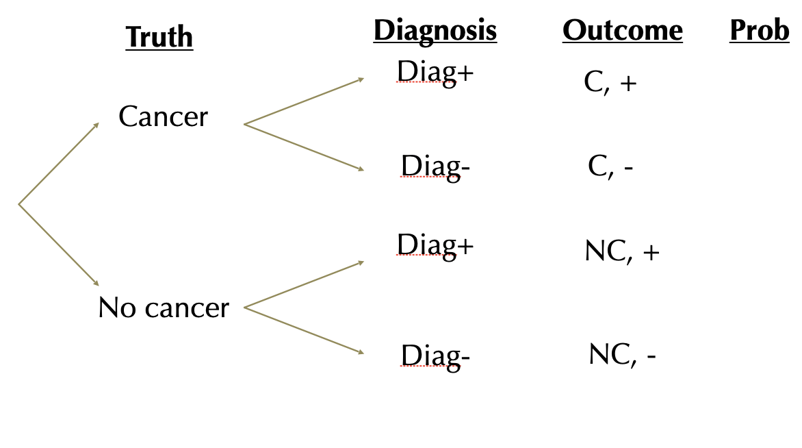
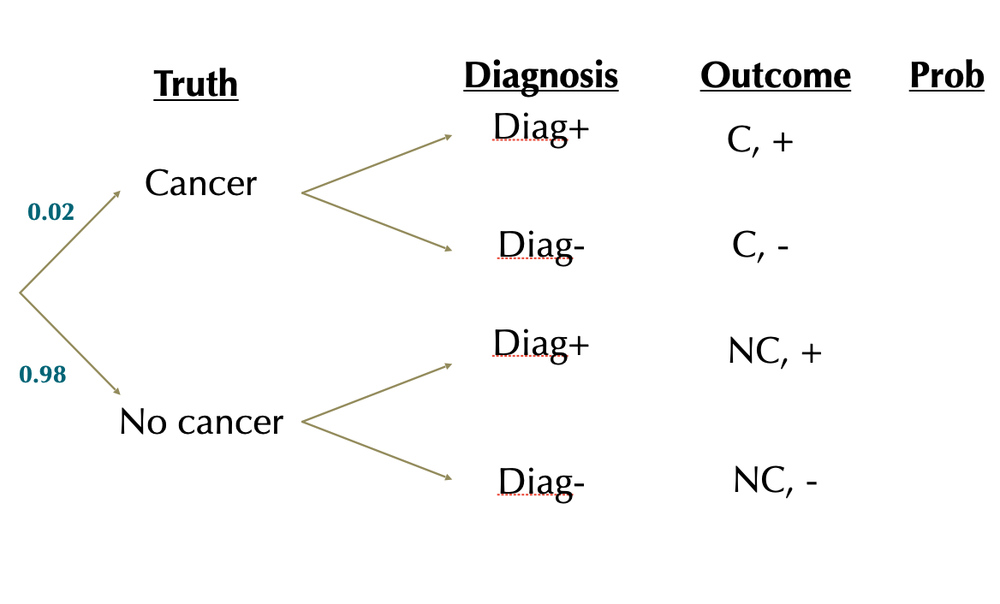
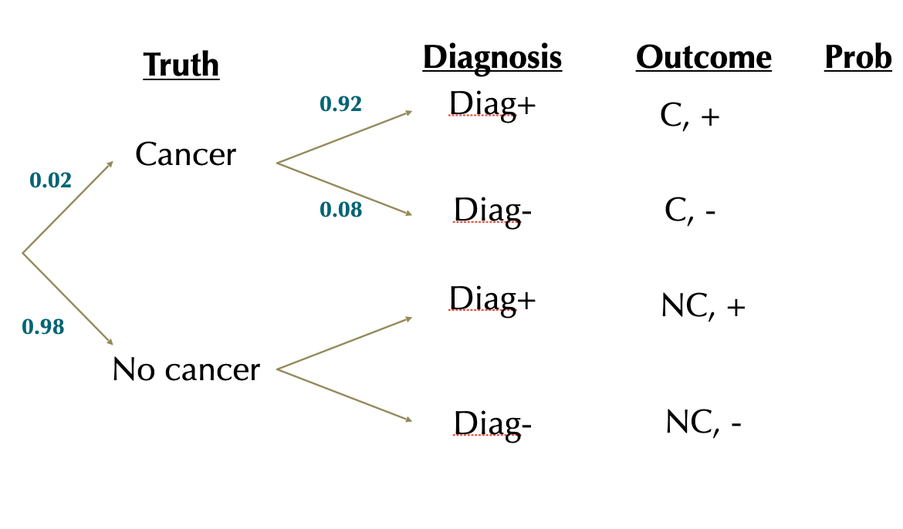
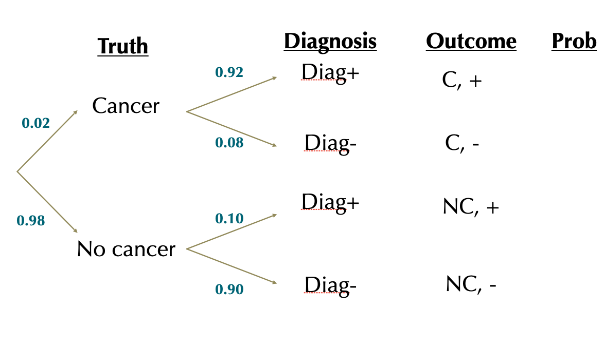
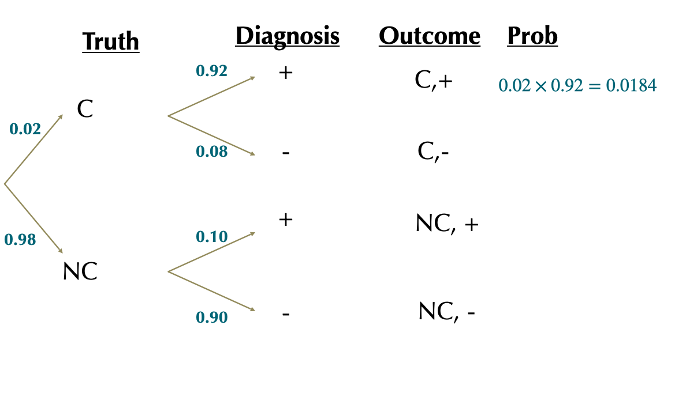
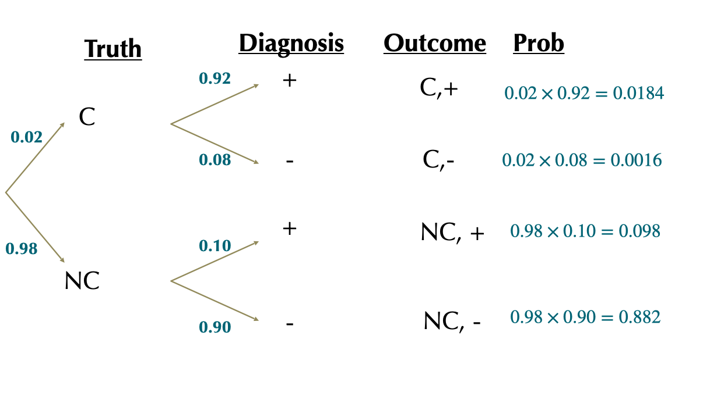
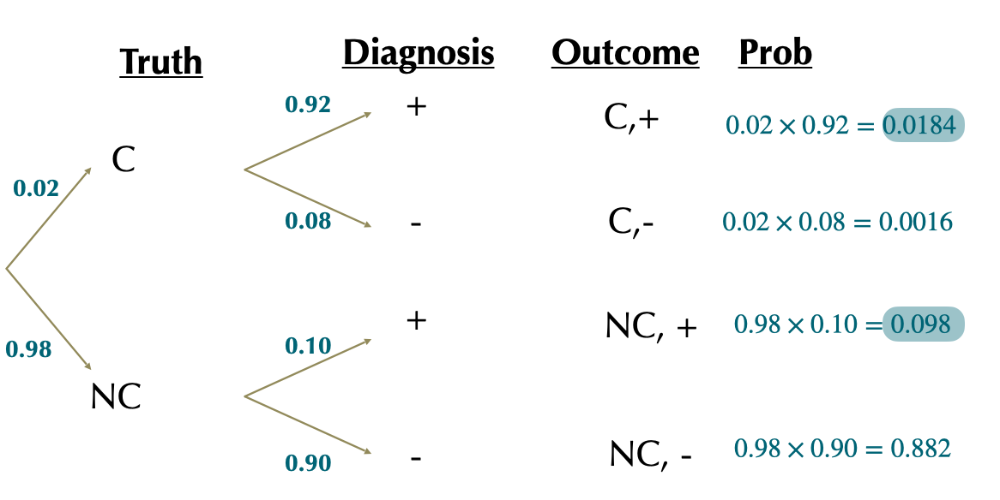
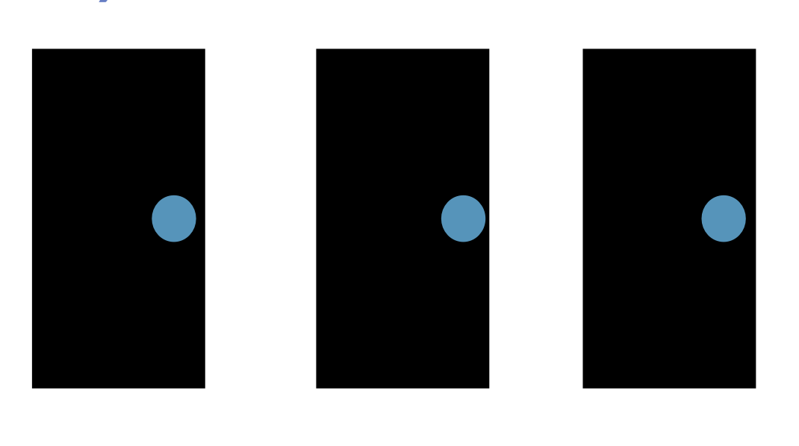
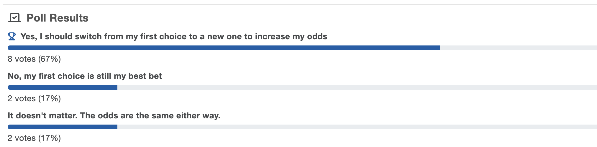
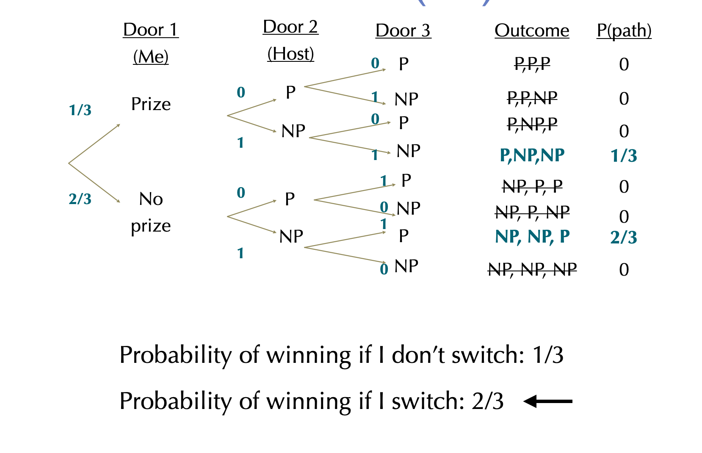

```{r setup, include=FALSE}
knitr::opts_chunk$set(echo = FALSE)
library(tidyverse)
library(forcats)
library(dplyr)
library(ggplot2)
library(ggforce)
library(tidyr)
library(stringr)
library(knitr)
library(ggthemes)
library(wesanderson)
library(gt)
library(RColorBrewer)
library(plotly)
library(readr)
library(thematic)

gg_color_hue <- function(n) {
  hues = seq(15, 375, length = n + 1)
  hcl(h = hues, l = 65, c = 100)[1:n]
}
source("bb_theme.R")

# set the theme
theme_set(bb_theme())
#theme_set(theme_bw())
#thematic_rmd(font = "Roboto Condensed", qualitative = asteroidcity1())
set.seed(12345)

tigerData<-read.csv("~/Documents/GitHub/DataSetsb215/data-raw/chap02e2aDeathsFromTigers.csv")

DieRoll<-function(times = 1){
  sample(x = 1:6,size = times, replace = T)
}

## to fix annoying ggplot2 issue ----
##https://rstudio-pubs-static.s3.amazonaws.com/991178_746a3f129f4d46829bda51127a8cb8f7.html
StatCount2 <- ggproto(
  "StatCount2", StatCount,
  compute_panel = function (self, data, scales, ...) {
    if (ggplot2:::empty(data)) 
      return(ggplot2:::data_frame0())
    groups <- split(data, data$group)
    stats <- lapply(groups, function(group) {
      self$compute_group(data = group, scales = scales, ...)
    })
    non_constant_columns <- character(0)
    
    stats <- mapply(function(new, old) {
      if (ggplot2:::empty(new)) return(ggplot2:::data_frame0())
      # Edit 1: Identify exceptions where a variable is constant *within values of x*
      within_x_constant <- vapply(old, function(x) nlevels(interaction(x, old$x, drop = TRUE)) == max(old$x), logical(1L))
      # Edit 2: Columns to keep
      kept <- unique(old[, within_x_constant])
      # Edit 3: Don't test non-constant-ness of `kept` columns
      old <- old[, !(names(old) %in% c(names(new), names(kept))), drop = FALSE]
      non_constant <- vapply(old, function(x) length(unique0(x)) > 1, logical(1L))
      non_constant_columns <<- c(non_constant_columns, names(old)[non_constant])
      # Edit 4: Add `kept` columns
      vctrs::vec_cbind(
        new,
        kept[, setdiff(names(kept), "x"), drop = FALSE],
        old[rep(1, nrow(new)), setdiff(names(old), names(kept)), drop = FALSE],
      )
    }, stats, groups, SIMPLIFY = FALSE)
    
    non_constant_columns <- ggplot2:::unique0(non_constant_columns)
    dropped <- non_constant_columns[!non_constant_columns %in% self$dropped_aes]
    if (length(dropped) > 0) {
      cli::cli_warn(c(
        "The following aesthetics were dropped during statistical transformation: {.field {glue_collapse(dropped, sep = ', ')}}",
        "i" = "This can happen when ggplot fails to infer the correct grouping structure in the data.",
        "i" = "Did you forget to specify a {.code group} aesthetic or to convert a numerical variable into a factor?"
      ))
    }

    # Finally, combine the results and drop columns that are not constant.
    data_new <- ggplot2:::vec_rbind0(!!!stats)
    data_new[, !names(data_new) %in% non_constant_columns, drop = FALSE]
  }
)
```

## Reminders/Announcements

-   PS1 grades posted over the break; please chek key carefully (I
    graded benevolently)
-   PS2 due Friday, no grace days -- will not accept late assignments
    after I post a key Sat 00:30 am
-   Coding Assignment 1 - due 11/2, resubmissions will be allowed after
    1st grading
-   Exam next week: announcement sent before breaka nd will start thread
    on Piazza this afternoon with info and space for Qs
-   Please note slight change in OH on course page
-   Please check Piazza often and participate
-   Mid semester check-in

## Recap {.dark-theme .center}

## Short summary: Multiplication Principle

-   The probability of **AND** involves multiplication:
    $P[A \& B]=P[A]\times P[B|A]$

-   If the two are independent : $P[B|A] = P[B]$

-   Therefore, for independent events: $P[A \& B]= P[A]\times P[B]$

## Short summary: Addition Principle

The probability of A **OR** B involves addition:

$P[A \text{ OR } B] = P[A] + P[B] -  P[A  \text{ & } B]$

-   if the two are mutually exclusive, $P[A  \text{ & } B] = 0$, and
    therefore $P[A \text{ or } B] = P[A] + P[B]$

## Bayes' Theorem

$$\huge{P[A|B] = \frac{P[B|A]\times P[A]}{P[B]}}$$

## Challenge: Rare Disease Diagnosis

::: goal
What proportion of women (ages 40-49) whose 1st mammogram suggests they
have breast cancer actually do have breast cancer?

-   About 20 in 1000 women (ages 40-49) have breast cancer.

-   A mammogram will reliably detect breast cancer in \~ 920 of every
    1000 patients who truly have cancer. (this is called a true
    positive" result)

-   A mammogram will incorrectly diagnose 100 of every 1000 cancer free
    patients as having cancer. (this is called a "false positive"
    result)
:::

\[work in pairs\]

::: aside
Tip: use a probability tree or Bayes' theorem
:::

## Solution 1

::: incremental
What we know:

-   Let $C$ and $NC$ be the cancer statuses and $+$ and $-$ the test
    results.

-   $P[C]=0.02$

-   $P[NC]=1-0.02=0.98$

-   $P[+|C]=0.92$

-   $P[+|NC]=0.10$

-   What we want: $P[C|+]$ or, in other words, the proportion of
    positive test cases that are actually true positives

-   What proportion of + results actually are obtained by C patients?

$\frac{P[C\& +]}{P[+]}$, but what's $P[+]$?
:::

## Solution 1 {visibility="hidden"}



## Solution 1



## Solution 1



## Solution 1



## Solution 1



## Solution 1



## Solution 1

{width="455"}

$P[+]=0.0184+0.098=0.1164$

Proportion of + tests where there actually is cancer is:

$= \frac{P[C,+]}{P[+]}=\frac{0.0184}{0.1164}=0.1578$

## Solution 2: Bayes' Theorem

-   Let $C$ and $NC$ be the cancer statuses and $+$ and $-$ the test
    results.

-   $P[C]=0.02$

-   $P[NC]=1-0.02=0.98$

-   $P[+|C]=0.92$

-   $P[+|NC]=0.10$

-   What we want: $P[C|+]$ or, in other words, the proportion of
    positive test cases that are actually true positives

-   So we want: $P[C|+]=\frac{P[+|C]\times P[C]}{P[+]}$

-   We have $P[+|C], P[C]$, but what about $P[+]$?

## Solution 2: Bayes' Theorem

::: incremental
-   So we want: $P[C|+]=\frac{P[+|C]\times P[C]}{P[+]}$

-   We have $P[+|C], P[C]$, but what about $P[+]$?

-   Law of total probability:
    $P[+]=P[+|C]\times P[C]+(P[+|NC]\times P[NC]$

-   $P[+]= (0.92\times0.02)+(0.10\times0.98)=0.0184+0.098=0.1164$

-   Now we can use Bayes' theorem:
    $P[C|+]=\frac{P[+|C]\times P[C]}{P[+]}$

-   $P[C|+]=\frac{0.92\times 0.02}{0.1164}=0.1580756\approx 0.158$
:::

## Monty Hall {.dark-theme .center}

## The problem:

-   You are a contestant in a show and you are presented with 3 doors.
    You must choose one door and you get to keep what's behind it.
    Behind one of the doors is a fancy new car
-   You pick one door (but the host doesn't open it yet)
-   At this point the host chooses one of the other two doors and opens
    it. There is a goat behind it.
-   He now offers you the chance to choose the other door (the one you
    didn't choose and hasn't been opened yet). What do you do?



## Cont.

::: panel-tabset
### Scenario:

-   There are no tricks here, just probabilityAll doors look identical.
    The host (who knows which door has the car) has a perfect poker face
    and reveals nothing
-   Because the host knows where the car is, he would never have chosen
    the door that has the car.

### Poll results



<https://piazza.com/class/mekmad7xwqw14d/post/13>
:::

## Key points to understanding the Monty Hall puzzle:

-   Two choices are 50-50 when you know nothing about them
-   Monty helps us by “filtering” the bad choices on the other side.
-   It’s a choice of a random guess and the “Champ door” that’s the best
    on the other side.
-   In general, more information means you re-evaluate your choices.

## Monty Hall: One Solution



## Monty Hall: One Solution

::: {align="center"}
<iframe src="images/monty.mp4">

</iframe>
:::

##  {.center}

::: r-fit-text
The fatal flaw in the Monty Hall paradox is not taking Monty’s filtering
into account, thinking the chances are the same before and after.

But the goal isn’t to understand this puzzle — it’s to realize how
subsequent actions & information challenge previous decisions.
:::

## Bayes’ Theorem On the Beach

[{width="400"}](https://xkcd.com/1236/)

## Probability Wrap Up

-   Probability theory provides a foundation for rigorous statistics.

-   Application of simple rules of probability facilitates the
    generation of more complex predictions.

-   We can use Bayes’ Theorem to translate between probabilistic
    statements

::: aside
Probability handout (Moodle) has more practice questions.
:::

## 

{fig-alt="\"Forrest says \"And that's all I wanted to say about that\""
width="347"}
