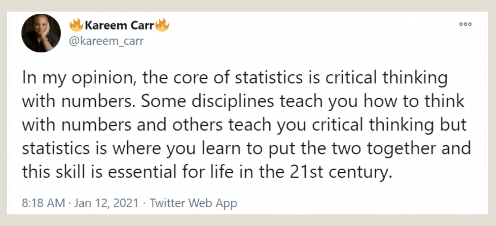
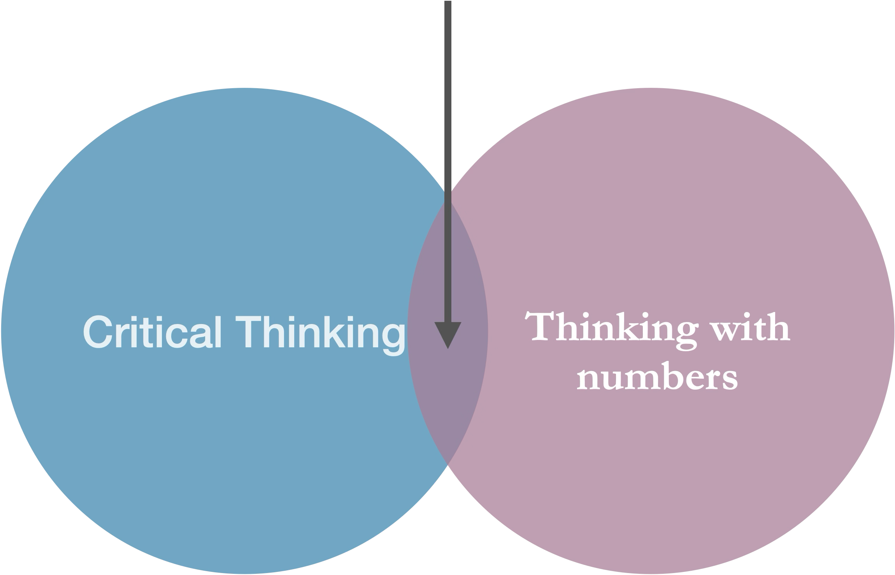
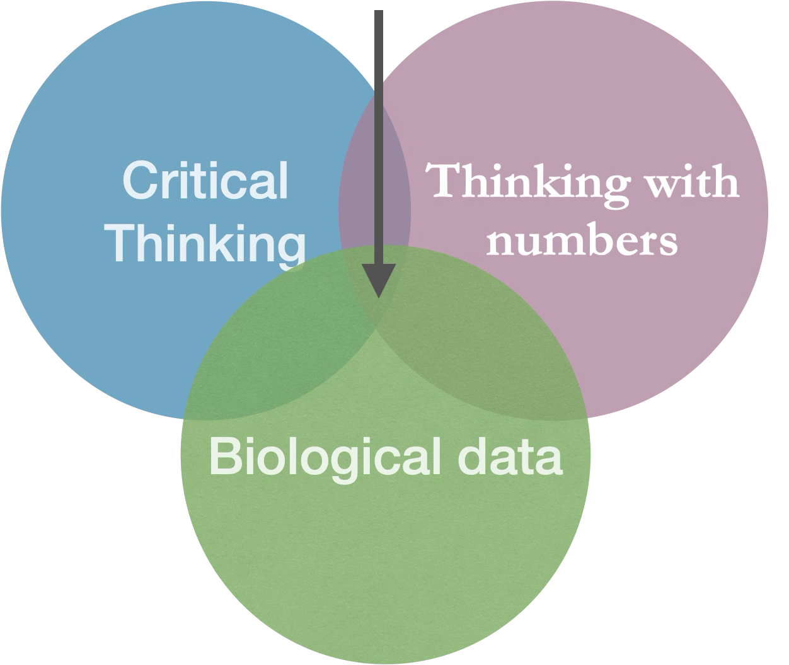
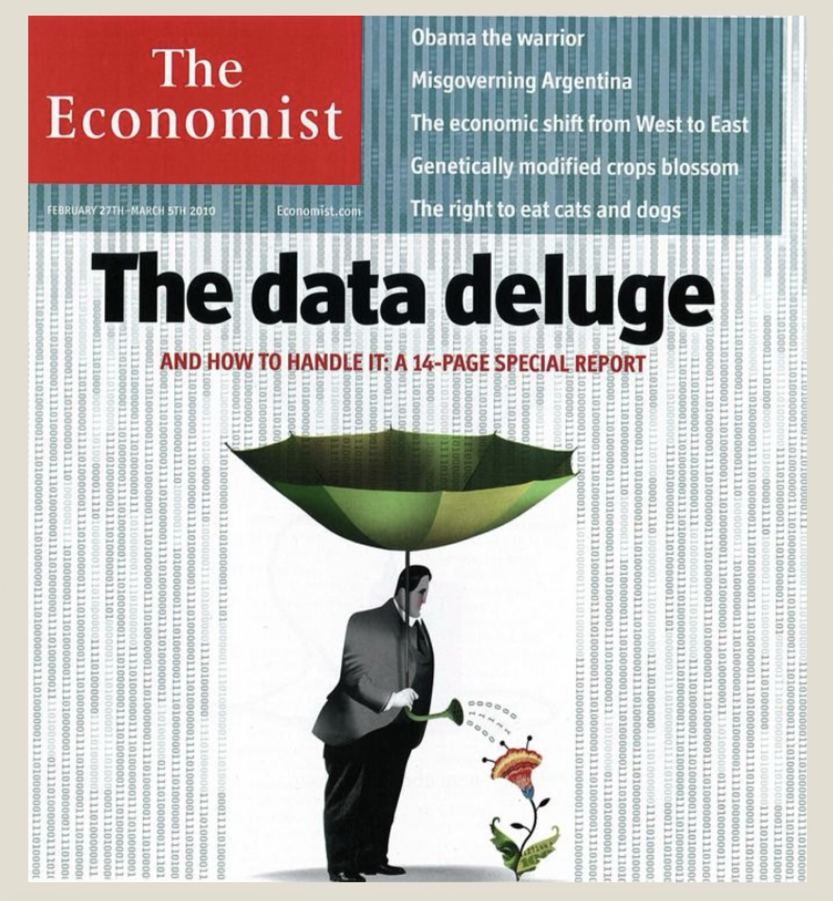
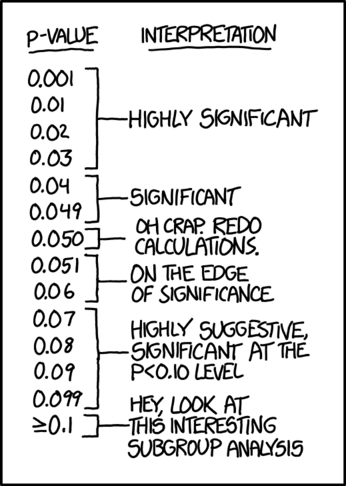
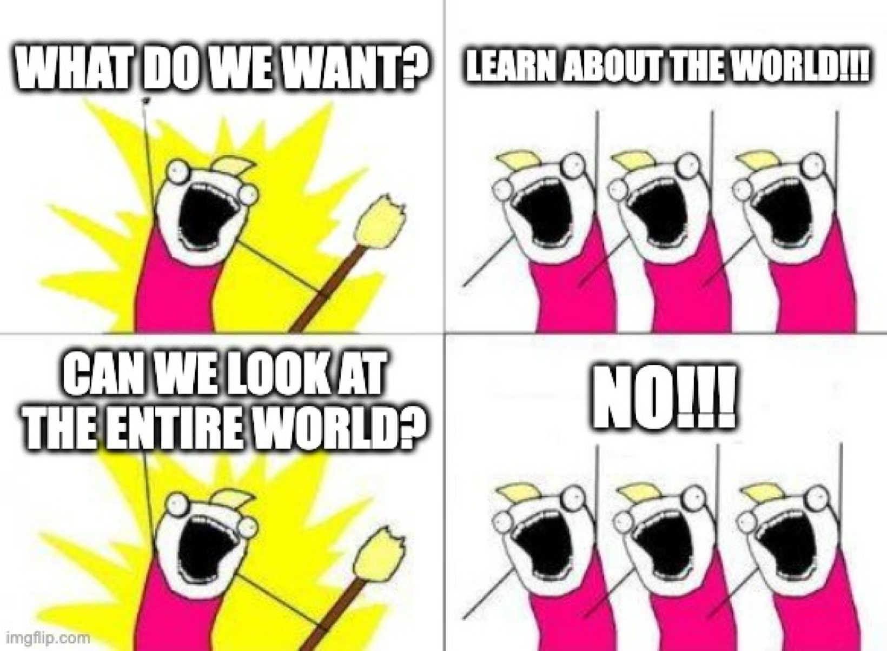
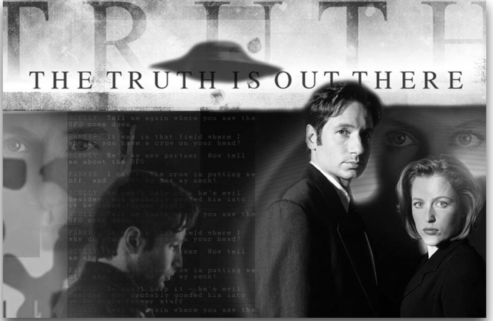
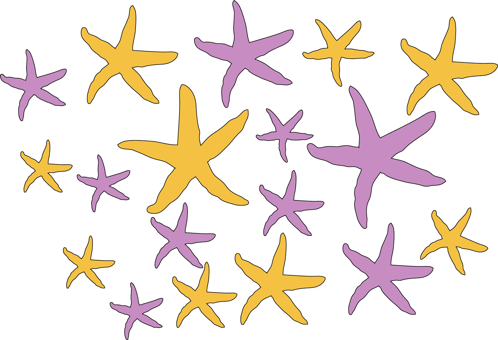
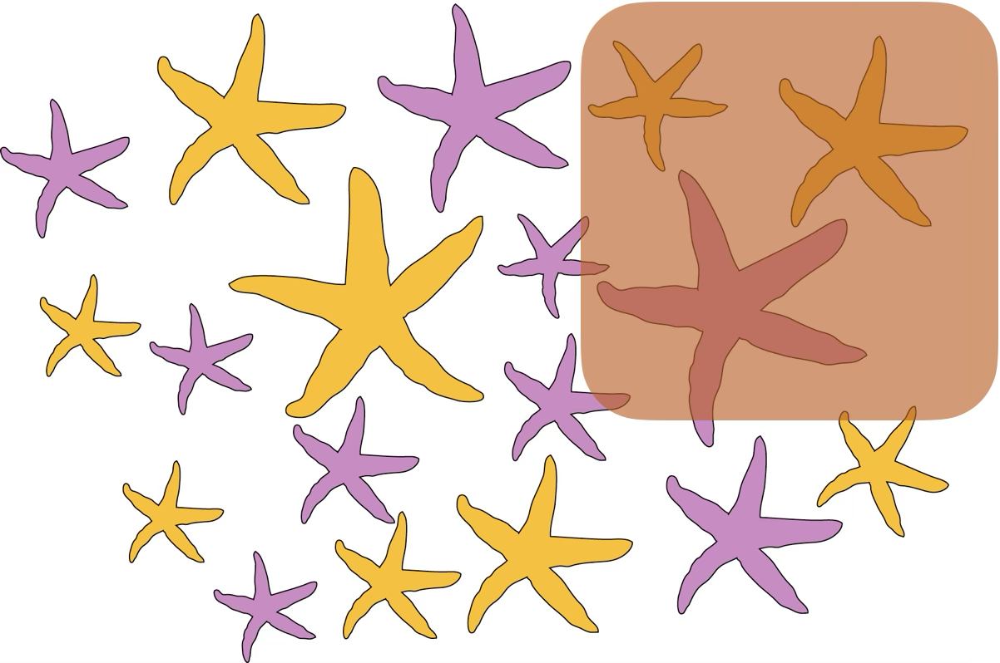

## Overview

-   **Goals of statistics**
-   **Populations and Samples**
-   **Statistics and parameters**
-   Estimate errors due to sampling
-   Types of experiments
-   Types of variables

::: aside
we will continue on this topic next time
:::

## Learning Goals

-   Understand the major goal of statistics
-   Distinguish between a sample and a population
-   Distinguish between an estimate and a parameter
-   Identify why estimates from samples may deviate from parameters of populations
-   Identify the properties of a good sample
-   Be able to detect the differences between observational and experimental studies

::: notes
These learning goals are for the entire topic/unit. They will also be available in the study guide.
:::

## What is statistics?

{fig-alt="Tweet by user @kareem_carr: “In my opinion, the core of statistics is critical thinking with numbers. Some disciplines teach you how to think with numbers and others teach you critical thinking but statistics if where you learn to put the two together and this skill is essential for life in the 21st century.” (January 12, 2021)"}

## What is statistics?

{fig-alt="venn diagram shows statistics as the intersection of critical thinking and thinking with numbers" fig-align="center" width="414"}

## What is BIOstatistics?

{fig-alt="venn diagram shows biostatistics as the intersection of critical thinking, biological data, and thinking with numbers" fig-align="center" width="496"}

## Why should *you* care about statistics?

-   Biology (ecology, genetics, immunology, microbiology, …)
-   Biomedical sciences
-   Public health
-   Data science
-   Economy, Psychology, Social Science

## Why should *anyone* care about statistics?

::::: columns
::: {.column width="\"50%\""}
-   Good science!
-   Critical evaluation of “scientific evidence”
-   Statistics and probability are not intuitive
-   We tend to jump to conclusions and we are very often wrong
-   Transferable skills
:::

::: column
{fig-align="center" width="339"}
:::
:::::

## Challenge: data deluge

{fig-alt="Cover of the magazine “The economist”. The heading reads: “The data deluge - And how to handle it: A 14-page special report”. Under the heading is a drawing of a person holding an umbrella in a rainstorm, but the rain is all 1s and 0s. The umbrella top is open but upside-down, collecting water which the person is using to water a plant from the handle of the umbrella." fig-align="center" width="460"}

## Challenge: understanding

{fig-alt="Comic from xfcd.com: lists p-values ranging from 0.001 to >=0.1 on the left, and on the right offers and interpretation." fig-align="center" width="467"}

## Goals

::: goal
Goal: learn about the world
:::

{fig-alt="Meme from meme generator reads: Question: ”What do we want?”, Response: “Learn about the world!!!”, question: “Can we look at the entire world?”, Response: “No!!!”." fig-align="center" width="272"}

## In practice, then...

-   Challenge: We can’t look at the whole world.

-   Solution: Take a sample and generalize outward.

## Great but...

-   New Challenge: Samples deviate from the populations by\\ luck/chance (**sampling error**) or unrepresentative sampling (**sampling bias**)

-   Solution:

    -   Estimate the values of important parameters

    -   Have measures of uncertainty for estimates

    -   Test hypotheses about those parameters

## Let's try again

-   Statistics are a [quantitative technology for empirical science]{.underline}.
-   A logic and methodology for the measurement of **uncertainty** and for an examination of that uncertainty.
-   The key word here is **uncertainty**. Statistics becomes necessary when observations are **variable**.

## What about biostats?

-   What is the motivating biological question?
-   What experiments can be done and/or data can be collected to address this question?
-   Do results support an interesting conclusion?
-   What are the shortcomings/limitations of statistical models and causal frameworks in the analysis?
-   How do I best communicate my results (including estimates, visualizations, conclusions, and caveats)?

## The Central Obsession

::::: columns
::: column
-   Question: How do we make inferences about the WORLD from our finite observations?
:::

::: column
-   Answer: Make models to account for the process of sampling and the associated hazards.
:::
:::::

## Important distinctions

-   Populations vs. samples
-   Parameters vs. estimates

## Populations

::::: columns
::: {.column width="\"50%\""}
> In Biology\| collection of interbreeding individuals of the same species that live in sufficient proximity that most mates are draw from this collection of individuals. This mostly applies to animals and, to some extent, plants.
:::

::: {.column width="\"50%\""}
> In Statistics\| the entire collection of individual units that a researcher is interested in. E.g. all women born in the US between 1990 and 200; all polar bears currently living in zoos; users of a certain social network in a certain age group; etc
:::
:::::

## Statistics & parameters

A parameter is some property of the world, i.e., the “truth”

{fig-align="center" width="605"}

::: aside
Seriously, though, \\\<3 X-files!
:::

## A population of starfish

::::: columns
::: column
-   Parameters describe populations
-   E.g. proportion of pink starfish among all starfish of a given species in a certain location
:::

::: column
{fig-alt="Several starfish, some orange, some pink." width="526"}
:::
:::::

## A sample of starfish

::::: columns
::: column
-   Estimates (statistics) approximate parameters as inferred from samples
-   We estimate the proportion of pink as inferred from this sample and extrapolate to the population as an approximation.
:::

::: column
{fig-alt="Several starfish, some orange, some pink. A rectangle surrounds three of them, one pink and two orange." width="449"}
:::
:::::

## In summary

::::: columns
::: {.column width="\"45%\""}
**Parameters and populations**

-   Parameters describe Populations
-   Because we can’t sample an entire population, we usually don’t know parameters.
:::

::: {.column width="\"45%\""}
**Estimates and samples**

-   But we can get a good sense of the parameters from estimates we make from samples.
-   Estimates approximate parameters as inferred from Samples
:::
:::::

## Sampling: What could go wrong?

Meet **sampling error** and **sampling bias**

## Sampling bias

::::: columns
::: {.column width="\"45%\""}
-   If you collected these against a dark background without careful procedures… {width="501"}
:::

::: {.column width="\"45%\""}
-   This sample is biased. There is a higher proportion of orange stars than the population from which it was taken. Therefore, it is not a representative sample of the underlying population. {width="445"}
:::
:::::

## Sampling bias

Systematic difference between parameters & estimates.

::: aside
Case study: Polls in the 1936 US Election.
:::

## The 1936 Election

:::::: r-fit-text
::::: columns
::: {.column width="\"50%\""}
{fig-alt="Picture of Alf Landon" width="244"}
:::

::: {.column width="\"50%\""}
{fig-alt="Picture of F. Roosevelt" width="206"}
:::
:::::
::::::

## 1936 Literary Digest poll

2.4 million responses to 10 million questionnaires , sent to people from telephone books and club lists.

## 1936 Literary Digest poll

```{r echo=F, fig.height=4, fig.cap="Figure made in R with code borrowed from Y. Brandvain"}
##| label: 1936-election
library(ggplot2)
source("bb_theme.R")
ggplot(data.frame(Candidate = c("Landon","Roosevelt"), 
                          support = 2.4 * c(.57,.43)),
               aes(x = Candidate , y = support, fill = Candidate)) +
  geom_bar(stat = "identity", show.legend = FALSE) +
  bb_theme() +
  ylab(label = "support (millions of respondents)")+
  geom_hline(yintercept = seq(0,1.40,.50), color = "white") +
  coord_flip() +
  ##theme(plot.title = element_text(size = 22),
  ##      axis.title = element_text(size = 18),
  ##      axis.text.x=element_text(size=16),
  ##      axis.text.y=element_text(size=16)) +
  scale_y_continuous(expand = c(0,0)) +
  ggtitle(label = "1936 literary digest poll results")
```

## Election: Roosevelt won in a landslide


## Sampling Bias in the 1936 Polls

-   Questionnaire was more likely to reach rich people (who could afford phones & attend book clubs) than those with fewer means.
-   Voting and party preference are correlated with wealth.
-   Poorer people (underrepresented in the poll) supported Roosevelt, carrying him to victory.

## That's all for today

{fig-alt="Forrest says \"And that's all I wanted to say about that\"" width="347"}
