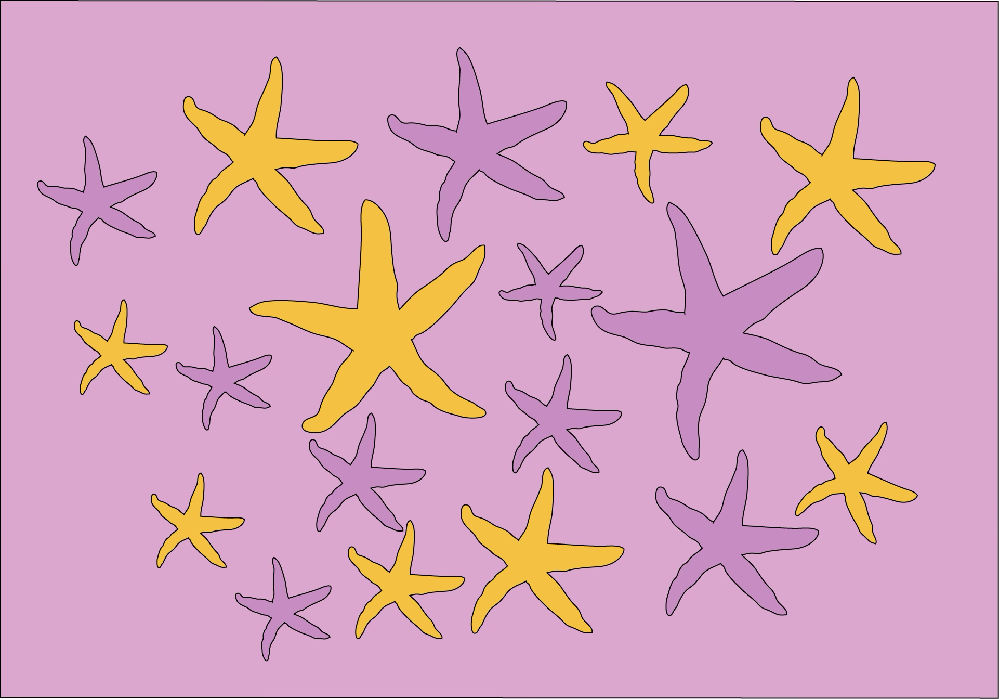
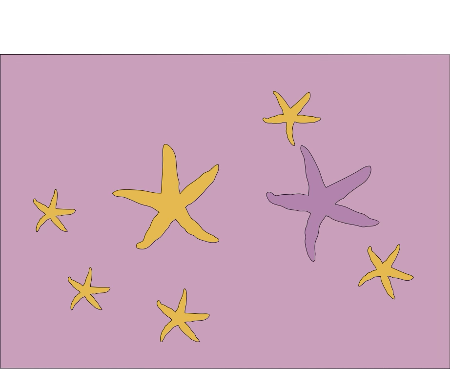
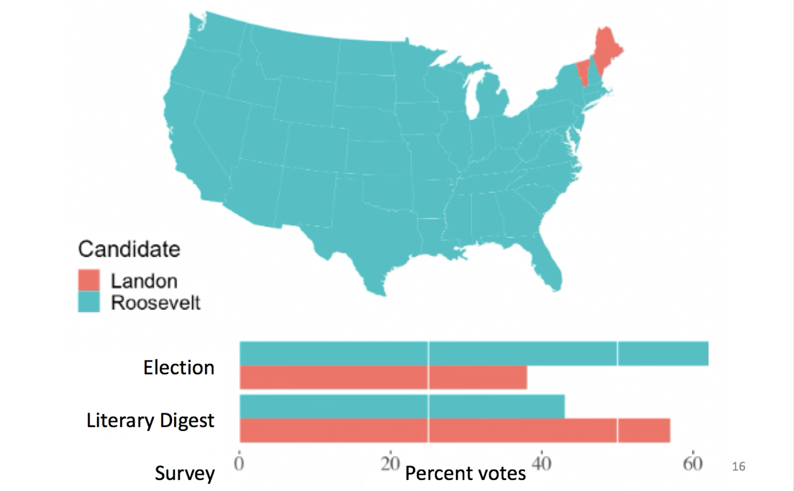
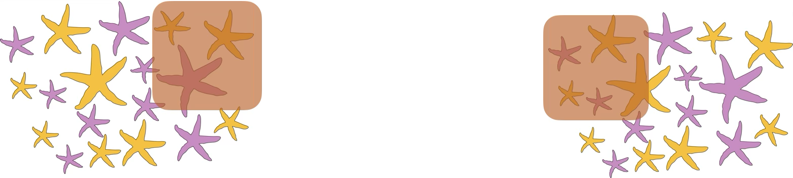
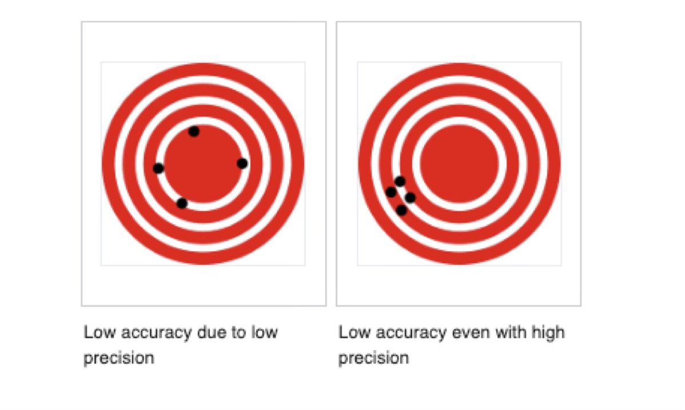
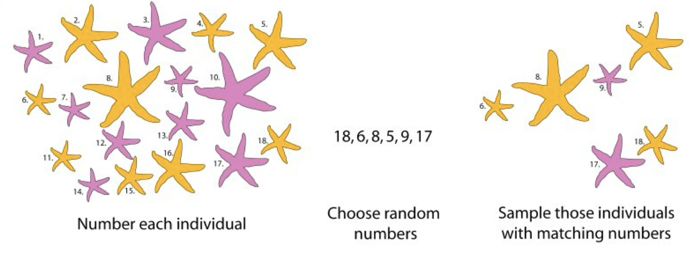

## Quick recap

Last lecture we discussed:

-   Population vs. sample
-   Parameter vs. estimate
-   The two types of errors associated with sampling: sampling error and sampling bias

::: notes
Ask for volunteers to remind these concepts
:::

## Today

::: nonincremental
-   ~~Goals of statistics~~
-   ~~Populations and Samples~~
-   ~~Statistics and parameters~~
-   **Estimate errors due to sampling**
-   **Types of experiments**
-   **Types of variables**
-   **Types of studies**
:::

## Learning Goals

::: nonincremental
-   ~~Understand the major goal of statistics~~
-   ~~Distinguish between a sample and a population~~
-   ~~Distinguish between an estimate and a parameter~~
-   **Identify why estimates from samples may deviate from parameters of populations**
-   **Identify the properties of a good sample**
-   **Be able to detect the differences between observational and experimental studies**
:::

::: notes
These learning goals are for the entire topic/unit. They will also be available in the study guide.
:::

## Sampling: What could go wrong?

Meet **sampling error** and **sampling bias**

## Sampling bias

::::: columns
::: {.column width="\"45%\""}
-   If you collected these against a dark background without careful procedures… {width="501"}
:::

::: {.column width="\"45%\""}
-   This sample is biased. There is a higher proportion of orange stars than the population from which it was taken. Therefore, it is not a representative sample of the underlying population. {width="445"}
:::
:::::

## Sampling bias

Systematic difference between parameters & estimates.

::: aside
Case study: Polls in the 1936 US Election.
:::

## The 1936 Election

:::::: r-fit-text
::::: columns
::: {.column width="\"50%\""}
{fig-alt="Picture of Alf Landon" width="244"}
:::

::: {.column width="\"50%\""}
{fig-alt="Picture of F. Roosevelt" width="206"}
:::
:::::
::::::

## 1936 Literary Digest poll

2.4 million responses to 10 million questionnaires , sent to people from telephone books and club lists.

## 1936 Literary Digest poll

```{r echo=F, fig.height=4, fig.cap="Figure made in R with code borrowed from Y. Brandvain"}
##| label: 1936-election
library(ggplot2)
source("bb_theme.R")
ggplot(data.frame(Candidate = c("Landon","Roosevelt"), 
                          support = 2.4 * c(.57,.43)),
               aes(x = Candidate , y = support, fill = Candidate)) +
  geom_bar(stat = "identity", show.legend = FALSE) +
  bb_theme() +
  ylab(label = "support (millions of respondents)")+
  geom_hline(yintercept = seq(0,1.40,.50), color = "white") +
  coord_flip() +
  ##theme(plot.title = element_text(size = 22),
  ##      axis.title = element_text(size = 18),
  ##      axis.text.x=element_text(size=16),
  ##      axis.text.y=element_text(size=16)) +
  scale_y_continuous(expand = c(0,0)) +
  ggtitle(label = "1936 literary digest poll results")
```

## Election: Roosevelt won in a landslide



## Sampling Bias in the 1936 Polls

-   Questionnaire was more likely to reach rich people (who could afford phones & attend book clubs) than those with fewer means.
-   Voting and party preference are correlated with wealth.
-   Poorer people (underrepresented in the poll) supported Roosevelt, carrying him to victory.

## Volunteer bias

::: goal
Volunteers for a study are likely to be different, on average, from the population. Also known as "self-selection" bias.
:::

For example:

-   Volunteers for sex studies are more likely to be open about sex.
-   In surveys about sexual activity, gender biases answers in opposite directions.
-   Volunteers for medical studies may be sicker than the general population.
-   Animals that are caught may be slower or more docile than those that are not.
-   The case we saw about the 1936 U.S. elections.

::: notes
Ask for volunteers to name some. The US elections example also involves sample of convenience.
:::

## Selection bias

[{fig-alt="[Blondie is standing on a podium behind a lectern with a microphone. She is standing under a hanging sign with large text. In front of the podium is an audience of five seated persons all with their hands raised above their heads. The audience includes two guys that look like Cueball, Hairbun, and two other persons with dark and blonde hair.]     Sign: Statistics Conference 2022     Blondie: Raise your hand if you’re familiar with selection bias.      Blondie: As you can see, it’s a term most people know..." fig-align="center" width="425"}](https://xkcd.com/2618/)

## Sample of convenience

::: goal
A sample of convenience is a collection of individuals that happen to be available at the time.
:::

Other definitions[^1]:

[^1]: Andrade C (2021). The Inconvenient Truth About Convenience and Purposive Samples. Indian J Psychol Med, 43(1):86-88. DOI: 10.1177/0253717620977000

> A convenience sample is the one that is drawn from a source that is conveniently accessible to the researcher.

> A purposive sample is the one whose characteristics are defined for a purpose that is relevant to the study.

## Sample of convenience

Problems:

::: nonincremental
-   "In research, we therefore implicitly seek to generalize the findings from our sample to the entire population, present and future."[^2]
:::

[^2]: Andrade C (2021). Indian J Psychol Med, 43(1):86-88. DOI: 10.1177/0253717620977000

::: incremental
-   low generalizability. What is true for your sample might not reflect what is true for the population.
-   in practice, you can only generalize findings to the subpopulation from which the sample was taken from.
-   sometimes, a sample of convenience is the best option researchers have (e.g. studies that extract data from national healthcare or insurance databases)
-   It is rarely possible to draw a truly random sample from the population
:::

. . .

This does not invalidate the studies in question. They can have high "internal validity". The issue is with generalizing, i.e, its external validity.

. . .

::: notes
However, this is possible only if our sample is representative of the population; a sample is likely to be representative of the population only if it is randomly drawn from the population.
:::

## What about sampling error?

::: goal
Sampling error: Chance deviations between estimates and the truth.
:::

. . .

Even when you did NOTHING wrong.

. . .

. . .

::: goal
Sampling error is the difference between the estimate and its true parameter value — and it can be quantified!
:::

## Example of sampling error

```{r, echo  = F, eval = T}
library(tidyverse)
source("bb_theme.R")
p1<-iris |> 
  ggplot(aes(x= Species, fill = Species)) + 
  geom_bar() + 
  scale_fill_manual(values = wesanderson::wes_palette("AsteroidCity1")) + bb_theme() + 
  theme(legend.position="none") +
  ggtitle("Full 'IRIS' dataset\n(n = 150)") +
  xlab("")
p2<-iris |> sample_n(size = 20) |>
  ggplot(aes(x = Species, fill = Species)) + 
  geom_bar() + 
  scale_fill_manual(values = wesanderson::wes_palette("AsteroidCity1")) +  bb_theme() + 
  theme(legend.position="none")+
  ggtitle("Random sample\n (n = 20)") +
  xlab("")
p3<-iris |> sample_n(size = 20) |>
  ggplot(aes(x = Species, fill = Species)) + 
  geom_bar() + 
  scale_fill_manual(values = wesanderson::wes_palette("AsteroidCity1")) + bb_theme() + 
  theme(legend.position="none") +
  ggtitle("Another random sample\n (n = 20)") +
  xlab("")
library(patchwork)
p1 + p2 + p3

```

::: aside

The iris data set gives the measurements (in cm) of the variables sepal length and width and petal length and width for 50 flowers from each of 3 species of iris. The species are *Iris setosa*, *Iris versicolor*, and *Iris virginica*.
:::

## Sampling error declines with sample size 

```{r, echo  = F, eval = T}
library(tidyverse)
source("bb_theme.R")

p1<-iris |> sample_n(size = 10) |>
  ggplot(aes(x = Species, fill = Species)) + 
  geom_bar() + 
  scale_fill_manual(values = wesanderson::wes_palette("AsteroidCity1")) +  bb_theme() + 
  theme(legend.position="none")+
  ggtitle("Random sample\n (n = 10)") +
  xlab("")
p2<-iris |> sample_n(size = 50) |>
  ggplot(aes(x = Species, fill = Species)) + 
  geom_bar() + 
  scale_fill_manual(values = wesanderson::wes_palette("AsteroidCity1")) + bb_theme() + 
  theme(legend.position="none") +
  ggtitle("Random sample\n (n = 50)") +
  xlab("")
p3<-iris |> sample_n(size = 100) |>
  ggplot(aes(x = Species, fill = Species)) + 
  geom_bar() + 
  scale_fill_manual(values = wesanderson::wes_palette("AsteroidCity1")) + bb_theme() + 
  theme(legend.position="none") +
  ggtitle("Random sample\n (n = 100)") +
  xlab("")
p4<-iris |> sample_n(size = 130) |>
  ggplot(aes(x = Species, fill = Species)) + 
  geom_bar() + 
  scale_fill_manual(values = wesanderson::wes_palette("AsteroidCity1")) + bb_theme() + 
  theme(legend.position="none") +
  ggtitle("Random sample\n (n = 130)") +
  xlab("")
library(patchwork)
(p1 + p2) / (p3 + p4)

```

## Estimates are random variables

-   Because an estimate is a random variable, the value of an estimate is influenced by chance.

-   Therefore estimates will differ among random samples from the same population.



::: notes
we're assuming here that we don't have the bias issue discussed for this example previously.
:::

## How bias and sampling error affect estimates

::::::: columns
:::: {.column width="50%"}
::: r-stack
**Sampling Bias**
:::

-   Systematic difference between estimates & parameters.
-   Driven by bias in the sampling process (i.e., sample not random in relation to the population of interest), regarless of sample size.
::::

:::: {.column width="50%\""}
::: r-stack
**Sampling Error**
:::

-   Undirected deviation of estimates away from parameters.
-   Driven by chance.
-   Decreases with sample size.
::::
:::::::

## Goals of estimation

::: goal
Accuracy (on average gets the correct answer)
:::

::: goal
Precision (gives a similar answer repeatedly)
:::

{fig-alt="Left: low accuracy due to low precision. Shot grouping shows four hits around the central circle, somewhat equi-distant from each other. right: low accuracy even with high precision. Shot grouping with four shots near each other to the left-bottom of the center of the central target."}

## Sampling error vs. bias

In this figure, the "X" is the population parameter. The circles are different estimates calculated from different samples taken from that population.

```{r biaserror, fig.height=5, fig.width=8,fig.align='center', warning=FALSE, echo = F, fig.cap = "Figure made in R with code borrowed from Y. Brandvain", fig.alt= "top left: all estimates are near each other and enar the bulls eye, so they are unbiased and precise; top right: all samples near each other but far from the bulls eye, so they are precise but also biased; bottom left, estimates are scattered 'randomly' around bulls eye, so they are unbiased but also imprecise; bottom right, samples are scattered around acenter that is not the bulls eye, so they are imprecise and biased."}
library(tidyverse)
source("bb_theme.R")
df <-  tibble(x = rnorm(n = 64, mean = rep(c(0, 1.5), each = 32), 
                                         sd = rep(c(1.5,  .4), each = 16)), 
                               y = rnorm(n = 64, mean = rep(c(0, 1.5), each = 32), 
                                         sd = rep(c(1.5,  .4), each = 16)),
                               sample = factor(1:64),
                               bias  = factor(rep(c("unbiased","biased"), each = 32), levels = c("unbiased","biased")),
                               samplingerror = factor(rep(c("imprecise","precise", "imprecise", "precise"), each = 16), levels = c("precise", "imprecise")))

ggplot(data = df, aes(x=x,y=y))+
  geom_point(aes(x=0,y=0), size = 4, shape = 4, show.legend = FALSE,stroke = 3, color = "red") +
  geom_point(size = 5, aes( color = sample),show.legend = FALSE, alpha = .4)+
  bb_theme() +
  xlim(c(-5,5)) +
  ylim(c(-5,5))+
  facet_grid(vars(samplingerror), vars(bias),switch = "y") +
  ggtitle(label = stringr::str_wrap("How sampling bias & sampling error affect estimates", width = 80)) +
  ylab("") +
  xlab("")
```

## Properties of a good sample

::: goal
Independent selection of individuals
:::

-   no influence of sampling one individual on other individuals that get sampled.

::: goal
Random selection of individuals
:::

-   each member of a population has an equal and independent chance of being selected
-   equality: probability of being selected reflects its representation in the population

::: goal
Sufficiently large
:::

-   What is the point of each of these principles in terms of sampling error and bias and accuracy and precision?

## Random samples

::: goal
Taking random samples is hard and requires effort
:::

::: nonincremental
-   Why are they important? Reduce sampling bias
-   How to get a random sample (ideal):
-   Carefully characterize a population and use computer code to select participants randomly.
:::

{fig-align="center" width="608"}


## That's all for today

{fig-alt="Forrest says \"And that's all I wanted to say about that\"" width="347"} 
