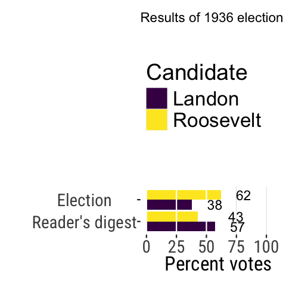

```{r setup, echo = F, cache=F}
library(tidyverse)
library(ggplot2)
library(knitr)
source("bb_theme.R")
library(maps)
library(gt)
StatCount2 <- ggproto(
  "StatCount2", StatCount,
  compute_panel = function (self, data, scales, ...) {
    if (ggplot2:::empty(data)) 
      return(ggplot2:::data_frame0())
    groups <- split(data, data$group)
    stats <- lapply(groups, function(group) {
      self$compute_group(data = group, scales = scales, ...)
    })
    non_constant_columns <- character(0)
    
    stats <- mapply(function(new, old) {
      if (ggplot2:::empty(new)) return(ggplot2:::data_frame0())
      # Edit 1: Identify exceptions where a variable is constant *within values of x*
      within_x_constant <- vapply(old, function(x) nlevels(interaction(x, old$x, drop = TRUE)) == max(old$x), logical(1L))
      # Edit 2: Columns to keep
      kept <- unique(old[, within_x_constant])
      # Edit 3: Don't test non-constant-ness of `kept` columns
      old <- old[, !(names(old) %in% c(names(new), names(kept))), drop = FALSE]
      non_constant <- vapply(old, function(x) length(unique0(x)) > 1, logical(1L))
      non_constant_columns <<- c(non_constant_columns, names(old)[non_constant])
      # Edit 4: Add `kept` columns
      vctrs::vec_cbind(
        new,
        kept[, setdiff(names(kept), "x"), drop = FALSE],
        old[rep(1, nrow(new)), setdiff(names(old), names(kept)), drop = FALSE],
      )
    }, stats, groups, SIMPLIFY = FALSE)
    
    non_constant_columns <- ggplot2:::unique0(non_constant_columns)
    dropped <- non_constant_columns[!non_constant_columns %in% self$dropped_aes]
    if (length(dropped) > 0) {
      cli::cli_warn(c(
        "The following aesthetics were dropped during statistical transformation: {.field {glue_collapse(dropped, sep = ', ')}}",
        "i" = "This can happen when ggplot fails to infer the correct grouping structure in the data.",
        "i" = "Did you forget to specify a {.code group} aesthetic or to convert a numerical variable into a factor?"
      ))
    }

    # Finally, combine the results and drop columns that are not constant.
    data_new <- ggplot2:::vec_rbind0(!!!stats)
    data_new[, !names(data_new) %in% non_constant_columns, drop = FALSE]
  }
)

DieRoll<-function(times = 1){
  sample(x = 1:6,size = times, replace = T)
}
```

## Quick recap

Last lecture we introduced:

- Population vs. sample
- Parameter vs. estimate
- The two types of errors associated with sampling: sampling error and sampling bias

::: notes
Ask for volunteers to remind these concepts
:::

## Today {visibility="hidden"}

::: nonincremental
- ~~Goals of statistics~~
- ~~Populations and Samples~~
- ~~Statistics and parameters~~
- **Estimate errors due to sampling**
- **Types of experiments**
- **Types of variables**
- **Types of studies**
:::

## Statistics three broad goals:

1.  **Estimation:** estimate the values of important *parameters* and have measures of *uncertainty* for estimates

2.  **Hypothesis testing:** Test hypotheses about those parameters

3.  **Causal inference** Teasing apart causation from correlation

::: notes
Statistics claims to be obsessed with the TRUTH. It’s meant to be a way of understanding the world. It’s meant to describe and differentiate, and ideally, to tease apart causation from correlation. These three goals of statistics (below) are the beams of light we, as statisticians, try to shine on questions. That is – these three things are what you call a statistician to do.
:::

## Learning Goals

::: nonincremental
- Identify the properties of a good sample
- Distinguish between sampling bias and sampling error.
- Identify why estimates from samples may deviate from parameters of populations
- Distinguish between accuracy and precision and how these terms relate to sampling bias and sampling error.
:::


## Properties of a good sample

1.  Random

    - equality: every unit in the population must have an equal chance of being included in the sample
    - independence: the selection of any one member of the population does not in any way influence the selection of any other member.

- *Equality:* probability of being selected reflects its representation in the population

- *Independence:* no influence of sampling one individual on other individuals that get sampled.

2.  A **sufficiently large** number of individuals.

## Random samples

::: goal
Taking random samples is hard and requires effort
:::

::: nonincremental
- Why are they important? Reduce sampling bias
- How to get a random sample (ideal):
- Carefully characterize a population and use computer code to select participants randomly.
:::

{fig-align="center" width="608"}

## Random sampling in R

::: nonincremental
- If you run the code below, it is very unlikely you will get the same numbers I did
:::

- Try it in webr: <https://webr.sh/>.

- Type this code at the bottom left, in the `>` prompt and then enter/return

```{r sample}
# Sample 3 random numbers between 1 and 10
# 1. Define the numbers from which you will sample
x <- c(1, 2, 3, 4, 5, 6, 7, 8, 9, 10)
# 2. Take 3 random numbers from this set
sample(x, size = 3)
# now, to convince yourself, do it again
sample(x, size = 3)
```

##  {.center}

::: r-fit-text
[The major goal of sampling is to minimize]{.smallcaps}

[sampling error and bias in estimates.]{.smallcaps}
:::

::: notes
Sampling: What could go wrong? {visibility="hidden"}
:::

##  {.center}

::: r-fit-text
Probability Distribution vs. Frequency Distribution
:::

## Example

::::: columns
::: {.column width="60%"}

- **Probability distribution:** The proportion of the population with a given value (often approximated with a function)
:::

::: {.column width="40%"}
- **Frequency distribution:** The number of times a value occurs in a sample.
:::
:::::

```{r, fig.align="center"}

plot.one.dice.prob  <- data.frame(outcome = c(1:6), probability = 1/6) |>
ggplot(aes(x = outcome, y = probability, fill = factor(outcome))) +
  geom_bar(stat  = "identity", show.legend = FALSE) +
  ggtitle("Probability Distribution", subtitle = "Outcome of a fair die")+
  scale_x_continuous(breaks = 1:6)+
  scale_y_continuous(expand = c(0,0), limits  = c(0,.32))+
  ylab("Expected probability")+
  theme(axis.ticks = element_blank())
df <- data.frame(Outcome = DieRoll(times = 6), NrRolls = 6)

one.roll<-ggplot(df, aes(x = Outcome, fill = factor(Outcome))) + 
  geom_bar(aes(y = after_stat(count)/sum(count)), show.legend = FALSE)+
  ggtitle("Proportions Observed", subtitle = "Outcome of a fair die\n(n = 6 trials)")+
  #scale_fill_manual(values = banff())+
  scale_x_continuous(breaks = 1:12)+
  ylab(label = "Observed proportion")+
  theme(axis.ticks = element_blank())
library(patchwork)
plot.one.dice.prob + one.roll
```

::: notes
before we go into that
:::

## Estimates are random variables

- Because an estimate is a **random variable**, the value of an estimate is influenced by chance.

> A random variable can take on many different values with different probabilities. Random variables are ways to map outcomes of random processes to numbers. -- [Khan Academy](https://www.khanacademy.org/math/statistics-probability/random-variables-stats-library/random-variables-discrete/v/random-variables)

- Therefore estimates will differ among random samples from the same population.


::: notes
we're assuming here that we don't have the bias issue discussed for this example previously.
:::


## Sampling error

::: goal
Sampling error: Chance deviations between estimates and the truth due to chance/luck-- even when you did NOTHING wrong!
:::

- Sampling error is the difference between the estimate and its true parameter value — and it can be quantified!

## Sampling error and precision of an estimate

- The spread of estimates resulting from sampling error indicates the [precision]{.underline} of an estimate.

- The lower the sampling error, the higher the precision.

- All else being equal, *larger samples will have lower sampling error and higher precision* than smaller samples.

## Example of sampling error

* The parameter "probability of getting a 6" is 1/6 (~0.17). The observed proportion in six random die rolls here was 0.

```{r, echo = T, fig.height=6, fig.cap="In this context we can think of each trial (die roll) as a sample. So our sample size here is 6."}
plot.one.dice.prob + geom_hline(aes(yintercept = 1/6), lty=2)
```

```{r, echo  = F, eval = F, include=F}

p1<-iris |> 
  ggplot(aes(x= Species, fill = Species)) + 
  geom_bar() + 
  theme(legend.position="none") +
  ggtitle("Full 'IRIS' dataset\n(n = 150)") +
  xlab("")
p2<-iris |> sample_n(size = 20) |>
  ggplot(aes(x = Species, fill = Species)) + 
  geom_bar() + 
  scale_fill_manual(values = wesanderson::wes_palette("AsteroidCity1")) +
  theme(legend.position="none")+
  ggtitle("Random sample\n (n = 20)") +
  xlab("")
p3<-iris |> sample_n(size = 20) |>
  ggplot(aes(x = Species, fill = Species)) + 
  geom_bar() + 
  scale_fill_manual(values = wesanderson::wes_palette("AsteroidCity1")) +
  theme(legend.position="none") +
  ggtitle("Another random sample\n (n = 20)") +
  xlab("")
library(patchwork)
p1 + p2 + p3
#The iris data set gives the measurements (in cm) of the variables sepal length and width and petal length and width for 50 flowers from each of 3 species of iris. The species are *Iris setosa*, *Iris versicolor*, and *Iris virginica*.
```

::: aside

:::

## Sampling error declines with sample size
```{r dice3}
#| code-line-numbers: "13"
#| echo: false

df2<-data.frame(Outcome = DieRoll(times = 12), NrRolls = 12)
df2<-rbind(df2, data.frame(Outcome = DieRoll(times = 48), NrRolls = 48))
df2<-rbind(df2, data.frame(Outcome = DieRoll(times = 384), NrRolls = 384))
df<-rbind(df, data.frame(Outcome = DieRoll(times = 768), NrRolls = 768))
df2<-rbind(df2, data.frame(Outcome = DieRoll(times = 768), NrRolls = 768))
df2<-as_tibble(df2)
vir<-viridisLite::viridis(n=6)
df2<-df2 |> group_by(NrRolls, Outcome) |> count() |> ungroup() |> mutate(prop=n/NrRolls)
df2$Outcome<-factor(df2$Outcome, ordered = T)
#df2$NrRolls<-factor(df2$NrRolls)
df2<-df2 |> mutate(col = ifelse(Outcome==1, vir[1], ifelse(Outcome==2, vir[2], ifelse(Outcome==3, vir[3], ifelse(Outcome==4, vir[4], ifelse(Outcome==5, vir[5], ifelse(Outcome==6, vir[6], NA)))))))
df2  |> ggplot(aes(x=Outcome, y=prop, fill =Outcome)) + geom_col(show.legend = FALSE) + facet_wrap(vars(NrRolls)) +
  geom_hline(aes(yintercept = 1/6), lty=2)
```

```{r, echo  = F, eval = F, include = F}
p1<-iris |> sample_n(size = 10) |>
  ggplot(aes(x = Species, fill = Species)) + 
  geom_bar() + 
  scale_fill_manual(values = wesanderson::wes_palette("AsteroidCity1")) +
  theme(legend.position="none")+
  ggtitle("Random sample\n (n = 10)") +
  xlab("")
p2<-iris |> sample_n(size = 50) |>
  ggplot(aes(x = Species, fill = Species)) + 
  geom_bar() + 
  scale_fill_manual(values = wesanderson::wes_palette("AsteroidCity1")) +
  theme(legend.position="none") +
  ggtitle("Random sample\n (n = 50)") +
  xlab("")
p3<-iris |> sample_n(size = 100) |>
  ggplot(aes(x = Species, fill = Species)) + 
  geom_bar() + 
  scale_fill_manual(values = wesanderson::wes_palette("AsteroidCity1")) + 
  theme(legend.position="none") +
  ggtitle("Random sample\n (n = 100)") +
  xlab("")
p4<-iris |> sample_n(size = 130) |>
  ggplot(aes(x = Species, fill = Species)) + 
  geom_bar() + 
  scale_fill_manual(values = wesanderson::wes_palette("AsteroidCity1")) + 
  theme(legend.position="none") +
  ggtitle("Random sample\n (n = 130)") +
  xlab("")
library(patchwork)
(p1 + p2) / (p3 + p4)

```

## Mean distance from 1/6 in the previous example

```{r gt, fig.height= 6}
df2 |> 
  mutate(dist=abs(prop-1/6)) |> 
  group_by(NrRolls)|> 
  summarise(meanDist=mean(dist)) |> 
  gt()
```


## Sampling Bias

::::: columns
::: {.column width="\"45%\""}
- If you collected these against a dark background without careful procedures… {width="501"}
:::

::: {.column width="\"45%\""}
- This sample is biased. There is a higher proportion of orange stars than the population from which it was taken. Therefore, it is not a representative sample of the underlying population. {width="445"}
:::
:::::


## Sampling bias and accuracy

* **Accurate (or unbiased) estimate** estimate: the average of all estimates that we might obtain is centered on the true population value

```{r accurate, fig.caption: the deviations from 1/6 are not going in any particular direction.}
df2 |> mutate(dist=prop-1/6)  |> ggplot(aes(x =  NrRolls, y = prop)) + geom_jitter() + geom_hline(aes(yintercept = 1/6), lty=2, color=vir[2])
```

## Sampling bias case study

Sampling bias: Systematic difference between parameters & estimates.

::: goal
Case study: Polls in the 1936 US Election.
:::

:::::: r-fit-text
::::: columns
::: {.column width="\"40%\""}
{fig-alt="Picture of Alf Landon" width="244"}
:::

::: {.column width="\"60%\""}
{fig-alt="Picture of F. Roosevelt" width="200"}
:::
:::::
::::::

## 1936 Literary Digest poll

2.4 million responses to 10 million questionnaires , sent to people from telephone books and club lists.

```{r echo=F, fig.height=3, fig.cap="Figure made in R with code borrowed from Y. Brandvain", eval=F}
##| label: 1936-election
ggplot(data.frame(Candidate = c("Landon","Roosevelt"), 
                          support = 2.4 * c(.57,.43)),
               aes(x = Candidate , y = support, fill = Candidate)) +
  geom_bar(stat = "identity", show.legend = FALSE) +
  ylab(label = "support (millions of respondents)")+
  geom_hline(yintercept = seq(0,1.40,.50), color = "white") +
  coord_flip() +
  scale_y_continuous(expand = c(0,0)) +
  ggtitle(label = "1936 literary digest poll results")
```

## Election results

```{r, message=FALSE, eval = F, echo = F}
#| cap-location: margin
##| label: 1936-results
#png("images/elections-1936.png", )
us_states <- map_data("state") |> 
  filter(region != "alaska")
elect <- tibble(region = unique(us_states$region)) |>
  mutate(Candidate = case_when(region %in% c("maine","vermont") ~ "Landon",
                            !region %in% c("maine","vermont") ~ "Roosevelt")) %>%
  left_join(us_states) |>
  ggplot(aes(x = long, y = lat, group = group, fill = Candidate)) +
  ggtitle("Results of 1936 election")+
  geom_polygon(color = "gray90", size = 0.1) +
  coord_map(projection = "albers", lat0 = 39, lat1 = 45)+
  theme_map()+
  theme(legend.text=element_text(size=16),
        legend.title = element_text(size=18))

dodgewidth <- position_dodge(width=0.9)
vote <- ggplot(
  data.frame(
    Candidate = c("Landon", "Roosevelt", "Landon", "Roosevelt"),
    Percent_votes = c(38, 62, 57, 43),
    survey = factor(
      c("Election", "Election", "Reader's digest", "Reader's digest"),
      levels = c("Reader's digest", "Election")
    )
  ) ,
  aes(x = survey , y = Percent_votes, fill = Candidate)
) +
  geom_bar(stat = "identity",
           show.legend = FALSE,
           position = dodgewidth) +
  geom_text(aes(x=survey, y=Percent_votes, label=Percent_votes), position=dodgewidth, hjust=c(-1,-1, -1,-2))+
 ylab("Percent votes")+
     xlab("")+
  ylim(0,100)+
#theme_tufte() +
geom_hline(yintercept = seq(0, 51, 25), color = "white") +
   coord_flip()+
  theme(panel.grid.major.y=element_blank())
# theme(axis.title = element_text(size = 18),
#        axis.text.x=element_text(size=16),
#        axis.text.y=element_text(size=16))

elect / vote + plot_layout(widths = c(2, 2), heights = c(3, 1))
dev.off()
```

{fig-alt="A map of the U.S. showing 1936 election results: most states in yellow for Roosevelt except Maine and Vermont in dark purple for Landon. Below, a bar graph displays vote percentages: 62% for Roosevelt in the election and 43% for him in Reader's Digest compared to 38% for Landon in the election compared to 57% for him in the reader's digest survey." fig-align="center" width="318"}

##  {.center}

::: r-fit-text
What do you think happened?
:::

## Sampling Bias in the 1936 Polls!

- Questionnaire was more likely to reach rich people (who could afford phones & attend book clubs) than those with fewer means.
- Voting and party preference are correlated with wealth.
- Poorer people (underrepresented in the poll) supported Roosevelt, carrying him to victory.

## Sample of convenience

::: goal
A sample of convenience is a collection of individuals that happen to be available at the time
:::

... usually one that is drawn from a source that is conveniently accessible to the researcher.

::: aside
Andrade C (2021). The Inconvenient Truth About Convenience and Purposive Samples. Indian J Psychol Med, 43(1):86-88. DOI: 10.1177/0253717620977000
:::

## Sample of convenience: Problems

- low generalizability. What is true for your sample might not reflect what is true for the population.

- a sample is likely to be representative of the population only if it is randomly drawn from the population -- the sample of convenience violates this assumption (and sometimes also the independence assumption)

- in practice, you can only generalize findings to the subpopulation from which the sample was taken from.

## Sometimes a sample of convenience is our only option

- A sample of convenience may be the best option researchers have (e.g. studies that extract data from national healthcare or insurance databases)

- Note: It is rarely possible to draw a *truly* random sample from the population -- but we must do our best.

::: notes
This does not invalidate the studies in question. They can have high "internal validity". The issue is with generalizing, i.e, its external validity.

However, this is possible only if our sample is representative of the population; a sample is likely to be representative of the population only if it is randomly drawn from the population.
:::

## Selection bias

[{fig-alt="[Blondie is standing on a podium behind a lectern with a microphone. She is standing under a hanging sign with large text. In front of the podium is an audience of five seated persons all with their hands raised above their heads. The audience includes two guys that look like Cueball, Hairbun, and two other persons with dark and blonde hair.]     Sign: Statistics Conference 2022     Blondie: Raise your hand if you’re familiar with selection bias.      Blondie: As you can see, it’s a term most people know..." fig-align="center" width="425"}](https://xkcd.com/2618/)

## Volunteer bias

::: goal
Volunteers for a study are likely to be different, on average, from the population. Also known as "self-selection" bias.
:::

For example:

- Volunteers for sex studies are more likely to be open about sex.
- In surveys about sexual activity, gender biases answers in opposite directions.
- Volunteers for medical studies may be sicker than the general population.
- Animals that are caught may be slower or more docile than those that are not.
- The case we saw about the 1936 U.S. elections.

::: notes
Ask for volunteers to name some. The US elections example also involves sample of convenience.
:::


## How bias and sampling error affect estimates

::: notes

In summary

:::

::::::: columns
:::: {.column width="50%"}
::: r-stack
**Sampling Bias**
:::

- [Systematic]{.underline} difference between estimates & parameters.
- Driven by bias in the sampling process (i.e., sample not random in relation to the population of interest), *regarless of sample size*.
::::

:::: {.column width="50%\""}
::: r-stack
**Sampling Error**
:::

- Undirected deviation of estimates away from parameters.
- [Driven by chance]{.underline}.
- Decreases with sample size.
::::
:::::::

## Goals of estimation: visual summary

::: goal
Accuracy (on average gets the correct answer).
:::

::: goal
Precision (gives a similar answer repeatedly). If unbiased, those estimated are centered around the true value (parameter).
:::

{fig-alt="Left: low accuracy due to low precision. Shot grouping shows four hits around the central circle, somewhat equi-distant from each other. right: low accuracy even with high precision. Shot grouping with four shots near each other to the left-bottom of the center of the central target."}

## Sampling error vs. bias: visual summary

In this figure, the "X" in the middle is the population parameter. The circles are different estimates calculated from different samples taken from that population.

```{r biaserror, fig.height=5, fig.width=8,fig.align='center', warning=FALSE, echo = F, fig.cap = "Figure made in R with code borrowed from Y. Brandvain", fig.alt= "top left: all estimates are near each other and enar the bulls eye, so they are unbiased and precise; top right: all samples near each other but far from the bulls eye, so they are precise but also biased; bottom left, estimates are scattered 'randomly' around bulls eye, so they are unbiased but also imprecise; bottom right, samples are scattered around acenter that is not the bulls eye, so they are imprecise and biased."}

df <-  tibble(x = rnorm(n = 64, mean = rep(c(0, 1.5), each = 32),sd = rep(c(1.5,  .4), each = 16)),  y = rnorm(n = 64, mean = rep(c(0, 1.5), each = 32),  sd = rep(c(1.5,  .4), each = 16)),sample = factor(1:64),
 bias  = factor(rep(c("unbiased","biased"), each = 32), levels = c("unbiased","biased")),
samplingerror = factor(rep(c("imprecise","precise", "imprecise", "precise"), each = 16), levels = c("precise", "imprecise")))

ggplot(data = df, aes(x=x,y=y))+
  geom_point(aes(x=0,y=0), size = 4, shape = 4, show.legend = FALSE,stroke = 3, color = "darkred") +
  geom_point(size = 5, aes( color = sample),show.legend = FALSE, alpha = .4)+
  xlim(c(-5,5)) +
  ylim(c(-5,5))+
  facet_grid(vars(samplingerror), vars(bias),switch = "y") +
  ggtitle(label = stringr::str_wrap("How sampling bias & sampling error affect estimates", width = 80)) +
  ylab("") +
  xlab("")
```
