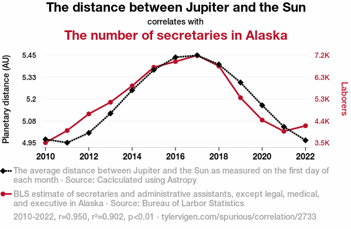

## Quick recap

Last lecture we discussed:

-   The two types of errors associated with sampling: sampling error and sampling bias
-   Properties of a good sample

::: notes
Ask for volunteers to remind these concepts
:::

## Today

::: nonincremental
-   Types of variables
-   Types of studies
-   Correlation *vs.* Causation
:::


::: notes
These learning goals are for the entire topic/unit. They will also be available in the study guide.
:::

## How do we choose random numbers? It’s actually really hard!

-   Here is random number generator, where the randomness comes from atmospheric noise <https://www.random.org/integers/>
-   In practice, for most statistical purposes, pseudo-random numbes are good enough and what we usually get with "random sampling functions" in R.

::: aside
One notable example of when this may not be good enough is cryptography, but that's outside of our scope. If you're curious, you can learn more [here](https://dev.to/artis3n/random-vs-pseudorandom).
:::

## Random sampling in R

::: nonincremental
-   Actually pseudo-random
-   If you run the code below, it is very unlikely you will get the same numbers I did
:::

```{r}
# Sample 3 random numbers between 1 and 10
# 1. Define the numbers from which you will sample
x <- c(1, 2, 3, 4, 5, 6, 7, 8, 9, 10)
# 2. Take 3 random numbers from this set
sample(x, size = 3)
# now, to convince yourself, do it again
sample(x, size = 3)
```

## Random sampling in R

::: nonincremental
-   But you can actually make this reproducible!
-   How? Setting a **seed**!
-   If you run the code below with the same seed you should get the same numbers I did
:::

```{r}
# Sample 3 random numbers between 1 and 10
# 1. Define the numbers from which you will sample
x <- c(1, 2, 3, 4, 5, 6, 7, 8, 9, 10)
# 2. Set seed
set.seed(1985) #the seed can be any number.
# 3. Take 3 random numbers from this set
sample(x, size = 3)
# now, to convince yourself, do it again
set.seed(1985) 
sample(x, size = 3)
```

## Types of Variables {.center background="#898928"}

## Variables and "Data"

> A **variable** is a characteristic measured on individuals drawn from a population under study.

> **Data** are measurements of one or more variables made on a collection of individuals. (i.e., your sample)

{fig-alt="[Cueball reading off a smart phone to someone off-screen.]     Cueball: According to this polling data, after Kirk and Picard, the most popular Star Trek character are Data.     Off-screen voice: Augh!     [Caption below the frame:]     Annoy grammar pedants on all sides by making \"data\" singular except when referring to the android." width="638"}

## Types of variables/data

::: goal
Numeric (also known as quantitative)
:::

-   **Discrete:** can be *counted*
-   **Continuous:** can be *measured*

::: goal
Categorical (also known as class or nominal variables)
:::

-   **Ordinal:** can be *ranked*
-   **Nominal:** cannot be ranked

::: aside
Why do we care about these types? We will focus a lot on this in our next topic about how to display and describe data. Knowing what kind of variable we have drives our models of data analysis, and is therefore critical to the enterprise of statistics.
:::

## Numeric Data/Variables

::: goal
Discrete: can only take some values within acceptable interval
:::

Examples:

-   Number of limbs
-   Number of offspring
-   Number of petals
-   Number of teeth
-   Natural numbers: $\{0,1,2,3,4,5,6,7,...,\infty\}$

## Numeric Data/Variables

::: goal
Continuous: Can take any value within acceptable interval
:::

Examples:

-   Arm length (cm, inches)
-   Height (cm, inches)
-   Weight (kg, lbs)
-   Age and longevity (in years, months, etc.)
-   Tail length (cm, inches)
-   Dose (e.g., in micrograms/gram)
-   Skin color (measured using a reflectometer, measure in wavelengths)

## Categorical variables

Examples:

-   Genotype (e.g., AA, AG, GG)
-   Drug treatment (e.g. aspirin *vs.*ibuprofen)
-   Province of origin
-   Survival status (i.e., live or die)
-   Skin/fur/coat/feather color (e.g., black, yellow, red, etc.)

## Relationships between variables {.center background="#006475"}

We predict the values of response variables from explanatory variables.

Outdated nomenclature: dependent and independent variables

## Case Study: surviving the Titanic


::: aside
Image from: [Wikipedia Commons](https://upload.wikimedia.org/wikipedia/commons/9/91/Titanic_struck_iceberg.jpg).
:::

## Case Study: surviving the Titanic

::: goal
Consider the fate of the approximatley 2,200 passengers of the titanic, including children and adults of both sexes.
:::

```{r titanic, fig.height=6, echo = F, fig.cap="This is a mosaic plot. We will learn about it in our next topic. Code based on snippets from Y. Brandvain.", fig.alt="Left, proportion of males and females among adults in the titanic who survived.  Right, same thing but for children."}
library(tidyverse)
source("bb_theme.R")
library(ggmosaic)
library(wesanderson)
titan <- data.frame(rbind(colSums(Titanic)[,,1],colSums(Titanic)[,,2]) )%>% 
  mutate(fate   = rep(c("Died","Survived"), each = 2),
         gender = rep(c("Male","Female"), times = 2)) %>%
  gather(Child, Adult, key = age, value = Inds) 

dat_text <- data.frame(
  label = c(20,20),
  age   = c("Adult","Child")
)


titan.plot <-  ggplot(data = titan) +
  geom_mosaic(aes(x = product(fate,gender), fill=fate, weight = Inds)) +
  facet_wrap(~age) +
  bb_theme()    +
  scale_y_continuous(expand = c(0,0)) +
  #theme(axis.title = element_text(size = 14)) +
  labs(x = "Sex", y = "Proportion") +
 
  geom_text(data    = titan %>% filter(fate == "Died", gender == "Female"),
            mapping = aes(x = -Inf, y = -Inf, label = Inds),
            hjust   = -c(1.5,.9), vjust   = -.5, size = 5, color = "white") +
  geom_text(data    = titan %>% filter(fate == "Survived", gender == "Female"),
            mapping = aes(x = -Inf, y = Inf, label = Inds),
            hjust   = -c(1.5,.9), vjust   = 1.5, size = 5, color = "white") +
  geom_text(data    = titan %>% filter(fate == "Died", gender == "Male"),
            mapping = aes(x = Inf, y = -Inf, label = Inds),
            hjust   = c(2.3,2.3), vjust   = -.5, size = 5, color = "white") +
  geom_text(data    = titan %>% filter(fate == "Survived", gender == "Male"),
            mapping = aes(x = Inf, y = Inf, label = Inds),
            hjust   = c(2.3,2.3), vjust   = 1.5, size = 5, color = "white") +
  scale_fill_manual(values = wesanderson::wes_palette("AsteroidCity1"), breaks=c("Survived","Died"))+
  ggtitle(label = "Suriving the Titanic by age and gender")

titan.plot 

```

## Discuss

```{r, echo = F, fig.align='center'}
titan.plot
```

1.  Variables? Types? Explanatory & response variables?

2.  Describe the population this result came from…

3.  How far would you generalize from this to “Women & Children 1st?”

4.  Experimental or observational study?

## Experimental *vs.* Observational Studies

::: goal
In Experimental Studies, researchers assign treatments to individuals.
:::

- Big advantage: possibility to conduct randomization (random assignment of treatments to units)
- Why is this important?

::: goal
In Observational Studies, researchers do not assign treatments to individuals.
:::

- But often this is the only source of data available

## Correlation DOES NOT imply causation

But it can, of course, suggest it

::: goal
Because researchers do not assign treatments in observational studies, observations cannot prove causation or disentangle cause and effect.
:::

{fig-alt="[    [Cueball is talking to Megan.]     Cueball: I used to think correlation implied causation. [Cueball lift his hand while continuing to talk to Megan.] Cueball: Then I took a statistics class. Now I don't. [Back to the same situation as the first frame.] Megan: Sounds like the class helped. Cueball: Well, maybe.]"}

## Case Study {background="#006475"}

::: goal
The distance between jupiter and the sun correlates with the number of secretaries in-alaska
:::



## 

> As the distance between Jupiter and the Sun increases, the gravitational pull on Earth fluctuates, leading to a rise in cosmic productivity waves. These waves, when they reach Alaska, have been found to have a magnetic effect on the influx of secretarial energy, prompting more individuals to pursue careers in Alaska as professional secretaries. It's like a celestial calling for secretarial excellence in the land of the midnight sun.

::: aside
**What is this?** "Random correlations dredged up from silly data, turned into linear line charts. Now with AI-generated explanations of the causal connection and silly images to accompany the charts!" <https://tylervigen.com/>
:::

## That's all for today

{fig-alt="Forrest says \"And that's all I wanted to say about that\"" width="347"} 


