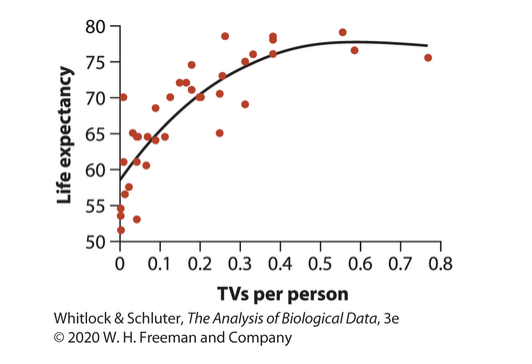
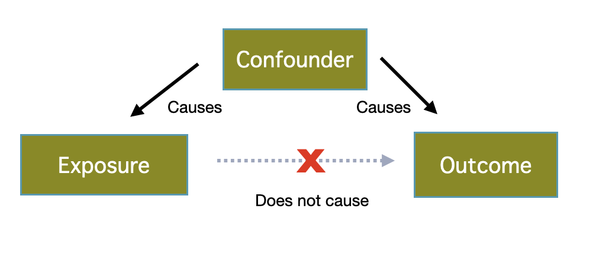
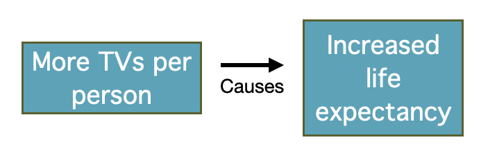
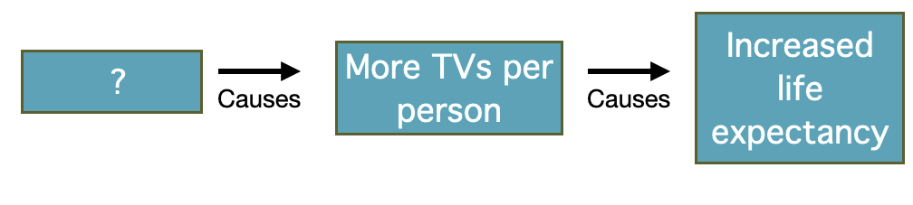
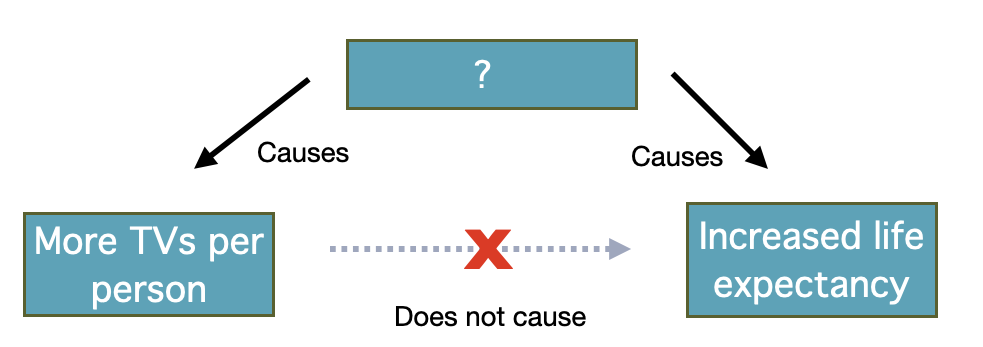

## Wrapping it up

::: nonincremental
-   Types of experiments
-   Correlation *vs.* Causation
:::

##  {.center}

> In statistics, a spurious relationship or **spurious correlation** is a mathematical relationship in which two or more events or variables are associated but **not causally related**, due to either *coincidence* or the *presence of a certain third, unseen factor* (referred to as a "common response variable", **"confounding factor"**, or "lurking variable"). [Wikipedia Commons](https://en.wikipedia.org/wiki/Spurious_relationship)

::: goal
Confounding Variables: unmeasured variable that changes in tandem with one or more of the measured variables, giving a false appearance of a causal association between the measured variables.
:::

## Example

::: goal
What could be happening here?
:::

{fig-align="center"}

## Causal Inference

{fig-align="center" width="410"}

. . .

{fig-alt="\"Graphical model: Amediator is a factor in the causal chain (middle)\"" fig-align="center" width="623"}

. . .

{fig-alt="A confounder is a spurious factor incorrectly implying causation (bottom)." fig-align="center" width="617"}

## Causal Inference

{fig-align="center" width="390"}

{fig-align="center" width="589"}

{fig-align="center" width="589"}

{fig-alt="[From Wikipedia Commons. Graphical model: Whereas a mediator is a factor in the causal chain (top), a confounder is a spurious factor incorrectly implying causation (bottom)]"}

## Example 2

::: goal
Consider a study showing (positive association) that people who ate more steaks can do more push-ups.
:::

::: nonincremental
-   Eating steaks could give people more muscle tone/strength OR
-   A certain type of person may enjoy both eating steaks and building muscle OR
-   Something else
:::

**Questions:**

::: nonincremental
-   Observational or experimental?
-   Is this enough to show causation?
:::

## Example 3

::: goal
Consider a study showing that plants with fewer pests had greater biomass.
:::

::: nonincremental
-   Pests could decrease plant vigor OR
-   Vigorous plants could fight off pests OR
-   Something else
:::

**Questions:**

::: nonincremental
-   Observational or experimental?
-   Is this enough to show causation?
:::

## Observational studies cannot separate cause and effect {.center background="#006475"}

::: r-fit-text
Simply observing the association (correlation) is not enough to infer causation, but could point to hypotheses which, hopefully, can be tested.

The main purpose of experimental studies is to disentangle these effects.
:::

## But experiments can reveal causation

::: nonincremental
-   Because researchers can randomly assign individuals to treatments, a well-executed experimental study removes confounds (except those that arise by chance!) and allows us to separate cause and effect !!!
:::

-   But be careful, experimental artifacts can introduce bias.

-   For example, the mental boost of receiving a treatment may help people feel better, an example of the **placebo effect** -- an improvement in medical condition that results form the physychological effects of treatment.

-   Appropriate controls are critical to a good experiment.

. . .

::: note
Placebo (Latin): "I shall please", from placeō, "I please". Read Interleaf 6 for more on the placebo effect.
:::

##  {.center background="#006475"}

{fig-alt="Forrest says \"And that's all I wanted to say about that\"" width="347"}
