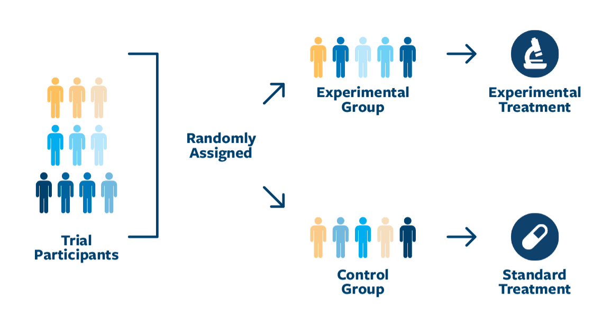
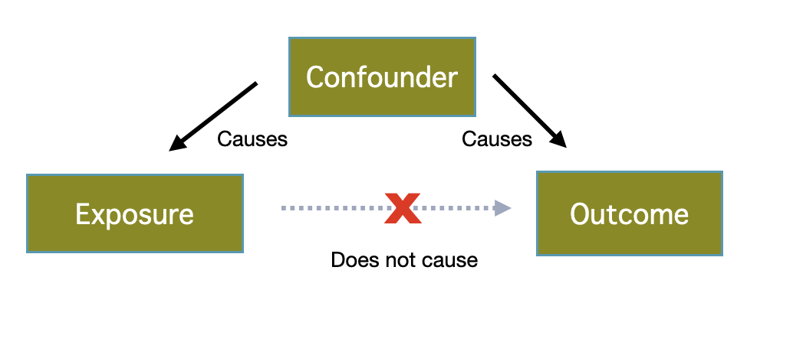

## Quick recap

Last time:

- Variables, data, dataset

- Types of variables and subtypes: numeric (discrete, continuous), categorical (nominal, ordinal)

- How to organize data in a dataset

- Explanatory and response variables

::: notes
Ask for volunteers to remind these concepts
:::

## Learning goals

- Describe the differences between observational and experimental studies.
- Distinguish between correlation and causation.
- Understand why experimental studies reveal causation, while observational studies cannot.
- Recognize that confounding factors limit our ability to interpret observed patterns.

# Correlation $\neq$ causation

## Relationships between variables

- A [relationship]{.underline} exists between two variables if they co-vary (e.g., – increasing (excessive) sun exposure is accompanied by increasing numbers of events of skin cancer).

- Both observational and experimental studies may detect relationships between variables -- not the same as assigning a causative link.

::: notes
we talk about these two next
:::

## Two ways to collect/obtain data

- A study is **experimental** if the researcher assigns treatments *randomly* to individuals, whereas a study is **observational** if the assignment of treatments is not made by the researcher.

## Observational study

- In [observational]{.underline} studies, researchers *do not* assign treatments to individuals.

- Researchers have no control over which units fall into which groups.

- Relationships between explanatory and response variables *can* be detected.

- But, these studies *cannot* prove causation or disentangle cause and effect. The main purpose of experiments is to accomplish this, though.

- E.g. Tobacco smoking and development of lung cancer.

::: notes
Because researches do not assign treatments in observational studies, observations cannot prove causation or disentangle cause and effect.
:::

## The magic of experiments

- In [experimental]{.underline} studies, researchers assign different treatment groups or values of an explanatory variable *randomly* to the individual units of study.

- Well-conceived experiments can reveal causation!

- E.g. clinical trials.

{fig-cap="Controls are identical to the treatment in all respects aside from the treatment itself. Controls allow us to attribute an outcome to a treatment. Image from The Lung Cancer Research Foundation" fig.height="2.5" fig.align="center" fig-alt="Flow diagram showing trial participants randomly assigned to experimental and control groups, receiving experimental or standard treatment." fig-align="center"}

## Experimental studies may reveal confounds

- A well-designed experiment can remove confounds (except those that arise by chance!) and allows us to separate cause and effect !!!

But caution:

- There are often more \[or less\] obvious biases.

- Experimental artifacts can introduce bias.

- E.g.: **placebo effect** -- an improvement in medical condition that results form the psychological effects of treatment.

- Appropriate **controls** are critical to a good experiment.

> Placebo (Latin): "I shall please", from placeō, "I please". Read Interleaf 6 for more on the placebo effect.

## Confounding Variables

::: goal
Confounding Variables: unmeasured variable that changes in tandem with one or more of the measured variables, giving a false appearance of a causal association between the measured variables.
:::

- A confounding variable is a hidden bias. I.e., one of the major goals of experiments is to **reduce bias**.

- I.e., they lead to a spurious association (correlation):

> a mathematical relationship in which two or more events or variables are associated but **not causally related**, due to either *coincidence* or the *presence of a certain third, unseen factor* (confound variable, confounding variable, or lurking variable). [Wikipedia Commons](https://en.wikipedia.org/wiki/Spurious_relationship)

## Causal Inference

{fig-align="center" width="410"}

. . .

{fig-alt="\"Graphical model: Amediator is a factor in the causal chain (middle)\"" fig-align="center" width="623"}

. . .

{fig-alt="A confounder is a spurious factor incorrectly implying causation (bottom)." fig-align="center" width="617"}

## Example: smoking and lung cancer (1/3)

::: goal
Say we saw a strong association between smoking and lung cancer from an observational study, and wanted to know if smoking causes cancer.
:::

- let's use a DAG (Directed Acyclic Graph) -- the backbone of causal thinking! They allow us to lay our causal models out there for the world to see.

{fig-cap="We could represent this causal claim with the simplest causal graph we can imagine. This is our first formal introduction to a Directed Acyclic Graph (hereafter DAG). This is Directed because WE are pointing a causal arrow from smoking to cancer. It is acyclic because causality in these models only flows in one direction, and its a graph because we are looking at it. These DAGs are the backbone of causal thinking because they allow us to lay our causal models out there for the world to see. Here we will largely use DAGs to consider potential causal paths, but these can be used for mathematical and statistical analyses." fig-alt="Diagram showing an arrow pointing from 'smoke' toward 'cancer'."}

## Example: smoking and lung cancer (2/3)

- Hypothesis: A confound could underlie the strong statistical association between smoking and lung cancer.

{fig-alt="Here genes point to cancer and to smoking, but no arrow connects smoking to lung cancer. ."}

## Example: smoking and lung cancer (3/3)

{fig-alt="A three-panel diagram labeled “a,” “b,” and “c” shows black circular nodes connected by directional arrows. In panel a, “genes” at the lower left points to “smoke” near the center, which points to “cancer” at the upper right. In panel b, “genes” on the left points directly to both “smoke” at the lower right and “cancer” at the upper right; “smoke” also points upward to “cancer.” In panel c, “environ” on the left points to both “smoke” at the top and “cancer” at the bottom; “genes” on the right points to “smoke” and “cancer,” and “smoke” points downward to “cancer.” The nodes are black circles with white text, and the arrows are black on a white background."}

## What's the conclusion?

- We cannot perform experimental studies on humans to test this.

- But causal associations were documented in other animal models.

- Fisher turned out to be quite wrong – genes *do* influence the probability of smoking and genes do influence the probability of lung cancer, but smoking has a much stronger influence on the probability of getting lung cancer than does genetics.

## In summary:

- Observations reveal associations between variables.

- An association doesn’t imply a causative link.

- Spurious associations can occur when both are associated with a confounding variable.

- Because researchers do not assign treatments in observational studies, observations cannot prove causation or disentangle cause and effect.

::: aside
Read Interleaf 1 for more on correlation x causation.
:::

## Comic moment

{fig-alt="[    [Cueball is talking to Megan.]     Cueball: I used to think correlation implied causation. [Cueball lift his hand while continuing to talk to Megan.] Cueball: Then I took a statistics class. Now I don't. [Back to the same situation as the first frame.] Megan: Sounds like the class helped. Cueball: Well, maybe.]"}

## Acknowledgments

Yaniv Brandvain (specifically, here, I used the smoking and cancer example from his book [Applied Biostats](https://bookdown.org/ybrandvain/Applied_Biostats_2024/01-intro.html)); Freeman & Company; and Michael Whitlock for some materials used in these slides.
